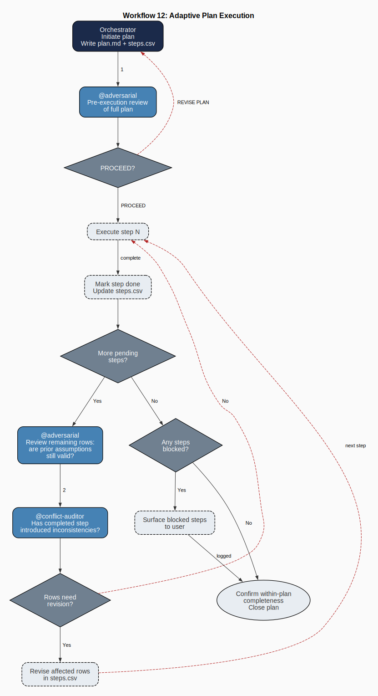

# Agent Teams Module

[](https://www.python.org/)
[](LICENSE)
[](https://jlcatonjr.github.io/agentteams/)

Generate a complete, coordinated AI agent team for any project — from a single project description file. All workflows are automatically adaptive and self-revising.

**Documentation:** https://jlcatonjr.github.io/agentteams/

---

## What It Does

Given a project description (a `.json` or `.md` brief), the module:

1. **Analyzes** the project goal, deliverables, tools, and components
2. **Selects** the right agent archetypes from a 4-tier taxonomy
3. **Renders** all agent files by filling in project-specific placeholders
4. **Emits** ready-to-use agent files for VS Code Copilot, Copilot CLI, or Claude

The generated team includes:
- 1 **Orchestrator** agent — coordinates all workflows
- 9 **Governance agents** — navigation, security, consistency, cleanup, documentation
- 2–9 **Domain agents** — appropriate archetypes for your deliverable type
- 1 **Workstream Expert** per project component — deep, component-specific knowledge
- 1 **Team Builder agent** — framework-native agent that can regenerate or expand the team from within your framework
- `copilot-instructions.md` — project conventions and routing rules

---

## Workflow



From Chapter 5 of [Agent Teams: A Theoretically Grounded Approach](https://jlcatonjr.github.io/agentteams/manuscript/)  
---

## Quick Start

### 1. Install

Clone the repository (no external dependencies — stdlib Python 3.11+):

```bash
git clone https://github.com/jlcatonjr/agentteams
cd agentteams
pip install -e .
```

### 2. Write a project description

Create `brief.json` (or `brief.md`):

```json
{
  "project_name": "MyProject",
  "project_goal": "Build a FastAPI backend with authentication and a task management API.",
  "deliverables": ["Python modules", "OpenAPI docs"],
  "output_format": "Python 3.11",
  "primary_output_dir": "src/",
  "components": [
    {"slug": "auth-module", "name": "Authentication Module", "number": 1},
    {"slug": "tasks-api", "name": "Tasks API", "number": 2}
  ]
}
```

### 3. Generate your team

```bash
agentteams \
  --description brief.json \
  --project /path/to/your/project \
  --framework copilot-vscode
```

Or with the script directly:

```bash
python build_team.py \
  --description brief.json \
  --project /path/to/your/project \
  --framework copilot-vscode
```

Output: agent files in `/path/to/your/project/.github/agents/`

### 4. Review SETUP-REQUIRED.md

Fill in any placeholders that couldn't be auto-resolved. Then open VS Code, invoke `@orchestrator`, and start working.

---

## Agent-Assisted Setup

Not ready to write a `brief.json` by hand? The **Team Builder agent** can conduct an intake interview from within your AI framework and generate the brief for you.

After installation, invoke `@team-builder` in VS Code Copilot chat (or open the builder prompt in Claude / Copilot CLI). It will ask you questions about your project and emit a ready-to-use agent team without any manual JSON editing.

See the [Agent-Assisted Setup guide](https://jlcatonjr.github.io/agentteams/agent-assisted-setup/) for step-by-step instructions.

---

## Framework Support

| Framework | Format | Handoffs | Builder Agent |
|-----------|--------|----------|---------------|
| `copilot-vscode` | `.agent.md` with YAML front matter | ✅ | VS Code Copilot `.agent.md` |
| `copilot-cli` | Plain `.md` system prompts | ❌ | CLI prompt `.md` |
| `claude` | Claude Code front matter `.md` | ❌ | Claude Code system prompt |

---

## Construction via Framework Agent (Key Feature)

After generation, a **Team Builder agent** is installed in your project. This is a framework-native agent that can:

- Conduct an intake interview for a new project
- Extend the team with new workstream experts
- Regenerate agent files after project structure changes

**For VS Code Copilot:** Invoke `@team-builder` in chat.  
**For Claude:** Open a Project with the generated `CLAUDE.md` as the system prompt.  
**For Copilot CLI:** Use `copilot` with the generated prompt file.

The builder ensures construction is always facilitated by the target framework itself, enabling the agent to elicit project-specific details interactively before generating files.

---

## Project Description Format

See [schemas/project-description.schema.json](schemas/project-description.schema.json) for the full schema.

Key fields:
- `project_goal` — **(required)** 1–3 sentence description
- `deliverables` — list of deliverable types
- `output_format` — final output format (PDF, Python modules, HTML, etc.)
- `primary_output_dir` — where authored files live
- `components` — one per workstream; each generates a dedicated expert agent
- `authority_sources` — files agents treat as ground truth
- `tools` — languages and frameworks; tools with `needs_specialist_agent: true` get their own agent

Markdown brief format is also accepted — see [examples/research-project/brief.json](examples/research-project/brief.json) for reference.

---

## Agent Taxonomy

### Tier 1: Orchestrator
Coordinates all workflows. Enforces security, consistency, and voice fidelity rules.

### Tier 2: Governance Agents (always generated)
`navigator` · `security` · `code-hygiene` · `adversarial` · `conflict-auditor` · `conflict-resolution` · `cleanup` · `agent-updater` · `agent-refactor`

### Tier 3: Domain Agents (selected by archetype)
| Archetype | Triggered by |
|-----------|-------------|
| `primary-producer` | Always |
| `quality-auditor` | Always |
| `cohesion-repairer` | Writing/documentation projects |
| `style-guardian` | Projects with style references |
| `technical-validator` | Code/data/technical projects |
| `format-converter` | Projects with compiled output (LaTeX, PDF) |
| `reference-manager` | Projects with citation databases |
| `output-compiler` | Multi-component assembly projects |
| `visual-designer` | Projects with diagrams or figures |
| `module-doc-author` | Projects with `pip_package_name` or PyPI distribution |
| `module-doc-validator` | Projects with `pip_package_name` or PyPI distribution |
| `tool-specific` | Tools with `needs_specialist_agent: true` |

### Tier 4: Workstream Experts
One generated per component. Prepares Component Briefs, reviews drafts, issues ACCEPT/REVISE verdicts.

---

## CLI Reference

```
agentteams --help

Options:
  --description PATH   Project description (.json or .md) [required]
  --project     PATH   Project directory to scan
  --framework   NAME   copilot-vscode (default) | copilot-cli | claude
  --output      DIR    Output directory (default: <project>/.github/agents/)
  --dry-run            Show what would be generated without writing
  --overwrite          Overwrite existing agent files unconditionally (full replacement)
  --merge              Update only template-fenced regions; preserve user-authored content
                       outside fence markers (see Section Fencing below)
  --yes, -y            Non-interactive: skip all prompts
  --no-scan            Disable project directory scanning
  --update             Re-render drifted files AND emit new agents added to the
                       taxonomy since the last build; preserves manually-filled values
  --prune              Used with --update: also delete agents removed from the taxonomy
  --check              Check for template drift and structural changes (exit code 1 if found)
  --scan-security      Scan generated agent files for security issues
  --post-audit         Run static + optional AI-powered audit after generation
  --auto-correct       After --post-audit findings, invoke standalone copilot CLI to repair
                       files (requires copilot CLI installed and authenticated separately)
  --enrich             Scan for unresolved placeholders, underdeveloped sections, and
                       incomplete tool metadata; apply context-aware auto-enrichment;
                       exports references/defaults-audit.csv
  --security-offline   Use cached vulnerability snapshot only (no network fetch)
  --security-max-items N  Max CVEs to include in security references (default: 15)
  --security-no-nvd    Skip NVD CVSS enrichment; CISA KEV + EPSS data still fetched
  --migrate            One-step legacy fencing migration: tag current state as
                       pre-fencing-snapshot, regenerate all files with fence markers,
                       print quality-audit checklist
  --revert-migration   Undo a --migrate run: git reset --hard pre-fencing-snapshot
  --self               Operate on the module's own agent team
  --version            Print version
```

---

## Maintenance Commands

Once a team has been generated, the module can detect and repair two kinds of drift:

- **Content drift** — a template's text changed (re-renders affected files)
- **Structural drift** — agents were added or removed from the taxonomy (emits new files, reports removed files)
- **Knowledge drift** — agents are operating on stale facts after silent project evolution (see [Agent Knowledge Updates](#agent-knowledge-updates) below)

### Check for drift

```bash
agentteams --description brief.json --check
# Exit code 0: no drift. Exit code 1: drift or structural changes detected.
```

### Update drifted files and new agents (preserve manual values)

When the module is updated (e.g., a new governance agent is added), run `--update` to bring an existing team in sync. New agent files are emitted; changed files are re-rendered preserving any `{MANUAL:*}` values you filled in previously; removed agents are reported but not deleted:

```bash
agentteams --description brief.json --update
```

To also delete agents that are no longer part of the taxonomy:

```bash
agentteams --description brief.json --update --prune
```

### Security scan

Scan deployed agent files for PII, credentials, and unresolved placeholders:

```bash
agentteams --description brief.json --scan-security
```

### Self-maintenance

Regenerate the module's own meta-agent team:

```bash
agentteams --self
```

---

## Section Fencing

Templates ship with `AGENTTEAMS:BEGIN/END` fence markers around every template-owned section. This enables surgical updates without clobbering your customizations:

```markdown
<!-- AGENTTEAMS:BEGIN routing_table_rows v=1 -->
| ... generated content ... |
<!-- AGENTTEAMS:END routing_table_rows -->
```

| Mode | Behaviour |
|------|-----------|
| `--overwrite` | Full-file replacement — best for first-time generation |
| `--merge` | Updates fenced sections only; preserves everything outside markers |
| `--update` | Re-render drifted files + emit new agents (uses merge semantics for existing files) |
| `--migrate` | Retrofits fence markers onto a legacy team in one step |

See [templates/FENCE-CONVENTIONS.md](agentteams/templates/FENCE-CONVENTIONS.md) for the full specification.

---

## Agent Knowledge Updates

Generated agent teams stay current through three automatic mechanisms:

### 1. Drift detection (`--check` / `--update`)
Run `--check` at any time to detect template content drift or taxonomy structural changes. Use `--update` to apply them while preserving manually-filled values.

### 2. Drift-as-trigger in `@agent-updater`
The `@agent-updater` governance agent includes a **Drift detected by `--check`** trigger: whenever drift is detected, agents must re-render and re-verify before the next workflow executes.

### 3. Periodic Knowledge Re-verification
The `@agent-updater` includes a `Periodic Knowledge Re-verification` protocol that kicks in when:
- A plan step references specific file paths, agent slugs, or counts
- Any multi-file session ran without invoking `@agent-updater`
- `@adversarial` flags a **Temporal (T)** presupposition in a plan review

The protocol: run `--check` → re-render if drift found → invoke `@technical-validator` to verify plan facts against disk state → surface any unverified claims before execution proceeds.

---

## Tool Classification

Tools declared in the brief are classified into three tiers:

| Tier | When | Output |
|------|------|--------|
| **Specialist agent** | `needs_specialist_agent: true` or category = `database`, `deployment`, `pipeline`, `compiler` | Full `.agent.md` with category-specific template |
| **Reference file** | Default for `framework`, `library`, `api`, `cli` | `references/ref-{tool}-reference.md` |
| **Passive** | `language`, `other` | Listed in `copilot-instructions.md` only |

The engine also parses dependency manifests (`requirements.txt`, `pyproject.toml`, `package.json`, `Cargo.toml`, `go.mod`) from the project directory to detect tools automatically.

---

## Usage Examples

### 1. New project — no existing codebase

Write a `brief.json`, then generate. The engine has no project directory to scan, so it works entirely from the description.

```bash
agentteams \
  --description brief.json \
  --framework copilot-vscode
# Output: .github/agents/ in the current directory
```

---

### 2. New project — existing codebase to scan

Pass `--project` to point at an existing directory. The engine scans `requirements.txt`, `pyproject.toml`, `package.json`, `Cargo.toml`, and `go.mod` to detect tools automatically, and supplements any fields missing from the brief.

```bash
agentteams \
  --description brief.json \
  --project ~/code/myproject \
  --framework copilot-vscode
# Output: ~/code/myproject/.github/agents/
```

To disable scanning (use the brief as-is):

```bash
agentteams --description brief.json --project ~/code/myproject --no-scan
```

---

### 3. Preview before writing (dry run)

Always a safe first step. Prints every file that would be written or overwritten without touching the filesystem.

```bash
agentteams --description brief.json --project ~/code/myproject --dry-run
```

The output lists each file as `[DRY RUN] WRITE` (new) or `[DRY RUN] OVERWRITE` (would replace existing).

---

### 4. Generate for Claude Code or Copilot CLI

Use `--framework` to target a different runtime. All three produce the same agent team from the same brief.

```bash
# Claude Code sub-agents (.claude/agents/*.md with Claude front matter)
agentteams --description brief.json --project ~/code/myproject --framework claude

# GitHub Copilot CLI (plain Markdown system prompts)
agentteams --description brief.json --project ~/code/myproject --framework copilot-cli
```

See [Framework Support](#framework-support) for output format differences.

---

### 5. Custom output directory

Override where agent files are written. Useful for monorepos or when the default `.github/agents/` location isn't appropriate.

```bash
agentteams \
  --description brief.json \
  --output ~/code/myproject/agents
```

---

### 6. Non-interactive / CI mode

Skip all confirmation prompts. Use in scripts, CI pipelines, or `Makefile` targets.

```bash
agentteams --description brief.json --project ~/code/myproject --yes
# or, to overwrite existing files without prompting:
agentteams --description brief.json --project ~/code/myproject --overwrite --yes
```

---

### 7. Post-generation audit

Run static checks (unresolved placeholders, YAML integrity, required-agent coverage) immediately after generation. If the `gh` CLI is authenticated, also runs an AI-powered conflict and presupposition review via GitHub Models.

```bash
agentteams --description brief.json --project ~/code/myproject --post-audit --yes
```

To automatically repair any findings, pass `--auto-correct`. This requires the [standalone `copilot` CLI](https://docs.github.com/en/copilot/github-copilot-in-the-cli/about-github-copilot-in-the-cli) to be installed and authenticated separately:

```bash
agentteams --description brief.json --project ~/code/myproject --post-audit --auto-correct --yes
```

---

### 8. Update an existing team after a module upgrade

When `agentteams` is updated, templates may change and new agent types may be added to the taxonomy. Run `--update` to bring an existing team in sync:

- Files whose templates changed are re-rendered, preserving any `{MANUAL:*}` values you filled in.
- New agent types introduced since the last build are emitted as new files.
- Agents removed from the taxonomy are **reported** but not deleted.

```bash
cd agentteams
git pull
pip install -e .
agentteams --description brief.json --update
```

---

### 9. Update and remove retired agents

If agents were removed from the taxonomy in a module update and you want to clean them up:

```bash
agentteams --description brief.json --update --prune
```

`--prune` only takes effect alongside `--update`. It will delete files for agents that no longer exist in the taxonomy and were not manually created.

---

### 10. Check for drift without writing (CI gate)

Use `--check` as a non-destructive lint step in CI. Exits with code `1` if any template has changed or if the team composition differs from the last build; exits `0` if everything is in sync.

```bash
agentteams --description brief.json --check
```

Example CI step (GitHub Actions):

```yaml
- name: Check agent team is up to date
  run: agentteams --description brief.json --check
```

---

### 11. Security scan on a deployed team

Scan existing agent files for PII paths, hardcoded credentials, bearer tokens, and unresolved `{MANUAL:*}` placeholders:

```bash
agentteams --description brief.json --scan-security
```

Exits with code `1` if any findings are reported. Suitable as a pre-commit or CI gate.

---

### 12. Merge — update fenced regions only (preserve your customizations)

If you have manually customized sections of your agent files, use `--merge` instead of `--overwrite`. It updates only the `AGENTTEAMS:BEGIN/END`-fenced sections that originated from templates and leaves everything else untouched:

```bash
agentteams --description brief.json --merge
```

Files without fence markers are skipped with an advisory warning. See [Section Fencing](#section-fencing) below.

---

### 13. Enrich — auto-fill defaults and underdeveloped sections

After generation, scan for default template elements and apply context-aware enrichment. Rule-based fills are applied first; if `--post-audit` is also set, AI-powered enrichment runs on remaining gaps:

```bash
agentteams --description brief.json --enrich
agentteams --description brief.json --enrich --post-audit  # AI enrichment pass
```

Outputs `references/defaults-audit.csv` listing every element evaluated.

---

### 14. Migration — add section fencing to an existing team

If you have an existing agent team generated before section fencing was introduced:

```bash
agentteams --description brief.json --project ~/code/myproject --migrate
```

This creates a `pre-fencing-snapshot` git tag at the current HEAD, regenerates all files with `AGENTTEAMS:BEGIN/END` markers, and prints a quality-audit checklist. To undo:

```bash
agentteams --description brief.json --project ~/code/myproject --revert-migration
```

---

### 15. Self-maintenance (regenerate the module's own team)

Regenerate the agent team that governs this module itself, using the stored `_build-description.json`:

```bash
agentteams --self
```

---

## Example Project Briefs

- [Research project](examples/research-project/brief.json) — academic paper with chapters, LaTeX output, and bibliography
- [Software project](examples/software-project/brief.json) — FastAPI backend with authentication and task API
- [Data pipeline](examples/data-pipeline/brief.json) — ETL pipeline with four workstream components

---

## Running Tests

```bash
python -m pytest tests/ -v
```

---

## Verify Your Install

```bash
agentteams --help             # all flags and usage
agentteams --version          # confirm installed version
python -m pytest tests/ -v   # run the full test suite
```

Tests require no external dependencies. Integration tests use the bundled examples.

---

## Project Structure

```
agentteams/
├── build_team.py              # CLI entry point
├── agentteams/
│   ├── ingest.py              # Parse project descriptions
│   ├── analyze.py             # Build team manifest
│   ├── render.py              # Render templates
│   ├── emit.py                # Write files to disk
│   ├── drift.py               # Drift detection
│   ├── scan.py                # Security scan
│   ├── audit.py               # Post-generation audit
│   ├── remediate.py           # Auto-correction
│   ├── graph.py               # Agent topology graph
│   ├── templates/             # All agent templates (shipped with package)
│   │   ├── universal/         # Governance agent templates (10)
│   │   ├── domain/            # Domain archetype templates
│   │   ├── builder/           # Team Builder agent templates (3)
│   │   ├── workstream-expert.template.md
│   │   ├── copilot-instructions.template.md
│   │   ├── PLACEHOLDER-CONVENTIONS.md
│   │   └── AUTHORING-GUIDE.md
│   └── frameworks/
│       ├── base.py            # Abstract adapter
│       ├── copilot_vscode.py  # VS Code Copilot adapter
│       ├── copilot_cli.py     # Copilot CLI adapter
│       └── claude.py          # Claude Code adapter
├── schemas/
│   ├── project-description.schema.json
│   └── team-manifest.schema.json
├── examples/
│   ├── research-project/brief.json
│   ├── software-project/brief.json
│   └── data-pipeline/brief.json
└── tests/
    ├── test_ingest.py
    ├── test_analyze.py
    ├── test_render.py
    ├── test_emit.py
    ├── test_drift.py
    ├── test_scan.py
    ├── test_audit.py
    ├── test_frameworks.py
    └── test_integration.py
```

---

## Documentation

**Online:** https://jlcatonjr.github.io/agentteams/

| Page | Description |
|------|-------------|
| [Getting Started](https://jlcatonjr.github.io/agentteams/getting-started/) | Install, write a brief, generate your first team |
| [Agent-Assisted Setup](https://jlcatonjr.github.io/agentteams/agent-assisted-setup/) | Use `@team-builder` to build the brief interactively |
| [How It Works](https://jlcatonjr.github.io/agentteams/how-it-works/) | Pipeline stages, agent taxonomy, knowledge updates |
| [CLI Reference](https://jlcatonjr.github.io/agentteams/cli-reference/) | All flags with descriptions and examples |
| [Description Format](https://jlcatonjr.github.io/agentteams/DESCRIPTION-FORMAT/) | Full field-by-field brief format reference |
| [Template Authoring](https://jlcatonjr.github.io/agentteams/template-authoring/) | Write and register new agent templates |
| [API Reference](https://jlcatonjr.github.io/agentteams/api-reference/) | Python module API (`ingest`, `analyze`, `render`, `emit`, …) |
| [Structural Update Plan](https://jlcatonjr.github.io/agentteams/structural-update-plan/) | Roadmap for programmatic team update propagation |
| [Changelog](https://jlcatonjr.github.io/agentteams/changelog/) | Release notes |

**In-repo references:**

- [agentteams/templates/AUTHORING-GUIDE.md](agentteams/templates/AUTHORING-GUIDE.md) — How to write and register new agent templates
- [agentteams/templates/FENCE-CONVENTIONS.md](agentteams/templates/FENCE-CONVENTIONS.md) — Section fencing specification
- [agentteams/templates/PLACEHOLDER-CONVENTIONS.md](agentteams/templates/PLACEHOLDER-CONVENTIONS.md) — Placeholder syntax rules
- [.github/agents/references/agent-taxonomy.reference.md](.github/agents/references/agent-taxonomy.reference.md) — Four-tier agent taxonomy specification
- [schemas/project-description.schema.json](schemas/project-description.schema.json) — JSON Schema for project descriptions
- [schemas/team-manifest.schema.json](schemas/team-manifest.schema.json) — JSON Schema for the internal team manifest

---

## License

MIT
