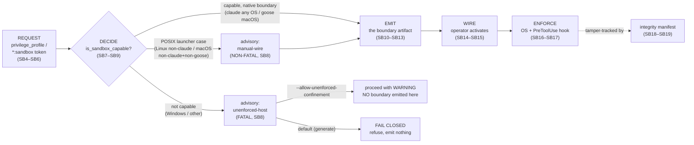
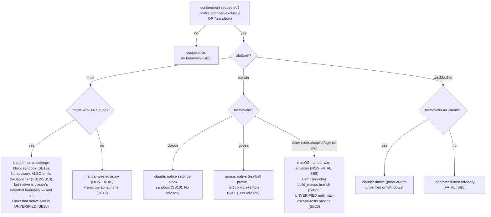
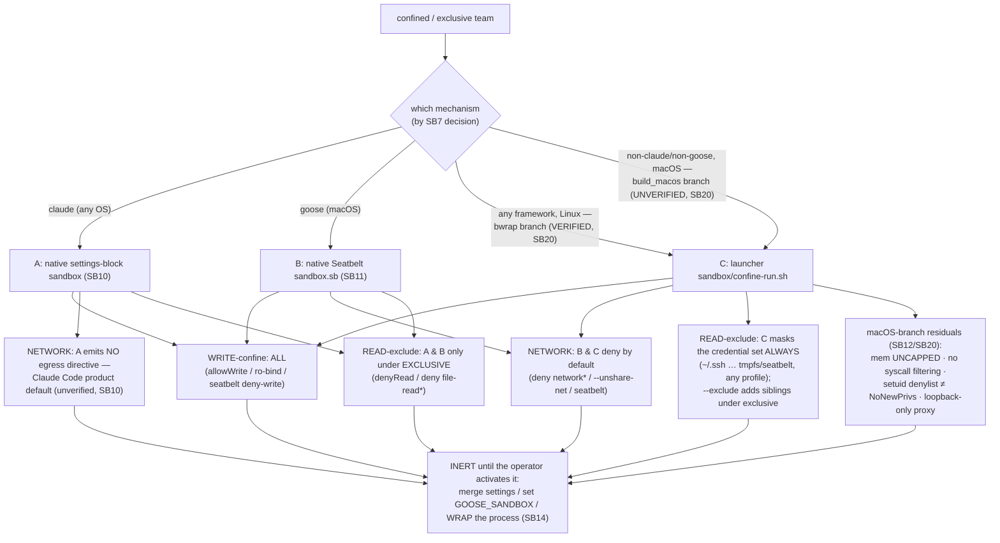
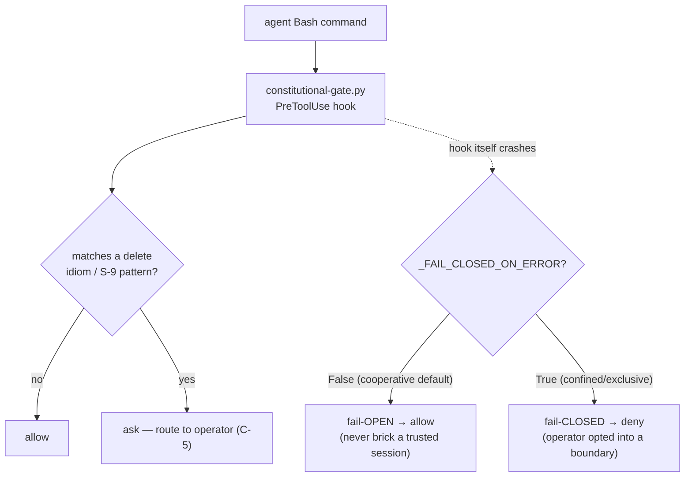
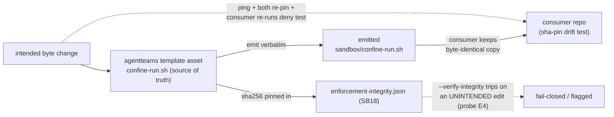
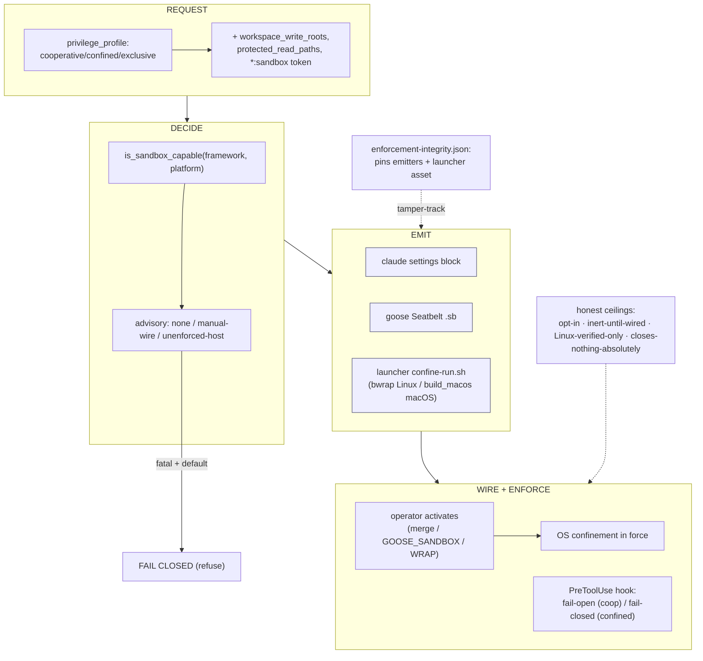

# SKELETON — the agentteams Sandboxing map (single source of structure + facts)

> This is the **core outline** for the sandboxing subsystem: the shared spine every edition
> (R/D/S/E) projects. It is a focused deep-dive on ONE layer of the broader
> [Security Guide](../agentteams-security-guide/README.md) (its Part VI) — how *workspace
> write-confinement, read-exclusion, egress control, and the runtime deny-hook* are requested,
> decided, emitted, wired, enforced, tamper-tracked, and honestly bounded.
>
> It fixes two things the editions may **not** diverge on — the **section structure** (stable IDs
> `SB1`…) and the **canonical facts** each section asserts. How deep and in what voice each edition
> renders a section is set by `audience-profiles.md`; *what is true* is set here.
>
> **Editing rule:** change the skeleton **first**, then project into every edition. Never add a fact,
> drop a section, or reorder the spine in a book alone.

## How to read this map

- **ID** — stable (`SB3`, `SB18`). An edition marks each section it renders with the ID so the map
  and the books cross-check.
- **Canonical facts** — the invariant claims. Every edition that includes the section states these
  (adapted in depth/voice) and states nothing that contradicts them.
- **Source** — the repo file(s) the facts rest on, with line ranges (collected in `SOURCES.md`). No
  fact ships without one.
- **Status marker** — ✅ *implemented & enforced in code/tests* · ⚙ *design / procedural / operator
  action only, not a deterministic code control*. Compound (`✅/⚙`) marks a concept partly each.
  Overclaiming a ⚙ as ✅ is a fact error.
- **Dial** — per-edition depth `R/D/S/E` (Full/Core/Light/Skip; see `audience-profiles.md`).
- **The honest-ceiling doctrine (binding on every edition).** Every control is stated with what it
  *buys* and what it *cannot*. A boundary is described as "engages as tested," never "secure" or
  "unbypassable." The four load-bearing ceilings of THIS subsystem, which no edition may drop:
  1. **Opt-in.** The default profile is `cooperative`: the sandbox is **off** and the deny-hook is
     **fail-open**. Confinement engages only under `confined`/`exclusive`.
  2. **Inert until wired.** Every emitted boundary is an *example/launcher the operator must
     activate* (merge settings, set `GOOSE_SANDBOX`, or WRAP the process). agentteams never writes an
     operator's live config or auto-invokes the launcher. An emitted-but-unwired boundary confines
     nothing.
  3. **Verified only on Linux.** The launcher's **Linux** (`bwrap`) branch is proven by a live-kernel
     deny test. As of 2026-W36 the SAME launcher also has a **macOS** (`build_macos`, `sandbox-exec`)
     branch — so macOS is now emittable framework-neutrally — but it is **enforcement-UNVERIFIED** until
     `sandbox/mac-escape-tests.sh` passes unnested (with its positive controls) on a real mac; Windows
     still has no emittable boundary.
  4. **Closes nothing absolutely.** T6 (a same-host key-holder / operator shell) and host-as-TCB stay
     bounded, never closed; seccomp/Landlock is a further layer **not yet added**.

---

## The pipeline at a glance (canonical graph G1)

Every sandbox request flows through five stages. The rest of this map details each.

> **Reading G1's honest ceiling:** reaching **EMIT** means a boundary *artifact* exists — not that a
> boundary is *in force*. **WIRE** (operator action) and, for the launcher (Linux `bwrap` or macOS
> `build_macos`), actually wrapping the process, are what make it enforce (SB14). A2 is one of two
> per-POSIX-platform manual-wire advisories (SB8). The dotted edge to the integrity manifest is not part
> of the per-team runtime path; it is how agentteams' OWN source protects the emitters from silent edits
> (SB18).

---

## Part I — What sandboxing is and why

### SB1 — What "sandboxing" means here  ✅/⚙
**Canonical facts.**
1. In agentteams, *sandboxing* is the **runtime OS-confinement layer**: workspace **write-confinement**
   (the agent may write only inside declared roots), optional **read-exclusion** (deny reads of
   credential paths + sibling workspaces), **egress control** (deny/proxy/host network), and a
   **PreToolUse deny-hook** that gates destructive commands. It is OWASP LLM06 ("Excessive Agency")
   containment: an agent that follows injected instructions and holds `edit`/`execute` is boxed so a
   steered action cannot escape the workspace.
2. It is **one layer** of the layered security stack, not the whole of it. The governance layers
   (constitution, `@security` sentinel, clearance/waiver/grant, CLI gates, content scanner) are always
   active and are documented in the [Security Guide](../agentteams-security-guide/README.md); *this*
   guide is only the OS-confinement + deny-hook layer.
3. **Design-time, not runtime-of-the-app.** The confinement boxes the *agent that builds an app* at
   design/build time. It is **not** shipped inside the produced app; an app that serves LLM output to
   end users must add its own runtime governance.
**Source.** `SECURITY.md` §threat-model; `agentteams/host_features.py`;
`agentteams/frameworks/_sandbox_emit.py`; `agentteams/templates/universal/sandbox/confine-run.sh`.
**Dial.** R Full · D Core · S Full · E Light.

### SB2 — The in-scope adversary and the two surfaces  ✅/⚙
**Canonical facts.**
1. The realistic in-scope adversary is **an agent with legitimate write/execute access acting on
   injected instructions** — not a remote network attacker. The sandbox's job is to make that agent's
   blast radius the declared workspace, not the whole host.
2. Two surfaces enforce, and they compose: **(a) OS confinement** (Claude Code's native sandbox; Apple
   Seatbelt for goose on macOS; or the framework-neutral launcher — `bwrap` on Linux, `sandbox-exec` on
   macOS) boxes the *filesystem + network*; **(b) the PreToolUse `constitutional-gate.py` hook** boxes
   *specific destructive command spellings* an agent's `Bash` tool might run. Neither is the boundary alone.
3. **Content is data (C-4).** The sandbox exists partly because a file under review, a fetched page, or
   a brief may carry injected text; confinement limits what a mis-followed instruction can do.
**Source.** `.claude/CLAUDE.md` (C-4); `agentteams/templates/universal/hooks/constitutional-gate.py`;
`SECURITY.md` §design-time-vs-runtime.
**Dial.** R Full · D Core · S Full · E Light.

### SB3 — The opt-in posture (binding ceiling)  ✅
**Canonical facts.**
1. The default `privilege_profile` is **`cooperative`**: no sandbox block is emitted and the deny-hook
   is emitted **fail-OPEN** (`_FAIL_CLOSED_ON_ERROR = False`). Confinement engages **only** when the
   operator selects `confined` or `exclusive` (or passes a `*:sandbox` host-feature token).
2. Reading "layered confinement" as "on by default" is the overclaim this fact prevents. Out of the
   box, the strongest locks are dormant.
**Source.** `agentteams/host_features.py` (cooperative default);
`agentteams/frameworks/_sandbox_emit.py:116` `_sandbox_feature_enabled`;
`agentteams/templates/universal/hooks/constitutional-gate.py:205` (`_FAIL_CLOSED_ON_ERROR = False`).
**Dial.** R Full · D Full · S Core · E Light (mandatory ceiling #1).

---

## Part II — The request

### SB4 — Three privilege profiles  ✅
**Canonical facts.**
1. `privilege_profile` has three values, each a superset of the last:
   - **`cooperative`** (default) — no boundary emitted; the agent is trusted, fail-open hook.
   - **`confined`** — workspace **write-confinement**: the agent writes only inside
     `workspace_write_roots` (default `["."]`, the generated tree). *Network* deny-by-default is a
     property of the mechanisms that emit an egress directive — goose Seatbelt (`deny network*`) and
     the Linux launcher (`--unshare-net`); the **claude** mechanism emits **no** egress directive, so
     claude network confinement is Claude Code's own product default (SB10, same unverified caveat).
   - **`exclusive`** — `confined` **plus read-exclusion** (P3a) for the **claude** (`denyRead`) and
     **goose** (`deny file-read*`) mechanisms: OS-deny reads of a curated credential set +
     operator-supplied `protected_read_paths` (sibling workspaces), plus an operator inbound-hardening
     advisory (P3b). **Nuance for the launcher (SB12), both OS branches:** it masks the default *credential* set
     (`~/.ssh …`) on **every** wrap regardless of profile; only the extra sibling-workspace
     `--exclude` reads are `exclusive`-specific there.
2. An **unknown** profile value **fails closed** (hard error at parse), never silently downgrades to
   `cooperative` — a typo cannot ship an unconfined team that looks confined.
**Source.** `agentteams/host_features.py` `validate_privilege_profile`;
`agentteams/frameworks/_sandbox_emit.py` `_exclusive_read_deny_paths`;
`schemas/project-description.schema.json` (`privilege_profile`, `workspace_write_roots`,
`protected_read_paths`).
**Dial.** R Full · D Full · S Core · E Light.

### SB5 — Host-feature tokens and profile expansion  ✅
**Canonical facts.**
1. The request is recorded two ways, both read: the `privilege_profile` field AND a `*:sandbox`
   host-feature token (`claude:sandbox`, `goose:sandbox`). A confined/exclusive profile **expands** to
   the framework-appropriate token (`expand_privilege_profile`): goose → `goose:sandbox`; every other
   framework → `claude:sandbox`.
2. `_sandbox_feature_enabled` / the framework-neutral `_sandbox_confinement_requested` treat **either**
   source as "confinement requested" so a confined manifest emits on the `convert`/`render` paths too,
   not only interactive `generate`.
3. A `:sandbox` token is **rejected** for a namespace with no emitter (bridge namespaces): a validating
   token that confined nothing is the silent-false-confinement failure this rejection prevents.
**Source.** `agentteams/host_features.py` `expand_privilege_profile`, `merge_profile_features`,
`validate`; `agentteams/frameworks/_linux_sandbox_emit.py` `_sandbox_confinement_requested`.
**Dial.** R Full · D Core · S Core · E Skip.

### SB6 — The manifest is the request record  ✅
**Canonical facts.**
1. `build_manifest` carries `privilege_profile`, `workspace_write_roots`, `protected_read_paths`, and
   the resolved `host_features` into the render/emit pipeline. The manifest is the single object the
   decision (SB7) and every emitter (SB10–SB13) read; there is no out-of-band sandbox state.
**Source.** `agentteams/analyze.py` `build_manifest`; `schemas/team-manifest.schema.json`.
**Dial.** R Full · D Core · S Light · E Skip.

---

## Part III — The decision

### SB7 — `is_sandbox_capable`: the capability matrix  ✅
**Canonical facts.**
1. `is_sandbox_capable(framework_id, platform)` is the single platform-aware decision function. Its
   matrix (framework-neutral on BOTH POSIX platforms as of 2026-W36):
   - **Linux** → `True` for **any** framework (the launcher's `bwrap` branch wraps any process).
   - **macOS** → `True` for **any** framework (the SAME launcher's `build_macos`/`sandbox-exec` branch,
     emitted by `macos_sandbox_output_files`; enforcement-UNVERIFIED until `mac-escape-tests.sh` passes).
   - **`claude`** → `True` **everywhere** (Claude Code configures its own Seatbelt/bubblewrap sandbox).
   - Windows / any other → `False` (no emittable boundary).
2. `SANDBOX_CAPABLE_FRAMEWORKS` is a convenience set sampling only `("claude","goose")` for the current
   host; the authoritative, framework-complete answer is `is_sandbox_capable` itself.
**Source.** `agentteams/host_features.py:222` `is_sandbox_capable` (linux + darwin framework-neutral).
**Dial.** R Full · D Full · S Full · E Light.

### SB8 — Three advisories: one fatal, two non-fatal  ✅
**Canonical facts.**
1. `privilege_profile_advisory` returns one of **three** codes, or `None`:
   - **`privilege-profile-unenforced-host`** (**FATAL**) — no boundary is emittable here: **Windows**,
     and any non-claude framework on any other non-POSIX target. (Since 2026-W36 macOS is emittable
     framework-neutrally, so a confined codex/copilot/agents-md team on a **mac** is NO LONGER fatal —
     see the macOS manual-wire code below.) `resolve_host_features_and_advise` **raises**
     `PrivilegeConfinementError` (fail-closed) unless `--allow-unenforced-confinement`, which downgrades
     it to a persisted warning **and emits no boundary on that host**.
   - **`privilege-profile-linux-launcher-manual-wire`** (**NON-FATAL**) — on **Linux, for every
     framework except claude**: enforcement IS available (the emitted launcher) but is **not
     auto-applied**; the operator must WRAP the invocation. Never fail-closes; always warns + persists.
   - **`privilege-profile-macos-launcher-manual-wire`** (**NON-FATAL**, 2026-W36) — on **macOS, for
     every framework except claude AND goose**: the SAME launcher's `build_macos` branch is emitted
     (`sandbox-exec` + a generated Seatbelt profile, RLIMIT_CPU/NPROC caps, a loopback-only proxy DNS
     contract, a non-exhaustive setuid-exec denylist). Also not auto-applied (WRAP the invocation);
     never fail-closes. Its message carries the **honest macOS residuals** (memory UNCAPPED, no syscall
     filtering, setuid denylist ≠ NoNewPrivs, loopback-only proxy) and the **enforcement-UNVERIFIED**
     gate (SB20). claude AND goose are excluded — each has its own auto-applied native macOS boundary
     (Claude Code Seatbelt; goose `GOOSE_SANDBOX` via `_goose_sandbox_emit`, SB11).
   - **`None`** — a boundary wired through the framework's own config surfaces no extra advisory:
     claude native everywhere; goose Seatbelt on macOS. **Claude/Linux caveat unchanged:** claude's
     native arm is its intended boundary but is UNVERIFIED on Linux (SB20) while the verified launcher
     rides along un-advised — "no advisory for claude" ≠ "fully covered."
2. `resolve_host_features_and_advise` fail-closes on the fatal code **only** (`fatal = code ==
   "privilege-profile-unenforced-host"`). Both manual-wire codes warn + persist, never raise — fail-
   closing on them would wrongly refuse a genuinely enforceable POSIX target.
3. **Why the manual-wire codes exist (a closed gap).** Making Linux — then macOS — capable for every
   framework would otherwise SUPPRESS the old unenforced-host advisory for codex/copilot/agents-md,
   whose launcher is inert until wrapped. The non-fatal advisories restore the honest signal so an
   operator who requested `confined`, saw no error, and found `sandbox/confine-run.sh` is told nothing
   is confined until they wrap the process — per POSIX platform.
**Source.** `agentteams/host_features.py:325` `privilege_profile_advisory`, `:376`
(unenforced-host), `:404` (linux manual-wire), `:426` (macos manual-wire); `agentteams/cli/artifacts.py:330`
`resolve_host_features_and_advise`, `:381` (fatal gate).
**Dial.** R Full · D Full · S Full · E Core (the "you must wire it / off systems it is advice not a lock").

### SB9 — Fail-closed by default on generate  ✅
**Canonical facts.**
1. On the interactive `generate` path a fatal (unenforceable) confinement request **refuses to emit an
   inert boundary** rather than ship a config that looks protective — the fail-safe-defaults principle.
   `--allow-unenforced-confinement` opts into proceeding with the advisory instead.
2. The `--convert-from`/`--fleet`/render paths keep an advisory-not-raise default (they emit via
   `_sandbox_feature_enabled` reading `privilege_profile` directly), so an unenforceable target there
   degrades to a warning rather than a non-zero exit.
**Source.** `agentteams/cli/artifacts.py:381`; `agentteams/frameworks/_sandbox_emit.py:116`.
**Dial.** R Full · D Full · S Core · E Light.

---

## Part IV — The mechanisms

### SB10 — Mechanism A: Claude native settings-block sandbox  ✅/⚙
**Canonical facts.**
1. For the `claude` framework, `_sandbox_emit._build_sandbox_block` emits a `sandbox` block into
   `.claude/settings.hooks.example.json`: `allowWrite` (the write roots), `denyWrite` (the control-plane
   files, denied even inside a write root), the `allowUnsandboxedCommands: false` escape-hatch closure,
   and — under `exclusive` — `denyRead` plus `allowRead` (which re-opens the write roots so granted paths
   stay readable). Claude Code applies it natively once the operator merges the example into their live
   `settings.json`. The block emits **no** network/egress directive — claude network confinement is
   Claude Code's own product default (unverified).
2. The block is **inert until merged** — agentteams ships an example, never writes the operator's
   `settings.json`. `verify_sandbox_wiring` (P1-3) is the read-only, output-only check that the block
   was actually merged (it reports booleans, never echoes live-settings secrets).
3. **Honest ceiling.** Claude Code's *mechanism* is verified; its Linux *product arm* on stock Ubuntu is
   **not** (nested-userns restrictions) — a separate mechanism from the bwrap launcher of SB12.
**Source.** `agentteams/frameworks/_sandbox_emit.py:176` `_build_sandbox_block`;
`agentteams/frameworks/claude.py:249` (gate), `:320` `verify_sandbox_wiring`.
**Dial.** R Full · D Full · S Core · E Light.

### SB11 — Mechanism B: the native macOS boundaries (goose Seatbelt; claude Seatbelt)  ✅/⚙
**Canonical facts.**
1. On **macOS**, two frameworks have their OWN auto-applied native boundary — distinct from the
   framework-neutral launcher macOS branch (SB12): **claude** (Claude Code's own Seatbelt) and
   **goose**. For `goose`, `goose_sandbox_output_files` emits a `sandbox.sb` Seatbelt profile
   (`sandbox-exec`) that `deny file-write*` outside the write roots, `deny network*` by default (an
   egress-proxy allow for ONE endpoint is behind an explicit flag), and — for `exclusive` — `deny
   file-read*` of the protected set. It ships an **inert** `config.yaml.agentteams.example` carrying
   `GOOSE_SANDBOX`; the operator merges it.
2. An **explicit `sys.platform == "darwin"` guard** ensures goose's Seatbelt path emits ONLY on macOS.
   Off macOS it returns `[]` — not "no boundary": on Linux the neutral launcher (SB12) is the boundary.
   Because claude and goose carry these native macOS boundaries, they are **excluded** from the macOS
   manual-wire advisory (SB8); every OTHER framework on macOS relies on the launcher's `build_macos`
   branch instead (SB12).
3. **Honest ceiling.** Both native Seatbelt paths are **enforcement- and profile-syntax-UNVERIFIED**
   off a mac host — a green emission test means "the profile is shaped right," never "it denies on a
   real mac."
**Source.** `agentteams/frameworks/_goose_sandbox_emit.py:333` `goose_sandbox_output_files`, `:350`
(darwin guard); `_seatbelt_path_expr`; `agentteams/host_features.py:414-440` (claude/goose macOS-advisory exclusion).
**Dial.** R Full · D Core · S Core · E Light (mandatory ceiling #3 — macOS UNVERIFIED).

### SB12 — Mechanism C: the framework-neutral launcher (Linux `bwrap` + macOS `sandbox-exec`)  ✅/⚙
**Canonical facts.**
1. The SAME provider-agnostic launcher — repo-root **`sandbox/confine-run.sh`**, NOT under `.goose/`,
   NOT framework-gated — carries **two OS branches**, and `base.extra_output_files` emits
   `linux_sandbox_output_files(...) + macos_sandbox_output_files(...)` (only one is non-empty per host,
   so it is emitted once). It is emitted for a confined/exclusive team of **any** framework.
2. **Linux branch (`bwrap`) — enforcement-VERIFIED (SB20).** Once WRAPped
   (`sandbox/confine-run.sh --scratch DIR --egress deny -- <agent cmd>`): `--ro-bind / /` (read-only
   root), `--bind $SCRATCH` (the only writable path), `--unshare-net` on `--egress deny`, `--tmpfs`
   masks over the credential set (`~/.ssh …`, on **every** wrap regardless of profile) plus `--exclude`
   siblings (exclusive). **NoNewPrivs** is bubblewrap's *default* (not an emitted flag → not covered by
   the SB18 pin). `--egress proxy` runs inside a pre-created netns.
3. **macOS branch (`build_macos`, 2026-W36) — enforcement-UNVERIFIED (SB20).** Once WRAPped:
   `sandbox-exec` + a generated path-agnostic **Seatbelt profile** (deny-write outside scratch, deny
   reads of the credential/`--exclude` set, deny-network / loopback-only proxy), **RLIMIT_CPU/NPROC**
   caps applied via `ulimit` before exec (kernel limits, `--cpu-max`/`--nproc-max`), and a
   **non-exhaustive setuid-exec denylist** (`deny process-exec*`, compensating hardening — NOT
   NoNewPrivs). **Honest macOS residuals:** memory is **UNCAPPED** (`--mem-max` is interface-only for
   Linux parity; a hard cap needs a VM/container/Linux host); **no syscall filtering** (no
   seccomp/Landlock analogue); sole-proxy egress is **loopback-only** (SBPL cannot pin a remote proxy
   IP — remote-address control lives out-of-band in PF). The `--cpu-max`/`--nproc-max`/`--mem-max`
   flags are **no-ops on Linux** (Linux reaches those caps via cgroups OOB).
4. Both branches are **inert until the operator WRAPs the invocation** — the emit step only *writes the
   file* (this is why SB12 is ✅/⚙: ✅ as emitted, ⚙ for the operator action that activates it; ceiling
   SB14). On non-POSIX/other OS the launcher `FAIL CLOSED`s rather than run a command labeled "confined".
5. The launcher content is **emitted verbatim** (byte-for-byte) from a shipped template asset
   (`templates/universal/sandbox/confine-run.sh`), generic (all params at RUN time); the emit path lands
   it repo-root-relative at the correct `../` depth (`sandbox_launcher_rel_path`) and marks it
   executable. On macOS `macos_sandbox_output_files` also ships **`sandbox/mac-escape-tests.sh`** (the
   on-host deny test that must pass before the macOS boundary is called "confined") and two INERT Tier-B
   examples (`dedicated-uid-provisioning.example.sh`, `pf-per-tenant-anchor.example.conf`).
**Source.** `agentteams/frameworks/_linux_sandbox_emit.py:112` `linux_sandbox_output_files`, `:154`
`macos_sandbox_output_files`; `agentteams/frameworks/base.py` `extra_output_files` (linux + macos),
`sandbox_launcher_rel_path`; `agentteams/templates/universal/sandbox/confine-run.sh` (both branches),
`mac-escape-tests.sh`; `agentteams/atomicio.py` (shebang → +x).
**Dial.** R Full · D Full · S Full · E Light.

### SB13 — Framework-neutral wiring, no harness preference  ✅
**Canonical facts.**
1. The launcher is emitted from `base.extra_output_files` (as `linux_sandbox_output_files +
   macos_sandbox_output_files`, one non-empty per host) so **every** framework adapter emits it on both
   POSIX platforms;
   (claude, codex, copilot-vscode/-cli, agents-md, goose) — no harness is preferred. Only `claude.py`
   and `goose.py` override `extra_output_files`, and both call `super()`; there is no double-emit.
2. The neutral path resolves to repo-root `sandbox/confine-run.sh` via `sandbox_launcher_rel_path()`:
   `../../` for 2-deep agents dirs (claude/copilot/goose), `../` for 1-deep (codex/agents-md).
**Source.** `agentteams/frameworks/base.py:139`; `agentteams/frameworks/codex.py`,
`agentteams/frameworks/agents_md.py` (rel-path overrides); `agentteams/frameworks/claude.py`,
`agentteams/frameworks/goose.py` (`super()`).
**Dial.** R Full · D Core · S Light · E Skip.

---

## Part V — Wiring & runtime enforcement

### SB14 — Inert until wired (binding ceiling)  ⚙
**Canonical facts.**
1. Every emitted boundary is **inert until the operator activates it** — the standing "ship an example,
   never clobber the operator's live config" convention. Activation differs by mechanism: **merge** the
   settings block (claude); **set `GOOSE_SANDBOX`** (goose macOS); **WRAP** the invocation
   (`sandbox/confine-run.sh --scratch DIR --egress deny -- <agent cmd>` — the SAME command on **Linux**
   (`bwrap`) and **macOS** (`sandbox-exec`/`build_macos`)).
2. For the Linux launcher there is no framework config that references it — the operator must change how
   they LAUNCH the agent. This is why SB8's non-fatal manual-wire advisory exists: to say so at
   generation time.
**Source.** `agentteams/frameworks/hooks_emit.py` (example-not-settings convention);
`agentteams/templates/universal/sandbox/confine-run.sh` (usage header);
`agentteams/host_features.py:404` (linux manual-wire).
**Dial.** R Full · D Full · S Core · E Core (mandatory ceiling #2).

### SB15 — Verifying the wiring took effect  ✅
**Canonical facts.**
1. Read-only, output-only verifiers close the "looks confined, enforces nothing" gap without echoing
   live-config secrets: `claude.verify_sandbox_wiring` (settings merged?) and
   `_goose_sandbox_emit.verify_goose_sandbox_wiring` — the latter is **platform-honest**: on **Linux**
   it verifies `sandbox/confine-run.sh` is present and returns `ENFORCEABLE` (noting it must still be
   wrapped); on **Windows** it is exit-neutral "NOT ENFORCEABLE HERE"; on **macOS** it checks the
   Seatbelt `.goose/sandbox.sb`.
**Source.** `agentteams/frameworks/claude.py:320` `verify_sandbox_wiring`;
`agentteams/frameworks/_goose_sandbox_emit.py:392` `verify_goose_sandbox_wiring`.
**Dial.** R Full · D Full · S Light · E Skip.

### SB16 — The PreToolUse constitutional-gate hook  ✅/⚙
**Canonical facts.**
1. A second surface — the emitted `constitutional-gate.py` PreToolUse hook — routes destructive **Bash**
   command spellings (repo/ref/worktree/filesystem/infrastructure/database deletion; the
   "delete-authorization gate") to the operator for authorization BEFORE they run (C-5).
2. **It is a best-effort, cooperative speed-bump, not a boundary.** It does NOT gate `Write`/`Edit`
   content deletion, MCP/non-Bash deletes, interpreter-mediated deletion it does not pattern-match,
   alias/quote/variable obfuscation, or harnesses that do not honor PreToolUse (or auto-approve under
   headless). A green delete-gate test means "these spellings are gated," never "deletion is prevented."
**Source.** `agentteams/templates/universal/hooks/constitutional-gate.py:63` (delete gate);
`agentteams/templates/universal/security.template.md` (scope + limits).
**Dial.** R Full · D Full · S Core · E Light.

### SB17 — Fail-open default, fail-closed under confinement  ✅
**Canonical facts.**
1. The hook defaults **fail-OPEN** (`_FAIL_CLOSED_ON_ERROR = False`): a gate crash is a harness *allow*,
   so a buggy gate never bricks a cooperative session. Under `confined`/`exclusive`, emission flips the
   sentinel to `_FAIL_CLOSED_ON_ERROR = True` (unless `--allow-fallback-fail-open`), so a crash emits a
   `deny` rather than a silent allow — the operator opted into a boundary a crash must not drop.
**Source.** `agentteams/templates/universal/hooks/constitutional-gate.py:205`
(`_FAIL_CLOSED_ON_ERROR = False`); `agentteams/frameworks/claude.py` `_apply_fail_closed_policy`.
**Dial.** R Full · D Full · S Core · E Light.

---

## Part VI — Integrity, provenance & drift

### SB18 — The boundary content is tamper-tracked  ✅
**Canonical facts.**
1. `enforcement-integrity.json` pins a sha256 of every enforcement module. For sandboxing it pins **both**
   the emitters (`_sandbox_emit.py`, `_linux_sandbox_emit.py`) **and** the launcher **asset**
   (`templates/universal/sandbox/confine-run.sh`) — because the bwrap flags that ARE the boundary live in
   the `.sh`, so pinning the `.py` alone would leave the boundary content untracked. A silent edit
   dropping `--unshare-net` trips `--verify-integrity` (red-team probe E4) instead of passing unnoticed.
2. The manifest is regenerated deliberately (`--write-integrity-manifest`) only after an INTENDED control
   change; the diff IS the control. `integrity.py` pins itself, so removing an entry is detectable.
**Source.** `agentteams/integrity.py:65` (`_sandbox_emit.py`), `:71` (`_linux_sandbox_emit.py`), `:77`
(`confine-run.sh`); `references/enforcement-integrity.json`.
**Dial.** R Full · D Full · S Core · E Light (mandatory ceiling: "tamper-evident, not tamper-proof").

### SB19 — Cross-repo single-source-of-truth & drift protocol  ✅/⚙
**Canonical facts.**
1. The launcher is emitted **verbatim** so a consuming project (e.g. baseAgent) keeps a byte-identical
   copy guarded by a **sha256 pin**; agentteams is the single source of truth. A byte change is a
   coordinated event: agentteams pings the consumer, both re-pin, and the consumer re-runs its live-kernel
   deny test. The launcher header is consumer-**neutral** (no consumer-specific paths or netns baked in);
   its `--netns` default is a neutral token a consumer overrides *explicitly at invocation* rather than
   by editing the file.
**Source.** `agentteams/templates/universal/sandbox/confine-run.sh` (provenance header);
`agentteams/frameworks/_linux_sandbox_emit.py` (verbatim emission).
**Dial.** R Full · D Core · S Light · E Skip.

---

## Part VII — Honest ceilings, verification & red-team

### SB20 — What is verified, and what is not  ✅/⚙
**Canonical facts.**
1. **Launcher Linux (`bwrap`) branch: enforcement-VERIFIED.** A live-kernel deny test proves
   write-outside-`--scratch`, credential/sibling read, and raw egress are all denied for a real process
   (incl. a real `goose` process), reproduced on stock `bwrap`.
2. **Launcher macOS (`build_macos`) branch: enforcement-UNVERIFIED** (2026-W36). Its intended on-host
   deny test is **`sandbox/mac-escape-tests.sh`**, which must pass **unnested, with its positive
   controls**, on a real mac before the macOS boundary may be called "confined" — *wiring-verified ≠
   enforcement-verified*. **Known gap (as shipped):** that test hard-targets a `confine-run.macos-ref.sh`
   wrapper that agentteams does **not** currently emit (it exits early if absent), so the gate is **not
   yet runnable against the emitted launcher** — macOS therefore cannot become "verified" until the
   test/wrapper mismatch is resolved (logged for the launcher/test owner). Its honest residuals ride
   along in the advisory (SB8): memory UNCAPPED, no syscall filtering, setuid denylist ≠ NoNewPrivs,
   loopback-only proxy.
3. **Native macOS Seatbelt (goose/claude) and Claude's native Linux product arm: also unverified** — the
   goose/claude Seatbelt profiles are enforcement/profile-syntax-unverified off a mac, and Claude Code's
   Linux bubblewrap product arm is unverified on stock Ubuntu (nested-userns; the *mechanism* is verified).
   Each of these is a **distinct mechanism with a distinct verdict** — never conflated.
4. **Cross-guide reconciliation (done, 2026-09-01).** The sibling
   [Security Guide's](../agentteams-security-guide/README.md) earlier *"verified on macOS only"* framing
   was stale (it predated the launcher). It has since been **corrected** to match current source (Linux
   deny-tested; macOS unverified) across its skeleton, four editions, and `audience-profiles.md`, and it
   cross-links here. The two guides now agree; the only nuance this guide adds is the newer macOS
   `build_macos` branch (fact 2).
**Source.** `agentteams/templates/universal/sandbox/confine-run.sh` (status header);
`agentteams/templates/universal/sandbox/mac-escape-tests.sh` (the macOS deny test);
`agentteams/host_features.py` (Linux VERIFIED comment);
`docs_src/api-reference/workspace-privilege-scoping.md` (Linux verification verdict).
**Dial.** R Full · D Core · S Full · E Core (mandatory ceiling #3).

### SB21 — What sandboxing does NOT close  ✅/⚙
**Canonical facts.**
1. **T6 / host-as-TCB stay bounded, never closed.** A same-host operator shell or a key-holding peer is
   out of scope for these controls; the sandbox boxes a mis-steered *agent*, not a determined local
   principal.
2. **seccomp/Landlock is a further layer NOT yet added** — the bwrap launcher is filesystem + netns +
   NoNewPrivs confinement, not syscall filtering.
3. The PreToolUse hook's uncovered surfaces (SB16.2) remain the operator's responsibility.
**Source.** `agentteams/templates/universal/sandbox/confine-run.sh` (policy header);
`agentteams/templates/universal/security.template.md` (delete-gate limits).
**Dial.** R Full · D Core · S Full · E Core (mandatory ceiling #4 restated).

---

## Part VIII — Synthesis & reference matter

### SB22 — The end-to-end synthesis  ✅/⚙
**Canonical facts.**
1. A confined team's life: **request** (profile/token, SB4–SB6) → **decide** (`is_sandbox_capable` +
   advisory, SB7–SB9) → **emit** the mechanism artifact (SB10–SB13) → **wire** (operator activation,
   SB14–SB15) → **enforce** (OS + fail-open/closed hook, SB16–SB17), with the emitters + launcher asset
   **tamper-tracked** (SB18–SB19) and every claim **honestly bounded** (SB20–SB21). No single stage is
   the boundary; confinement is the composition, and it engages *as tested* only when opted-in and wired.
**Source.** all of the above.
**Dial.** R Full · D Core · S Full · E Light.

### SB23 — Reference tables & glossary  ✅
**Canonical facts.**
1. The capability matrix (SB7 — POSIX framework-neutral: any framework capable on **both** Linux and
   macOS; claude everywhere; Windows none), the **three** advisory codes (SB8 — one fatal
   `unenforced-host`, two non-fatal manual-wire, one per POSIX platform), the mechanisms and their emit
   paths (SB10–SB12 — the native settings block, the native macOS Seatbelt paths, and the dual-branch
   launcher `bwrap`+`sandbox-exec`), the pinned modules (SB18), and the four load-bearing ceilings (top of
   this map) are the quick-reference surface. Editions R and D carry the full tables; S carries the matrix
   + ceilings; E carries the four ceilings in plain words.
**Source.** this SKELETON.
**Dial.** R Full · D Full · S Core · E Light.
