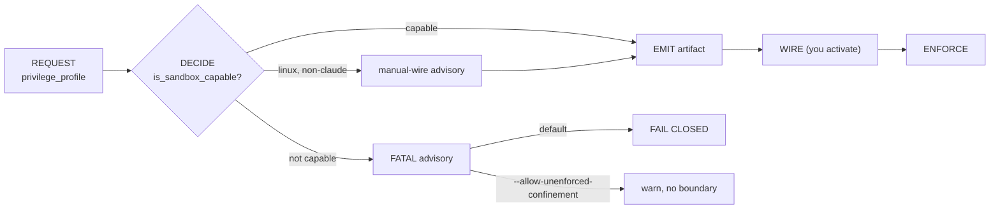

# Part I — What it is & why  (SB1–SB3)

<!-- skeleton:SB1 SB2 SB3 -->

**What you're turning on.** `confined`/`exclusive` boxes the agent that *builds* your project so a
mis-steered or injected instruction can't write, read secrets, or reach the network outside the declared
workspace. Two surfaces enforce: OS confinement (files + network) and a PreToolUse hook that gates
destructive `Bash` spellings. It's **design-time** — none of it runs inside the app you ship.

**Ceiling #1 — emitted by default, inert until wired (SB3).** As of 2026-W39 the default profile is
`confined`, which *emits* an OS write-confinement boundary (a settings/config example you must merge) —
but the hook still stays **fail-open** (`_FAIL_CLOSED_ON_ERROR = False`) unless you set an *explicit*
`confined`/`exclusive`. Opt out of emitting with `cooperative`. You get *enforcement* only when you wire
the emitted boundary in.

```bash
# nothing is ENFORCED here — the default confined profile emits an inert boundary until you wire it:
agentteams --description brief.json --framework claude --project ./proj
```

*Full detail:* [Reference Part I](../reference/part-i-what-it-is-and-why.md).

### The pipeline you're driving (G1)



> **The trap:** reaching EMIT means an *artifact* exists, not that you're confined. **You** wire it
> (Part V).
