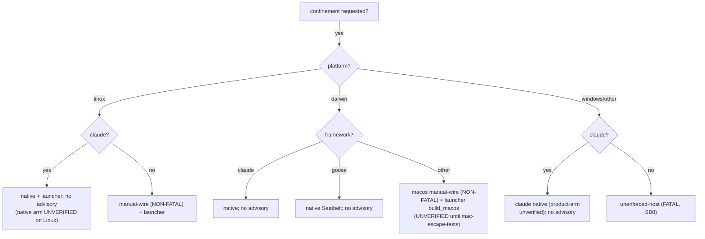

# Part III — The decision  (SB7–SB9)

<!-- skeleton:SB7 SB8 SB9 -->

**Will agentteams emit a boundary for my target?** Run `is_sandbox_capable(framework, platform)`:

| Platform | claude | goose | codex / copilot / agents-md |
|---|---|---|---|
| Linux | ✅ native + launcher `bwrap` | ✅ launcher `bwrap` | ✅ launcher `bwrap` |
| macOS | ✅ native Seatbelt | ✅ native Seatbelt | ✅ launcher `build_macos` (**UNVERIFIED**) |
| Windows | ✅ native (unverified) | ❌ **fatal** | ❌ **fatal** |

*(Since 2026-W36 macOS is framework-neutral too — the SAME launcher has a `build_macos`/`sandbox-exec`
branch, so codex/copilot/agents-md on a mac are no longer fatal.)*

**Three advisories you may hit:**

- **FATAL `unenforced-host`** — no boundary emittable (**Windows**; non-claude on any non-POSIX target).
  On `generate` this **refuses** (`PrivilegeConfinementError`) unless you pass
  `--allow-unenforced-confinement` (proceeds with a warning, **emits no boundary**).
- **NON-FATAL `linux-launcher-manual-wire`** — Linux, any framework except claude. Enforcement *is*
  available; the warning reminds you the launcher must be **wrapped**. Never refuses.
- **NON-FATAL `macos-launcher-manual-wire`** — macOS, any framework except claude **and** goose (both
  have native macOS boundaries). Same "you must wrap it" reminder, plus the honest macOS residuals (mem
  uncapped, no syscall filtering, setuid denylist ≠ NoNewPrivs, loopback-only proxy) and the
  UNVERIFIED-until-`mac-escape-tests` gate. Never refuses.

*Full detail:* [Reference Part III](../reference/part-iii-the-decision.md).
