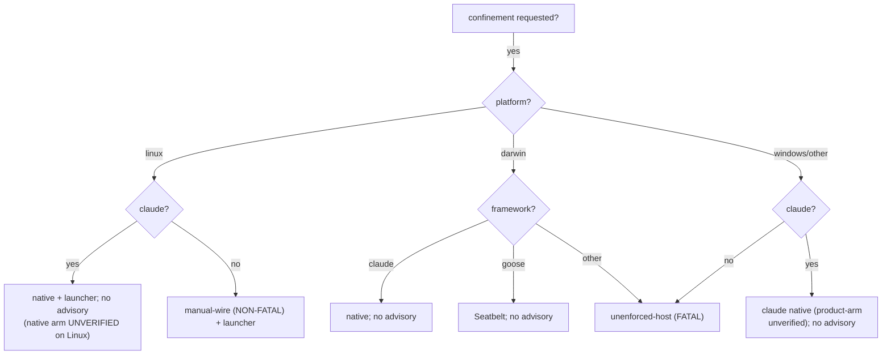

# Part III — The decision  (SB7–SB9)

<!-- skeleton:SB7 SB8 SB9 -->

**Will agentteams emit a boundary for my target?** Run `is_sandbox_capable(framework, platform)`:

| Platform | claude | goose | codex / copilot / agents-md |
|---|---|---|---|
| Linux | ✅ native + launcher | ✅ launcher | ✅ launcher |
| macOS | ✅ native | ✅ Seatbelt | ❌ **fatal** |
| Windows | ✅ native (unverified) | ❌ **fatal** | ❌ **fatal** |

**Two advisories you may hit:**

- **FATAL `unenforced-host`** — no boundary emittable (Windows; non-claude/non-goose off Linux, incl.
  macOS). On `generate` this **refuses** (`PrivilegeConfinementError`) unless you pass
  `--allow-unenforced-confinement` (which proceeds with a warning and **emits no boundary**).
- **NON-FATAL `linux-launcher-manual-wire`** — Linux, any framework except claude. Enforcement *is*
  available; the warning reminds you the launcher must be **wrapped**. It never refuses.

*Full detail:* [Reference Part III](../reference/part-iii-the-decision.md).
