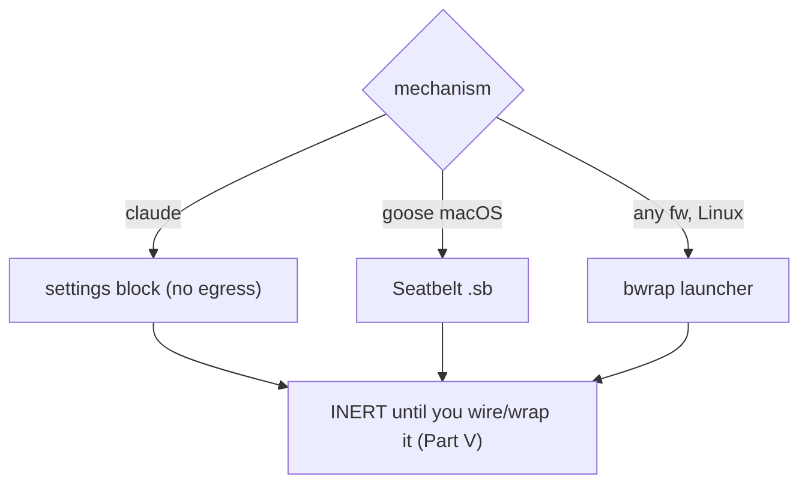

# Part IV — The mechanisms  (SB10–SB13)

<!-- skeleton:SB10 SB11 SB12 SB13 -->

Three artifacts; on Linux the launcher **stacks** with a framework's own mechanism.

| Mechanism | You get | Where |
|---|---|---|
| **A — claude settings block** | `sandbox` block (`allowWrite`/`denyWrite`/`denyRead`/`allowUnsandboxedCommands:false`). **No egress directive** — network is Claude Code's product default. | `.claude/settings.hooks.example.json` |
| **B — goose Seatbelt (macOS)** | `sandbox.sb` (`deny file-write*`, `deny network*` by default, `deny file-read*` under exclusive) | `.goose/sandbox.sb` + `config.yaml.agentteams.example` |
| **C — Linux bwrap launcher** | `sandbox/confine-run.sh` — `--ro-bind / /`, `--bind $SCRATCH`, `--unshare-net` (deny), tmpfs masks over `~/.ssh …` **always**, NoNewPrivs (bwrap default) | repo-root `sandbox/confine-run.sh` |

The launcher is emitted for **every** framework (`base.extra_output_files`), byte-for-byte from a shipped
template, at the right `../` depth per framework, and marked executable.

*Full detail:* [Reference Part IV](../reference/part-iv-the-mechanisms.md).
