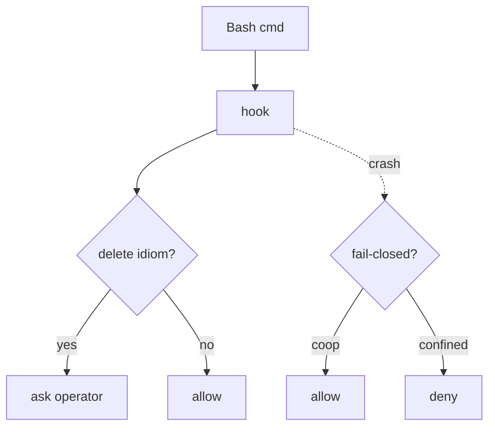

# Part V — Wiring & enforcement  (SB14–SB17)

<!-- skeleton:SB14 SB15 SB16 SB17 -->

**Ceiling #2 — inert until wired.** An emitted boundary confines nothing until you activate it.

**Activate it:**

```bash
# claude — merge the block into your live settings, then Claude Code enforces it:
#   (merge .claude/settings.hooks.example.json → .claude/settings.json)

# goose (macOS) — set GOOSE_SANDBOX (merge config.yaml.agentteams.example)

# Linux — WRAP your agent with the launcher (nothing is confined until you do):
sandbox/confine-run.sh --scratch ./work --egress deny -- goose run --recipe .goose/recipes/orchestrator.yaml
sandbox/confine-run.sh --scratch ./work --egress deny --check -- <cmd>   # dry-run, runs nothing
```

**Verify it took:** `claude.verify_sandbox_wiring` (settings merged?) and
`verify_goose_sandbox_wiring` (Linux: launcher present → `ENFORCEABLE`; Windows: exit-neutral).

**The second surface — the PreToolUse hook.** The emitted `constitutional-gate.py` routes destructive
`Bash` spellings to you for approval (C-5). It is a **best-effort speed-bump, not a boundary** — it
misses `Write`/`Edit` deletes, non-Bash tools, obfuscation, and non-honoring harnesses. Under
`confined`/`exclusive` it flips **fail-closed** (a crash denies) unless `--allow-fallback-fail-open`.



*Full detail:* [Reference Part V](../reference/part-v-wiring-and-enforcement.md).
