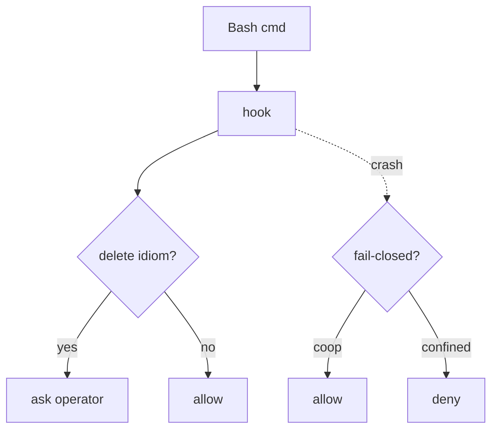

# Part V — Wiring & enforcement  (SB14–SB17, SB24)

<!-- skeleton:SB14 SB15 SB16 SB17 SB24 -->

**Ceiling #2 — inert until wired.** An emitted boundary confines nothing until you activate it.

**Activate it:**

```bash
# claude — merge the block into your live settings, then Claude Code enforces it:
#   (merge .claude/settings.hooks.example.json → .claude/settings.json)

# goose (macOS) — set GOOSE_SANDBOX (merge config.yaml.agentteams.example)

# Linux — WRAP your agent with the launcher (nothing is confined until you do):
sandbox/confine-run.sh --scratch ./work --egress deny -- goose run --recipe .goose/recipes/orchestrator.yaml
sandbox/confine-run.sh --scratch ./work --egress deny --check -- <cmd>   # dry-run, runs nothing
```

**Verify it took:** `claude.verify_sandbox_wiring` (settings merged?) and
`verify_goose_sandbox_wiring` (Linux: launcher present → `ENFORCEABLE`; Windows: exit-neutral).

**The second surface — the PreToolUse hook.** The emitted `constitutional-gate.py` routes destructive
`Bash` spellings to you for approval (C-5). It is a **best-effort speed-bump, not a boundary** — it
misses `Write`/`Edit` deletes, non-Bash tools, obfuscation, and non-honoring harnesses. Under
`confined`/`exclusive` it flips **fail-closed** (a crash denies) unless `--allow-fallback-fail-open`.

**It also asks before a PR merge** (since PR #173): `gh [flags] pr [flags] merge`, and the REST
`pulls/<n>/merge` endpoint or the GraphQL `mergePullRequest` / `enablePullRequestAutoMerge` mutations
from *any* client (`gh api`, `curl`, `wget`, httpie, a Python one-liner). `git merge` and a "merge" in
a PR body don't prompt. Same ceiling: a speed bump over the command text — an obfuscated or split call
still gets through.


```mermaid
flowchart TD
    CMD[Bash cmd] --> H[hook]
    H --> M{delete idiom?}
    M -->|yes| ASK[ask operator]
    M -->|no| OK[allow]
    H -.crash.-> FC{fail-closed?}
    FC -->|coop| OK2[allow]
    FC -->|confined| DENY[deny]
```

## SB24 — Only the orchestrator writes (`write_policy` + `agentteams_runner`)  ✅/⚙

An **opt-in** layer on top of the sandbox. Turn it on in the brief:

```json
{"write_policy": "orchestrator-only", "privilege_profile": "confined",
 "mcp_grants": {"<agent-slug>": {"tools": ["read_file_hashed", "write_file", "run_command", "request_status"]}}}
```

- **Where it renders.** claude and goose; codex only on Linux/macOS and only if you launch Codex through
  `.codex/confined-run.example.sh` (generation can't verify that). Copilot/agents-md: refused. It also
  refuses `cooperative` and a *defaulted* profile — set `confined`/`exclusive` explicitly.
- **What changes.** Every non-orchestrator agent is narrowed to `read`/`search`/`todo` and told to return
  `change-proposal` / `delete-proposal` / `command-request` JSON; the orchestrator applies them.
  Agents in `mcp_grants` instead get the exact `agentteams_runner` tools you list (of `read_file_hashed`,
  `write_file`, `delete_file`, `run_command`, `request_status`).
- **Start the runner outside every agent session** — it is the only holder of the ledger key
  (`~/.config/agentteams/keys/proposal-ledger.key`, mode 0600; it refuses a key in its environment):

  ```bash
  agentteams --serve-requests --project . --description brief.json
  ```

  It serves one request at a time (MCP-channel commands capped at 120 s), runs every command in an OS
  sandbox from `confined_programs`, and stops if the brief, the confined file or the grants file
  changes — restart it.
- **Granted writes are staged.** Review them with `agentteams --list-staged`, `--show-staged SID`,
  then `--apply-staged SID` (re-checks against the file as it is now) or `--reject-staged SID`. A write
  lands directly only for an agent with an **operator Ed25519-signed grant** (≤30 days, ≤500 writes,
  ≤3 active, kept outside the project); deletes are always staged.
- **Check it.** The `--check-wiring` mode adds the runner checks (no shadowing `agentteams_runner`
  server, the live Claude denies/`denyWrite` on `.agentteams` and `.claude`, Goose's `sandbox.sb`); the
  `AR_WRITE_POLICY` audit flags any non-orchestrator agent that can still write.
- **Importing bespoke agents:** `agentteams --interop-from DIR --framework claude|goose --description
  brief.json` carries the policy and grants into the import (PR #174). `--convert-from` and bridge
  subagent stubs don't apply the policy, so they refuse a team under the switch. For claude and goose they print that command; for other convert
  targets, they say to regenerate natively.

**What it costs, honestly.** In staged mode an agent can't run its own edit-test loop — its write hasn't
landed, so its test runs against the old file. `--check-wiring` checks configuration, not behaviour.
That Claude Code and Goose actually launch the inline server on a live host is **not yet verified**
(the mathAgents M6 pilot is that test). **Ceiling:** the runner and your host are the TCB — anyone on
that host who can read the ledger key or holds your signing key is out of scope (ceiling #4), and the
layer holds only where the session sandbox is wired.

*Full detail:* [Reference Part V](../reference/part-v-wiring-and-enforcement.md) (SB24) and the
[runner-mcp](../../api-reference/runner-mcp.md) / [write-policy](../../api-reference/write-policy.md)
API references.
