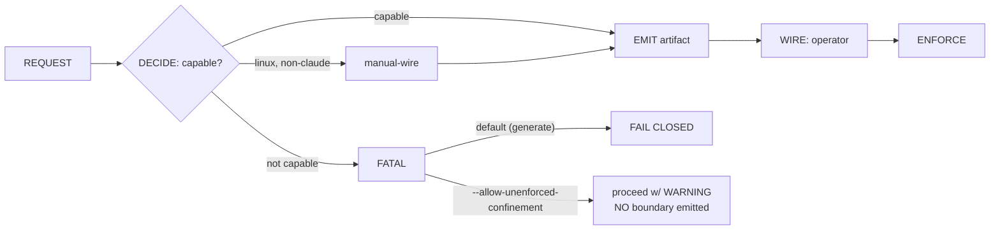

# Part I — What it is & why  (SB1–SB3)

<!-- skeleton:SB1 SB2 SB3 -->

## The adversary (SB1–SB2)

The in-scope adversary is **not** a remote network attacker. It is **an agent with legitimate
write/execute access acting on injected instructions** — OWASP LLM06, "Excessive Agency." Because the
agent *follows instructions*, a hostile string in a file under review, a fetched page, or the brief
itself (the **content-is-data** principle, C-4) can steer it toward destructive, bulk, cross-repository,
or credential-adjacent action. Sandboxing exists to make that agent's blast radius the *declared
workspace* rather than the whole host.

Two enforcement surfaces compose: **(a)** OS confinement (files + network) and **(b)** a PreToolUse hook
that gates destructive command spellings. Both are **design-time** — they box the agent that *builds* an
app, and are *not* present in the shipped app.

## The posture to check first (SB3) — ceiling #1

**Confinement is emitted by default but inert until wired.** As of 2026-W39 the default profile is
`confined`, which emits an OS write-confinement boundary (a settings/config example the operator must
merge) — but the hook still stays **fail-open by default** unless an *explicit* `confined`/`exclusive`
flips it. A reviewer's first question — "is this *enforced*?" — has the answer "only once the operator
wires the emitted boundary in." The layered stack is *emitted*, not *in force by default*.

### The pipeline (G1)

> The review-critical property: **EMIT ≠ in force.** The subsystem's central risk is a boundary that is
> emitted but never wired (Part V).
