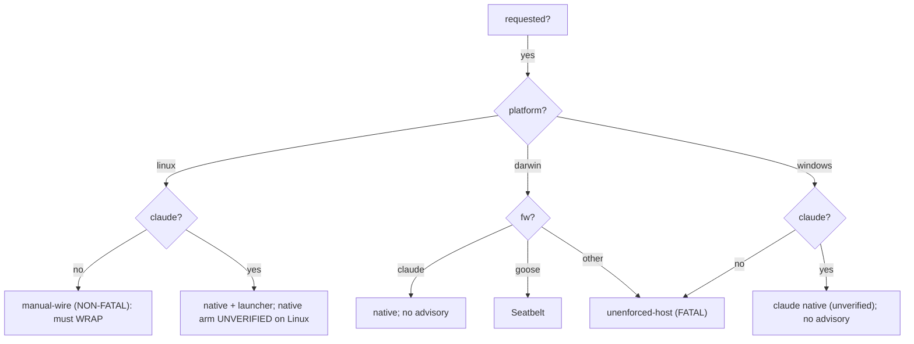

# Part III — The decision  (SB7–SB9)

<!-- skeleton:SB7 SB8 SB9 -->

`is_sandbox_capable(framework, platform)` is the single trust-boundary decision: **Linux → any
framework** (the bwrap launcher wraps any process); **claude → everywhere** (native sandbox); **goose →
macOS** (Seatbelt); else off-Linux → **not capable**.

The reviewer's key artifact is the **advisory model**, which encodes the honest-signal discipline:

- **FATAL `unenforced-host`** — no boundary emittable (Windows; non-claude/non-goose off Linux, incl.
  macOS). Generation **fails closed** (refuses to emit an inert config that looks protective) unless the
  operator explicitly opts out — and even then, *no boundary is emitted*.
- **NON-FATAL `manual-wire`** — Linux, non-claude. Enforcement *is* available but not auto-applied; the
  warning tells the operator they must **wrap** the launcher. This is the fix for a real gap: making
  Linux universally "capable" would otherwise have *silenced* the honest signal for codex/copilot/
  agents-md, leaving an operator who found `sandbox/confine-run.sh` believing they were confined.

*Detail:* [Reference Part III](../reference/part-iii-the-decision.md).
