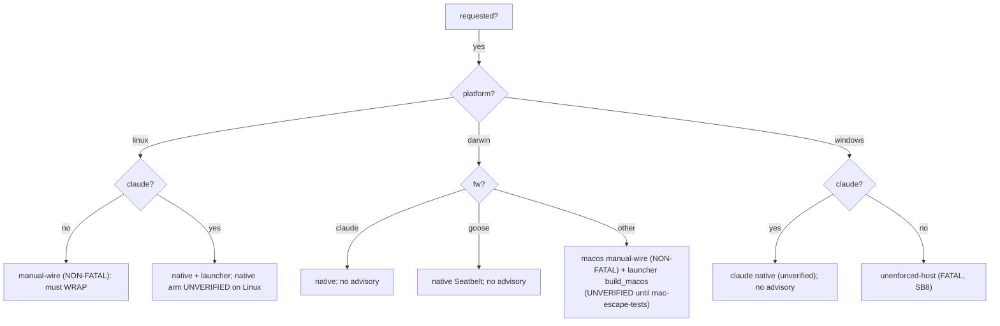

# Part III — The decision  (SB7–SB9)

<!-- skeleton:SB7 SB8 SB9 -->

`is_sandbox_capable(framework, platform)` is the single trust-boundary decision: **Linux → any
framework** (the launcher's `bwrap` branch); **macOS → any framework too** (the SAME launcher's `build_macos`/`sandbox-exec` branch, 2026-W36 — enforcement-UNVERIFIED until `mac-escape-tests.sh` passes); **claude → everywhere** (native sandbox); **goose →
macOS** (Seatbelt); else off-Linux → **not capable**.

The reviewer's key artifact is the **advisory model**, which encodes the honest-signal discipline:

- **FATAL `unenforced-host`** — no boundary emittable (**Windows**, and non-claude on any other
  non-POSIX target). Generation **fails closed** (refuses to emit an inert config that looks protective)
  unless the operator explicitly opts out — and even then, *no boundary is emitted*. (Since 2026-W36
  macOS is emittable framework-neutrally, so a mac is **no longer** fatal — see the macOS code below.)
- **NON-FATAL `linux-launcher-manual-wire`** — Linux, non-claude. Enforcement *is* available but not
  auto-applied; the warning tells the operator they must **wrap** the launcher.
- **NON-FATAL `macos-launcher-manual-wire`** (2026-W36) — macOS, non-claude **and** non-goose (both have
  native macOS boundaries). The launcher's `build_macos` branch is emitted; same "must wrap it" signal,
  carrying the honest macOS residuals + the enforcement-UNVERIFIED gate (Part VII).
- These two non-fatal codes are the fix for a real gap: making Linux — then macOS — universally
  "capable" would otherwise have *silenced* the honest signal for codex/copilot/agents-md, leaving an
  operator who found `sandbox/confine-run.sh` believing they were confined.

*Detail:* [Reference Part III](../reference/part-iii-the-decision.md).
