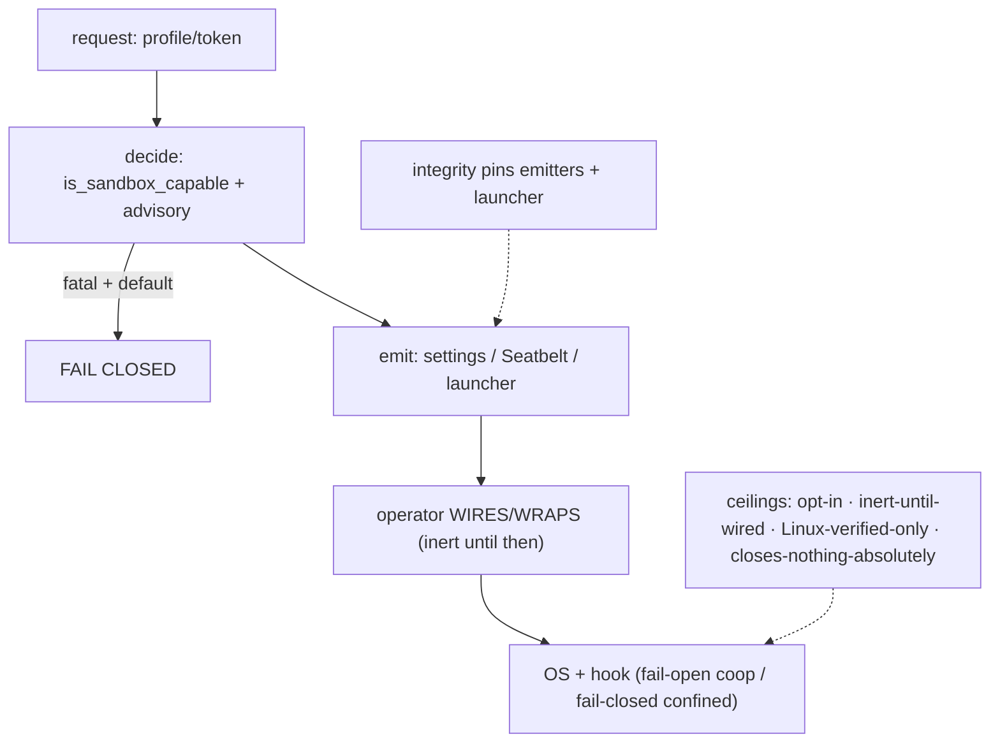

# Part VIII — Synthesis & reference  (SB22–SB23)

<!-- skeleton:SB22 SB23 -->

The subsystem, as a reviewer should model it: **request → decide (capability + honest advisory) → emit
one of three mechanisms → operator wires/wraps → OS + hook enforce**, with the emitters tamper-tracked
and every claim bounded. No single stage is the boundary; confinement is the composition, and it engages
*as tested* only when opted-in and wired.

The four ceilings are the reviewer's takeaways; the full tables are in
[Reference Part VIII](../reference/part-viii-synthesis-and-reference.md).
