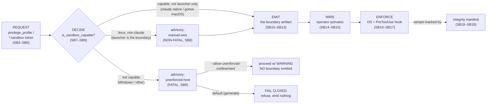

# Part I — What sandboxing is & why  (SB1–SB3)

<!-- skeleton:SB1 SB2 SB3 -->

## SB1 — What "sandboxing" means here  ✅/⚙

In agentteams, *sandboxing* is the **runtime OS-confinement layer** of the security stack. It is four
things working together: workspace **write-confinement** (the agent may write only inside declared
roots), optional **read-exclusion** (deny reads of credential paths and sibling workspaces), **egress
control** (deny / proxy / host network), and a **PreToolUse deny-hook** that gates destructive
commands. Its purpose is OWASP LLM06 ("Excessive Agency") containment: an agent that *follows
instructions* and holds `edit`/`execute` can be steered — by injected text or its own error — into
destructive, bulk, cross-repository, or credential-adjacent action, and confinement makes its blast
radius the declared workspace instead of the whole host.

It is **one layer**, not the whole stack. The governance layers — the constitution, the read-only
`@security` sentinel, the clearance/waiver/grant triad, the CLI gates, and the content scanner — are
always active and are documented in the [Security Guide](../../agentteams-security-guide/README.md).
This guide is *only* the OS-confinement + deny-hook layer (the Security Guide's Part VI, in full).

The confinement is **design-time, not runtime-of-the-app**. It boxes the agent that *builds* an app at
design/build time; it is **not** shipped inside the produced app. An app that serves LLM output to end
users must add its own runtime governance.

*Source:* `SECURITY.md` §threat-model; `agentteams/host_features.py`;
`agentteams/frameworks/_sandbox_emit.py`; `agentteams/templates/universal/sandbox/confine-run.sh`.

## SB2 — The in-scope adversary and the two surfaces  ✅/⚙

The realistic in-scope adversary is **an agent with legitimate write/execute access acting on injected
instructions** — not a remote network attacker. Two surfaces enforce, and they compose:

- **(a) OS confinement** boxes the *filesystem + network*: Claude Code's native sandbox, Apple Seatbelt
  for goose on macOS, or the framework-neutral bwrap launcher on Linux.
- **(b) the PreToolUse `constitutional-gate.py` hook** boxes *specific destructive command spellings* an
  agent's `Bash` tool might run.

Neither is the boundary alone. The layer exists partly because **content is data (C-4)**: a file under
review, a fetched page, or the brief itself may carry injected text, and confinement limits what a
mis-followed instruction can do.

*Source:* `.claude/CLAUDE.md` (C-4); `agentteams/templates/universal/hooks/constitutional-gate.py`;
`SECURITY.md` §design-time-vs-runtime.

## SB3 — The opt-in posture (binding ceiling #1)  ✅

**By default the strongest locks are off.** The default `privilege_profile` is **`cooperative`**: no
sandbox block is emitted, and the deny-hook is emitted **fail-OPEN** (`_FAIL_CLOSED_ON_ERROR = False`, so
a hook crash is a harness *allow* — a buggy gate never bricks a trusted session). Runtime confinement
engages **only** when the operator selects `confined` or `exclusive` (or passes a `*:sandbox`
host-feature token). Reading "layered confinement" as "on out of the box" is the overclaim this fact
exists to prevent.

*Source:* `agentteams/host_features.py` (cooperative default);
`agentteams/frameworks/_sandbox_emit.py:116` `_sandbox_feature_enabled`;
`agentteams/templates/universal/hooks/constitutional-gate.py:205` (`_FAIL_CLOSED_ON_ERROR = False`).

---

## The pipeline (graph G1)

Every sandbox request flows through five stages — the rest of this guide details each. **Reaching
EMIT means a boundary *artifact* exists, not that a boundary is *in force*:** WIRE (operator action)
and, for the Linux launcher, actually wrapping the process are what make it enforce.

> **Next:** [Part II — The request](part-ii-the-request.md) details the REQUEST stage.
