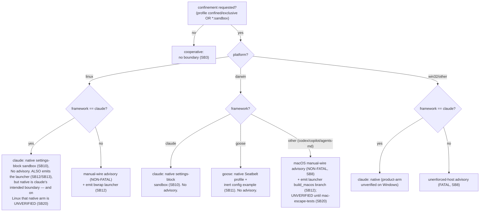

# Part III — The decision  (SB7–SB9)

<!-- skeleton:SB7 SB8 SB9 -->

## SB7 — `is_sandbox_capable`: the capability matrix  ✅

`is_sandbox_capable(framework_id, platform)` is the single platform-aware decision function. Its matrix:

| Platform | Framework | Capable? | Boundary |
|---|---|---|---|
| **Linux** | **any** | ✅ | the launcher's `bwrap` branch (framework-neutral; **VERIFIED**) |
| **macOS** | **any** | ✅ | claude/goose via their native Seatbelt; every other framework via the launcher's `build_macos` (`sandbox-exec`) branch (**UNVERIFIED** until `mac-escape-tests.sh` passes) |
| any (incl. Windows) | `claude` | ✅ | Claude Code's own native sandbox |
| **Windows / any other** | non-claude | ❌ | no emittable boundary |

As of 2026-W36 the matrix is **framework-neutral on both POSIX platforms** — the SAME launcher carries a
`bwrap` branch (Linux) and a `sandbox-exec`/`build_macos` branch (macOS). `SANDBOX_CAPABLE_FRAMEWORKS` is
a convenience set sampling only `("claude","goose")` for the current host; the authoritative answer is
`is_sandbox_capable` itself.

*Source:* `agentteams/host_features.py:222` `is_sandbox_capable`.

### The decision graph (G2)

## SB8 — Three advisories: one fatal, two non-fatal  ✅

`privilege_profile_advisory` returns one of **three** codes, or `None`:

- **`privilege-profile-unenforced-host`** (**FATAL**) — no boundary is emittable here: **Windows** (and
  any non-claude framework on another non-POSIX target). Since 2026-W36 macOS is emittable
  framework-neutrally, so a confined codex/copilot/agents-md team on a **mac is NO LONGER fatal** (see
  the macOS manual-wire code below). `resolve_host_features_and_advise` **raises**
  `PrivilegeConfinementError` (fail-closed) unless `--allow-unenforced-confinement`, which downgrades it
  to a persisted warning **and emits no boundary on that host**.
- **`privilege-profile-linux-launcher-manual-wire`** (**NON-FATAL**) — on **Linux, every framework
  except claude**: enforcement IS available (the launcher `bwrap` branch) but is **not auto-applied**;
  the operator must WRAP the invocation. Never fail-closes; always warns + persists.
- **`privilege-profile-macos-launcher-manual-wire`** (**NON-FATAL**, 2026-W36) — on **macOS, every
  framework except claude AND goose** (both have their own auto-applied native macOS boundary, SB11).
  The launcher's `build_macos` branch is emitted (`sandbox-exec` + Seatbelt profile, RLIMIT_CPU/NPROC
  caps, loopback-only proxy DNS contract, non-exhaustive setuid-exec denylist). Also not auto-applied
  (WRAP the invocation); never fail-closes. Its message carries the **honest macOS residuals** (memory
  UNCAPPED, no syscall filtering, setuid denylist ≠ NoNewPrivs, loopback-only proxy) and the
  **enforcement-UNVERIFIED** gate (SB20).
- **`None`** — a boundary wired through the framework's own config surfaces no extra advisory: claude
  native everywhere; goose Seatbelt on macOS. **Claude/Linux caveat:** claude's native arm is its
  intended boundary but is UNVERIFIED on Linux (SB20) while the verified launcher rides along un-advised
  — "no advisory for claude" ≠ "fully covered."

`resolve_host_features_and_advise` fail-closes on the fatal code **only** (`fatal = code ==
"privilege-profile-unenforced-host"`); both manual-wire codes warn + persist, never raise. **Why the
manual-wire codes exist (a closed gap):** making Linux — then macOS — capable for every framework would
otherwise suppress the old unenforced-host advisory for codex/copilot/agents-md, whose launcher is inert
until wrapped. The non-fatal advisories restore the honest signal, per POSIX platform.

*Source:* `agentteams/host_features.py:325` `privilege_profile_advisory`, `:376` (unenforced-host),
`:404` (linux manual-wire), `:426` (macos manual-wire); `agentteams/cli/artifacts.py:330`
`resolve_host_features_and_advise`, `:381`.

## SB9 — Fail-closed by default on generate  ✅

On the interactive `generate` path a fatal (unenforceable) confinement request **refuses to emit an
inert boundary** rather than ship a config that looks protective — the fail-safe-defaults principle.
`--allow-unenforced-confinement` opts into proceeding with the advisory instead (and emits no boundary
on that host). The `--convert-from`/`--fleet`/render paths keep an advisory-not-raise default, so an
unenforceable target there degrades to a warning rather than a non-zero exit.

*Source:* `agentteams/cli/artifacts.py:381`; `agentteams/frameworks/_sandbox_emit.py:116`.

> **Next:** [Part IV — The mechanisms](part-iv-the-mechanisms.md).
