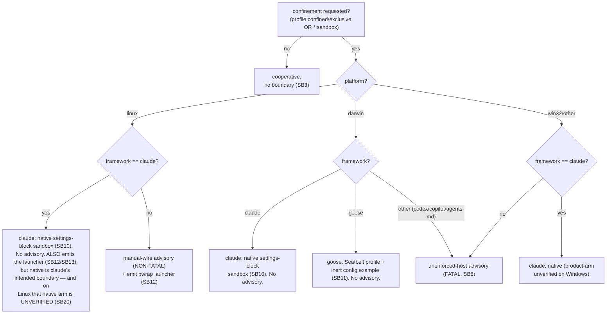

# Part III — The decision  (SB7–SB9)

<!-- skeleton:SB7 SB8 SB9 -->

## SB7 — `is_sandbox_capable`: the capability matrix  ✅

`is_sandbox_capable(framework_id, platform)` is the single platform-aware decision function. Its matrix:

| Platform | Framework | Capable? | Boundary |
|---|---|---|---|
| **Linux** | **any** | ✅ | the bwrap launcher wraps any process (framework-neutral) |
| any (incl. macOS/Windows) | `claude` | ✅ | Claude Code's own native sandbox |
| **macOS** | `goose` | ✅ | Apple Seatbelt |
| macOS/Windows | `goose` off macOS / codex / copilot / agents-md | ❌ | no emittable boundary |

`SANDBOX_CAPABLE_FRAMEWORKS` is a convenience set sampling only `("claude","goose")` for the current
host; the authoritative, framework-complete answer is `is_sandbox_capable` itself.

*Source:* `agentteams/host_features.py:222` `is_sandbox_capable`.

### The decision graph (G2)

## SB8 — Two advisories: fatal vs non-fatal  ✅

`privilege_profile_advisory` returns one of two codes, or `None`:

- **`privilege-profile-unenforced-host`** (**FATAL**) — no boundary is emittable here: **Windows**, and
  any **non-claude/non-goose** framework off Linux (**including on macOS** — e.g. a confined
  codex/copilot/agents-md team on a mac). `resolve_host_features_and_advise` **raises**
  `PrivilegeConfinementError` (fail-closed) unless `--allow-unenforced-confinement`, which downgrades it
  to a persisted warning **and emits no boundary on that host**.
- **`privilege-profile-linux-launcher-manual-wire`** (**NON-FATAL**) — on **Linux, for every framework
  except claude**: enforcement IS available (the emitted launcher) but is **not auto-applied**; the
  operator must WRAP the invocation. This **never** fail-closes (enforcement is genuinely available); it
  always warns + persists.
- **`None`** — a boundary wired through the framework's own config (claude native everywhere; goose
  Seatbelt on macOS) surfaces no extra advisory. **Claude-on-Linux caveat:** claude is excluded because
  its *native settings-block sandbox* is its intended boundary — but on Linux that native arm is
  enforcement-**UNVERIFIED** (SB20), while the *verified* neutral launcher (also emitted for claude on
  Linux, SB13) is left un-advised. "No advisory for claude" means "its intended boundary is the native
  one," not "claude-on-Linux is fully covered."

`resolve_host_features_and_advise` fail-closes on the fatal code **only** (`fatal = code ==
"privilege-profile-unenforced-host"`). **Why manual-wire exists (a closed gap):** making Linux capable
for every framework suppressed the old unenforced-host advisory for codex/copilot/agents-md, whose
launcher is inert until wrapped. The non-fatal advisory restores the honest signal so an operator who
requested `confined`, saw no error, and found `sandbox/confine-run.sh` is told *nothing is confined
until they wrap the process*.

*Source:* `agentteams/host_features.py:277` `privilege_profile_advisory`, `:324` (unenforced-host),
`:352` (manual-wire); `agentteams/cli/artifacts.py:330` `resolve_host_features_and_advise`, `:381`.

## SB9 — Fail-closed by default on generate  ✅

On the interactive `generate` path a fatal (unenforceable) confinement request **refuses to emit an
inert boundary** rather than ship a config that looks protective — the fail-safe-defaults principle.
`--allow-unenforced-confinement` opts into proceeding with the advisory instead (and emits no boundary
on that host). The `--convert-from`/`--fleet`/render paths keep an advisory-not-raise default, so an
unenforceable target there degrades to a warning rather than a non-zero exit.

*Source:* `agentteams/cli/artifacts.py:381`; `agentteams/frameworks/_sandbox_emit.py:116`.

> **Next:** [Part IV — The mechanisms](part-iv-the-mechanisms.md).
