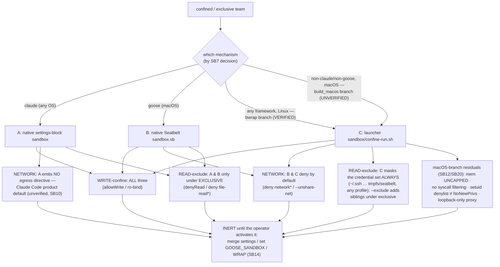

# Part IV — The mechanisms  (SB10–SB13)

<!-- skeleton:SB10 SB11 SB12 SB13 -->

Three emitters produce three boundary artifacts. On Linux the launcher **stacks** with a framework's
own mechanism (a claude team on Linux emits both the settings block and the launcher).

## SB10 — Mechanism A: Claude native settings-block sandbox  ✅/⚙

For the `claude` framework, `_sandbox_emit._build_sandbox_block` emits a `sandbox` block into
`.claude/settings.hooks.example.json`: `allowWrite` (the write roots), `denyWrite` (the control-plane
files even inside a write root), `denyRead`/`allowRead` (for `exclusive`), and the
`allowUnsandboxedCommands: false` escape-hatch closure. Claude Code applies it natively once the operator
merges the example into their live `settings.json`. **The block emits no network/egress directive** —
claude network confinement is Claude Code's own product default, which agentteams neither emits nor
verifies.

The block is **inert until merged** — agentteams ships an *example*, never writes the operator's
`settings.json`. `verify_sandbox_wiring` (P1-3) is the read-only, output-only check that the block was
actually merged; it reports booleans and never echoes live-settings secrets.

**Honest ceiling.** Claude Code's *mechanism* is verified; its **Linux product arm** on stock Ubuntu is
**not** (nested-userns restrictions) — a distinct mechanism from the bwrap launcher of SB12.

*Source:* `agentteams/frameworks/_sandbox_emit.py:176` `_build_sandbox_block`;
`agentteams/frameworks/claude.py:249` (gate), `:320` `verify_sandbox_wiring`.

## SB11 — Mechanism B: the native macOS boundaries (goose Seatbelt; claude Seatbelt)  ✅/⚙

For `goose` on **macOS**, `goose_sandbox_output_files` emits a `sandbox.sb` Seatbelt profile
(`sandbox-exec`) that `deny file-write*` outside the write roots, `deny network*` **by default** (an
egress-proxy allow for ONE endpoint is behind an explicit flag), and — for `exclusive` — `deny
file-read*` of the protected set. It ships an **inert** `config.yaml.agentteams.example` carrying
`GOOSE_SANDBOX`, which the operator merges. An explicit `sys.platform == "darwin"` guard ensures this
path emits **only** on macOS; off macOS it returns `[]` — not "no boundary" (Linux uses the launcher of
SB12), only Windows has none.

**Honest ceiling (#3).** The Seatbelt path is **enforcement- and profile-syntax-UNVERIFIED** off a mac
host — a green *emission* test means "the profile is shaped right," never "it denies on a real mac."

*Source:* `agentteams/frameworks/_goose_sandbox_emit.py:333` `goose_sandbox_output_files`, `:350`
(darwin guard); `_seatbelt_path_expr`.

## SB12 — Mechanism C: the framework-neutral launcher (Linux `bwrap` + macOS `sandbox-exec`)  ✅/⚙

The SAME provider-agnostic launcher — repo-root **`sandbox/confine-run.sh`**, NOT under `.goose/`, NOT
framework-gated — carries **two OS branches**, and `base.extra_output_files` emits
`linux_sandbox_output_files(...) + macos_sandbox_output_files(...)` (only one is non-empty per host).

**macOS branch (`build_macos`, 2026-W36) — enforcement-UNVERIFIED (SB20).** Once WRAPped, `sandbox-exec`
+ a generated path-agnostic Seatbelt profile (deny-write outside scratch; deny reads of the
credential/`--exclude` set; deny-network / loopback-only proxy), **RLIMIT_CPU/NPROC** caps via `ulimit`
(`--cpu-max`/`--nproc-max`), and a **non-exhaustive setuid-exec denylist** (compensating hardening — NOT
NoNewPrivs). **Honest macOS residuals:** memory **UNCAPPED** (`--mem-max` is interface-only — a hard cap
needs a VM/container/Linux host); **no syscall filtering**; sole-proxy egress **loopback-only** (SBPL
can't pin a remote proxy IP — remote-address control lives out-of-band in PF). The `--cpu-max`/
`--nproc-max`/`--mem-max` flags are **no-ops on Linux** (cgroups reach those caps OOB). On macOS the
emit also ships **`sandbox/mac-escape-tests.sh`** (the on-host deny test that must pass unnested before
the macOS boundary is called "confined") + two INERT Tier-B examples (`dedicated-uid-provisioning`,
`pf-per-tenant-anchor`).

**Linux branch (`bwrap`) — enforcement-VERIFIED (SB20).** The launcher confines **once the operator
WRAPs the invocation with it**
(`sandbox/confine-run.sh --scratch DIR --egress deny -- <agent cmd>`); the emit step only *writes the
file* — an emitted-but-unwrapped launcher confines nothing (this is why SB12 is ✅/⚙: ✅ as emitted, ⚙
for the operator action that activates it; the ceiling is SB14). When wrapped it enforces:

- `--ro-bind / /` — read-only root; `--bind $SCRATCH` — the *only* writable path;
- `--unshare-net` on `--egress deny` — network isolation (`--egress proxy` runs inside a pre-created
  netns; `--egress host` shares the host net with a printed warning);
- `--tmpfs` masks over the credential set (`~/.ssh ~/.aws ~/.gnupg ~/.kube ~/.config/gcloud ~/.azure`),
  applied on **every** wrap regardless of profile, plus any `--exclude` sibling paths (exclusive);
- `--die-with-parent`, the unshare namespaces (`user/ipc/pid/uts/cgroup`), and **NoNewPrivs** — which is
  bubblewrap's *default* behavior here, **not an explicit emitted flag**, so unlike the textual flags it
  is **not** covered by the SB18 content pin (there is no line to diff);
- `other OS → FAIL CLOSED` (never runs a command while labeled "confined").

The launcher content is **emitted verbatim** (byte-for-byte) from a shipped template asset
(`templates/universal/sandbox/confine-run.sh`) — it is generic, taking `--scratch`/`--exclude`/`--egress`
at RUN time, so no manifest values are baked in. The emit path lands it repo-root-relative at the correct
`../` depth per framework (`sandbox_launcher_rel_path`) and marks it executable.

*Source:* `agentteams/frameworks/_linux_sandbox_emit.py:52,94`; `agentteams/frameworks/base.py:125,139`;
`agentteams/templates/universal/sandbox/confine-run.sh`; `agentteams/atomicio.py` (shebang → +x).

### What each mechanism denies (graph G3)

## SB13 — Framework-neutral wiring, no harness preference  ✅

The Linux launcher is emitted from `base.extra_output_files`, so **every** framework adapter emits it
(claude, codex, copilot-vscode/-cli, agents-md, goose) — no harness is preferred. Only `claude.py` and
`goose.py` override `extra_output_files`, and both call `super()`; there is no double-emit. The neutral
path resolves to repo-root `sandbox/confine-run.sh` via `sandbox_launcher_rel_path()`: `../../` for
2-deep agents dirs (claude/copilot/goose), `../` for 1-deep (codex/agents-md).

*Source:* `agentteams/frameworks/base.py:139`; `agentteams/frameworks/codex.py`,
`agentteams/frameworks/agents_md.py` (rel-path overrides); `claude.py`, `goose.py` (`super()`).

> **Next:** [Part V — Wiring & runtime enforcement](part-v-wiring-and-enforcement.md).
