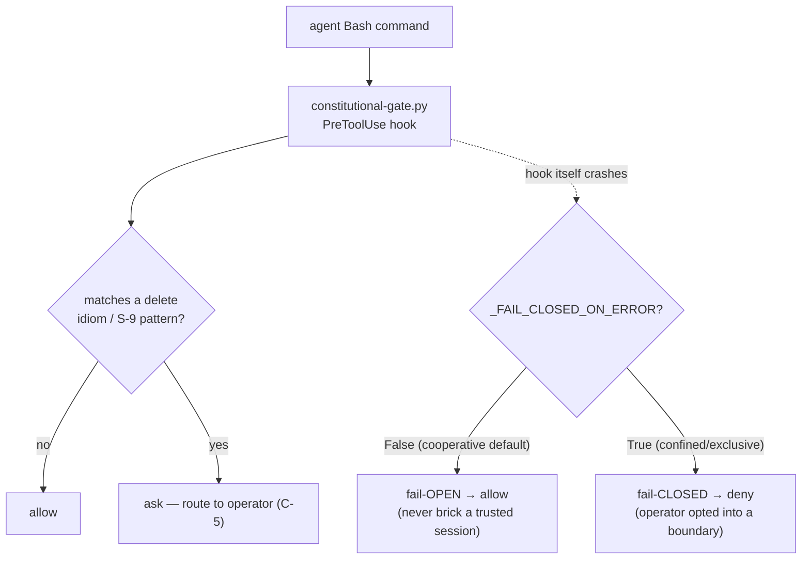

# Part V — Wiring & runtime enforcement  (SB14–SB17)

<!-- skeleton:SB14 SB15 SB16 SB17 -->

## SB14 — Inert until wired (binding ceiling #2)  ⚙

Every emitted boundary is **inert until the operator activates it** — the standing "ship an example,
never clobber the operator's live config" convention. Activation differs by mechanism:

- **claude** — *merge* the settings block into `.claude/settings.json`;
- **goose macOS** — *set `GOOSE_SANDBOX`* (merge the config example);
- **Linux launcher** — *WRAP* the invocation: `sandbox/confine-run.sh --scratch DIR --egress deny --
  <agent cmd>`.

For the Linux launcher there is no framework config that references it — the operator must change *how
they launch* the agent. This is exactly why SB8's non-fatal manual-wire advisory exists: to say so at
generation time. An emitted-but-unwired boundary confines nothing.

*Source:* `agentteams/frameworks/hooks_emit.py`;
`agentteams/templates/universal/sandbox/confine-run.sh` (usage header); `agentteams/host_features.py:404` (linux manual-wire).

## SB15 — Verifying the wiring took effect  ✅

Read-only, output-only verifiers close the "looks confined, enforces nothing" gap without echoing
live-config secrets:

- `claude.verify_sandbox_wiring` — was the settings block merged (and the escape-hatch left closed)?
- `_goose_sandbox_emit.verify_goose_sandbox_wiring` — **platform-honest**: on **Linux** it verifies
  `sandbox/confine-run.sh` is present and returns `ENFORCEABLE` (noting it must still be wrapped); on
  **Windows** it is exit-neutral "NOT ENFORCEABLE HERE"; on **macOS** it checks the Seatbelt
  `.goose/sandbox.sb`.

*Source:* `agentteams/frameworks/claude.py:320` `verify_sandbox_wiring`;
`agentteams/frameworks/_goose_sandbox_emit.py:392` `verify_goose_sandbox_wiring`.

## SB16 — The PreToolUse constitutional-gate hook  ✅/⚙

The second enforcement surface — the emitted `constitutional-gate.py` PreToolUse hook — routes
destructive **Bash** command spellings (repo/ref/worktree/filesystem/infrastructure/database deletion —
the "delete-authorization gate") to the operator for authorization BEFORE they run (C-5).

**It is a best-effort, cooperative speed-bump, not a boundary.** It does NOT gate `Write`/`Edit` content
deletion, MCP/non-Bash deletes, interpreter-mediated deletion it does not pattern-match, alias/quote/
variable obfuscation, or harnesses that do not honor PreToolUse (or auto-approve under headless). A green
delete-gate test means "these spellings are gated," never "deletion is prevented."

*Source:* `agentteams/templates/universal/hooks/constitutional-gate.py:63` (delete gate);
`agentteams/templates/universal/security.template.md` (scope + limits).

## SB17 — Fail-open default, fail-closed under confinement  ✅

The hook defaults **fail-OPEN** (`_FAIL_CLOSED_ON_ERROR = False`): a gate crash is a harness *allow*, so
a buggy gate never bricks a cooperative session. Under `confined`/`exclusive`, emission flips the
sentinel to `_FAIL_CLOSED_ON_ERROR = True` (unless `--allow-fallback-fail-open`), so a crash emits a
`deny` — the operator opted into a boundary a crash must not silently drop.

### The hook flow (graph G4)

*Source:* `agentteams/templates/universal/hooks/constitutional-gate.py:205`;
`agentteams/frameworks/claude.py` `_apply_fail_closed_policy`.

> **Next:** [Part VI — Integrity, provenance & drift](part-vi-integrity-and-drift.md).
