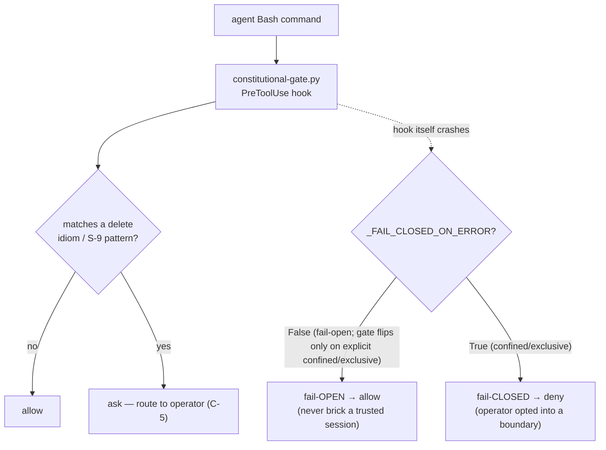

# Part V — Wiring & runtime enforcement  (SB14–SB17, SB24)

<!-- skeleton:SB14 SB15 SB16 SB17 SB24 -->

## SB14 — Inert until wired (binding ceiling #2)  ⚙

Every emitted boundary is **inert until the operator activates it** — the standing "ship an example,
never clobber the operator's live config" convention. Activation differs by mechanism:

- **claude** — *merge* the settings block into `.claude/settings.json`;
- **goose macOS** — *set `GOOSE_SANDBOX`* (merge the config example);
- **Linux launcher** — *WRAP* the invocation: `sandbox/confine-run.sh --scratch DIR --egress deny --
  <agent cmd>`.

For the Linux launcher there is no framework config that references it — the operator must change *how
they launch* the agent. This is exactly why SB8's non-fatal manual-wire advisory exists: to say so at
generation time. An emitted-but-unwired boundary confines nothing.

*Source:* `agentteams/frameworks/hooks_emit.py`;
`agentteams/templates/universal/sandbox/confine-run.sh` (usage header); `agentteams/host_features.py:404` (linux manual-wire).

## SB15 — Verifying the wiring took effect  ✅

Read-only, output-only verifiers close the "looks confined, enforces nothing" gap without echoing
live-config secrets:

- `claude.verify_sandbox_wiring` — was the settings block merged (and the escape-hatch left closed)?
- `_goose_sandbox_emit.verify_goose_sandbox_wiring` — **platform-honest**: on **Linux** it verifies
  `sandbox/confine-run.sh` is present and returns `ENFORCEABLE` (noting it must still be wrapped); on
  **Windows** it is exit-neutral "NOT ENFORCEABLE HERE"; on **macOS** it checks the Seatbelt
  `.goose/sandbox.sb`.

*Source:* `agentteams/frameworks/claude.py:320` `verify_sandbox_wiring`;
`agentteams/frameworks/_goose_sandbox_emit.py:392` `verify_goose_sandbox_wiring`.

## SB16 — The PreToolUse constitutional-gate hook  ✅/⚙

The second enforcement surface — the emitted `constitutional-gate.py` PreToolUse hook — routes
destructive **Bash** command spellings (repo/ref/worktree/filesystem/infrastructure/database deletion —
the "delete-authorization gate") to the operator for authorization BEFORE they run (C-5).

**It is a best-effort, cooperative speed-bump, not a boundary.** It does NOT gate `Write`/`Edit` content
deletion, MCP/non-Bash deletes, interpreter-mediated deletion it does not pattern-match, alias/quote/
variable obfuscation, or harnesses that do not honor PreToolUse (or auto-approve under headless). A green
delete-gate test means "these spellings are gated," never "deletion is prevented."

**PR merges go to the operator too (since PR #173).** The same `ask` fires on a pull-request merge:

- `gh [flags] pr [flags] merge` — flags may sit on either side of `pr` (`gh pr -R o/r merge 12`);
- the REST merge endpoint `pulls/<n>/merge`, and
- the GraphQL `mergePullRequest` / `enablePullRequestAutoMerge` mutations —

the last two matched in the command text **whatever client sends them**: `gh api`, `curl`, `wget`,
httpie, or an interpreter one-liner (the earlier gh-only rule let `curl -X PUT …/pulls/N/merge`
through). A "merge" in a PR body, `gh pr view … mergeable`, or a later `git merge` does not prompt.

**Same ceiling.** The rule is a case-insensitive pattern over one `Bash` command string, so it is the
same cooperative speed bump: an obfuscated or split string (a path assembled from variables, an encoded
GraphQL body, a script file that makes the call) still evades it, and a merge through a non-Bash tool
is never seen.

*Source:* `agentteams/templates/universal/hooks/constitutional-gate.py:63` (delete gate), `:75-85`
(PR-merge rule), `:157-161` (Bash-only, case-insensitive);
`agentteams/templates/universal/security.template.md` (scope + limits);
`tests/test_constitutional_gate_hook.py:280-292` (merge spellings), `:226-228` (benign non-merges).

## SB17 — Fail-open default, fail-closed under confinement  ✅

The hook defaults **fail-OPEN** (`_FAIL_CLOSED_ON_ERROR = False`): a gate crash is a harness *allow*, so
a buggy gate never bricks a cooperative session. Under an **explicit** `confined`/`exclusive`, emission flips the
sentinel to `_FAIL_CLOSED_ON_ERROR = True` (unless `--allow-fallback-fail-open`), so a crash emits a
`deny` — the operator opted into a boundary a crash must not silently drop.

### The hook flow (graph G4)

```mermaid
flowchart TD
    CMD["agent Bash command"] --> H["constitutional-gate.py<br/>PreToolUse hook"]
    H --> MATCH{"matches a delete<br/>idiom / S-9 pattern?"}
    MATCH -->|no| ALLOW["allow"]
    MATCH -->|yes| ASK["ask — route to operator (C-5)"]
    H -.->|"hook itself crashes"| FC{"_FAIL_CLOSED_ON_ERROR?"}
    FC -->|"False (fail-open; gate flips only on explicit confined/exclusive)"| ALLOW2["fail-OPEN → allow<br/>(never brick a trusted session)"]
    FC -->|"True (confined/exclusive)"| DENY["fail-CLOSED → deny<br/>(operator opted into a boundary)"]
```

*Source:* `agentteams/templates/universal/hooks/constitutional-gate.py:230`;
`agentteams/frameworks/claude.py` `_apply_fail_closed_policy`.

## SB24 — The orchestrator-only write policy and the `agentteams_runner` MCP server  ✅/⚙

*Appended section (new ID). It sits here because it is an enforcement layer that rides on the session
sandbox of SB10–SB14.*

### The switch, and where it is refused

`write_policy: "orchestrator-only"` is **opt-in**: without it, `apply` returns every agent file
unchanged, so a default team is byte-identical. One resolver, `write_policy.resolve`, serves both native
generation and `--interop-from --description`, and it **refuses** the switch:

- on any framework but `claude`, `goose` and `codex` (Copilot and agents-md are not covered);
- with `privilege_profile: "cooperative"` (no session sandbox);
- without an **explicit** `confined`/`exclusive` — the defaulted profile leaves the gate hook fail-open
  (SB17);
- with a legacy Goose tool scoping (only grant-mode recipes derive extensions from declared tools).

`write_policy_frameworks` may scope it to some of those three; the rest render **without** it, with a
notice. **Codex** is accepted only on Linux/macOS, and holds only when Codex is launched through
`.codex/confined-run.example.sh` — the launcher masks the key directory and a generated role gate
(`codex-role-gate.py`) limits spawned agents to read-only tools. Generation prints that it cannot verify
that launch.

### Narrowing and the sections

Every non-orchestrator agent's canonical `tools:` line is narrowed to `read`/`search`/`todo` (`read` is
always kept; no shell, no dispatch) *before* any adapter reads it, so one narrowing reaches Claude's
tool map, Codex `sandbox_mode` and Goose's grant extensions alike. A legacy one-line `allowed-tools:`
is removed; a `tools:` key of any other shape is refused. The agent gains a fenced **"Write Policy:
Return Proposals, Never Write"** section that overrides any write wording in its body: it returns a
`change-proposal` (whole file + `base_sha256`), `delete-proposal`, or `command-request` (`argv` list).
The `orchestrator` and Goose's `bridge-orchestrator` keep their tools and get **"Applying Proposals"**.

### The out-of-session runner — the only key holder

The orchestrator's `agentteams --apply-proposal` / `--run-request` only **queue** a request. The
operator starts `agentteams --serve-requests --project <root> --description <brief>` *outside* every
agent session. That runner:

- is the **only** process holding the ledger key, read from a 0600 file under
  `~/.config/agentteams/keys/` (which every session sandbox read-denies) — and it refuses to start if a
  key sits in its environment, since a confined child could read it there;
- refuses a brief without the switch, and pins the brief, the operator `confined_programs` file and the
  direct-grants file at start — any change stops it until restarted;
- runs every command and gate inside an OS sandbox built from `confined_programs`, and refuses when no
  sandbox is usable unless the brief's logged `allow_unconfined_runs` is set;
- serves the queue **one request at a time** (each command's write check diffs the worktree before and
  after), with MCP-channel commands capped at **120 s**;
- takes a request's **channel** from the directory it arrived in (`.agentteams-queue/requests/` vs
  `.agentteams-queue/mcp-requests/`), never from a field the sender writes; the MCP channel may queue
  only `stage-proposal` and `run-request`.

### The `agentteams_runner` MCP server

An agent named in the brief's `mcp_grants` gets exactly its granted subset of five tools —
`read_file_hashed`, `write_file`, `delete_file`, `run_command`, `request_status` — and no others are
advertised or callable.

- **Keyless queue client.** It writes only request and ack files under `.agentteams-queue/`, never the
  project, and is **not a trust boundary**: the runner re-validates identity (from the nonce, bound to
  the instance's `--agent`), scopes, allowlist, gates and base hashes.
- **Launch integrity.** Generation installs it at `.agentteams/bin/agentteams-runner-mcp.py` inside the
  session-write-denied control plane. Agents launch it with an absolute **system** `python3`
  (`/usr/bin`, `/usr/local/bin`, `/opt/homebrew/bin` — never PATH or a home dir) with `-I -S`. The
  server derives the project root from its install location. The runner checks the installed copy
  against a **pinned SHA256** on every poll and stops serving on a mismatch (detection; prevention is the
  sandbox's write-deny on `.agentteams/`).
- **Read deny list.** `read_file_hashed` refuses VCS dirs, the control plane and queue, and credential
  names/suffixes, checked on **both the requested and the resolved path** (an in-project link to `.env`
  is refused).

### Staged by default; direct only on a verified operator grant

Generated agents always launch the server as `staged`. A `write_file` is checked, gated and stored under
`.agentteams/staged/` (24 h); the orchestrator decides with `--list-staged`, `--show-staged`,
`--apply-staged` (which re-runs every check against the file as it is now) or `--reject-staged`. The
runner alone upgrades a staged **change** to a direct write, and only for an agent whose **operator
Ed25519-signed grant** verified at start: purpose-tagged, bound to the agent, tools, write scopes, gates
and the installed server's sha256, at most 30 days, at most 500 writes, read from a custody-checked
operator file outside the project — and more than **3** active grants activates none. An unsigned
`approval: "direct"` acts as staged. **Deletes are always staged.** A direct grant is a constraint-relaxing change
(Rule 15) — hence the asymmetric signature and the caps.

### Audit, wiring check, interop

- **`AR_WRITE_POLICY`** imports the generator's read-only token set (no drift) and flags any
  non-orchestrator agent, generated or adopted, that can write or dispatch or carries a capability key
  beyond its canonical runner block.
- **`--check-wiring`** adds `runner_mcp.wiring_problems` for a granted team: no config scope may define a
  server named `agentteams_runner`; Claude's live `settings.json` must deny edits to `.agentteams/**` and
  `.claude/agents/**` and reads of `.agentteams/**` and `.agentteams-queue/**`, enable the sandbox and
  `denyWrite` `.agentteams` and `.claude`, and `settings.local.json` may not turn it off; Goose's
  `.goose/sandbox.sb` must deny writes to `.agentteams` and `.goose/recipes`.
- **Interop (PR #174).** `--interop-from DIR --description BRIEF` carries `write_policy` and
  `mcp_grants` into an import under the same `resolve` checks, narrows each imported agent's scopes, adds
  its section exactly once (a contradicting one is refused) and installs the pinned server — `claude` and
  `goose` imports only.
- **Convert and bridge stubs refuse.** `--convert-from` and bridge subagent stubs (Claude, Goose) apply none
  of that, so they refuse a team under the switch (read from its `references/build-log.json` or from
  `--description`; a build-log that exists but is unreadable fails closed). For claude and goose they print the
  interop command; for other convert targets, they say to regenerate natively. A bridge-only project with no native build-log is
  detected only through `--description`.
- The layer's core modules (`write_policy`, the audit, the runner and its policy/staging halves, `runner_mcp` and the server, `mcp_direct_grants`, the Codex role gate) are pinned in the integrity manifest (SB18); the interop carrier `interop_write_policy` is not.

### Status and ceiling

| Claim | Status |
|---|---|
| Narrowing, sections, `resolve` refusals, runner, channels, staging, Ed25519 grants + caps, server deny list + pin, `AR_WRITE_POLICY`, `--check-wiring` checks, interop | ✅ code + tests |
| Claude Code / Goose actually launch the inline server and honour it on a live host | ⚙ **not yet verified** — tests drive the server as a subprocess, not through either harness; the mathAgents M6 pilot is that test |
| Staged mode supports the agent's own edit-test loop | ⚙ **no** — a staged write has not landed, so a command the agent runs sees the old file |
| `--check-wiring` proves the layer works | ⚙ **no** — it checks configuration, not behaviour |
| Copilot / agents-md | not covered; **codex** only via its launcher + role gate |

**Ceiling.** The runner and the operator's host are the TCB. The layer bounds a mis-steered *agent*;
anyone on the same host who can read the ledger key or holds the operator's signing key is out of scope —
ceiling #4 (SB21), not a new one. It also inherits SB14: it holds only where the session sandbox is
wired and in force.

*Source:* `agentteams/write_policy.py:29-40`, `:49`, `:84`, `:109`, `:164`, `:179-240`, `:263-307`,
`:309-339`; `agentteams/proposal_runner.py:1-19`, `:43-73`, `:190-237`, `:268-282`, `:402-433`,
`:504-521`; `agentteams/proposals.py:109-115`; `agentteams/runner_mcp.py:21-27`, `:67`, `:145-168`,
`:232-296`; `agentteams/data/agentteams-runner-mcp.py:14-24`, `:56-62`, `:261-269`, `:357-367`;
`agentteams/proposal_staging.py:31-33`, `:101-128`, `:166`; `agentteams/mcp_direct_grants.py:1-18`,
`:37-48`, `:174-259`; `agentteams/proposal_policy.py:220-245`; `agentteams/frameworks/claude.py:151-155`;
`agentteams/frameworks/goose.py:280-286`; `agentteams/audit_agent_contract.py:33-34`, `:778`;
`agentteams/cli/standalone_modes.py:204-261`; `agentteams/interop_write_policy.py:1-55`, `:192`, `:228-310`;
`agentteams/integrity.py:54-68`. API references for orientation:
[write-policy](../../api-reference/write-policy.md), [runner-mcp](../../api-reference/runner-mcp.md),
[proposal-staging](../../api-reference/proposal-staging.md),
[mcp-direct-grants](../../api-reference/mcp-direct-grants.md),
[interop-write-policy](../../api-reference/interop-write-policy.md).

> **Next:** [Part VI — Integrity, provenance & drift](part-vi-integrity-and-drift.md).
