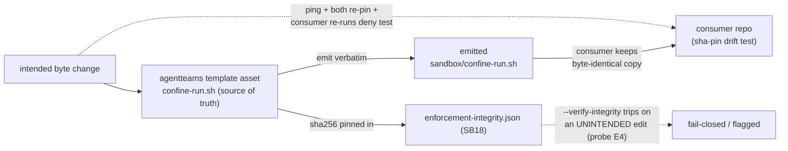

# Part VI — Integrity, provenance & drift  (SB18–SB19)

<!-- skeleton:SB18 SB19 -->

## SB18 — The boundary content is tamper-tracked  ✅

`enforcement-integrity.json` pins a sha256 of every enforcement module. For sandboxing it pins **both**
the emitters (`_sandbox_emit.py`, `_linux_sandbox_emit.py`) **and** the launcher **asset**
(`templates/universal/sandbox/confine-run.sh`) — because the bwrap flags that *are* the boundary live in
the `.sh`, so pinning the `.py` alone would leave the boundary content untracked. A silent edit dropping
`--unshare-net` trips `--verify-integrity` (red-team probe E4) instead of passing unnoticed.

The manifest is regenerated **deliberately** (`agentteams --write-integrity-manifest`) only after an
INTENDED control change; the diff *is* the control. `integrity.py` pins itself, so removing an entry is
detectable.

> **Ceiling.** The content pin makes an *edit* tamper-evident; it is not tamper-proof, and — as SB12
> notes — it protects only textual flags, not bwrap's implicit defaults (NoNewPrivs has no line to diff).

*Source:* `agentteams/integrity.py:65` (`_sandbox_emit.py`), `:71` (`_linux_sandbox_emit.py`), `:77`
(`confine-run.sh`); `references/enforcement-integrity.json`; `tests/test_redteam_integrity_coverage.py`.

## SB19 — Cross-repo single-source-of-truth & drift protocol  ✅/⚙

The launcher is emitted **verbatim**, so a consuming project (e.g. baseAgent) keeps a **byte-identical**
copy guarded by a **sha256 pin**; agentteams is the single source of truth. A byte change is a
*coordinated* event: agentteams pings the consumer, both re-pin, and the consumer re-runs its live-kernel
deny test. The launcher header is consumer-**neutral** — no consumer-specific paths or netns baked in (a
consumer overrides the neutral `--netns` default explicitly).

### The integrity + drift loop (graph G5)

*Source:* `agentteams/templates/universal/sandbox/confine-run.sh` (provenance header);
`agentteams/frameworks/_linux_sandbox_emit.py` (verbatim emission).

> **Next:** [Part VII — Honest ceilings & red-team](part-vii-ceilings-and-red-team.md).
