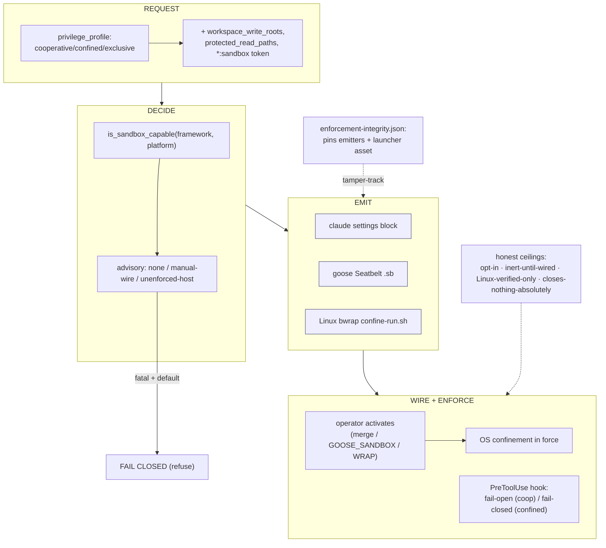

# Part VIII — Synthesis & reference matter  (SB22–SB23)

<!-- skeleton:SB22 SB23 -->

## SB22 — The end-to-end synthesis  ✅/⚙

A confined team's life: **request** (profile/token, SB4–SB6) → **decide** (`is_sandbox_capable` +
advisory, SB7–SB9) → **emit** the mechanism artifact (SB10–SB13) → **wire** (operator activation,
SB14–SB15) → **enforce** (OS + fail-open/closed hook, SB16–SB17), with the emitters + launcher asset
**tamper-tracked** (SB18–SB19) and every claim **honestly bounded** (SB20–SB21). No single stage is the
boundary; confinement is the composition — and it engages *as tested* only when opted-in and wired.

## SB23 — Reference tables & glossary  ✅

### Capability matrix (SB7)

| Platform | claude | goose | codex / copilot / agents-md |
|---|---|---|---|
| Linux | ✅ (native + launcher) | ✅ (launcher) | ✅ (launcher) |
| macOS | ✅ (native) | ✅ (Seatbelt) | ❌ fatal advisory |
| Windows | ✅ native (product-arm unverified) | ❌ fatal | ❌ fatal |

### Advisory codes (SB8)

| Code | When | Fatal? |
|---|---|---|
| `privilege-profile-unenforced-host` | no emittable boundary (Windows; non-claude/non-goose off Linux, incl. macOS) | **Yes** — raises unless `--allow-unenforced-confinement` |
| `privilege-profile-linux-launcher-manual-wire` | Linux, any framework except claude | **No** — warns + persists; never refuses |
| `None` | claude (native) anywhere; goose (Seatbelt) macOS | — |

### The three mechanisms (SB10–SB12)

| Mechanism | Framework/OS | Artifact | Activation |
|---|---|---|---|
| A — settings block | claude, any OS | `.claude/settings.hooks.example.json` | merge into `settings.json` |
| B — Seatbelt | goose, macOS | `.goose/sandbox.sb` + `config.yaml.agentteams.example` | set `GOOSE_SANDBOX` |
| C — bwrap launcher | any framework, Linux | repo-root `sandbox/confine-run.sh` | WRAP the invocation |

### Pinned modules (SB18)

`agentteams/frameworks/_sandbox_emit.py` · `agentteams/frameworks/_linux_sandbox_emit.py` ·
`agentteams/templates/universal/sandbox/confine-run.sh` (+ the hook and its own manifest).

### Glossary

- **Write-confinement** — the agent may write only inside `workspace_write_roots`.
- **Read-exclusion (P3a)** — deny reads of a credential set (+ sibling workspaces); `exclusive` only for
  claude/goose; the Linux launcher masks the default credential set on every wrap.
- **Inert until wired** — an emitted boundary confines nothing until the operator activates/wraps it.
- **Manual-wire advisory** — the non-fatal Linux notice that the launcher must be wrapped.
- **T6 / host-as-TCB** — the same-host operator/key-holder threat tier the sandbox does not close.

> **The four ceilings, once more:** opt-in · inert-until-wired · Linux-verified-only · closes-nothing-
> absolutely. No edition drops them.
