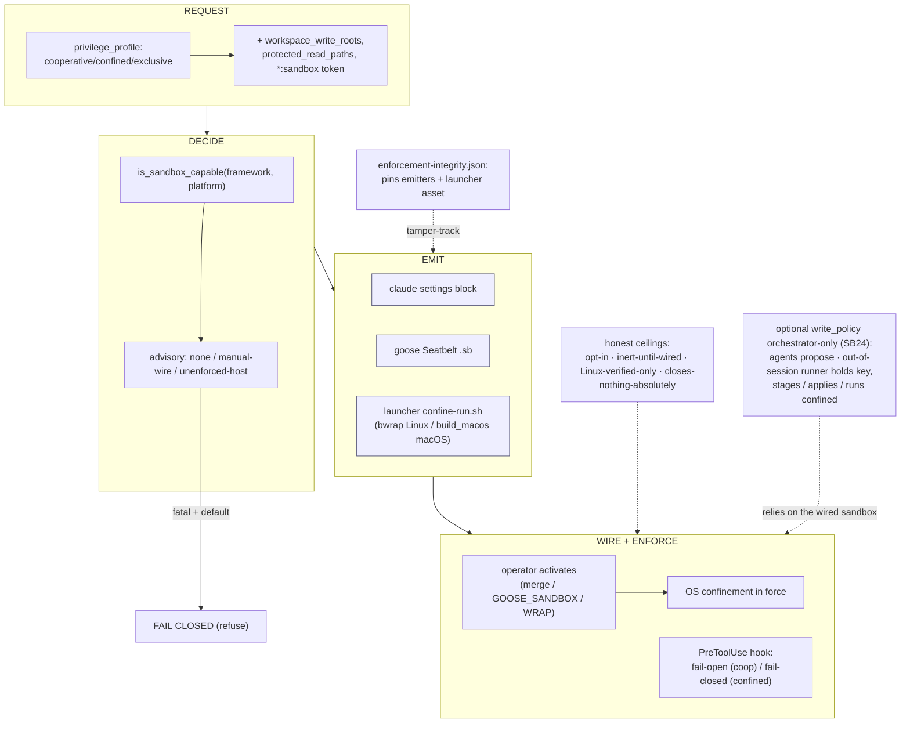

# Part VIII — Synthesis & reference matter  (SB22–SB23)

<!-- skeleton:SB22 SB23 -->

## SB22 — The end-to-end synthesis  ✅/⚙

A confined team's life: **request** (profile/token, SB4–SB6) → **decide** (`is_sandbox_capable` +
advisory, SB7–SB9) → **emit** the mechanism artifact (SB10–SB13) → **wire** (operator activation,
SB14–SB15) → **enforce** (OS + fail-open/closed hook, SB16–SB17), with the emitters + launcher asset
**tamper-tracked** (SB18–SB19) and every claim **honestly bounded** (SB20–SB21). No single stage is the
boundary; confinement is the composition — and it engages *as tested* only when opted-in and wired.

**An optional layer on top (SB24).** Under the opt-in `write_policy: "orchestrator-only"` (which needs an
explicit `confined`/`exclusive`), only the orchestrator writes; other agents return proposals or go
through the `agentteams_runner` MCP server, and an out-of-session runner — the only key holder — applies,
stages or runs them, confined. It relies on the wired session sandbox to keep the key and the control
plane out of the agents' reach.

```mermaid
flowchart TD
    subgraph REQUEST
        r1["privilege_profile:<br/>cooperative/confined/exclusive"] --> r2["+ workspace_write_roots,<br/>protected_read_paths, *:sandbox token"]
    end
    subgraph DECIDE
        d1["is_sandbox_capable(framework, platform)"] --> d2["advisory: none / manual-wire / unenforced-host"]
    end
    subgraph EMIT
        e1["claude settings block"]:::m
        e2["goose Seatbelt .sb"]:::m
        e3["launcher confine-run.sh<br/>(bwrap Linux / build_macos macOS)"]:::m
    end
    subgraph WIRE_ENFORCE["WIRE + ENFORCE"]
        w1["operator activates<br/>(merge / GOOSE_SANDBOX / WRAP)"] --> w2["OS confinement in force"]
        w3["PreToolUse hook:<br/>fail-open (coop) / fail-closed (confined)"]
    end
    REQUEST --> DECIDE
    d2 -->|"fatal + default"| FCX["FAIL CLOSED (refuse)"]
    DECIDE --> EMIT
    EMIT --> WIRE_ENFORCE
    INT["enforcement-integrity.json:<br/>pins emitters + launcher asset"] -.->|tamper-track| EMIT
    CEIL["honest ceilings:<br/>opt-in · inert-until-wired · Linux-verified-only · closes-nothing-absolutely"] -.-> WIRE_ENFORCE
    WP["optional write_policy orchestrator-only (SB24):<br/>agents propose · out-of-session runner holds key,<br/>stages / applies / runs confined"] -.->|"relies on the wired sandbox"| WIRE_ENFORCE
    classDef m fill:#eef,stroke:#557;
```

## SB23 — Reference tables & glossary  ✅

### Capability matrix (SB7)

| Platform | claude | goose | codex / copilot / agents-md |
|---|---|---|---|
| Linux | ✅ (native + launcher `bwrap`, **VERIFIED**) | ✅ (launcher `bwrap`) | ✅ (launcher `bwrap`) |
| macOS | ✅ (native Seatbelt) | ✅ (native Seatbelt) | ✅ (launcher `build_macos`, **UNVERIFIED**) |
| Windows | ✅ native (product-arm unverified) | ❌ fatal | ❌ fatal |

*(POSIX framework-neutral since 2026-W36: any framework is capable on both Linux and macOS via the
launcher's `bwrap` / `build_macos` branch; only Windows/other lack an emittable boundary.)*

### Advisory codes (SB8)

| Code | When | Fatal? |
|---|---|---|
| `privilege-profile-unenforced-host` | no emittable boundary (Windows; non-claude off any non-POSIX target) | **Yes** — raises unless `--allow-unenforced-confinement` |
| `privilege-profile-linux-launcher-manual-wire` | Linux, any framework except claude | **No** — warns + persists; never refuses |
| `privilege-profile-macos-launcher-manual-wire` | macOS, any framework except claude & goose | **No** — warns + persists; never refuses |
| `None` | claude (native) anywhere; goose (native Seatbelt) macOS | — |

### The mechanisms (SB10–SB12)

| Mechanism | Framework/OS | Artifact | Activation |
|---|---|---|---|
| A — native settings block | claude, any OS | `.claude/settings.hooks.example.json` | merge into `settings.json` |
| B — native Seatbelt | goose, macOS | `.goose/sandbox.sb` + `config.yaml.agentteams.example` | set `GOOSE_SANDBOX` |
| C — launcher (`bwrap` Linux / `sandbox-exec` macOS) | any framework, both POSIX | repo-root `sandbox/confine-run.sh` (+ `mac-escape-tests.sh` on macOS) | WRAP the invocation |

### Pinned modules (SB18)

`agentteams/frameworks/_sandbox_emit.py` · `agentteams/frameworks/_linux_sandbox_emit.py` ·
`agentteams/templates/universal/sandbox/confine-run.sh` (+ the hook and its own manifest).

### The write-policy layer (SB24)

| Item | Value |
|---|---|
| Switch | `write_policy: "orchestrator-only"` (opt-in; needs an explicit `confined`/`exclusive`) |
| Frameworks | claude, goose; codex only via `.codex/confined-run.example.sh` + role gate (Linux/macOS); **not** Copilot / agents-md; interop: claude + goose |
| Non-orchestrator tools | narrowed to `read`/`search`/`todo` (+ exact `mcp__agentteams_runner__*` names when granted) |
| Runner | `agentteams --serve-requests --project <root> --description <brief>` — out of session, sole key holder, serial queue |
| MCP tools | `read_file_hashed`, `write_file`, `delete_file`, `run_command`, `request_status` |
| Write modes | staged (default) → `--list-staged` / `--show-staged` / `--apply-staged` / `--reject-staged`; direct only on a verified operator Ed25519 grant (≤30 d, ≤500 writes, ≤3 active); deletes always staged |
| Checks | `AR_WRITE_POLICY` (audit); `--check-wiring` (configuration, not behaviour) |
| Status | ✅ code + tests; ⚙ live launch by Claude Code / Goose not yet verified |

### Glossary

- **Write-confinement** — the agent may write only inside `workspace_write_roots`.
- **Read-exclusion (P3a)** — deny reads of a credential set (+ sibling workspaces); `exclusive` only for
  claude/goose; the Linux launcher masks the default credential set on every wrap.
- **Inert until wired** — an emitted boundary confines nothing until the operator activates/wraps it.
- **Manual-wire advisory** — the non-fatal Linux notice that the launcher must be wrapped.
- **T6 / host-as-TCB** — the same-host operator/key-holder threat tier the sandbox does not close.
- **Orchestrator-only write policy** — the opt-in switch under which only the orchestrator writes (SB24).
- **Runner** — the out-of-session `--serve-requests` process: the only ledger-key holder; it applies,
  stages and runs queued requests, confined. With the operator's host, it is the layer's TCB.
- **`agentteams_runner`** — the keyless MCP queue client a granted agent writes and runs through.
- **Staged / direct** — a staged write waits for the orchestrator's approval; a direct one lands at once,
  only under a verified operator-signed grant. Deletes are always staged.

> **The four ceilings, once more:** opt-in · inert-until-wired · Linux-verified-only · closes-nothing-
> absolutely. No edition drops them.
