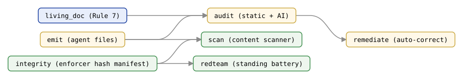

# `audit` — AgentTeamsModule

Post-generation audit for agent team files.

Performs two types of checks after the emit phase: static structural checks (conflict detection and presupposition validation, always available) and AI-powered review via the standalone `copilot` CLI (optional, requires authentication).

> *Source: `agentteams/audit.py`*

## Audit chain at a glance

`audit` sits in the post-emit chain — [`emit`](emit.md) → `audit` → [`remediate`](remediate.md) —
aggregating [`living_doc`](living-doc.md) findings, with the standing guards
[`scan`](scan.md), [`integrity`](integrity.md), and [`redteam`](redteam.md) alongside (integrity's
hash manifest covers scan + the redteam checks). Generated deterministically from
`scripts/gen_api_cluster_figures.py`.

---

## Classes

### `AuditFinding`

> *Source: `agentteams/audit_types.py`* (re-exported from `agentteams/audit.py`)

A single audit finding.

**Attributes:**

- `category` (`str`) — `'CONFLICT'`, `'PRESUPPOSITION'`, `'WARNING'`, `'AGENT_REFACTOR'`, or `'CODE_HYGIENE'`.
- `code` (`str`) — Short machine-readable code (e.g., `'AR_UNRESOLVED_PLACEHOLDER'`).
- `severity` (`str`) — `'error'`, `'warning'`, or `'info'`.
- `file` (`str`) — Relative path or `'(team)'` for team-level findings.
- `description` (`str`) — Human-readable description of the finding.

---

### `AuditResult`

> *Source: `agentteams/audit.py`*

Aggregated result of a post-generation audit.

**Attributes:**

- `static_findings` (`list[AuditFinding]`) — Findings from static structural checks.
- `agent_refactor_findings` (`list[AuditFinding]`) — Findings from agent-refactor (spec-compliance) checks: invariant-core, return-handoff, read-only tool declarations, and dangling agent slugs.
- `code_hygiene_findings` (`list[AuditFinding]`) — Findings from code-hygiene checks: CH-14 (inline data blocks) and CH-20 (duplicate descriptions).
- `ai_report` (`str | None`) — Raw text of the AI-powered audit report, or `None` if not run.
- `ai_available` (`bool`) — `True` if the `copilot` CLI was detected and available.

**Properties:**

- `has_errors` (`bool`) — `True` if any finding across all phases has severity `'error'`.
- `has_warnings` (`bool`) — `True` if any finding across all phases has severity `'warning'`.
- `is_clean` (`bool`) — `True` if all phases are clean and AI audit (if run) reported no issues.

---

## Functions

### `run_post_audit(output_dir, manifest, *, rendered_files=None, ai_audit=True)`

> *Source: `agentteams/audit.py`*

Run a post-generation audit on the agent files in `output_dir`.

**Args:**

- `output_dir` (`Path`) — Path to the `.github/agents/` directory.
- `manifest` (`dict[str, Any]`) — Team manifest from `analyze.build_manifest()`.
- `rendered_files` (`list[tuple[str, str]] | None`, keyword-only) — Optional in-memory list of `(rel_path, content)` from `render_all()`. When provided, the audit uses it instead of re-reading from disk (avoids a stale-read race). Default: `None`.
- `ai_audit` (`bool`, keyword-only) — If `True` and `copilot` CLI is available, run the AI-powered review. Default: `True`.

**Returns:** `AuditResult`

---

### `print_audit_report(result)`

> *Source: `agentteams/audit.py`*

Print a human-readable audit report to stdout.

**Args:**

- `result` (`AuditResult`) — Result from `run_post_audit()`.

---

## See also

- [`remediate`](remediate.md) — runs after the audit and consumes the `AuditResult` to repair the flagged files.
- [`living_doc`](living-doc.md) — living-document conformance findings, carved out of `audit.py` and registered back into the audit.
- [`scan`](scan.md) — the proactive security scanner run over the generated files.
