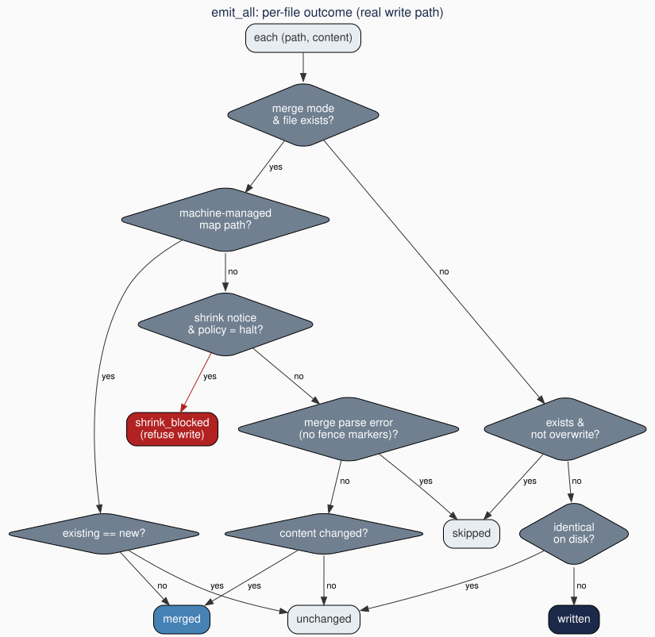

# `emit` — AgentTeamsModule

Write rendered agent files to disk.

Takes the list of `(output_path, content)` pairs from [`render.py`](render.md) and writes them to the target output directory with dry-run support and overwrite protections.

Backup behavior is provided by `backup_output_dir()` and by CLI orchestration flows that call it before destructive writes; `emit_all()` does not automatically trigger backup on its own.

## Action selection at a glance

How `emit_all` picks a per-file outcome. The root split is **merge-mode**, not existence; a
fenced-region shrink under `shrink_policy="halt"` yields the distinct `shrink_blocked` "refuse write"
outcome (not `skipped`). These are the real result buckets; the dry-run `DryRunEntry.action` enum
(WRITE / OVERWRITE / MERGE / …, reached via `DryRunReport.entries`) is a projection of them. Generated deterministically from
`scripts/gen_api_decision_figures.py` (Graphviz).

> *Source: `agentteams/emit.py`*

---

## Classes

### `DryRunReport`

> *Source: `agentteams/emit.py`*

Structured preview of what an emit/update would write without performing the write.

Only present when `emit_all(..., dry_run=True)`. Serves as an extension point for Plan 3 shrink-delta notices.

**Attributes:**

- `entries` (`list[DryRunEntry]`) — List of planned write actions. See `DryRunEntry` below for the per-row fields and the canonical `action` vocabulary.

- `notices` (`list[str]`) — Human-readable notices for Plan 3 extension (e.g., shrink alerts). Empty by default.

---

### `DryRunEntry`

> *Source: `agentteams/emit.py`*

One per-file row in the dry-run preview. Populated by `emit_all(..., dry_run=True)` into `DryRunReport.entries`.

**Attributes:**

- `path` (`str`) — Absolute path of the file the action would touch.
- `action` (`str`) — One of `WRITE`, `OVERWRITE`, `MERGE`, `MERGE-OVERWRITE-FENCED`, `UNCHANGED`, `SKIP`.
- `fence_actions` (`list[dict[str, Any]]`) — Per-fence merge details for `MERGE` / `MERGE-OVERWRITE-FENCED` rows (each dict carries `fence_id` and `action`). Empty for other actions.
- `delta_bytes` (`int`) — Estimated byte delta for the action.

---

### `EmitResult`

> *Source: `agentteams/emit.py`*

Results of an emit operation.

**Attributes:**

- `written` (`list[str]`) — Relative paths of files written successfully.
- `merged` (`list[str]`) — Relative paths of files updated via fenced-section merge.
- `unchanged` (`list[str]`) — Relative paths of files whose on-disk content was already identical to the rendered output (no write performed). **Note:** Files in this list were not written (byte-equality check); callers should not count them in result-counting logic.
- `skipped` (`list[str]`) — Relative paths of files skipped (already up to date or user declined overwrite).
- `errors` (`list[str]`) — Error messages for any failed writes.
- `dry_run` (`bool`) — `True` if this result is from a dry-run invocation.
- `dry_run_report` (`DryRunReport | None`) — Structured dry-run preview (only when `dry_run=True`).
- `notices` (`list[str]`) — Aggregated notices from all operations (Plan 3 extension point). May include shrink alerts, deprecation warnings, etc.
- `skipped_legacy` (`list[str]`) — Subset of `skipped` containing files skipped because they had no fence markers (unfenced legacy files); template updates targeting these files were **not** applied.
- `skipped_legacy_drift` (`list[bool]`) — Parallel list to `skipped_legacy`: `True` when the rendered content actually differs from what's on disk (the template change was lost), `False` for a harmless skip.
- `fence_injected` (`list[str]`) — Relative paths of legacy files that were (or, in dry-run, would be) retrofitted with a `content` fence — via `auto_fence_legacy=True` — so their template region became mergeable this run instead of being skipped.
- `shrink_blocked` (`list[str]`) — *(T2.D5)* Absolute paths whose merge was skipped because `shrink_policy="halt"` detected a destructive shrink. Distinct from `skipped` (overwrite declined) and `errors` (true failures) — these are intentional non-writes the operator can review.

**Properties:**

- `success` (`bool`) — `True` if `errors` is empty.

---

### `MergeResult`

> *Source: [`agentteams/fences.py`](fences.md) (re-exported from `agentteams/emit.py`)*

Result for a single fenced-content merge operation.

> **Boundary note:** `MergeResult` is part of the documented API surface for merge diagnostics. Most callers should still use `emit_all()` and rely on `EmitResult` for operation-level outcomes.

**Attributes:**

- `sections_replaced` (`list[str]`) — Section IDs whose content was replaced from the newly rendered file.
- `sections_added` (`list[str]`) — Section IDs present in the new render but absent in the existing file.
- `sections_orphaned` (`list[str]`) — Section IDs present in existing file but absent in new render.
- `sections_preserved` (`list[str]`) — Section IDs whose new render would have shrunk the existing body and were therefore kept unchanged under `shrink_policy="preserve"` (the default). Non-shrinking fences are still updated; no content is lost.
- `parse_errors` (`list[str]`) — Parse-related error messages from fenced-region extraction/validation.
- `unchanged` (`list[str]`) — Section IDs that were identical in both files (no write needed).
- `merged_content` (`str`) — Final merged file content. Empty string when parse fails.
- `shrink_notices` (`list[str]`) — Per-section human-readable notices (Plan 3) when a regenerated fence body is materially shorter or less specific than the existing on-disk version. Used for alerting on potential loss of detail during merge.
- `lost_fence_bodies` (`dict[str, str]`) — W22 data-loss recovery: full pre-merge body of every fence that fired a shrink notice, keyed by `section_id`. Persisted as a `<rel_path>.lost.<sid>.md` sidecar inside the backup dir by `emit_all` when `backup_path` is provided. Empty when no shrink fired.
- `front_matter_drift` (`list[str]`) — Front-matter keys whose template value moved on while the on-disk file kept its own. Merge preserves everything outside a fence by design — that never changes what is written — so this exists purely to surface an otherwise-silent drift (e.g. a new tool added to a template's `tools:` list that an already-generated team never receives).
- `duplicate_section_notices` (`list[str]`) — Sections a newly-added fence duplicates: the deployed file already carries the same heading unfenced, from before the template fenced it. Reported, never auto-resolved.
- `deleted_constraint_notices` (`list[str]`) — Template rules absent from the deployed file. Fires regardless of modification state.

**Properties:**

- `has_errors` (`bool`) — `True` when parse errors are present.
- `content_changed` (`bool`) — `True` when at least one section was replaced or added.

---
---

### `BackupResult`

> *Source: `agentteams/backup.py` (re-exported from `agentteams/emit.py`)*

Result of a backup operation.

**Attributes:**

- `backup_path` (`Path | None`) — Absolute path to the timestamped backup directory, or `None` if no backup was taken (e.g. output directory did not exist).
- `files_backed_up` (`int`) — Number of files copied into the backup.
- `extra_files_removed` (`int`) — Number of output files removed during restore when `remove_extra=True`.
- `skipped` (`bool`) — `True` if the backup was suppressed (`--no-backup` or `dry_run=True`).

---

### `PruneResult`

> *Source: `agentteams/backup.py` (re-exported from `agentteams/emit.py`)*

Outcome of `prune_backups()`.

**Attributes:**

- `deleted` (`list[str]`) — Backup timestamps deleted (or that would be deleted, under `dry_run`).
- `kept` (`list[str]`) — Backup timestamps retained.
- `dry_run` (`bool`) — `True` if this result is from a dry-run invocation.

---

## Functions

### `emit_all(rendered_files, *, output_dir, dry_run=False, overwrite=False, merge=False, yes=False, shrink_policy="preserve", backup_path=None, auto_fence_legacy=False)`

> *Source: `agentteams/emit.py`*

Write rendered files to `output_dir`.

**Args:**

- `rendered_files` (`list[tuple[str, str]]`) — List of `(relative_output_path, content)` from `render_all()`.
- `output_dir` (`Path`, keyword-only) — Absolute path to the agents output directory.
- `dry_run` (`bool`, keyword-only) — If `True`, print actions without writing any files. Default: `False`.
- `overwrite` (`bool`, keyword-only) — If `True`, overwrite existing files without prompting. Default: `False`.
- `merge` (`bool`, keyword-only) — If `True`, update only fenced template regions in existing files, preserving user-authored content. Default: `False`.
- `yes` (`bool`, keyword-only) — If `True`, answer `'yes'` to all interactive prompts. Default: `False`.
- `shrink_policy` (`str`, keyword-only) — *(T2.D5)* Behaviour when a fenced-region merge would lose concrete references (paths, identifiers, list items). One of:
    - `"preserve"` (default): keep the existing enriched body for any fence the new render would shrink, while still applying template updates to non-shrinking fences. Respectful and non-destructive — no content is lost and the write is not blocked. Preserved fences are recorded in `MergeResult.sections_preserved`.
    - `"warn"`: log the shrink notice into `EmitResult.notices` and proceed with the smaller content (recoverable via the `.lost.<sid>.md` sidecar when `backup_path` is set).
    - `"halt"`: log the notice, refuse the write, and append the path to `EmitResult.shrink_blocked`. Use to enforce strict fence-content preservation for self-team daily runs.
    - `"allow"`: suppress notices and write the smaller content silently. Use for one-time recovery when a previous halt was over-cautious.

    The fence-id allowlist `_LIVE_DATA_FENCES` (`threat_intelligence`, `threat_data`) is exempt from the shrink heuristic — those fences are filled each run from live CISA KEV / NVD / OSV feeds, and CVE rotation is expected behavior, not user-content deletion. The canonical history for these fences is the cache JSON (`references/security-vulnerability-watch.json`), not the embedded snapshot.

- `backup_path` (`Path | None`, keyword-only) — When provided and a shrink notice fires under `warn`, the full pre-merge body of every shrunken fence is written to `<backup_path>/<rel_path>.lost.<sid>.md` and the corresponding `EmitResult.notices` entry is annotated with `— recovery: <sidecar-path>`. This makes `warn` recoverable even when the operator didn't catch the notice — the sidecar is the durable evidence of what was dropped. Default: `None` (no sidecar written; notices are not annotated).
- `auto_fence_legacy` (`bool`, keyword-only) — When `True`, a `--merge` run retrofits `AGENTTEAMS` fence markers into a legacy unfenced file instead of skipping it, so subsequent merges can update it. Off by default because retrofitting rewrites a file the operator has not opted in to having managed. Default: `False`.

**Returns:** `EmitResult` — Results of all write operations.

**Raises:**

- `ValueError` — If both `overwrite` and `merge` are `True` (mutually exclusive).

---

### `print_summary(result, manifest)`

> *Source: `agentteams/emit.py`*

Print a human-readable summary of an emit operation to stdout.

**Args:**

- `result` (`EmitResult`) — Result from `emit_all()`.
- `manifest` (`dict[str, Any]`) — Team manifest from `analyze.build_manifest()`.

---
---

### `print_dry_run_report(result, manifest, *, fmt='text', stream=None)`

`stream` defaults to `sys.stdout`. `--dry-run --json` passes the *real* stdout explicitly, because the CLI has redirected `sys.stdout` to stderr for that run so progress narration cannot corrupt the JSON document — see `agentteams.cli.json_mode`.

> *Source: `agentteams/emit.py`*

Print the structured dry-run plan recorded on `EmitResult.dry_run_report`.

**Args:**

- `result` (`EmitResult`) — Result returned by `emit_all(..., dry_run=True)`. If `result.dry_run_report` is `None`, the function is a no-op that prints a one-line note.
- `manifest` (`dict`) — Manifest from `analyze.build_manifest()`; used for header context.
- `fmt` (`str`, keyword-only) — `'text'` prints a per-file action table plus aggregated counts and notices; `'json'` prints a single JSON document to stdout suitable for `jq` piping. Default: `'text'`.

**Returns:** `None`.

---

### `backup_output_dir(output_dir, *, files_to_backup=None, dry_run=False, reason="unspecified", framework="", description_path=None)`

> *Source: `agentteams/backup.py` (re-exported from `agentteams/emit.py`)*

Copy existing agent files to a timestamped backup directory before a write.

The backup is placed at `<output_dir>/.agentteams-backups/YYYYMMDD-HHMMSS/`. If `files_to_backup` is given, only those relative paths are backed up (plus liaison/security CSV logs when present). If `files_to_backup` is `None`, every file in `output_dir` is copied except backup storage and `references/build-log.json`.

**Args:**

- `output_dir` (`Path`) — Absolute path to the agents output directory.
- `files_to_backup` (`list[str] | None`, keyword-only) — Relative paths to selectively back up. Pass `None` to back up everything. Default: `None`.
- `dry_run` (`bool`, keyword-only) — If `True`, report what would be backed up without writing. Default: `False`.
- `reason` (`str`, keyword-only) — Recorded in the backup's metadata so a later reader can tell why the snapshot exists (e.g. `"pre-update"`, `"overwrite-mode"`). Default: `"unspecified"`.
- `framework` (`str`, keyword-only) — Framework the backed-up team targets, recorded alongside `reason`. Default: `""`.
- `description_path` (`str | None`, keyword-only) — Path to the project description that drove the run, recorded for provenance. Default: `None`.

**Returns:** `BackupResult` — Description of what was backed up.

---

### `list_backups(output_dir)`

> *Source: `agentteams/backup.py` (re-exported from `agentteams/emit.py`)*

Return all available backups for `output_dir`, newest first.

**Args:**

- `output_dir` (`Path`) — Absolute path to the agents output directory.

**Returns:** `list[tuple[str, Path, int]]` — List of `(timestamp_str, backup_path, file_count)` tuples sorted newest-first. Empty list if no backups exist.

---

### `verify_backup(backup_path)`

> *Source: `agentteams/backup.py` (re-exported from `agentteams/emit.py`)*

Verify a backup's own integrity (read-only): each backed-up file's bytes against its recorded `source_sha256` in `_manifest.json`. Confirms the backup is restorable (catches backup bit-rot/tamper).

**Args:**

- `backup_path` (`Path`) — Absolute path to the timestamped backup directory.

**Returns:** `list[dict[str, str]]` — One entry per recorded file with keys `source_path`, `status` (`PASS` / `FAIL` / `MISSING`), and `note`. Empty list when the backup has no `_manifest.json` (older backup; cannot verify). The manifest stores the full SHA-256 (not the 16-char build-log form).

---

### `prune_backups(output_dir, *, keep_last=DEFAULT_BACKUP_KEEP_LAST, keep_within_days=None, dry_run=False)`

> *Source: `agentteams/backup.py` (re-exported from `agentteams/emit.py`)*

Delete old backups under `output_dir`, keeping the recovery net bounded.

Retain rule (union, fail-safe): a backup is kept if it is among the `keep_last` newest **or** (when `keep_within_days` is set) its timestamp is within `keep_within_days` days. Everything else is deleted. The single most-recent backup is always kept (even `keep_last == 0`). A backup whose age cannot be determined (unparseable name and no mtime) is kept (fail-safe).

**Args:**

- `output_dir` (`Path`) — Absolute path to the agents output directory.
- `keep_last` (`int`, keyword-only) — Number of most-recent backups to always keep. Default: `DEFAULT_BACKUP_KEEP_LAST` (`10`).
- `keep_within_days` (`int | None`, keyword-only) — When set, also keep any backup within this many days of now. Default: `None`.
- `dry_run` (`bool`, keyword-only) — If `True`, report what would be deleted without deleting. Default: `False`.

**Returns:** `PruneResult`

---

### `restore_backup(backup_path, output_dir, *, remove_extra=False)`

> *Source: `agentteams/backup.py` (re-exported from `agentteams/emit.py`)*

Restore files from a backup directory into `output_dir`, overwriting current content.

**Args:**

- `backup_path` (`Path`) — Absolute path to the timestamped backup directory.
- `output_dir` (`Path`) — Absolute path to the agents output directory to restore into.
- `remove_extra` (`bool`, keyword-only) — If `True`, remove files in `output_dir` that are not present in the selected backup. Default: `False`.

**Returns:** `int` — Number of files restored.

**Raises:** `FileNotFoundError` — If `backup_path` does not exist.

---

### `file_hash(path)`

> *Source: `agentteams/emit.py`*

Return the SHA-256 hex digest of a file's contents.

> **Note:** This function is public for use in build tooling and tests. It is a utility symbol rather than a core pipeline interface; callers should not rely on it remaining in `emit` across major versions.

**Args:**

- `path` (`Path`) — Path to the file to hash.

**Returns:** `str` — First 8 characters of the SHA-256 hex digest of the file's contents (used for change-detection comparisons).

---

## Module Constants

### `BACKUP_MANIFEST_NAME`

> *Source: `agentteams/backup.py` (re-exported from `agentteams/emit.py`)*

Filename of the per-backup manifest written alongside each timestamped backup directory, consumed by `verify_backup()`.

**Type:** `str`  
**Value:** `"_manifest.json"`

---

### `BACKUP_MANIFEST_SCHEMA_VERSION`

> *Source: `agentteams/backup.py` (re-exported from `agentteams/emit.py`)*

Schema version recorded in each backup's manifest (`BACKUP_MANIFEST_NAME`).

**Type:** `str`  
**Value:** `"1.0"`

---

### `DEFAULT_BACKUP_KEEP_LAST`

> *Source: `agentteams/backup.py` (re-exported from `agentteams/emit.py`)*

Default number of most-recent backups `prune_backups()` keeps.

**Type:** `int`  
**Value:** `10`

---

## See also

- [Update lifecycle guide](../update-lifecycle-guide.md) — how `--update` / `--merge` runs drive these write modes.
- [Section fencing guide](../section-fencing-guide.md) — the fenced-region contract behind `merge` and `MergeResult`.
