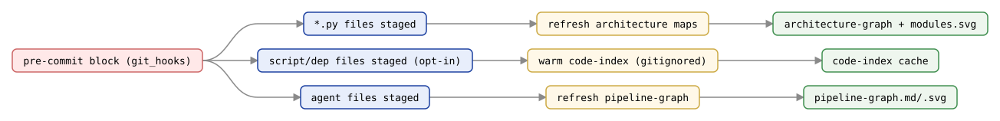

# `git_hooks` — AgentTeamsModule

Commit-triggered refresh of the repository maps. Installs a `pre-commit` hook
that regenerates the maps from the *staged* files and stages the result into the
same commit — so the committed maps are always in step with the committed source.

## Refresh flow at a glance

The installed hook runs three **independent, separately-guarded** refreshes — each fires only when
its own kind of file is staged, so unrelated commits pay no cost. Generated deterministically from
`scripts/gen_api_cluster_figures.py`.



Two maps are refreshed, each under its own guard, plus an optional third capability:

- agent files staged → `<agent-dir>/references/pipeline-graph.md` (agent topology, kept *with the team* — same location `--update`/emit writes — via [`graph`](graph.md))
- `*.py` files staged → `references/architecture-graph.md` (repo-level module architecture, via [`architecture`](architecture.md))
- (opt-in via `--code-index-hook`) script/dependency files staged → warm the [code & API index cache](code-index.md) (`references/code-index/`, gitignored — never staged) via `refresh_code_index()`

> *Source: `agentteams/git_hooks.py`*

---

## Determinism contract

The refresh reads source files from disk while `--update` builds the same maps
from the in-memory render. Both go through the deterministic serialisers in
[`graph`](graph.md) / [`architecture`](architecture.md), so a disk-built refresh
reproduces the pipeline output **byte-for-byte**. Without that guarantee the hook
would rewrite the maps with meaningless reorderings on every commit and never
agree with `--update`.

---

## Key functions

### `refresh_pipeline_graph(repo_root, *, agents_dir=None, dry_run=False, stage=False) -> RefreshResult`

Rebuild the agent dir's `references/pipeline-graph.md` (+ `pipeline-graph.svg` and
`pipeline-handoffs.svg`) from the agent files on disk (`.github/agents/` or
`.claude/agents/`) — the same location `--update`/emit writes, so there is a single
copy (no repo-root duplicate). Fence-normalised, written only when the topology
changed. Backup/ghost agents under dot-prefixed directories are excluded. When
`stage=True` (the hook path) the written files are `git add`-ed.

### `refresh_architecture_graph(repo_root, *, package_dir=None, dry_run=False, stage=False) -> RefreshResult`

Rebuild `references/architecture-graph.md` from the repo's primary Python package
(auto-detected). Same write-if-changed contract.

### `refresh_code_index(repo_root, *, agents_dir=None, dry_run=False, stage=False) -> RefreshResult`

The optional pre-commit warm-up (off by default; opt in via `--code-index-hook`).
Refreshes the code & API index cache (`references/code-index/`) from the working
tree. Unlike the two graph refreshes, this is a **gitignored local cache** — it is
never staged (`stage` is accepted for a uniform job signature but ignored), and
correctness never depends on it since `--query-code` rebuilds a stale partition on
demand. Best-effort and non-raising.

### `install_pre_commit_hook(repo_root, *, agentteams_path=None, hooks_dir=None, code_index_hook=False) -> InstallResult`

Write (or sentinel-merge) the refresh block into the repo's `pre-commit` hook,
preserving any pre-existing hook body. Idempotent. The block is non-blocking
(`|| true`) so a refresh failure never aborts a commit, and each guard fires only
when relevant files are staged. Resolves the hooks directory via
`git rev-parse --git-path hooks` (honours `core.hooksPath`, worktrees, submodules).
`code_index_hook` (default `False`) additionally installs the opt-in code-index
warm-up guard described above.

### `maybe_install_git_hooks(args, project_root) -> None`

Default-on auto-install called from the generate/update success path (see the
[update lifecycle guide](../update-lifecycle-guide.md)); opt out
with `--no-git-hooks`. No-op outside a git repository.

### `maybe_refresh_architecture_map(args, project_root) -> None`

Auto-invoked alongside `maybe_install_git_hooks` from the generate/update success
path: regenerates `references/architecture-graph.md` (+ SVGs) at the repo root
after every build, not just when the `*.py`-staged pre-commit hook fires. Closes
the gap where a repo whose Python changed via a [fleet](fleet.md) `--update`
(rather than a hook-fired commit) would otherwise keep a stale architecture map
indefinitely.
No-op when the repo has no importable package; never fails the build.

---

## CLI

```
agentteams --install-git-hooks [--project DIR]     # install the hook
agentteams --refresh-graph        [--project DIR]  # refresh agent topology map
agentteams --refresh-architecture [--project DIR]  # refresh module architecture map
agentteams --update --no-git-hooks                 # opt out of auto-install
agentteams --update --code-index-hook              # opt IN to the code-index cache warm-up guard
```

The installed hook calls `python -m agentteams.git_hooks --refresh` /
`--refresh-architecture` / `--refresh-code-index` (the last only when the
`--code-index-hook` guard was installed).
