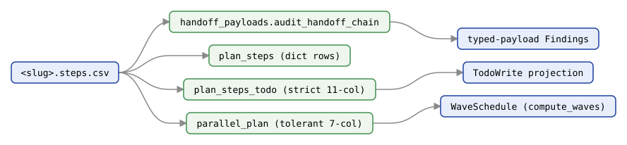

# `plan_steps` — AgentTeamsModule

Tolerant reader for plan `.steps.csv` artifacts.

Plans in `tmp/by-week/<ISO-week>/<slug>.steps.csv` describe sequenced handoffs between agents. Some cells (typically `notes`) contain quoted multi-line text. This module's `read_steps` wraps `csv.DictReader` with the conventions used across the project — quoted multi-line cells preserved, rows without a `step` field skipped, missing cells coerced to empty strings.

Introduced alongside [`handoff_payloads`](handoff_payloads.md) so the chain comparator can operate on dict rows.

> **Sibling readers.** Three modules define a `read_steps`/`PlanStep` pair over related-but-different schemas: this one returns plain **dict rows** keyed by the CSV header; [`plan_steps_todo`](plan-steps-todo.md) parses the **strict 11-column** todo-projection schema into `PlanStep` dataclasses; and [`parallel_plan`](parallel-plan.md) uses a **tolerant 7-column** runtime reader. Pick by which schema your CSV follows.

## Readers at a glance

One `<slug>.steps.csv` feeds three distinct readers — this module's dict rows,
[`plan_steps_todo`](plan-steps-todo.md)'s TodoWrite projection, and [`parallel_plan`](parallel-plan.md)'s
wave schedule — plus [`handoff_payloads`](handoff_payloads.md)'s typed-payload chain check.
Generated deterministically from `scripts/gen_api_cluster_figures.py`.



> *Source: `agentteams/plan_steps.py`*

---

## Functions

### `read_steps(path)`

> *Source: `agentteams/plan_steps.py`*

Read a plan `.steps.csv`. Each returned dict is keyed by the CSV header row; missing values are normalized to empty strings (not `None`).

**Args:**

- `path` (`Path | str`) — Path to a plan `.steps.csv` artifact.

**Returns:** `list[dict[str, str]]` — One dict per data row. Rows whose `step` cell is empty are skipped (this allows trailing blank lines and comment-style header gaps without raising).

**Malformed rows:** if a row has more comma-separated values than the header (typically an unquoted comma or a stray quote inside a hand-edited cell shifting every subsequent column), `read_steps` emits a `UserWarning` naming the file and physical line number, and drops the unassigned overflow rather than leaking it into the returned dict under a `None` key. This is a warning, not an exception — well-formed rows elsewhere in the same file are read normally. Callers that must treat this as fatal can use `warnings.simplefilter("error")` around the call.

**Example:**

```python
from pathlib import Path
from agentteams.plan_steps import read_steps
from agentteams.handoff_payloads import audit_handoff_chain

steps = read_steps(Path("tmp/by-week/2026-W21/my-plan.steps.csv"))
findings = audit_handoff_chain(steps)
for finding in findings:
    print(f"{finding.severity} {finding.code}: {finding.message}")
```

---

## See Also

- [`handoff_payloads`](handoff_payloads.md) — typed handoff substrate that consumes the rows returned here.
