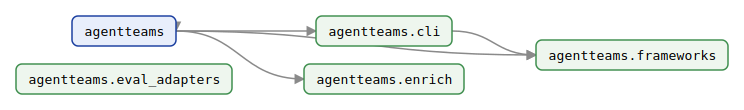
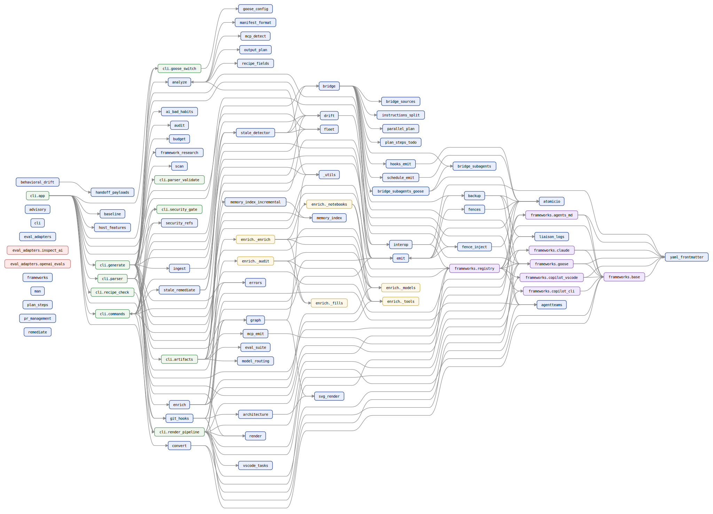
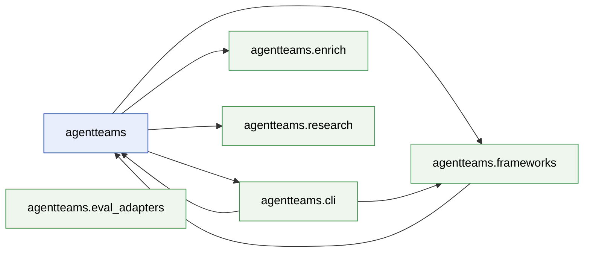
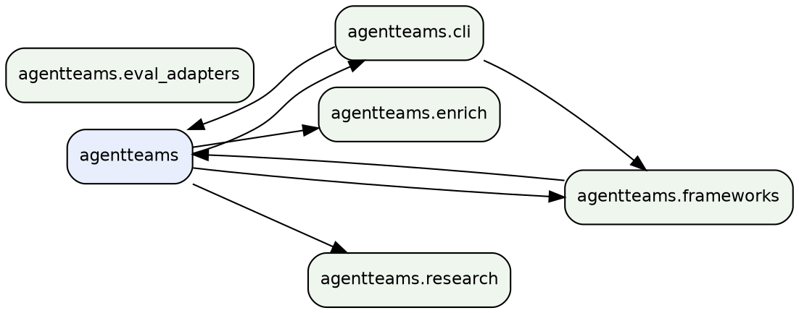

<!-- AGENTTEAMS:BEGIN content v=1 -->
# agentteams — Repository Architecture Map

> **Auto-generated.** Regenerated on every commit that touches the `agentteams` package. Do not edit manually — changes will be overwritten.

- Modules mapped: **95**
- Packages: **6**
- Internal import edges: **162**
- Distinct external dependencies: **3**

---

## Package Dependency Diagram

Inter-package import dependencies (module-level detail in the tables below).



---

## Packages

| Package | Modules | Depends on |
| --- | --- | --- |
| `agentteams` | 65 | `agentteams.cli`, `agentteams.enrich`, `agentteams.frameworks`, `agentteams.research` |
| `agentteams.cli` | 11 | `agentteams`, `agentteams.frameworks` |
| `agentteams.enrich` | 6 | — |
| `agentteams.eval_adapters` | 2 | — |
| `agentteams.frameworks` | 7 | `agentteams` |
| `agentteams.research` | 4 | — |

---

## Module Dependency Diagram

Every module, coloured by package (full adjacency in the table below).



---

## Module Dependency Table

| Module | Imports (internal) | Imported by |
| --- | --- | --- |
| `agentteams` | — | `agentteams.backup`, `agentteams.cli.artifacts`, `agentteams.cli.parser`, `agentteams.git_hooks` |
| `agentteams._utils` | — | `agentteams.analyze`, `agentteams.graph`, `agentteams.ingest` |
| `agentteams.advisory` | — | — |
| `agentteams.ai_bad_habits` | — | `agentteams.cli.generate` |
| `agentteams.analyze` | `agentteams._utils`, `agentteams.manifest_format`, `agentteams.mcp_detect`, `agentteams.output_plan`, `agentteams.recipe_fields` | `agentteams.cli.generate`, `agentteams.output_plan` |
| `agentteams.architecture` | `agentteams.svg_render` | `agentteams.git_hooks` |
| `agentteams.atomicio` | — | `agentteams.backup`, `agentteams.cli.artifacts`, `agentteams.cli.schema_cache`, `agentteams.emit`, `agentteams.fence_inject`, `agentteams.fences`, `agentteams.hooks_emit`, `agentteams.mcp_emit`, `agentteams.schedule_emit` |
| `agentteams.audit` | — | `agentteams.cli.generate` |
| `agentteams.backup` | `agentteams`, `agentteams.atomicio`, `agentteams.liaison_logs` | `agentteams.bridge`, `agentteams.emit` |
| `agentteams.baseline` | — | `agentteams.cli.app` |
| `agentteams.behavioral_drift` | `agentteams.handoff_payloads` | — |
| `agentteams.bridge` | `agentteams.backup`, `agentteams.bridge_sources`, `agentteams.bridge_subagents`, `agentteams.bridge_subagents_goose`, `agentteams.frameworks.goose`, `agentteams.hooks_emit`, `agentteams.instructions_split`, `agentteams.interop`, `agentteams.parallel_plan`, `agentteams.plan_steps_todo`, `agentteams.schedule_emit` | `agentteams.cli.commands`, `agentteams.stale_detector` |
| `agentteams.bridge_sources` | — | `agentteams.bridge` |
| `agentteams.bridge_subagents` | — | `agentteams.bridge`, `agentteams.bridge_subagents_goose` |
| `agentteams.bridge_subagents_goose` | `agentteams.bridge_subagents`, `agentteams.frameworks.goose` | `agentteams.bridge` |
| `agentteams.budget` | — | `agentteams.cli.generate` |
| `agentteams.cli` | — | — |
| `agentteams.cli.app` | `agentteams.baseline`, `agentteams.cli.commands`, `agentteams.cli.generate`, `agentteams.cli.goose_switch`, `agentteams.cli.parser`, `agentteams.cli.recipe_check`, `agentteams.cli.render_pipeline`, `agentteams.fence_inject`, `agentteams.fleet`, `agentteams.frameworks.goose`, `agentteams.git_hooks`, `agentteams.host_features` | — |
| `agentteams.cli.artifacts` | `agentteams`, `agentteams.atomicio`, `agentteams.cli.schema_cache`, `agentteams.code_index`, `agentteams.code_sources`, `agentteams.drift`, `agentteams.errors`, `agentteams.eval_suite`, `agentteams.mcp_emit`, `agentteams.memory_index`, `agentteams.memory_index_incremental`, `agentteams.model_routing` | `agentteams.cli.generate`, `agentteams.git_hooks` |
| `agentteams.cli.commands` | `agentteams.bridge`, `agentteams.cli.security_gate`, `agentteams.convert`, `agentteams.drift`, `agentteams.emit`, `agentteams.frameworks.registry`, `agentteams.interop`, `agentteams.security_refs`, `agentteams.stale_detector`, `agentteams.stale_remediate` | `agentteams.cli.app`, `agentteams.stale_remediate` |
| `agentteams.cli.generate` | `agentteams.ai_bad_habits`, `agentteams.analyze`, `agentteams.audit`, `agentteams.budget`, `agentteams.cli.artifacts`, `agentteams.cli.render_pipeline`, `agentteams.cli.security_gate`, `agentteams.drift`, `agentteams.emit`, `agentteams.enrich`, `agentteams.errors`, `agentteams.framework_research`, `agentteams.frameworks.registry`, `agentteams.git_hooks`, `agentteams.graph`, `agentteams.ingest`, `agentteams.liaison_logs`, `agentteams.render`, `agentteams.scan`, `agentteams.security_refs` | `agentteams.cli.app` |
| `agentteams.cli.goose_switch` | `agentteams.goose_config` | `agentteams.cli.app`, `agentteams.cli.parser` |
| `agentteams.cli.parser` | `agentteams`, `agentteams.cli.goose_switch`, `agentteams.cli.parser_validate`, `agentteams.emit`, `agentteams.frameworks.registry` | `agentteams.cli.app` |
| `agentteams.cli.parser_validate` | — | `agentteams.cli.parser` |
| `agentteams.cli.recipe_check` | `agentteams.frameworks.goose` | `agentteams.cli.app` |
| `agentteams.cli.render_pipeline` | `agentteams.emit`, `agentteams.frameworks.agents_md`, `agentteams.frameworks.base`, `agentteams.frameworks.claude`, `agentteams.frameworks.copilot_cli`, `agentteams.frameworks.copilot_vscode`, `agentteams.frameworks.goose`, `agentteams.graph`, `agentteams.render`, `agentteams.vscode_tasks` | `agentteams.cli.app`, `agentteams.cli.generate` |
| `agentteams.cli.schema_cache` | `agentteams.atomicio` | `agentteams.cli.artifacts` |
| `agentteams.cli.security_gate` | — | `agentteams.cli.commands`, `agentteams.cli.generate` |
| `agentteams.code_index` | — | `agentteams.cli.artifacts`, `agentteams.code_sources` |
| `agentteams.code_sources` | `agentteams.code_index` | `agentteams.cli.artifacts` |
| `agentteams.convert` | `agentteams.frameworks.base`, `agentteams.frameworks.registry` | `agentteams.cli.commands` |
| `agentteams.drift` | `agentteams.emit` | `agentteams.cli.artifacts`, `agentteams.cli.commands`, `agentteams.cli.generate`, `agentteams.stale_detector` |
| `agentteams.emit` | `agentteams.atomicio`, `agentteams.backup`, `agentteams.fence_inject`, `agentteams.fences` | `agentteams.cli.commands`, `agentteams.cli.generate`, `agentteams.cli.parser`, `agentteams.cli.render_pipeline`, `agentteams.drift`, `agentteams.fence_inject`, `agentteams.git_hooks` |
| `agentteams.enrich` | `agentteams.enrich._audit`, `agentteams.enrich._enrich`, `agentteams.enrich._models`, `agentteams.enrich._tools` | `agentteams.cli.generate` |
| `agentteams.enrich._audit` | `agentteams.enrich._fills`, `agentteams.enrich._models`, `agentteams.enrich._tools` | `agentteams.enrich` |
| `agentteams.enrich._enrich` | `agentteams.enrich._fills`, `agentteams.enrich._models`, `agentteams.enrich._notebooks`, `agentteams.enrich._tools` | `agentteams.enrich` |
| `agentteams.enrich._fills` | — | `agentteams.enrich._audit`, `agentteams.enrich._enrich` |
| `agentteams.enrich._models` | — | `agentteams.enrich`, `agentteams.enrich._audit`, `agentteams.enrich._enrich`, `agentteams.enrich._notebooks` |
| `agentteams.enrich._notebooks` | `agentteams.enrich._models`, `agentteams.enrich._tools` | `agentteams.enrich._enrich` |
| `agentteams.enrich._tools` | — | `agentteams.enrich`, `agentteams.enrich._audit`, `agentteams.enrich._enrich`, `agentteams.enrich._notebooks` |
| `agentteams.errors` | — | `agentteams.cli.artifacts`, `agentteams.cli.generate`, `agentteams.git_hooks` |
| `agentteams.eval_adapters` | — | — |
| `agentteams.eval_adapters.inspect_ai` | — | — |
| `agentteams.eval_adapters.openai_evals` | — | — |
| `agentteams.eval_suite` | — | `agentteams.cli.artifacts` |
| `agentteams.fence_inject` | `agentteams.atomicio`, `agentteams.emit` | `agentteams.cli.app`, `agentteams.emit` |
| `agentteams.fences` | `agentteams.atomicio` | `agentteams.emit` |
| `agentteams.fleet` | — | `agentteams.cli.app`, `agentteams.stale_detector`, `agentteams.stale_remediate` |
| `agentteams.framework_research` | — | `agentteams.cli.generate` |
| `agentteams.frameworks` | — | — |
| `agentteams.frameworks.agents_md` | `agentteams.frameworks.base`, `agentteams.yaml_frontmatter` | `agentteams.cli.render_pipeline`, `agentteams.frameworks.registry` |
| `agentteams.frameworks.base` | `agentteams.yaml_frontmatter` | `agentteams.cli.render_pipeline`, `agentteams.convert`, `agentteams.frameworks.agents_md`, `agentteams.frameworks.claude`, `agentteams.frameworks.copilot_cli`, `agentteams.frameworks.copilot_vscode`, `agentteams.frameworks.goose`, `agentteams.frameworks.registry` |
| `agentteams.frameworks.claude` | `agentteams.frameworks.base`, `agentteams.yaml_frontmatter` | `agentteams.cli.render_pipeline`, `agentteams.frameworks.registry` |
| `agentteams.frameworks.copilot_cli` | `agentteams.frameworks.base` | `agentteams.cli.render_pipeline`, `agentteams.frameworks.registry` |
| `agentteams.frameworks.copilot_vscode` | `agentteams.frameworks.base`, `agentteams.yaml_frontmatter` | `agentteams.cli.render_pipeline`, `agentteams.frameworks.registry` |
| `agentteams.frameworks.goose` | `agentteams.frameworks.base`, `agentteams.yaml_frontmatter` | `agentteams.bridge`, `agentteams.bridge_subagents_goose`, `agentteams.cli.app`, `agentteams.cli.recipe_check`, `agentteams.cli.render_pipeline`, `agentteams.frameworks.registry` |
| `agentteams.frameworks.registry` | `agentteams.frameworks.agents_md`, `agentteams.frameworks.base`, `agentteams.frameworks.claude`, `agentteams.frameworks.copilot_cli`, `agentteams.frameworks.copilot_vscode`, `agentteams.frameworks.goose` | `agentteams.cli.commands`, `agentteams.cli.generate`, `agentteams.cli.parser`, `agentteams.convert`, `agentteams.interop` |
| `agentteams.git_hooks` | `agentteams`, `agentteams.architecture`, `agentteams.cli.artifacts`, `agentteams.emit`, `agentteams.errors`, `agentteams.graph` | `agentteams.cli.app`, `agentteams.cli.generate` |
| `agentteams.goose_config` | — | `agentteams.cli.goose_switch` |
| `agentteams.graph` | `agentteams._utils`, `agentteams.svg_render` | `agentteams.cli.generate`, `agentteams.cli.render_pipeline`, `agentteams.git_hooks` |
| `agentteams.handoff_payloads` | — | `agentteams.behavioral_drift` |
| `agentteams.hooks_emit` | `agentteams.atomicio` | `agentteams.bridge` |
| `agentteams.host_features` | — | `agentteams.cli.app` |
| `agentteams.ingest` | `agentteams._utils` | `agentteams.cli.generate` |
| `agentteams.instructions_split` | — | `agentteams.bridge` |
| `agentteams.interop` | `agentteams.frameworks.registry`, `agentteams.yaml_frontmatter` | `agentteams.bridge`, `agentteams.cli.commands` |
| `agentteams.liaison_logs` | — | `agentteams.backup`, `agentteams.cli.generate` |
| `agentteams.man` | — | — |
| `agentteams.manifest_format` | — | `agentteams.analyze` |
| `agentteams.mcp_detect` | — | `agentteams.analyze` |
| `agentteams.mcp_emit` | `agentteams.atomicio` | `agentteams.cli.artifacts` |
| `agentteams.memory_index` | — | `agentteams.cli.artifacts`, `agentteams.memory_index_incremental` |
| `agentteams.memory_index_incremental` | `agentteams.memory_index` | `agentteams.cli.artifacts` |
| `agentteams.model_routing` | — | `agentteams.cli.artifacts` |
| `agentteams.output_plan` | `agentteams.analyze` | `agentteams.analyze` |
| `agentteams.parallel_plan` | — | `agentteams.bridge` |
| `agentteams.plan_steps` | — | — |
| `agentteams.plan_steps_todo` | — | `agentteams.bridge` |
| `agentteams.pr_management` | — | — |
| `agentteams.recipe_fields` | — | `agentteams.analyze` |
| `agentteams.remediate` | — | — |
| `agentteams.render` | — | `agentteams.cli.generate`, `agentteams.cli.render_pipeline` |
| `agentteams.research` | `agentteams.research.reputable`, `agentteams.research.search`, `agentteams.research.verify` | — |
| `agentteams.research.__main__` | `agentteams.research.search` | — |
| `agentteams.research.reputable` | `agentteams.research.search` | `agentteams.research` |
| `agentteams.research.search` | — | `agentteams.research`, `agentteams.research.__main__`, `agentteams.research.reputable` |
| `agentteams.research.verify` | — | `agentteams.research` |
| `agentteams.scan` | — | `agentteams.cli.generate` |
| `agentteams.schedule_emit` | `agentteams.atomicio` | `agentteams.bridge` |
| `agentteams.security_refs` | — | `agentteams.cli.commands`, `agentteams.cli.generate` |
| `agentteams.stale_detector` | `agentteams.bridge`, `agentteams.drift`, `agentteams.fleet` | `agentteams.cli.commands`, `agentteams.stale_remediate` |
| `agentteams.stale_remediate` | `agentteams.cli.commands`, `agentteams.fleet`, `agentteams.stale_detector` | `agentteams.cli.commands` |
| `agentteams.svg_render` | — | `agentteams.architecture`, `agentteams.graph` |
| `agentteams.vscode_tasks` | — | `agentteams.cli.render_pipeline` |
| `agentteams.yaml_frontmatter` | — | `agentteams.frameworks.agents_md`, `agentteams.frameworks.base`, `agentteams.frameworks.claude`, `agentteams.frameworks.copilot_vscode`, `agentteams.frameworks.goose`, `agentteams.interop` |

---

## External Dependencies

Third-party (non-stdlib) top-level packages imported by the mapped package:

`httpx`, `jsonschema`, `pypdf`

**Repo-local (outside the mapped package):** `build_team`

---

## Diagram Source

<details>
<summary>Mermaid &amp; DOT source for the diagram above</summary>





</details>

---

## JSON (module-level)

```json
{
  "root_package": "agentteams",
  "modules": {
    "agentteams": {
      "package": "agentteams",
      "path": "agentteams/__init__.py",
      "is_package": true,
      "imports_internal": [],
      "external": [],
      "repo_local": []
    },
    "agentteams._utils": {
      "package": "agentteams",
      "path": "agentteams/_utils.py",
      "is_package": false,
      "imports_internal": [],
      "external": [],
      "repo_local": []
    },
    "agentteams.advisory": {
      "package": "agentteams",
      "path": "agentteams/advisory.py",
      "is_package": false,
      "imports_internal": [],
      "external": [],
      "repo_local": []
    },
    "agentteams.ai_bad_habits": {
      "package": "agentteams",
      "path": "agentteams/ai_bad_habits.py",
      "is_package": false,
      "imports_internal": [],
      "external": [],
      "repo_local": []
    },
    "agentteams.analyze": {
      "package": "agentteams",
      "path": "agentteams/analyze.py",
      "is_package": false,
      "imports_internal": [
        "agentteams._utils",
        "agentteams.manifest_format",
        "agentteams.mcp_detect",
        "agentteams.output_plan",
        "agentteams.recipe_fields"
      ],
      "external": [],
      "repo_local": []
    },
    "agentteams.architecture": {
      "package": "agentteams",
      "path": "agentteams/architecture.py",
      "is_package": false,
      "imports_internal": [
        "agentteams.svg_render"
      ],
      "external": [],
      "repo_local": []
    },
    "agentteams.atomicio": {
      "package": "agentteams",
      "path": "agentteams/atomicio.py",
      "is_package": false,
      "imports_internal": [],
      "external": [],
      "repo_local": []
    },
    "agentteams.audit": {
      "package": "agentteams",
      "path": "agentteams/audit.py",
      "is_package": false,
      "imports_internal": [],
      "external": [],
      "repo_local": []
    },
    "agentteams.backup": {
      "package": "agentteams",
      "path": "agentteams/backup.py",
      "is_package": false,
      "imports_internal": [
        "agentteams",
        "agentteams.atomicio",
        "agentteams.liaison_logs"
      ],
      "external": [],
      "repo_local": []
    },
    "agentteams.baseline": {
      "package": "agentteams",
      "path": "agentteams/baseline.py",
      "is_package": false,
      "imports_internal": [],
      "external": [],
      "repo_local": []
    },
    "agentteams.behavioral_drift": {
      "package": "agentteams",
      "path": "agentteams/behavioral_drift.py",
      "is_package": false,
      "imports_internal": [
        "agentteams.handoff_payloads"
      ],
      "external": [],
      "repo_local": []
    },
    "agentteams.bridge": {
      "package": "agentteams",
      "path": "agentteams/bridge.py",
      "is_package": false,
      "imports_internal": [
        "agentteams.backup",
        "agentteams.bridge_sources",
        "agentteams.bridge_subagents",
        "agentteams.bridge_subagents_goose",
        "agentteams.frameworks.goose",
        "agentteams.hooks_emit",
        "agentteams.instructions_split",
        "agentteams.interop",
        "agentteams.parallel_plan",
        "agentteams.plan_steps_todo",
        "agentteams.schedule_emit"
      ],
      "external": [],
      "repo_local": []
    },
    "agentteams.bridge_sources": {
      "package": "agentteams",
      "path": "agentteams/bridge_sources.py",
      "is_package": false,
      "imports_internal": [],
      "external": [],
      "repo_local": []
    },
    "agentteams.bridge_subagents": {
      "package": "agentteams",
      "path": "agentteams/bridge_subagents.py",
      "is_package": false,
      "imports_internal": [],
      "external": [],
      "repo_local": []
    },
    "agentteams.bridge_subagents_goose": {
      "package": "agentteams",
      "path": "agentteams/bridge_subagents_goose.py",
      "is_package": false,
      "imports_internal": [
        "agentteams.bridge_subagents",
        "agentteams.frameworks.goose"
      ],
      "external": [],
      "repo_local": []
    },
    "agentteams.budget": {
      "package": "agentteams",
      "path": "agentteams/budget.py",
      "is_package": false,
      "imports_internal": [],
      "external": [],
      "repo_local": []
    },
    "agentteams.cli": {
      "package": "agentteams",
      "path": "agentteams/cli/__init__.py",
      "is_package": true,
      "imports_internal": [],
      "external": [],
      "repo_local": []
    },
    "agentteams.cli.app": {
      "package": "agentteams.cli",
      "path": "agentteams/cli/app.py",
      "is_package": false,
      "imports_internal": [
        "agentteams.baseline",
        "agentteams.cli.commands",
        "agentteams.cli.generate",
        "agentteams.cli.goose_switch",
        "agentteams.cli.parser",
        "agentteams.cli.recipe_check",
        "agentteams.cli.render_pipeline",
        "agentteams.fence_inject",
        "agentteams.fleet",
        "agentteams.frameworks.goose",
        "agentteams.git_hooks",
        "agentteams.host_features"
      ],
      "external": [],
      "repo_local": [
        "build_team"
      ]
    },
    "agentteams.cli.artifacts": {
      "package": "agentteams.cli",
      "path": "agentteams/cli/artifacts.py",
      "is_package": false,
      "imports_internal": [
        "agentteams",
        "agentteams.atomicio",
        "agentteams.cli.schema_cache",
        "agentteams.code_index",
        "agentteams.code_sources",
        "agentteams.drift",
        "agentteams.errors",
        "agentteams.eval_suite",
        "agentteams.mcp_emit",
        "agentteams.memory_index",
        "agentteams.memory_index_incremental",
        "agentteams.model_routing"
      ],
      "external": [],
      "repo_local": []
    },
    "agentteams.cli.commands": {
      "package": "agentteams.cli",
      "path": "agentteams/cli/commands.py",
      "is_package": false,
      "imports_internal": [
        "agentteams.bridge",
        "agentteams.cli.security_gate",
        "agentteams.convert",
        "agentteams.drift",
        "agentteams.emit",
        "agentteams.frameworks.registry",
        "agentteams.interop",
        "agentteams.security_refs",
        "agentteams.stale_detector",
        "agentteams.stale_remediate"
      ],
      "external": [],
      "repo_local": []
    },
    "agentteams.cli.generate": {
      "package": "agentteams.cli",
      "path": "agentteams/cli/generate.py",
      "is_package": false,
      "imports_internal": [
        "agentteams.ai_bad_habits",
        "agentteams.analyze",
        "agentteams.audit",
        "agentteams.budget",
        "agentteams.cli.artifacts",
        "agentteams.cli.render_pipeline",
        "agentteams.cli.security_gate",
        "agentteams.drift",
        "agentteams.emit",
        "agentteams.enrich",
        "agentteams.errors",
        "agentteams.framework_research",
        "agentteams.frameworks.registry",
        "agentteams.git_hooks",
        "agentteams.graph",
        "agentteams.ingest",
        "agentteams.liaison_logs",
        "agentteams.render",
        "agentteams.scan",
        "agentteams.security_refs"
      ],
      "external": [],
      "repo_local": [
        "build_team"
      ]
    },
    "agentteams.cli.goose_switch": {
      "package": "agentteams.cli",
      "path": "agentteams/cli/goose_switch.py",
      "is_package": false,
      "imports_internal": [
        "agentteams.goose_config"
      ],
      "external": [],
      "repo_local": []
    },
    "agentteams.cli.parser": {
      "package": "agentteams.cli",
      "path": "agentteams/cli/parser.py",
      "is_package": false,
      "imports_internal": [
        "agentteams",
        "agentteams.cli.goose_switch",
        "agentteams.cli.parser_validate",
        "agentteams.emit",
        "agentteams.frameworks.registry"
      ],
      "external": [],
      "repo_local": []
    },
    "agentteams.cli.parser_validate": {
      "package": "agentteams.cli",
      "path": "agentteams/cli/parser_validate.py",
      "is_package": false,
      "imports_internal": [],
      "external": [],
      "repo_local": []
    },
    "agentteams.cli.recipe_check": {
      "package": "agentteams.cli",
      "path": "agentteams/cli/recipe_check.py",
      "is_package": false,
      "imports_internal": [
        "agentteams.frameworks.goose"
      ],
      "external": [],
      "repo_local": []
    },
    "agentteams.cli.render_pipeline": {
      "package": "agentteams.cli",
      "path": "agentteams/cli/render_pipeline.py",
      "is_package": false,
      "imports_internal": [
        "agentteams.emit",
        "agentteams.frameworks.agents_md",
        "agentteams.frameworks.base",
        "agentteams.frameworks.claude",
        "agentteams.frameworks.copilot_cli",
        "agentteams.frameworks.copilot_vscode",
        "agentteams.frameworks.goose",
        "agentteams.graph",
        "agentteams.render",
        "agentteams.vscode_tasks"
      ],
      "external": [],
      "repo_local": []
    },
    "agentteams.cli.schema_cache": {
      "package": "agentteams.cli",
      "path": "agentteams/cli/schema_cache.py",
      "is_package": false,
      "imports_internal": [
        "agentteams.atomicio"
      ],
      "external": [
        "jsonschema"
      ],
      "repo_local": []
    },
    "agentteams.cli.security_gate": {
      "package": "agentteams.cli",
      "path": "agentteams/cli/security_gate.py",
      "is_package": false,
      "imports_internal": [],
      "external": [],
      "repo_local": []
    },
    "agentteams.code_index": {
      "package": "agentteams",
      "path": "agentteams/code_index.py",
      "is_package": false,
      "imports_internal": [],
      "external": [],
      "repo_local": []
    },
    "agentteams.code_sources": {
      "package": "agentteams",
      "path": "agentteams/code_sources.py",
      "is_package": false,
      "imports_internal": [
        "agentteams.code_index"
      ],
      "external": [],
      "repo_local": []
    },
    "agentteams.convert": {
      "package": "agentteams",
      "path": "agentteams/convert.py",
      "is_package": false,
      "imports_internal": [
        "agentteams.frameworks.base",
        "agentteams.frameworks.registry"
      ],
      "external": [],
      "repo_local": []
    },
    "agentteams.drift": {
      "package": "agentteams",
      "path": "agentteams/drift.py",
      "is_package": false,
      "imports_internal": [
        "agentteams.emit"
      ],
      "external": [],
      "repo_local": []
    },
    "agentteams.emit": {
      "package": "agentteams",
      "path": "agentteams/emit.py",
      "is_package": false,
      "imports_internal": [
        "agentteams.atomicio",
        "agentteams.backup",
        "agentteams.fence_inject",
        "agentteams.fences"
      ],
      "external": [],
      "repo_local": []
    },
    "agentteams.enrich": {
      "package": "agentteams",
      "path": "agentteams/enrich/__init__.py",
      "is_package": true,
      "imports_internal": [
        "agentteams.enrich._audit",
        "agentteams.enrich._enrich",
        "agentteams.enrich._models",
        "agentteams.enrich._tools"
      ],
      "external": [],
      "repo_local": []
    },
    "agentteams.enrich._audit": {
      "package": "agentteams.enrich",
      "path": "agentteams/enrich/_audit.py",
      "is_package": false,
      "imports_internal": [
        "agentteams.enrich._fills",
        "agentteams.enrich._models",
        "agentteams.enrich._tools"
      ],
      "external": [],
      "repo_local": []
    },
    "agentteams.enrich._enrich": {
      "package": "agentteams.enrich",
      "path": "agentteams/enrich/_enrich.py",
      "is_package": false,
      "imports_internal": [
        "agentteams.enrich._fills",
        "agentteams.enrich._models",
        "agentteams.enrich._notebooks",
        "agentteams.enrich._tools"
      ],
      "external": [],
      "repo_local": []
    },
    "agentteams.enrich._fills": {
      "package": "agentteams.enrich",
      "path": "agentteams/enrich/_fills.py",
      "is_package": false,
      "imports_internal": [],
      "external": [],
      "repo_local": []
    },
    "agentteams.enrich._models": {
      "package": "agentteams.enrich",
      "path": "agentteams/enrich/_models.py",
      "is_package": false,
      "imports_internal": [],
      "external": [],
      "repo_local": []
    },
    "agentteams.enrich._notebooks": {
      "package": "agentteams.enrich",
      "path": "agentteams/enrich/_notebooks.py",
      "is_package": false,
      "imports_internal": [
        "agentteams.enrich._models",
        "agentteams.enrich._tools"
      ],
      "external": [],
      "repo_local": []
    },
    "agentteams.enrich._tools": {
      "package": "agentteams.enrich",
      "path": "agentteams/enrich/_tools.py",
      "is_package": false,
      "imports_internal": [],
      "external": [],
      "repo_local": []
    },
    "agentteams.errors": {
      "package": "agentteams",
      "path": "agentteams/errors.py",
      "is_package": false,
      "imports_internal": [],
      "external": [],
      "repo_local": []
    },
    "agentteams.eval_adapters": {
      "package": "agentteams",
      "path": "agentteams/eval_adapters/__init__.py",
      "is_package": true,
      "imports_internal": [],
      "external": [],
      "repo_local": []
    },
    "agentteams.eval_adapters.inspect_ai": {
      "package": "agentteams.eval_adapters",
      "path": "agentteams/eval_adapters/inspect_ai.py",
      "is_package": false,
      "imports_internal": [],
      "external": [],
      "repo_local": []
    },
    "agentteams.eval_adapters.openai_evals": {
      "package": "agentteams.eval_adapters",
      "path": "agentteams/eval_adapters/openai_evals.py",
      "is_package": false,
      "imports_internal": [],
      "external": [],
      "repo_local": []
    },
    "agentteams.eval_suite": {
      "package": "agentteams",
      "path": "agentteams/eval_suite.py",
      "is_package": false,
      "imports_internal": [],
      "external": [],
      "repo_local": []
    },
    "agentteams.fence_inject": {
      "package": "agentteams",
      "path": "agentteams/fence_inject.py",
      "is_package": false,
      "imports_internal": [
        "agentteams.atomicio",
        "agentteams.emit"
      ],
      "external": [],
      "repo_local": []
    },
    "agentteams.fences": {
      "package": "agentteams",
      "path": "agentteams/fences.py",
      "is_package": false,
      "imports_internal": [
        "agentteams.atomicio"
      ],
      "external": [],
      "repo_local": []
    },
    "agentteams.fleet": {
      "package": "agentteams",
      "path": "agentteams/fleet.py",
      "is_package": false,
      "imports_internal": [],
      "external": [],
      "repo_local": [
        "build_team"
      ]
    },
    "agentteams.framework_research": {
      "package": "agentteams",
      "path": "agentteams/framework_research.py",
      "is_package": false,
      "imports_internal": [],
      "external": [],
      "repo_local": []
    },
    "agentteams.frameworks": {
      "package": "agentteams",
      "path": "agentteams/frameworks/__init__.py",
      "is_package": true,
      "imports_internal": [],
      "external": [],
      "repo_local": []
    },
    "agentteams.frameworks.agents_md": {
      "package": "agentteams.frameworks",
      "path": "agentteams/frameworks/agents_md.py",
      "is_package": false,
      "imports_internal": [
        "agentteams.frameworks.base",
        "agentteams.yaml_frontmatter"
      ],
      "external": [],
      "repo_local": []
    },
    "agentteams.frameworks.base": {
      "package": "agentteams.frameworks",
      "path": "agentteams/frameworks/base.py",
      "is_package": false,
      "imports_internal": [
        "agentteams.yaml_frontmatter"
      ],
      "external": [],
      "repo_local": []
    },
    "agentteams.frameworks.claude": {
      "package": "agentteams.frameworks",
      "path": "agentteams/frameworks/claude.py",
      "is_package": false,
      "imports_internal": [
        "agentteams.frameworks.base",
        "agentteams.yaml_frontmatter"
      ],
      "external": [],
      "repo_local": []
    },
    "agentteams.frameworks.copilot_cli": {
      "package": "agentteams.frameworks",
      "path": "agentteams/frameworks/copilot_cli.py",
      "is_package": false,
      "imports_internal": [
        "agentteams.frameworks.base"
      ],
      "external": [],
      "repo_local": []
    },
    "agentteams.frameworks.copilot_vscode": {
      "package": "agentteams.frameworks",
      "path": "agentteams/frameworks/copilot_vscode.py",
      "is_package": false,
      "imports_internal": [
        "agentteams.frameworks.base",
        "agentteams.yaml_frontmatter"
      ],
      "external": [],
      "repo_local": []
    },
    "agentteams.frameworks.goose": {
      "package": "agentteams.frameworks",
      "path": "agentteams/frameworks/goose.py",
      "is_package": false,
      "imports_internal": [
        "agentteams.frameworks.base",
        "agentteams.yaml_frontmatter"
      ],
      "external": [],
      "repo_local": []
    },
    "agentteams.frameworks.registry": {
      "package": "agentteams.frameworks",
      "path": "agentteams/frameworks/registry.py",
      "is_package": false,
      "imports_internal": [
        "agentteams.frameworks.agents_md",
        "agentteams.frameworks.base",
        "agentteams.frameworks.claude",
        "agentteams.frameworks.copilot_cli",
        "agentteams.frameworks.copilot_vscode",
        "agentteams.frameworks.goose"
      ],
      "external": [],
      "repo_local": []
    },
    "agentteams.git_hooks": {
      "package": "agentteams",
      "path": "agentteams/git_hooks.py",
      "is_package": false,
      "imports_internal": [
        "agentteams",
        "agentteams.architecture",
        "agentteams.cli.artifacts",
        "agentteams.emit",
        "agentteams.errors",
        "agentteams.graph"
      ],
      "external": [],
      "repo_local": []
    },
    "agentteams.goose_config": {
      "package": "agentteams",
      "path": "agentteams/goose_config.py",
      "is_package": false,
      "imports_internal": [],
      "external": [],
      "repo_local": []
    },
    "agentteams.graph": {
      "package": "agentteams",
      "path": "agentteams/graph.py",
      "is_package": false,
      "imports_internal": [
        "agentteams._utils",
        "agentteams.svg_render"
      ],
      "external": [],
      "repo_local": []
    },
    "agentteams.handoff_payloads": {
      "package": "agentteams",
      "path": "agentteams/handoff_payloads.py",
      "is_package": false,
      "imports_internal": [],
      "external": [
        "jsonschema"
      ],
      "repo_local": []
    },
    "agentteams.hooks_emit": {
      "package": "agentteams",
      "path": "agentteams/hooks_emit.py",
      "is_package": false,
      "imports_internal": [
        "agentteams.atomicio"
      ],
      "external": [],
      "repo_local": []
    },
    "agentteams.host_features": {
      "package": "agentteams",
      "path": "agentteams/host_features.py",
      "is_package": false,
      "imports_internal": [],
      "external": [],
      "repo_local": []
    },
    "agentteams.ingest": {
      "package": "agentteams",
      "path": "agentteams/ingest.py",
      "is_package": false,
      "imports_internal": [
        "agentteams._utils"
      ],
      "external": [],
      "repo_local": []
    },
    "agentteams.instructions_split": {
      "package": "agentteams",
      "path": "agentteams/instructions_split.py",
      "is_package": false,
      "imports_internal": [],
      "external": [],
      "repo_local": []
    },
    "agentteams.interop": {
      "package": "agentteams",
      "path": "agentteams/interop.py",
      "is_package": false,
      "imports_internal": [
        "agentteams.frameworks.registry",
        "agentteams.yaml_frontmatter"
      ],
      "external": [],
      "repo_local": []
    },
    "agentteams.liaison_logs": {
      "package": "agentteams",
      "path": "agentteams/liaison_logs.py",
      "is_package": false,
      "imports_internal": [],
      "external": [],
      "repo_local": []
    },
    "agentteams.man": {
      "package": "agentteams",
      "path": "agentteams/man.py",
      "is_package": false,
      "imports_internal": [],
      "external": [],
      "repo_local": [
        "build_team"
      ]
    },
    "agentteams.manifest_format": {
      "package": "agentteams",
      "path": "agentteams/manifest_format.py",
      "is_package": false,
      "imports_internal": [],
      "external": [],
      "repo_local": []
    },
    "agentteams.mcp_detect": {
      "package": "agentteams",
      "path": "agentteams/mcp_detect.py",
      "is_package": false,
      "imports_internal": [],
      "external": [],
      "repo_local": []
    },
    "agentteams.mcp_emit": {
      "package": "agentteams",
      "path": "agentteams/mcp_emit.py",
      "is_package": false,
      "imports_internal": [
        "agentteams.atomicio"
      ],
      "external": [
        "jsonschema"
      ],
      "repo_local": []
    },
    "agentteams.memory_index": {
      "package": "agentteams",
      "path": "agentteams/memory_index.py",
      "is_package": false,
      "imports_internal": [],
      "external": [],
      "repo_local": []
    },
    "agentteams.memory_index_incremental": {
      "package": "agentteams",
      "path": "agentteams/memory_index_incremental.py",
      "is_package": false,
      "imports_internal": [
        "agentteams.memory_index"
      ],
      "external": [],
      "repo_local": []
    },
    "agentteams.model_routing": {
      "package": "agentteams",
      "path": "agentteams/model_routing.py",
      "is_package": false,
      "imports_internal": [],
      "external": [],
      "repo_local": []
    },
    "agentteams.output_plan": {
      "package": "agentteams",
      "path": "agentteams/output_plan.py",
      "is_package": false,
      "imports_internal": [
        "agentteams.analyze"
      ],
      "external": [],
      "repo_local": []
    },
    "agentteams.parallel_plan": {
      "package": "agentteams",
      "path": "agentteams/parallel_plan.py",
      "is_package": false,
      "imports_internal": [],
      "external": [],
      "repo_local": []
    },
    "agentteams.plan_steps": {
      "package": "agentteams",
      "path": "agentteams/plan_steps.py",
      "is_package": false,
      "imports_internal": [],
      "external": [],
      "repo_local": []
    },
    "agentteams.plan_steps_todo": {
      "package": "agentteams",
      "path": "agentteams/plan_steps_todo.py",
      "is_package": false,
      "imports_internal": [],
      "external": [],
      "repo_local": []
    },
    "agentteams.pr_management": {
      "package": "agentteams",
      "path": "agentteams/pr_management.py",
      "is_package": false,
      "imports_internal": [],
      "external": [],
      "repo_local": []
    },
    "agentteams.recipe_fields": {
      "package": "agentteams",
      "path": "agentteams/recipe_fields.py",
      "is_package": false,
      "imports_internal": [],
      "external": [],
      "repo_local": []
    },
    "agentteams.remediate": {
      "package": "agentteams",
      "path": "agentteams/remediate.py",
      "is_package": false,
      "imports_internal": [],
      "external": [],
      "repo_local": []
    },
    "agentteams.render": {
      "package": "agentteams",
      "path": "agentteams/render.py",
      "is_package": false,
      "imports_internal": [],
      "external": [],
      "repo_local": []
    },
    "agentteams.research": {
      "package": "agentteams",
      "path": "agentteams/research/__init__.py",
      "is_package": true,
      "imports_internal": [
        "agentteams.research.reputable",
        "agentteams.research.search",
        "agentteams.research.verify"
      ],
      "external": [],
      "repo_local": []
    },
    "agentteams.research.__main__": {
      "package": "agentteams.research",
      "path": "agentteams/research/__main__.py",
      "is_package": false,
      "imports_internal": [
        "agentteams.research.search"
      ],
      "external": [],
      "repo_local": []
    },
    "agentteams.research.reputable": {
      "package": "agentteams.research",
      "path": "agentteams/research/reputable.py",
      "is_package": false,
      "imports_internal": [
        "agentteams.research.search"
      ],
      "external": [],
      "repo_local": []
    },
    "agentteams.research.search": {
      "package": "agentteams.research",
      "path": "agentteams/research/search.py",
      "is_package": false,
      "imports_internal": [],
      "external": [
        "httpx",
        "pypdf"
      ],
      "repo_local": []
    },
    "agentteams.research.verify": {
      "package": "agentteams.research",
      "path": "agentteams/research/verify.py",
      "is_package": false,
      "imports_internal": [],
      "external": [],
      "repo_local": []
    },
    "agentteams.scan": {
      "package": "agentteams",
      "path": "agentteams/scan.py",
      "is_package": false,
      "imports_internal": [],
      "external": [],
      "repo_local": []
    },
    "agentteams.schedule_emit": {
      "package": "agentteams",
      "path": "agentteams/schedule_emit.py",
      "is_package": false,
      "imports_internal": [
        "agentteams.atomicio"
      ],
      "external": [],
      "repo_local": []
    },
    "agentteams.security_refs": {
      "package": "agentteams",
      "path": "agentteams/security_refs.py",
      "is_package": false,
      "imports_internal": [],
      "external": [],
      "repo_local": []
    },
    "agentteams.stale_detector": {
      "package": "agentteams",
      "path": "agentteams/stale_detector.py",
      "is_package": false,
      "imports_internal": [
        "agentteams.bridge",
        "agentteams.drift",
        "agentteams.fleet"
      ],
      "external": [],
      "repo_local": []
    },
    "agentteams.stale_remediate": {
      "package": "agentteams",
      "path": "agentteams/stale_remediate.py",
      "is_package": false,
      "imports_internal": [
        "agentteams.cli.commands",
        "agentteams.fleet",
        "agentteams.stale_detector"
      ],
      "external": [],
      "repo_local": []
    },
    "agentteams.svg_render": {
      "package": "agentteams",
      "path": "agentteams/svg_render.py",
      "is_package": false,
      "imports_internal": [],
      "external": [],
      "repo_local": []
    },
    "agentteams.vscode_tasks": {
      "package": "agentteams",
      "path": "agentteams/vscode_tasks.py",
      "is_package": false,
      "imports_internal": [],
      "external": [],
      "repo_local": []
    },
    "agentteams.yaml_frontmatter": {
      "package": "agentteams",
      "path": "agentteams/yaml_frontmatter.py",
      "is_package": false,
      "imports_internal": [],
      "external": [],
      "repo_local": []
    }
  },
  "package_edges": [
    {
      "source": "agentteams",
      "target": "agentteams.cli"
    },
    {
      "source": "agentteams",
      "target": "agentteams.enrich"
    },
    {
      "source": "agentteams",
      "target": "agentteams.frameworks"
    },
    {
      "source": "agentteams",
      "target": "agentteams.research"
    },
    {
      "source": "agentteams.cli",
      "target": "agentteams"
    },
    {
      "source": "agentteams.cli",
      "target": "agentteams.frameworks"
    },
    {
      "source": "agentteams.frameworks",
      "target": "agentteams"
    }
  ],
  "module_edges": [
    {
      "source": "agentteams.analyze",
      "target": "agentteams._utils"
    },
    {
      "source": "agentteams.analyze",
      "target": "agentteams.manifest_format"
    },
    {
      "source": "agentteams.analyze",
      "target": "agentteams.mcp_detect"
    },
    {
      "source": "agentteams.analyze",
      "target": "agentteams.output_plan"
    },
    {
      "source": "agentteams.analyze",
      "target": "agentteams.recipe_fields"
    },
    {
      "source": "agentteams.architecture",
      "target": "agentteams.svg_render"
    },
    {
      "source": "agentteams.backup",
      "target": "agentteams"
    },
    {
      "source": "agentteams.backup",
      "target": "agentteams.atomicio"
    },
    {
      "source": "agentteams.backup",
      "target": "agentteams.liaison_logs"
    },
    {
      "source": "agentteams.behavioral_drift",
      "target": "agentteams.handoff_payloads"
    },
    {
      "source": "agentteams.bridge",
      "target": "agentteams.backup"
    },
    {
      "source": "agentteams.bridge",
      "target": "agentteams.bridge_sources"
    },
    {
      "source": "agentteams.bridge",
      "target": "agentteams.bridge_subagents"
    },
    {
      "source": "agentteams.bridge",
      "target": "agentteams.bridge_subagents_goose"
    },
    {
      "source": "agentteams.bridge",
      "target": "agentteams.frameworks.goose"
    },
    {
      "source": "agentteams.bridge",
      "target": "agentteams.hooks_emit"
    },
    {
      "source": "agentteams.bridge",
      "target": "agentteams.instructions_split"
    },
    {
      "source": "agentteams.bridge",
      "target": "agentteams.interop"
    },
    {
      "source": "agentteams.bridge",
      "target": "agentteams.parallel_plan"
    },
    {
      "source": "agentteams.bridge",
      "target": "agentteams.plan_steps_todo"
    },
    {
      "source": "agentteams.bridge",
      "target": "agentteams.schedule_emit"
    },
    {
      "source": "agentteams.bridge_subagents_goose",
      "target": "agentteams.bridge_subagents"
    },
    {
      "source": "agentteams.bridge_subagents_goose",
      "target": "agentteams.frameworks.goose"
    },
    {
      "source": "agentteams.cli.app",
      "target": "agentteams.baseline"
    },
    {
      "source": "agentteams.cli.app",
      "target": "agentteams.cli.commands"
    },
    {
      "source": "agentteams.cli.app",
      "target": "agentteams.cli.generate"
    },
    {
      "source": "agentteams.cli.app",
      "target": "agentteams.cli.goose_switch"
    },
    {
      "source": "agentteams.cli.app",
      "target": "agentteams.cli.parser"
    },
    {
      "source": "agentteams.cli.app",
      "target": "agentteams.cli.recipe_check"
    },
    {
      "source": "agentteams.cli.app",
      "target": "agentteams.cli.render_pipeline"
    },
    {
      "source": "agentteams.cli.app",
      "target": "agentteams.fence_inject"
    },
    {
      "source": "agentteams.cli.app",
      "target": "agentteams.fleet"
    },
    {
      "source": "agentteams.cli.app",
      "target": "agentteams.frameworks.goose"
    },
    {
      "source": "agentteams.cli.app",
      "target": "agentteams.git_hooks"
    },
    {
      "source": "agentteams.cli.app",
      "target": "agentteams.host_features"
    },
    {
      "source": "agentteams.cli.artifacts",
      "target": "agentteams"
    },
    {
      "source": "agentteams.cli.artifacts",
      "target": "agentteams.atomicio"
    },
    {
      "source": "agentteams.cli.artifacts",
      "target": "agentteams.cli.schema_cache"
    },
    {
      "source": "agentteams.cli.artifacts",
      "target": "agentteams.code_index"
    },
    {
      "source": "agentteams.cli.artifacts",
      "target": "agentteams.code_sources"
    },
    {
      "source": "agentteams.cli.artifacts",
      "target": "agentteams.drift"
    },
    {
      "source": "agentteams.cli.artifacts",
      "target": "agentteams.errors"
    },
    {
      "source": "agentteams.cli.artifacts",
      "target": "agentteams.eval_suite"
    },
    {
      "source": "agentteams.cli.artifacts",
      "target": "agentteams.mcp_emit"
    },
    {
      "source": "agentteams.cli.artifacts",
      "target": "agentteams.memory_index"
    },
    {
      "source": "agentteams.cli.artifacts",
      "target": "agentteams.memory_index_incremental"
    },
    {
      "source": "agentteams.cli.artifacts",
      "target": "agentteams.model_routing"
    },
    {
      "source": "agentteams.cli.commands",
      "target": "agentteams.bridge"
    },
    {
      "source": "agentteams.cli.commands",
      "target": "agentteams.cli.security_gate"
    },
    {
      "source": "agentteams.cli.commands",
      "target": "agentteams.convert"
    },
    {
      "source": "agentteams.cli.commands",
      "target": "agentteams.drift"
    },
    {
      "source": "agentteams.cli.commands",
      "target": "agentteams.emit"
    },
    {
      "source": "agentteams.cli.commands",
      "target": "agentteams.frameworks.registry"
    },
    {
      "source": "agentteams.cli.commands",
      "target": "agentteams.interop"
    },
    {
      "source": "agentteams.cli.commands",
      "target": "agentteams.security_refs"
    },
    {
      "source": "agentteams.cli.commands",
      "target": "agentteams.stale_detector"
    },
    {
      "source": "agentteams.cli.commands",
      "target": "agentteams.stale_remediate"
    },
    {
      "source": "agentteams.cli.generate",
      "target": "agentteams.ai_bad_habits"
    },
    {
      "source": "agentteams.cli.generate",
      "target": "agentteams.analyze"
    },
    {
      "source": "agentteams.cli.generate",
      "target": "agentteams.audit"
    },
    {
      "source": "agentteams.cli.generate",
      "target": "agentteams.budget"
    },
    {
      "source": "agentteams.cli.generate",
      "target": "agentteams.cli.artifacts"
    },
    {
      "source": "agentteams.cli.generate",
      "target": "agentteams.cli.render_pipeline"
    },
    {
      "source": "agentteams.cli.generate",
      "target": "agentteams.cli.security_gate"
    },
    {
      "source": "agentteams.cli.generate",
      "target": "agentteams.drift"
    },
    {
      "source": "agentteams.cli.generate",
      "target": "agentteams.emit"
    },
    {
      "source": "agentteams.cli.generate",
      "target": "agentteams.enrich"
    },
    {
      "source": "agentteams.cli.generate",
      "target": "agentteams.errors"
    },
    {
      "source": "agentteams.cli.generate",
      "target": "agentteams.framework_research"
    },
    {
      "source": "agentteams.cli.generate",
      "target": "agentteams.frameworks.registry"
    },
    {
      "source": "agentteams.cli.generate",
      "target": "agentteams.git_hooks"
    },
    {
      "source": "agentteams.cli.generate",
      "target": "agentteams.graph"
    },
    {
      "source": "agentteams.cli.generate",
      "target": "agentteams.ingest"
    },
    {
      "source": "agentteams.cli.generate",
      "target": "agentteams.liaison_logs"
    },
    {
      "source": "agentteams.cli.generate",
      "target": "agentteams.render"
    },
    {
      "source": "agentteams.cli.generate",
      "target": "agentteams.scan"
    },
    {
      "source": "agentteams.cli.generate",
      "target": "agentteams.security_refs"
    },
    {
      "source": "agentteams.cli.goose_switch",
      "target": "agentteams.goose_config"
    },
    {
      "source": "agentteams.cli.parser",
      "target": "agentteams"
    },
    {
      "source": "agentteams.cli.parser",
      "target": "agentteams.cli.goose_switch"
    },
    {
      "source": "agentteams.cli.parser",
      "target": "agentteams.cli.parser_validate"
    },
    {
      "source": "agentteams.cli.parser",
      "target": "agentteams.emit"
    },
    {
      "source": "agentteams.cli.parser",
      "target": "agentteams.frameworks.registry"
    },
    {
      "source": "agentteams.cli.recipe_check",
      "target": "agentteams.frameworks.goose"
    },
    {
      "source": "agentteams.cli.render_pipeline",
      "target": "agentteams.emit"
    },
    {
      "source": "agentteams.cli.render_pipeline",
      "target": "agentteams.frameworks.agents_md"
    },
    {
      "source": "agentteams.cli.render_pipeline",
      "target": "agentteams.frameworks.base"
    },
    {
      "source": "agentteams.cli.render_pipeline",
      "target": "agentteams.frameworks.claude"
    },
    {
      "source": "agentteams.cli.render_pipeline",
      "target": "agentteams.frameworks.copilot_cli"
    },
    {
      "source": "agentteams.cli.render_pipeline",
      "target": "agentteams.frameworks.copilot_vscode"
    },
    {
      "source": "agentteams.cli.render_pipeline",
      "target": "agentteams.frameworks.goose"
    },
    {
      "source": "agentteams.cli.render_pipeline",
      "target": "agentteams.graph"
    },
    {
      "source": "agentteams.cli.render_pipeline",
      "target": "agentteams.render"
    },
    {
      "source": "agentteams.cli.render_pipeline",
      "target": "agentteams.vscode_tasks"
    },
    {
      "source": "agentteams.cli.schema_cache",
      "target": "agentteams.atomicio"
    },
    {
      "source": "agentteams.code_sources",
      "target": "agentteams.code_index"
    },
    {
      "source": "agentteams.convert",
      "target": "agentteams.frameworks.base"
    },
    {
      "source": "agentteams.convert",
      "target": "agentteams.frameworks.registry"
    },
    {
      "source": "agentteams.drift",
      "target": "agentteams.emit"
    },
    {
      "source": "agentteams.emit",
      "target": "agentteams.atomicio"
    },
    {
      "source": "agentteams.emit",
      "target": "agentteams.backup"
    },
    {
      "source": "agentteams.emit",
      "target": "agentteams.fence_inject"
    },
    {
      "source": "agentteams.emit",
      "target": "agentteams.fences"
    },
    {
      "source": "agentteams.enrich",
      "target": "agentteams.enrich._audit"
    },
    {
      "source": "agentteams.enrich",
      "target": "agentteams.enrich._enrich"
    },
    {
      "source": "agentteams.enrich",
      "target": "agentteams.enrich._models"
    },
    {
      "source": "agentteams.enrich",
      "target": "agentteams.enrich._tools"
    },
    {
      "source": "agentteams.enrich._audit",
      "target": "agentteams.enrich._fills"
    },
    {
      "source": "agentteams.enrich._audit",
      "target": "agentteams.enrich._models"
    },
    {
      "source": "agentteams.enrich._audit",
      "target": "agentteams.enrich._tools"
    },
    {
      "source": "agentteams.enrich._enrich",
      "target": "agentteams.enrich._fills"
    },
    {
      "source": "agentteams.enrich._enrich",
      "target": "agentteams.enrich._models"
    },
    {
      "source": "agentteams.enrich._enrich",
      "target": "agentteams.enrich._notebooks"
    },
    {
      "source": "agentteams.enrich._enrich",
      "target": "agentteams.enrich._tools"
    },
    {
      "source": "agentteams.enrich._notebooks",
      "target": "agentteams.enrich._models"
    },
    {
      "source": "agentteams.enrich._notebooks",
      "target": "agentteams.enrich._tools"
    },
    {
      "source": "agentteams.fence_inject",
      "target": "agentteams.atomicio"
    },
    {
      "source": "agentteams.fence_inject",
      "target": "agentteams.emit"
    },
    {
      "source": "agentteams.fences",
      "target": "agentteams.atomicio"
    },
    {
      "source": "agentteams.frameworks.agents_md",
      "target": "agentteams.frameworks.base"
    },
    {
      "source": "agentteams.frameworks.agents_md",
      "target": "agentteams.yaml_frontmatter"
    },
    {
      "source": "agentteams.frameworks.base",
      "target": "agentteams.yaml_frontmatter"
    },
    {
      "source": "agentteams.frameworks.claude",
      "target": "agentteams.frameworks.base"
    },
    {
      "source": "agentteams.frameworks.claude",
      "target": "agentteams.yaml_frontmatter"
    },
    {
      "source": "agentteams.frameworks.copilot_cli",
      "target": "agentteams.frameworks.base"
    },
    {
      "source": "agentteams.frameworks.copilot_vscode",
      "target": "agentteams.frameworks.base"
    },
    {
      "source": "agentteams.frameworks.copilot_vscode",
      "target": "agentteams.yaml_frontmatter"
    },
    {
      "source": "agentteams.frameworks.goose",
      "target": "agentteams.frameworks.base"
    },
    {
      "source": "agentteams.frameworks.goose",
      "target": "agentteams.yaml_frontmatter"
    },
    {
      "source": "agentteams.frameworks.registry",
      "target": "agentteams.frameworks.agents_md"
    },
    {
      "source": "agentteams.frameworks.registry",
      "target": "agentteams.frameworks.base"
    },
    {
      "source": "agentteams.frameworks.registry",
      "target": "agentteams.frameworks.claude"
    },
    {
      "source": "agentteams.frameworks.registry",
      "target": "agentteams.frameworks.copilot_cli"
    },
    {
      "source": "agentteams.frameworks.registry",
      "target": "agentteams.frameworks.copilot_vscode"
    },
    {
      "source": "agentteams.frameworks.registry",
      "target": "agentteams.frameworks.goose"
    },
    {
      "source": "agentteams.git_hooks",
      "target": "agentteams"
    },
    {
      "source": "agentteams.git_hooks",
      "target": "agentteams.architecture"
    },
    {
      "source": "agentteams.git_hooks",
      "target": "agentteams.cli.artifacts"
    },
    {
      "source": "agentteams.git_hooks",
      "target": "agentteams.emit"
    },
    {
      "source": "agentteams.git_hooks",
      "target": "agentteams.errors"
    },
    {
      "source": "agentteams.git_hooks",
      "target": "agentteams.graph"
    },
    {
      "source": "agentteams.graph",
      "target": "agentteams._utils"
    },
    {
      "source": "agentteams.graph",
      "target": "agentteams.svg_render"
    },
    {
      "source": "agentteams.hooks_emit",
      "target": "agentteams.atomicio"
    },
    {
      "source": "agentteams.ingest",
      "target": "agentteams._utils"
    },
    {
      "source": "agentteams.interop",
      "target": "agentteams.frameworks.registry"
    },
    {
      "source": "agentteams.interop",
      "target": "agentteams.yaml_frontmatter"
    },
    {
      "source": "agentteams.mcp_emit",
      "target": "agentteams.atomicio"
    },
    {
      "source": "agentteams.memory_index_incremental",
      "target": "agentteams.memory_index"
    },
    {
      "source": "agentteams.output_plan",
      "target": "agentteams.analyze"
    },
    {
      "source": "agentteams.research",
      "target": "agentteams.research.reputable"
    },
    {
      "source": "agentteams.research",
      "target": "agentteams.research.search"
    },
    {
      "source": "agentteams.research",
      "target": "agentteams.research.verify"
    },
    {
      "source": "agentteams.research.__main__",
      "target": "agentteams.research.search"
    },
    {
      "source": "agentteams.research.reputable",
      "target": "agentteams.research.search"
    },
    {
      "source": "agentteams.schedule_emit",
      "target": "agentteams.atomicio"
    },
    {
      "source": "agentteams.stale_detector",
      "target": "agentteams.bridge"
    },
    {
      "source": "agentteams.stale_detector",
      "target": "agentteams.drift"
    },
    {
      "source": "agentteams.stale_detector",
      "target": "agentteams.fleet"
    },
    {
      "source": "agentteams.stale_remediate",
      "target": "agentteams.cli.commands"
    },
    {
      "source": "agentteams.stale_remediate",
      "target": "agentteams.fleet"
    },
    {
      "source": "agentteams.stale_remediate",
      "target": "agentteams.stale_detector"
    }
  ],
  "external_dependencies": [
    "httpx",
    "jsonschema",
    "pypdf"
  ],
  "repo_local_dependencies": [
    "build_team"
  ]
}
```
<!-- AGENTTEAMS:END content -->
