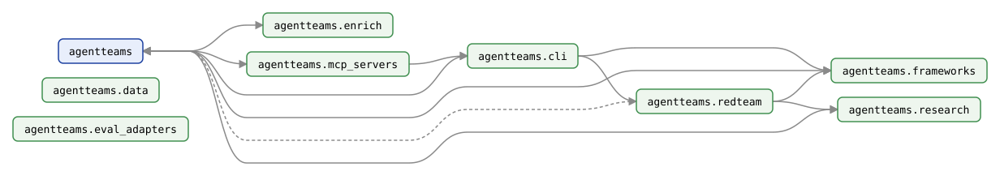
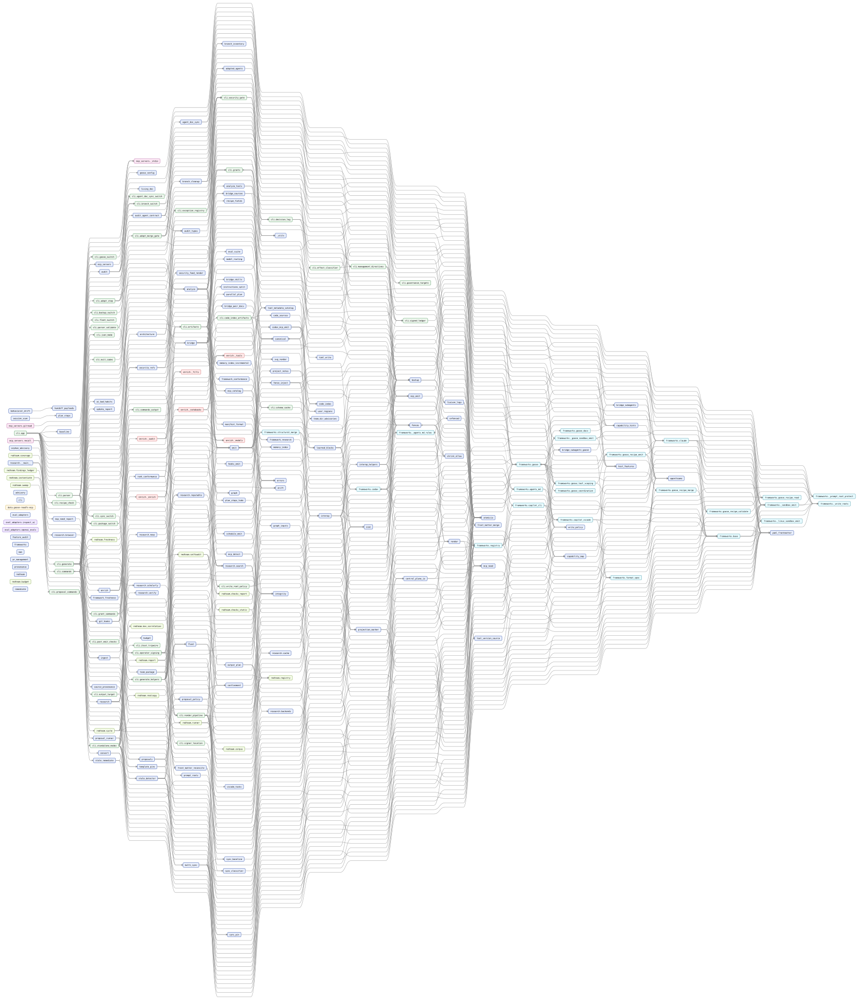
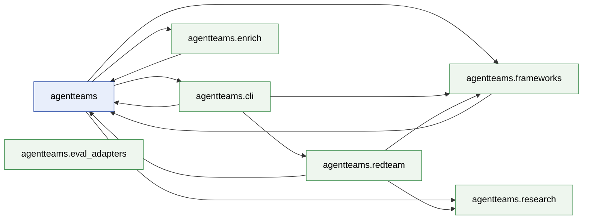
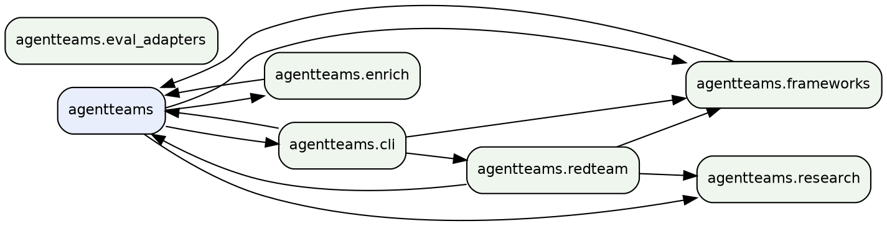

<!-- AGENTTEAMS:BEGIN content v=1 -->
# agentteams — Repository Architecture Map

> **Auto-generated.** Regenerated on every commit that touches the `agentteams` package. Do not edit manually — changes will be overwritten.

- Modules mapped: **210**
- Packages: **7**
- Internal import edges: **535**
- Distinct external dependencies: **7**

---

## Package Dependency Diagram

Inter-package import dependencies (module-level detail in the tables below).



---

## Packages

| Package | Modules | Depends on |
| --- | --- | --- |
| `agentteams` | 114 | `agentteams.cli`, `agentteams.enrich`, `agentteams.frameworks`, `agentteams.research` |
| `agentteams.cli` | 40 | `agentteams`, `agentteams.frameworks`, `agentteams.redteam` |
| `agentteams.enrich` | 6 | `agentteams` |
| `agentteams.eval_adapters` | 2 | — |
| `agentteams.frameworks` | 23 | `agentteams` |
| `agentteams.redteam` | 16 | `agentteams`, `agentteams.frameworks`, `agentteams.research` |
| `agentteams.research` | 9 | — |

---

## Module Dependency Diagram

Every module, coloured by package (full adjacency in the table below).



---

## Module Dependency Table

| Module | Imports (internal) | Imported by |
| --- | --- | --- |
| `agentteams` | — | `agentteams.backup`, `agentteams.capability_hints`, `agentteams.cli.artifacts`, `agentteams.cli.generate_helpers`, `agentteams.cli.operator_signing`, `agentteams.cli.parser`, `agentteams.cli.signer_location`, `agentteams.git_hooks`, `agentteams.projection_marker` |
| `agentteams._utils` | — | `agentteams.analyze`, `agentteams.analyze_tools`, `agentteams.branch_cleanup`, `agentteams.ingest` |
| `agentteams.adopted_agents` | `agentteams.yaml_frontmatter` | `agentteams.analyze`, `agentteams.cli.adopt_step` |
| `agentteams.advisory` | — | — |
| `agentteams.agent_doc_sync` | `agentteams.learned_blocks`, `agentteams.scan` | `agentteams.cli.agent_doc_sync_switch` |
| `agentteams.ai_bad_habits` | — | `agentteams.cli.generate` |
| `agentteams.analyze` | `agentteams._utils`, `agentteams.adopted_agents`, `agentteams.analyze_tools`, `agentteams.host_features`, `agentteams.manifest_format`, `agentteams.mcp_detect`, `agentteams.mcp_emit`, `agentteams.output_plan`, `agentteams.recipe_fields`, `agentteams.tool_metadata_catalog` | `agentteams.cli.adopt_step`, `agentteams.cli.generate`, `agentteams.output_plan`, `agentteams.rank_conformance` |
| `agentteams.analyze_tools` | `agentteams._utils`, `agentteams.tool_metadata_catalog` | `agentteams.analyze` |
| `agentteams.architecture` | `agentteams.backup`, `agentteams.svg_render` | `agentteams.git_hooks` |
| `agentteams.atomicio` | — | `agentteams.backup`, `agentteams.canonical`, `agentteams.cli.adopt_merge_gate`, `agentteams.cli.artifacts`, `agentteams.cli.decision_log`, `agentteams.cli.exception_registry`, `agentteams.cli.grants`, `agentteams.cli.management_directives`, `agentteams.cli.schema_cache`, `agentteams.cli.security_gate`, `agentteams.codex_mcp_emit`, `agentteams.emit`, `agentteams.enrich._enrich`, `agentteams.fence_inject`, `agentteams.fences`, `agentteams.hooks_emit`, `agentteams.liaison_logs`, `agentteams.mcp_emit`, `agentteams.plan_steps_todo`, `agentteams.proposals`, `agentteams.redteam.findings_ledger`, `agentteams.schedule_emit`, `agentteams.sync_baseline`, `agentteams.sync_pin`, `agentteams.team_package` |
| `agentteams.audit` | `agentteams.audit_agent_contract`, `agentteams.audit_types`, `agentteams.backup`, `agentteams.frameworks.format_spec`, `agentteams.frameworks.goose`, `agentteams.living_doc` | `agentteams.cli.generate` |
| `agentteams.audit_agent_contract` | `agentteams.audit_types`, `agentteams.frameworks.goose_recipe_read`, `agentteams.frameworks.goose_recipe_validate`, `agentteams.frameworks.goose_tool_scoping`, `agentteams.write_policy` | `agentteams.audit` |
| `agentteams.audit_types` | `agentteams.frameworks.registry` | `agentteams.audit`, `agentteams.audit_agent_contract`, `agentteams.cli.standalone_modes`, `agentteams.rank_conformance` |
| `agentteams.backup` | `agentteams`, `agentteams.atomicio`, `agentteams.liaison_logs` | `agentteams.architecture`, `agentteams.audit`, `agentteams.bridge`, `agentteams.cli.adopt_merge_gate`, `agentteams.cli.artifacts`, `agentteams.cli.code_index_artifacts`, `agentteams.cli.commands`, `agentteams.cli.output_target`, `agentteams.emit`, `agentteams.fence_inject`, `agentteams.fleet`, `agentteams.interop`, `agentteams.multi_sync`, `agentteams.scan`, `agentteams.stale_detector`, `agentteams.stale_remediate` |
| `agentteams.baseline` | — | `agentteams.cli.app` |
| `agentteams.behavioral_drift` | `agentteams.handoff_payloads` | — |
| `agentteams.branch_cleanup` | `agentteams._utils`, `agentteams.branch_inventory`, `agentteams.cli.grants`, `agentteams.cli.security_gate` | `agentteams.cli.branch_switch` |
| `agentteams.branch_inventory` | — | `agentteams.branch_cleanup`, `agentteams.cli.branch_switch` |
| `agentteams.bridge` | `agentteams.backup`, `agentteams.bridge_pair_docs`, `agentteams.bridge_skills`, `agentteams.bridge_sources`, `agentteams.bridge_subagents`, `agentteams.bridge_subagents_goose`, `agentteams.canonical`, `agentteams.capability_hints`, `agentteams.frameworks.goose`, `agentteams.hooks_emit`, `agentteams.instructions_split`, `agentteams.interop`, `agentteams.parallel_plan`, `agentteams.plan_steps_todo`, `agentteams.projection_marker`, `agentteams.schedule_emit` | `agentteams.cli.commands`, `agentteams.stale_detector`, `agentteams.team_package` |
| `agentteams.bridge_pair_docs` | `agentteams.canonical` | `agentteams.bridge` |
| `agentteams.bridge_skills` | — | `agentteams.bridge` |
| `agentteams.bridge_sources` | `agentteams.canonical`, `agentteams.yaml_frontmatter` | `agentteams.bridge`, `agentteams.redteam.instantiate` |
| `agentteams.bridge_subagents` | `agentteams.frameworks.claude` | `agentteams.bridge`, `agentteams.bridge_subagents_goose` |
| `agentteams.bridge_subagents_goose` | `agentteams.bridge_subagents`, `agentteams.frameworks.goose` | `agentteams.bridge`, `agentteams.frameworks.goose`, `agentteams.orphan_advisory` |
| `agentteams.budget` | — | `agentteams.cli.standalone_modes` |
| `agentteams.canonical` | `agentteams.atomicio`, `agentteams.interop`, `agentteams.yaml_frontmatter` | `agentteams.bridge`, `agentteams.bridge_pair_docs`, `agentteams.bridge_sources`, `agentteams.cli.commands`, `agentteams.interop`, `agentteams.interop_helpers`, `agentteams.multi_sync`, `agentteams.team_package` |
| `agentteams.capability_hints` | `agentteams` | `agentteams.bridge`, `agentteams.cli.commands`, `agentteams.cli.parser`, `agentteams.cli.signed_ledger`, `agentteams.frameworks.goose_docs` |
| `agentteams.capability_map` | `agentteams.yaml_frontmatter` | `agentteams.frameworks.codex`, `agentteams.frameworks.goose`, `agentteams.interop`, `agentteams.interop_helpers`, `agentteams.rank_conformance` |
| `agentteams.cli` | — | — |
| `agentteams.cli.adopt_merge_gate` | `agentteams.atomicio`, `agentteams.backup`, `agentteams.cli.decision_log`, `agentteams.cli.exception_registry`, `agentteams.cli.security_gate` | `agentteams.cli.adopt_step` |
| `agentteams.cli.adopt_step` | `agentteams.adopted_agents`, `agentteams.analyze`, `agentteams.cli.adopt_merge_gate`, `agentteams.emit` | `agentteams.cli.generate` |
| `agentteams.cli.agent_doc_sync_switch` | `agentteams.agent_doc_sync` | `agentteams.cli.app`, `agentteams.cli.parser`, `agentteams.cli.parser_validate` |
| `agentteams.cli.app` | `agentteams.baseline`, `agentteams.cli.agent_doc_sync_switch`, `agentteams.cli.artifacts`, `agentteams.cli.branch_switch`, `agentteams.cli.commands`, `agentteams.cli.generate`, `agentteams.cli.goose_switch`, `agentteams.cli.json_mode`, `agentteams.cli.package_switch`, `agentteams.cli.parser`, `agentteams.cli.proposal_commands`, `agentteams.cli.recipe_check`, `agentteams.cli.render_pipeline`, `agentteams.cli.sync_switch`, `agentteams.fence_inject`, `agentteams.fleet`, `agentteams.frameworks.goose`, `agentteams.git_hooks`, `agentteams.host_features` | — |
| `agentteams.cli.artifacts` | `agentteams`, `agentteams.atomicio`, `agentteams.backup`, `agentteams.cli.code_index_artifacts`, `agentteams.cli.grants`, `agentteams.cli.management_directives`, `agentteams.cli.schema_cache`, `agentteams.cli.write_root_policy`, `agentteams.codex_mcp_emit`, `agentteams.drift`, `agentteams.errors`, `agentteams.eval_suite`, `agentteams.fences`, `agentteams.framework_conformance`, `agentteams.frameworks.claude`, `agentteams.host_features`, `agentteams.mcp_emit`, `agentteams.memory_index`, `agentteams.memory_index_incremental`, `agentteams.model_routing` | `agentteams.cli.app`, `agentteams.cli.generate`, `agentteams.cli.generate_helpers`, `agentteams.cli.standalone_modes`, `agentteams.git_hooks` |
| `agentteams.cli.backup_switch` | `agentteams.emit` | `agentteams.cli.parser` |
| `agentteams.cli.branch_switch` | `agentteams.branch_cleanup`, `agentteams.branch_inventory` | `agentteams.cli.app`, `agentteams.cli.parser`, `agentteams.cli.parser_validate` |
| `agentteams.cli.code_index_artifacts` | `agentteams.backup`, `agentteams.cli.schema_cache`, `agentteams.code_index`, `agentteams.code_sources`, `agentteams.errors` | `agentteams.cli.artifacts` |
| `agentteams.cli.commands` | `agentteams.backup`, `agentteams.bridge`, `agentteams.canonical`, `agentteams.capability_hints`, `agentteams.cli.commands_output`, `agentteams.cli.exception_registry`, `agentteams.cli.grant_commands`, `agentteams.cli.management_directives`, `agentteams.cli.operator_signing`, `agentteams.cli.render_pipeline`, `agentteams.cli.security_gate`, `agentteams.convert`, `agentteams.drift`, `agentteams.emit`, `agentteams.framework_freshness`, `agentteams.frameworks.registry`, `agentteams.integrity`, `agentteams.interop`, `agentteams.redteam.cycle`, `agentteams.redteam.freshness`, `agentteams.research`, `agentteams.security_refs`, `agentteams.stale_detector`, `agentteams.stale_remediate`, `agentteams.sync_baseline`, `agentteams.sync_classifier` | `agentteams.cli.app`, `agentteams.stale_remediate` |
| `agentteams.cli.commands_output` | — | `agentteams.cli.commands`, `agentteams.cli.grant_commands` |
| `agentteams.cli.decision_log` | `agentteams.atomicio`, `agentteams.cli.effect_classifier`, `agentteams.cli.grants`, `agentteams.cli.signed_ledger` | `agentteams.cli.adopt_merge_gate`, `agentteams.cli.grants`, `agentteams.cli.operator_signing`, `agentteams.cli.security_gate` |
| `agentteams.cli.effect_classifier` | `agentteams.cli.governance_targets`, `agentteams.cli.management_directives` | `agentteams.cli.decision_log`, `agentteams.cli.operator_signing` |
| `agentteams.cli.exception_registry` | `agentteams.atomicio`, `agentteams.cli.signed_ledger` | `agentteams.cli.adopt_merge_gate`, `agentteams.cli.commands` |
| `agentteams.cli.exit_codes` | `agentteams.emit` | `agentteams.cli.generate` |
| `agentteams.cli.fleet_switch` | — | `agentteams.cli.parser` |
| `agentteams.cli.generate` | `agentteams.ai_bad_habits`, `agentteams.analyze`, `agentteams.audit`, `agentteams.cli.adopt_step`, `agentteams.cli.artifacts`, `agentteams.cli.exit_codes`, `agentteams.cli.generate_helpers`, `agentteams.cli.json_mode`, `agentteams.cli.output_target`, `agentteams.cli.post_emit_checks`, `agentteams.cli.render_pipeline`, `agentteams.cli.security_gate`, `agentteams.cli.standalone_modes`, `agentteams.cli.write_root_policy`, `agentteams.drift`, `agentteams.emit`, `agentteams.enrich`, `agentteams.errors`, `agentteams.fences`, `agentteams.framework_research`, `agentteams.frameworks.goose_tool_scoping`, `agentteams.frameworks.registry`, `agentteams.front_matter_reconcile`, `agentteams.git_hooks`, `agentteams.graph`, `agentteams.ingest`, `agentteams.liaison_logs`, `agentteams.render`, `agentteams.security_refs`, `agentteams.shrink_allow`, `agentteams.template_pins`, `agentteams.update_report` | `agentteams.cli.app` |
| `agentteams.cli.generate_helpers` | `agentteams`, `agentteams.cli.artifacts`, `agentteams.cli.management_directives`, `agentteams.cli.render_pipeline`, `agentteams.control_plane_io`, `agentteams.drift`, `agentteams.emit`, `agentteams.frameworks._goose_sandbox_emit`, `agentteams.frameworks._linux_sandbox_emit`, `agentteams.frameworks._prompt_root_protect`, `agentteams.frameworks._sandbox_emit`, `agentteams.frameworks._write_roots`, `agentteams.frameworks.claude`, `agentteams.frameworks.goose_tool_scoping`, `agentteams.front_matter_reconcile`, `agentteams.integrity`, `agentteams.projection_marker`, `agentteams.prompt_roots`, `agentteams.team_dir_advisories` | `agentteams.cli.generate`, `agentteams.cli.standalone_modes` |
| `agentteams.cli.goose_switch` | `agentteams.goose_config` | `agentteams.cli.app`, `agentteams.cli.parser` |
| `agentteams.cli.governance_targets` | — | `agentteams.cli.effect_classifier`, `agentteams.cli.management_directives` |
| `agentteams.cli.grant_commands` | `agentteams.cli.commands_output`, `agentteams.cli.grants`, `agentteams.cli.operator_signing`, `agentteams.frameworks.registry` | `agentteams.cli.commands` |
| `agentteams.cli.grants` | `agentteams.atomicio`, `agentteams.cli.decision_log`, `agentteams.cli.signed_ledger` | `agentteams.branch_cleanup`, `agentteams.cli.artifacts`, `agentteams.cli.decision_log`, `agentteams.cli.grant_commands`, `agentteams.cli.operator_signing` |
| `agentteams.cli.itest_tripwire` | — | `agentteams.cli.standalone_modes` |
| `agentteams.cli.json_mode` | — | `agentteams.cli.app`, `agentteams.cli.generate` |
| `agentteams.cli.management_directives` | `agentteams.atomicio`, `agentteams.cli.governance_targets`, `agentteams.cli.signed_ledger` | `agentteams.cli.artifacts`, `agentteams.cli.commands`, `agentteams.cli.effect_classifier`, `agentteams.cli.generate_helpers` |
| `agentteams.cli.operator_signing` | `agentteams`, `agentteams.cli.decision_log`, `agentteams.cli.effect_classifier`, `agentteams.cli.grants`, `agentteams.cli.signed_ledger`, `agentteams.cli.signer_location`, `agentteams.frameworks._sandbox_emit`, `agentteams.integrity` | `agentteams.cli.commands`, `agentteams.cli.grant_commands` |
| `agentteams.cli.output_target` | `agentteams.backup`, `agentteams.drift` | `agentteams.cli.generate` |
| `agentteams.cli.package_switch` | `agentteams.cli.security_gate`, `agentteams.security_refs`, `agentteams.team_package` | `agentteams.cli.app`, `agentteams.cli.parser` |
| `agentteams.cli.parser` | `agentteams`, `agentteams.capability_hints`, `agentteams.cli.agent_doc_sync_switch`, `agentteams.cli.backup_switch`, `agentteams.cli.branch_switch`, `agentteams.cli.fleet_switch`, `agentteams.cli.goose_switch`, `agentteams.cli.package_switch`, `agentteams.cli.parser_validate`, `agentteams.cli.sync_switch`, `agentteams.emit`, `agentteams.frameworks.registry` | `agentteams.cli.app` |
| `agentteams.cli.parser_validate` | `agentteams.cli.agent_doc_sync_switch`, `agentteams.cli.branch_switch`, `agentteams.shrink_allow` | `agentteams.cli.parser` |
| `agentteams.cli.post_emit_checks` | `agentteams.emit`, `agentteams.scan` | `agentteams.cli.generate` |
| `agentteams.cli.proposal_commands` | `agentteams.ingest`, `agentteams.proposal_runner`, `agentteams.proposals` | `agentteams.cli.app` |
| `agentteams.cli.recipe_check` | `agentteams.frameworks.goose` | `agentteams.cli.app` |
| `agentteams.cli.render_pipeline` | `agentteams.emit`, `agentteams.frameworks.agents_md`, `agentteams.frameworks.base`, `agentteams.frameworks.claude`, `agentteams.frameworks.copilot_cli`, `agentteams.frameworks.copilot_vscode`, `agentteams.frameworks.goose`, `agentteams.graph`, `agentteams.render`, `agentteams.vscode_tasks`, `agentteams.write_policy` | `agentteams.cli.app`, `agentteams.cli.commands`, `agentteams.cli.generate`, `agentteams.cli.generate_helpers` |
| `agentteams.cli.schema_cache` | `agentteams.atomicio` | `agentteams.cli.artifacts`, `agentteams.cli.code_index_artifacts`, `agentteams.security_refs` |
| `agentteams.cli.security_gate` | `agentteams.atomicio`, `agentteams.cli.decision_log` | `agentteams.branch_cleanup`, `agentteams.cli.adopt_merge_gate`, `agentteams.cli.commands`, `agentteams.cli.generate`, `agentteams.cli.package_switch`, `agentteams.cli.standalone_modes`, `agentteams.security_refs` |
| `agentteams.cli.signed_ledger` | `agentteams.capability_hints` | `agentteams.cli.decision_log`, `agentteams.cli.exception_registry`, `agentteams.cli.grants`, `agentteams.cli.management_directives`, `agentteams.cli.operator_signing` |
| `agentteams.cli.signer_location` | `agentteams` | `agentteams.cli.operator_signing` |
| `agentteams.cli.standalone_modes` | `agentteams.audit_types`, `agentteams.budget`, `agentteams.cli.artifacts`, `agentteams.cli.generate_helpers`, `agentteams.cli.itest_tripwire`, `agentteams.cli.security_gate`, `agentteams.emit`, `agentteams.frameworks._goose_sandbox_emit`, `agentteams.frameworks._sandbox_emit`, `agentteams.frameworks.claude`, `agentteams.rank_conformance`, `agentteams.scan`, `agentteams.template_pins` | `agentteams.cli.generate` |
| `agentteams.cli.sync_switch` | `agentteams.multi_sync` | `agentteams.cli.app`, `agentteams.cli.parser` |
| `agentteams.cli.write_root_policy` | `agentteams.frameworks._prompt_root_protect`, `agentteams.frameworks._write_roots` | `agentteams.cli.artifacts`, `agentteams.cli.generate`, `agentteams.multi_sync` |
| `agentteams.code_index` | — | `agentteams.cli.code_index_artifacts`, `agentteams.code_sources` |
| `agentteams.code_sources` | `agentteams.code_index` | `agentteams.cli.code_index_artifacts` |
| `agentteams.codex_mcp_emit` | `agentteams.atomicio`, `agentteams.mcp_emit`, `agentteams.team_dir_advisories`, `agentteams.toml_write` | `agentteams.cli.artifacts` |
| `agentteams.control_plane_io` | `agentteams.frameworks._linux_sandbox_emit`, `agentteams.frameworks._sandbox_emit` | `agentteams.cli.generate_helpers`, `agentteams.multi_sync`, `agentteams.projection_marker` |
| `agentteams.convert` | `agentteams.frameworks.base`, `agentteams.frameworks.registry` | `agentteams.cli.commands` |
| `agentteams.drift` | `agentteams.emit` | `agentteams.cli.artifacts`, `agentteams.cli.commands`, `agentteams.cli.generate`, `agentteams.cli.generate_helpers`, `agentteams.cli.output_target`, `agentteams.emit`, `agentteams.framework_freshness`, `agentteams.stale_detector` |
| `agentteams.emit` | `agentteams.atomicio`, `agentteams.backup`, `agentteams.drift`, `agentteams.fence_inject`, `agentteams.fences`, `agentteams.frameworks.structural_merge`, `agentteams.learned_blocks`, `agentteams.project_notes`, `agentteams.shrink_allow` | `agentteams.cli.adopt_step`, `agentteams.cli.backup_switch`, `agentteams.cli.commands`, `agentteams.cli.exit_codes`, `agentteams.cli.generate`, `agentteams.cli.generate_helpers`, `agentteams.cli.parser`, `agentteams.cli.post_emit_checks`, `agentteams.cli.render_pipeline`, `agentteams.cli.standalone_modes`, `agentteams.drift`, `agentteams.fence_inject`, `agentteams.git_hooks` |
| `agentteams.enrich` | `agentteams.enrich._audit`, `agentteams.enrich._enrich`, `agentteams.enrich._models`, `agentteams.enrich._tools` | `agentteams.cli.generate` |
| `agentteams.enrich._audit` | `agentteams.enrich._fills`, `agentteams.enrich._models`, `agentteams.enrich._tools`, `agentteams.tool_metadata_catalog` | `agentteams.enrich` |
| `agentteams.enrich._enrich` | `agentteams.atomicio`, `agentteams.enrich._fills`, `agentteams.enrich._models`, `agentteams.enrich._notebooks`, `agentteams.enrich._tools` | `agentteams.enrich` |
| `agentteams.enrich._fills` | — | `agentteams.enrich._audit`, `agentteams.enrich._enrich` |
| `agentteams.enrich._models` | — | `agentteams.enrich`, `agentteams.enrich._audit`, `agentteams.enrich._enrich`, `agentteams.enrich._notebooks` |
| `agentteams.enrich._notebooks` | `agentteams.enrich._models`, `agentteams.enrich._tools`, `agentteams.tool_metadata_catalog` | `agentteams.enrich._enrich` |
| `agentteams.enrich._tools` | `agentteams.tool_metadata_catalog` | `agentteams.enrich`, `agentteams.enrich._audit`, `agentteams.enrich._enrich`, `agentteams.enrich._notebooks` |
| `agentteams.errors` | — | `agentteams.cli.artifacts`, `agentteams.cli.code_index_artifacts`, `agentteams.cli.generate`, `agentteams.git_hooks`, `agentteams.template_pins` |
| `agentteams.eval_adapters` | — | — |
| `agentteams.eval_adapters.inspect_ai` | — | — |
| `agentteams.eval_adapters.openai_evals` | — | — |
| `agentteams.eval_suite` | — | `agentteams.cli.artifacts` |
| `agentteams.feature_audit` | — | — |
| `agentteams.fence_inject` | `agentteams.atomicio`, `agentteams.backup`, `agentteams.emit`, `agentteams.fences`, `agentteams.frameworks.codex` | `agentteams.cli.app`, `agentteams.emit` |
| `agentteams.fences` | `agentteams.atomicio`, `agentteams.front_matter_merge`, `agentteams.shrink_allow`, `agentteams.unfenced` | `agentteams.cli.artifacts`, `agentteams.cli.generate`, `agentteams.emit`, `agentteams.fence_inject`, `agentteams.frameworks.codex`, `agentteams.interop`, `agentteams.interop_helpers`, `agentteams.learned_blocks`, `agentteams.project_notes`, `agentteams.prompt_roots`, `agentteams.shrink_allow` |
| `agentteams.fleet` | `agentteams.backup`, `agentteams.projection_marker` | `agentteams.cli.app`, `agentteams.redteam.realcopy`, `agentteams.stale_detector`, `agentteams.stale_remediate` |
| `agentteams.framework_conformance` | `agentteams.framework_research` | `agentteams.cli.artifacts` |
| `agentteams.framework_freshness` | `agentteams.drift` | `agentteams.cli.commands` |
| `agentteams.framework_research` | `agentteams.frameworks.format_spec` | `agentteams.cli.generate`, `agentteams.framework_conformance` |
| `agentteams.frameworks` | — | — |
| `agentteams.frameworks._agents_md_rules` | `agentteams.render` | `agentteams.frameworks.agents_md`, `agentteams.frameworks.codex`, `agentteams.frameworks.goose`, `agentteams.frameworks.structural_merge` |
| `agentteams.frameworks._goose_sandbox_emit` | `agentteams.frameworks._sandbox_emit`, `agentteams.frameworks._write_roots`, `agentteams.host_features` | `agentteams.cli.generate_helpers`, `agentteams.cli.standalone_modes`, `agentteams.frameworks.goose` |
| `agentteams.frameworks._linux_sandbox_emit` | — | `agentteams.cli.generate_helpers`, `agentteams.control_plane_io`, `agentteams.frameworks.base`, `agentteams.frameworks.codex` |
| `agentteams.frameworks._prompt_root_protect` | — | `agentteams.cli.generate_helpers`, `agentteams.cli.write_root_policy`, `agentteams.frameworks._sandbox_emit`, `agentteams.frameworks.claude` |
| `agentteams.frameworks._sandbox_emit` | `agentteams.frameworks._prompt_root_protect`, `agentteams.frameworks._write_roots` | `agentteams.cli.generate_helpers`, `agentteams.cli.operator_signing`, `agentteams.cli.standalone_modes`, `agentteams.control_plane_io`, `agentteams.frameworks._goose_sandbox_emit`, `agentteams.frameworks.base`, `agentteams.frameworks.claude`, `agentteams.multi_sync`, `agentteams.projection_marker` |
| `agentteams.frameworks._write_roots` | — | `agentteams.cli.generate_helpers`, `agentteams.cli.write_root_policy`, `agentteams.frameworks._goose_sandbox_emit`, `agentteams.frameworks._sandbox_emit`, `agentteams.frameworks.claude`, `agentteams.multi_sync`, `agentteams.proposals` |
| `agentteams.frameworks.agents_md` | `agentteams.frameworks._agents_md_rules`, `agentteams.frameworks.base`, `agentteams.yaml_frontmatter` | `agentteams.cli.render_pipeline`, `agentteams.frameworks.codex`, `agentteams.frameworks.registry` |
| `agentteams.frameworks.base` | `agentteams.frameworks._linux_sandbox_emit`, `agentteams.frameworks._sandbox_emit`, `agentteams.yaml_frontmatter` | `agentteams.cli.render_pipeline`, `agentteams.convert`, `agentteams.frameworks.agents_md`, `agentteams.frameworks.claude`, `agentteams.frameworks.copilot_cli`, `agentteams.frameworks.copilot_vscode`, `agentteams.frameworks.goose`, `agentteams.frameworks.goose_recipe_emit`, `agentteams.frameworks.registry`, `agentteams.interop`, `agentteams.output_plan` |
| `agentteams.frameworks.claude` | `agentteams.frameworks._prompt_root_protect`, `agentteams.frameworks._sandbox_emit`, `agentteams.frameworks._write_roots`, `agentteams.frameworks.base`, `agentteams.yaml_frontmatter` | `agentteams.bridge_subagents`, `agentteams.cli.artifacts`, `agentteams.cli.generate_helpers`, `agentteams.cli.render_pipeline`, `agentteams.cli.standalone_modes`, `agentteams.frameworks.registry` |
| `agentteams.frameworks.codex` | `agentteams.capability_map`, `agentteams.fences`, `agentteams.frameworks._agents_md_rules`, `agentteams.frameworks._linux_sandbox_emit`, `agentteams.frameworks.agents_md`, `agentteams.frameworks.copilot_vscode`, `agentteams.yaml_frontmatter` | `agentteams.fence_inject`, `agentteams.frameworks.registry`, `agentteams.interop` |
| `agentteams.frameworks.copilot_cli` | `agentteams.frameworks.base`, `agentteams.frameworks.copilot_vscode`, `agentteams.yaml_frontmatter` | `agentteams.cli.render_pipeline`, `agentteams.frameworks.registry` |
| `agentteams.frameworks.copilot_vscode` | `agentteams.frameworks.base`, `agentteams.frameworks.format_spec`, `agentteams.yaml_frontmatter` | `agentteams.cli.render_pipeline`, `agentteams.frameworks.codex`, `agentteams.frameworks.copilot_cli`, `agentteams.frameworks.registry` |
| `agentteams.frameworks.format_spec` | — | `agentteams.audit`, `agentteams.framework_research`, `agentteams.frameworks.copilot_vscode`, `agentteams.output_plan` |
| `agentteams.frameworks.goose` | `agentteams.bridge_subagents_goose`, `agentteams.capability_map`, `agentteams.frameworks._agents_md_rules`, `agentteams.frameworks._goose_sandbox_emit`, `agentteams.frameworks.base`, `agentteams.frameworks.goose_coordination`, `agentteams.frameworks.goose_docs`, `agentteams.frameworks.goose_recipe_emit`, `agentteams.frameworks.goose_recipe_read`, `agentteams.frameworks.goose_recipe_validate`, `agentteams.frameworks.goose_tool_scoping`, `agentteams.write_policy` | `agentteams.audit`, `agentteams.bridge`, `agentteams.bridge_subagents_goose`, `agentteams.cli.app`, `agentteams.cli.recipe_check`, `agentteams.cli.render_pipeline`, `agentteams.frameworks.goose_coordination`, `agentteams.frameworks.registry` |
| `agentteams.frameworks.goose_coordination` | `agentteams.frameworks.goose` | `agentteams.frameworks.goose` |
| `agentteams.frameworks.goose_docs` | `agentteams.capability_hints` | `agentteams.frameworks.goose` |
| `agentteams.frameworks.goose_recipe_emit` | `agentteams.frameworks.base`, `agentteams.frameworks.goose_recipe_merge`, `agentteams.yaml_frontmatter` | `agentteams.frameworks.goose`, `agentteams.frameworks.goose_tool_scoping` |
| `agentteams.frameworks.goose_recipe_merge` | `agentteams.frameworks.goose_recipe_validate` | `agentteams.frameworks.goose_recipe_emit`, `agentteams.frameworks.structural_merge` |
| `agentteams.frameworks.goose_recipe_read` | — | `agentteams.audit_agent_contract`, `agentteams.frameworks.goose`, `agentteams.frameworks.goose_recipe_validate`, `agentteams.frameworks.goose_tool_scoping` |
| `agentteams.frameworks.goose_recipe_validate` | `agentteams.frameworks.goose_recipe_read` | `agentteams.audit_agent_contract`, `agentteams.frameworks.goose`, `agentteams.frameworks.goose_recipe_merge`, `agentteams.learned_blocks` |
| `agentteams.frameworks.goose_tool_scoping` | `agentteams.frameworks.goose_recipe_emit`, `agentteams.frameworks.goose_recipe_read` | `agentteams.audit_agent_contract`, `agentteams.cli.generate`, `agentteams.cli.generate_helpers`, `agentteams.frameworks.goose` |
| `agentteams.frameworks.registry` | `agentteams.frameworks.agents_md`, `agentteams.frameworks.base`, `agentteams.frameworks.claude`, `agentteams.frameworks.codex`, `agentteams.frameworks.copilot_cli`, `agentteams.frameworks.copilot_vscode`, `agentteams.frameworks.goose` | `agentteams.audit_types`, `agentteams.cli.commands`, `agentteams.cli.generate`, `agentteams.cli.grant_commands`, `agentteams.cli.parser`, `agentteams.convert`, `agentteams.interop`, `agentteams.manifest_format`, `agentteams.multi_sync`, `agentteams.output_plan`, `agentteams.redteam.instantiate`, `agentteams.redteam.sweep`, `agentteams.render`, `agentteams.stale_detector` |
| `agentteams.frameworks.structural_merge` | `agentteams.frameworks._agents_md_rules`, `agentteams.frameworks.goose_recipe_merge`, `agentteams.learned_blocks` | `agentteams.emit` |
| `agentteams.front_matter_merge` | — | `agentteams.fences`, `agentteams.front_matter_reconcile`, `agentteams.sync_classifier`, `agentteams.unfenced` |
| `agentteams.front_matter_reconcile` | `agentteams.front_matter_merge`, `agentteams.yaml_frontmatter` | `agentteams.cli.generate`, `agentteams.cli.generate_helpers` |
| `agentteams.git_hooks` | `agentteams`, `agentteams.architecture`, `agentteams.cli.artifacts`, `agentteams.emit`, `agentteams.errors`, `agentteams.graph` | `agentteams.cli.app`, `agentteams.cli.generate` |
| `agentteams.goose_config` | — | `agentteams.cli.goose_switch` |
| `agentteams.graph` | `agentteams.graph_inputs`, `agentteams.svg_render` | `agentteams.cli.generate`, `agentteams.cli.render_pipeline`, `agentteams.git_hooks` |
| `agentteams.graph_inputs` | `agentteams.yaml_frontmatter` | `agentteams.graph` |
| `agentteams.handoff_payloads` | — | `agentteams.behavioral_drift` |
| `agentteams.hooks_emit` | `agentteams.atomicio` | `agentteams.bridge` |
| `agentteams.host_features` | — | `agentteams.analyze`, `agentteams.cli.app`, `agentteams.cli.artifacts`, `agentteams.frameworks._goose_sandbox_emit`, `agentteams.multi_sync` |
| `agentteams.ingest` | `agentteams._utils`, `agentteams.tool_version_source` | `agentteams.cli.generate`, `agentteams.cli.proposal_commands` |
| `agentteams.instructions_split` | — | `agentteams.bridge` |
| `agentteams.integrity` | — | `agentteams.cli.commands`, `agentteams.cli.generate_helpers`, `agentteams.cli.operator_signing`, `agentteams.redteam.checks_static`, `agentteams.redteam.runner` |
| `agentteams.interop` | `agentteams.backup`, `agentteams.canonical`, `agentteams.capability_map`, `agentteams.fences`, `agentteams.frameworks.base`, `agentteams.frameworks.codex`, `agentteams.frameworks.registry`, `agentteams.interop_helpers`, `agentteams.mcp_emit`, `agentteams.projection_marker`, `agentteams.yaml_frontmatter` | `agentteams.bridge`, `agentteams.canonical`, `agentteams.cli.commands`, `agentteams.multi_sync`, `agentteams.team_package` |
| `agentteams.interop_helpers` | `agentteams.canonical`, `agentteams.capability_map`, `agentteams.fences`, `agentteams.mcp_emit`, `agentteams.yaml_frontmatter` | `agentteams.interop` |
| `agentteams.learned_blocks` | `agentteams.fences`, `agentteams.frameworks.goose_recipe_validate`, `agentteams.scan`, `agentteams.unfenced` | `agentteams.agent_doc_sync`, `agentteams.emit`, `agentteams.frameworks.structural_merge` |
| `agentteams.liaison_logs` | `agentteams.atomicio` | `agentteams.backup`, `agentteams.cli.generate` |
| `agentteams.living_doc` | — | `agentteams.audit` |
| `agentteams.man` | — | — |
| `agentteams.manifest_format` | `agentteams.frameworks.registry` | `agentteams.analyze` |
| `agentteams.mcp_detect` | — | `agentteams.analyze` |
| `agentteams.mcp_emit` | `agentteams.atomicio` | `agentteams.analyze`, `agentteams.cli.artifacts`, `agentteams.codex_mcp_emit`, `agentteams.interop`, `agentteams.interop_helpers` |
| `agentteams.memory_index` | — | `agentteams.cli.artifacts`, `agentteams.memory_index_incremental` |
| `agentteams.memory_index_incremental` | `agentteams.memory_index` | `agentteams.cli.artifacts` |
| `agentteams.model_routing` | — | `agentteams.cli.artifacts` |
| `agentteams.multi_sync` | `agentteams.backup`, `agentteams.canonical`, `agentteams.cli.write_root_policy`, `agentteams.control_plane_io`, `agentteams.frameworks._sandbox_emit`, `agentteams.frameworks._write_roots`, `agentteams.frameworks.registry`, `agentteams.host_features`, `agentteams.interop`, `agentteams.projection_marker`, `agentteams.sync_baseline`, `agentteams.sync_classifier`, `agentteams.sync_pin` | `agentteams.cli.sync_switch`, `agentteams.stale_detector` |
| `agentteams.orphan_advisory` | `agentteams.bridge_subagents_goose` | — |
| `agentteams.output_plan` | `agentteams.analyze`, `agentteams.frameworks.base`, `agentteams.frameworks.format_spec`, `agentteams.frameworks.registry` | `agentteams.analyze` |
| `agentteams.parallel_plan` | — | `agentteams.bridge` |
| `agentteams.plan_steps` | — | `agentteams.session_scan` |
| `agentteams.plan_steps_todo` | `agentteams.atomicio` | `agentteams.bridge` |
| `agentteams.pr_management` | — | — |
| `agentteams.project_notes` | `agentteams.fences` | `agentteams.emit` |
| `agentteams.projection_marker` | `agentteams`, `agentteams.control_plane_io`, `agentteams.frameworks._sandbox_emit` | `agentteams.bridge`, `agentteams.cli.generate_helpers`, `agentteams.fleet`, `agentteams.interop`, `agentteams.multi_sync` |
| `agentteams.prompt_roots` | `agentteams.fences` | `agentteams.cli.generate_helpers` |
| `agentteams.proposal_runner` | `agentteams.proposals` | `agentteams.cli.proposal_commands` |
| `agentteams.proposals` | `agentteams.atomicio`, `agentteams.frameworks._write_roots` | `agentteams.cli.proposal_commands`, `agentteams.proposal_runner` |
| `agentteams.provenance` | — | — |
| `agentteams.rank_conformance` | `agentteams.analyze`, `agentteams.audit_types`, `agentteams.capability_map` | `agentteams.cli.standalone_modes` |
| `agentteams.recipe_fields` | — | `agentteams.analyze` |
| `agentteams.redteam` | — | — |
| `agentteams.redteam.budget` | — | — |
| `agentteams.redteam.checks_report` | `agentteams.redteam.registry` | `agentteams.redteam.cycle`, `agentteams.redteam.selfaudit` |
| `agentteams.redteam.checks_static` | `agentteams.integrity`, `agentteams.redteam.registry` | `agentteams.redteam.selfaudit` |
| `agentteams.redteam.corpus` | `agentteams.scan` | `agentteams.redteam.runner` |
| `agentteams.redteam.coverage` | `agentteams.redteam.registry` | — |
| `agentteams.redteam.cycle` | `agentteams.redteam.checks_report`, `agentteams.redteam.kev_correlation`, `agentteams.redteam.realcopy`, `agentteams.redteam.registry`, `agentteams.redteam.report`, `agentteams.redteam.runner`, `agentteams.redteam.selfaudit` | `agentteams.cli.commands` |
| `agentteams.redteam.findings_ledger` | `agentteams.atomicio` | — |
| `agentteams.redteam.freshness` | `agentteams.research.search` | `agentteams.cli.commands` |
| `agentteams.redteam.instantiate` | `agentteams.bridge_sources`, `agentteams.frameworks.registry` | — |
| `agentteams.redteam.kev_correlation` | — | `agentteams.redteam.cycle` |
| `agentteams.redteam.realcopy` | `agentteams.fleet` | `agentteams.redteam.cycle` |
| `agentteams.redteam.registry` | — | `agentteams.redteam.checks_report`, `agentteams.redteam.checks_static`, `agentteams.redteam.coverage`, `agentteams.redteam.cycle`, `agentteams.redteam.report`, `agentteams.redteam.runner`, `agentteams.redteam.selfaudit` |
| `agentteams.redteam.report` | `agentteams.redteam.registry`, `agentteams.redteam.runner`, `agentteams.redteam.selfaudit` | `agentteams.redteam.cycle` |
| `agentteams.redteam.runner` | `agentteams.integrity`, `agentteams.redteam.corpus`, `agentteams.redteam.registry` | `agentteams.redteam.cycle`, `agentteams.redteam.report` |
| `agentteams.redteam.selfaudit` | `agentteams.redteam.checks_report`, `agentteams.redteam.checks_static`, `agentteams.redteam.registry` | `agentteams.redteam.cycle`, `agentteams.redteam.report` |
| `agentteams.redteam.sweep` | `agentteams.frameworks.registry` | — |
| `agentteams.remediate` | — | — |
| `agentteams.render` | `agentteams.frameworks.registry`, `agentteams.tool_version_source` | `agentteams.cli.generate`, `agentteams.cli.render_pipeline`, `agentteams.frameworks._agents_md_rules`, `agentteams.template_pins` |
| `agentteams.research` | `agentteams.research.backends`, `agentteams.research.news`, `agentteams.research.reputable`, `agentteams.research.scholarly`, `agentteams.research.search`, `agentteams.research.verify` | `agentteams.cli.commands` |
| `agentteams.research.__main__` | `agentteams.research.browser`, `agentteams.research.scholarly`, `agentteams.research.search` | — |
| `agentteams.research.backends` | — | `agentteams.research`, `agentteams.research.search` |
| `agentteams.research.browser` | `agentteams.research.search` | `agentteams.research.__main__` |
| `agentteams.research.cache` | — | `agentteams.research.scholarly`, `agentteams.research.search` |
| `agentteams.research.news` | `agentteams.research.reputable` | `agentteams.research` |
| `agentteams.research.reputable` | `agentteams.research.search` | `agentteams.research`, `agentteams.research.news` |
| `agentteams.research.scholarly` | `agentteams.research.cache` | `agentteams.research`, `agentteams.research.__main__` |
| `agentteams.research.search` | `agentteams.research.backends`, `agentteams.research.cache` | `agentteams.redteam.freshness`, `agentteams.research`, `agentteams.research.__main__`, `agentteams.research.browser`, `agentteams.research.reputable` |
| `agentteams.research.verify` | — | `agentteams.research` |
| `agentteams.scan` | `agentteams.backup` | `agentteams.agent_doc_sync`, `agentteams.cli.post_emit_checks`, `agentteams.cli.standalone_modes`, `agentteams.learned_blocks`, `agentteams.redteam.corpus` |
| `agentteams.schedule_emit` | `agentteams.atomicio` | `agentteams.bridge` |
| `agentteams.security_feed_render` | — | `agentteams.security_refs` |
| `agentteams.security_refs` | `agentteams.cli.schema_cache`, `agentteams.cli.security_gate`, `agentteams.security_feed_render` | `agentteams.cli.commands`, `agentteams.cli.generate`, `agentteams.cli.package_switch` |
| `agentteams.session_scan` | `agentteams.plan_steps` | — |
| `agentteams.shrink_allow` | `agentteams.fences` | `agentteams.cli.generate`, `agentteams.cli.parser_validate`, `agentteams.emit`, `agentteams.fences` |
| `agentteams.stale_detector` | `agentteams.backup`, `agentteams.bridge`, `agentteams.drift`, `agentteams.fleet`, `agentteams.frameworks.registry`, `agentteams.multi_sync`, `agentteams.sync_pin` | `agentteams.cli.commands`, `agentteams.stale_remediate` |
| `agentteams.stale_remediate` | `agentteams.backup`, `agentteams.cli.commands`, `agentteams.fleet`, `agentteams.stale_detector` | `agentteams.cli.commands` |
| `agentteams.svg_render` | — | `agentteams.architecture`, `agentteams.graph` |
| `agentteams.sync_baseline` | `agentteams.atomicio` | `agentteams.cli.commands`, `agentteams.multi_sync` |
| `agentteams.sync_classifier` | `agentteams.front_matter_merge` | `agentteams.cli.commands`, `agentteams.multi_sync` |
| `agentteams.sync_pin` | `agentteams.atomicio` | `agentteams.multi_sync`, `agentteams.stale_detector` |
| `agentteams.team_dir_advisories` | — | `agentteams.cli.generate_helpers`, `agentteams.codex_mcp_emit` |
| `agentteams.team_package` | `agentteams.atomicio`, `agentteams.bridge`, `agentteams.canonical`, `agentteams.interop` | `agentteams.cli.package_switch` |
| `agentteams.template_pins` | `agentteams.errors`, `agentteams.render` | `agentteams.cli.generate`, `agentteams.cli.standalone_modes` |
| `agentteams.toml_write` | — | `agentteams.codex_mcp_emit` |
| `agentteams.tool_metadata_catalog` | — | `agentteams.analyze`, `agentteams.analyze_tools`, `agentteams.enrich._audit`, `agentteams.enrich._notebooks`, `agentteams.enrich._tools` |
| `agentteams.tool_version_source` | — | `agentteams.ingest`, `agentteams.render` |
| `agentteams.unfenced` | `agentteams.front_matter_merge` | `agentteams.fences`, `agentteams.learned_blocks` |
| `agentteams.update_report` | — | `agentteams.cli.generate` |
| `agentteams.vscode_tasks` | — | `agentteams.cli.render_pipeline` |
| `agentteams.write_policy` | — | `agentteams.audit_agent_contract`, `agentteams.cli.render_pipeline`, `agentteams.frameworks.goose` |
| `agentteams.yaml_frontmatter` | — | `agentteams.adopted_agents`, `agentteams.bridge_sources`, `agentteams.canonical`, `agentteams.capability_map`, `agentteams.frameworks.agents_md`, `agentteams.frameworks.base`, `agentteams.frameworks.claude`, `agentteams.frameworks.codex`, `agentteams.frameworks.copilot_cli`, `agentteams.frameworks.copilot_vscode`, `agentteams.frameworks.goose_recipe_emit`, `agentteams.front_matter_reconcile`, `agentteams.graph_inputs`, `agentteams.interop`, `agentteams.interop_helpers` |

---

## External Dependencies

Third-party (non-stdlib) top-level packages imported by the mapped package:

`cryptography`, `httpx`, `jsonschema`, `playwright`, `pypdf`, `referencing`, `yaml`

**Repo-local (outside the mapped package):** `build_team`

---

## Diagram Source

<details>
<summary>Mermaid &amp; DOT source for the diagram above</summary>


```mermaid
flowchart LR
    classDef root fill:#e8eefb,stroke:#1b3fa0,color:#000
    classDef sub  fill:#eef6ee,stroke:#3f8f4f,color:#000
    agentteams["agentteams"]
    class agentteams root
    agentteams_cli["agentteams.cli"]
    class agentteams_cli sub
    agentteams_enrich["agentteams.enrich"]
    class agentteams_enrich sub
    agentteams_eval_adapters["agentteams.eval_adapters"]
    class agentteams_eval_adapters sub
    agentteams_frameworks["agentteams.frameworks"]
    class agentteams_frameworks sub
    agentteams_redteam["agentteams.redteam"]
    class agentteams_redteam sub
    agentteams_research["agentteams.research"]
    class agentteams_research sub
    agentteams --> agentteams_cli
    agentteams --> agentteams_enrich
    agentteams --> agentteams_frameworks
    agentteams --> agentteams_research
    agentteams_cli --> agentteams
    agentteams_cli --> agentteams_frameworks
    agentteams_cli --> agentteams_redteam
    agentteams_enrich --> agentteams
    agentteams_frameworks --> agentteams
    agentteams_redteam --> agentteams
    agentteams_redteam --> agentteams_frameworks
    agentteams_redteam --> agentteams_research
```


```dot
digraph "agentteams architecture" {
    rankdir=LR;
    node [fontname="Helvetica", fontsize=11, shape=box, style="rounded,filled", fillcolor="#eef6ee"];
    edge [fontsize=9];
    "agentteams" [fillcolor="#e8eefb"];
    "agentteams.cli" [fillcolor="#eef6ee"];
    "agentteams.enrich" [fillcolor="#eef6ee"];
    "agentteams.eval_adapters" [fillcolor="#eef6ee"];
    "agentteams.frameworks" [fillcolor="#eef6ee"];
    "agentteams.redteam" [fillcolor="#eef6ee"];
    "agentteams.research" [fillcolor="#eef6ee"];
    "agentteams" -> "agentteams.cli";
    "agentteams" -> "agentteams.enrich";
    "agentteams" -> "agentteams.frameworks";
    "agentteams" -> "agentteams.research";
    "agentteams.cli" -> "agentteams";
    "agentteams.cli" -> "agentteams.frameworks";
    "agentteams.cli" -> "agentteams.redteam";
    "agentteams.enrich" -> "agentteams";
    "agentteams.frameworks" -> "agentteams";
    "agentteams.redteam" -> "agentteams";
    "agentteams.redteam" -> "agentteams.frameworks";
    "agentteams.redteam" -> "agentteams.research";
}
```

</details>

---

## JSON (module-level)

```json
{
  "root_package": "agentteams",
  "modules": {
    "agentteams": {
      "package": "agentteams",
      "path": "agentteams/__init__.py",
      "is_package": true,
      "imports_internal": [],
      "external": [],
      "repo_local": []
    },
    "agentteams._utils": {
      "package": "agentteams",
      "path": "agentteams/_utils.py",
      "is_package": false,
      "imports_internal": [],
      "external": [],
      "repo_local": []
    },
    "agentteams.adopted_agents": {
      "package": "agentteams",
      "path": "agentteams/adopted_agents.py",
      "is_package": false,
      "imports_internal": [
        "agentteams.yaml_frontmatter"
      ],
      "external": [],
      "repo_local": []
    },
    "agentteams.advisory": {
      "package": "agentteams",
      "path": "agentteams/advisory.py",
      "is_package": false,
      "imports_internal": [],
      "external": [],
      "repo_local": []
    },
    "agentteams.agent_doc_sync": {
      "package": "agentteams",
      "path": "agentteams/agent_doc_sync.py",
      "is_package": false,
      "imports_internal": [
        "agentteams.learned_blocks",
        "agentteams.scan"
      ],
      "external": [],
      "repo_local": []
    },
    "agentteams.ai_bad_habits": {
      "package": "agentteams",
      "path": "agentteams/ai_bad_habits.py",
      "is_package": false,
      "imports_internal": [],
      "external": [],
      "repo_local": []
    },
    "agentteams.analyze": {
      "package": "agentteams",
      "path": "agentteams/analyze.py",
      "is_package": false,
      "imports_internal": [
        "agentteams._utils",
        "agentteams.adopted_agents",
        "agentteams.analyze_tools",
        "agentteams.host_features",
        "agentteams.manifest_format",
        "agentteams.mcp_detect",
        "agentteams.mcp_emit",
        "agentteams.output_plan",
        "agentteams.recipe_fields",
        "agentteams.tool_metadata_catalog"
      ],
      "external": [],
      "repo_local": []
    },
    "agentteams.analyze_tools": {
      "package": "agentteams",
      "path": "agentteams/analyze_tools.py",
      "is_package": false,
      "imports_internal": [
        "agentteams._utils",
        "agentteams.tool_metadata_catalog"
      ],
      "external": [],
      "repo_local": []
    },
    "agentteams.architecture": {
      "package": "agentteams",
      "path": "agentteams/architecture.py",
      "is_package": false,
      "imports_internal": [
        "agentteams.backup",
        "agentteams.svg_render"
      ],
      "external": [],
      "repo_local": []
    },
    "agentteams.atomicio": {
      "package": "agentteams",
      "path": "agentteams/atomicio.py",
      "is_package": false,
      "imports_internal": [],
      "external": [],
      "repo_local": []
    },
    "agentteams.audit": {
      "package": "agentteams",
      "path": "agentteams/audit.py",
      "is_package": false,
      "imports_internal": [
        "agentteams.audit_agent_contract",
        "agentteams.audit_types",
        "agentteams.backup",
        "agentteams.frameworks.format_spec",
        "agentteams.frameworks.goose",
        "agentteams.living_doc"
      ],
      "external": [],
      "repo_local": []
    },
    "agentteams.audit_agent_contract": {
      "package": "agentteams",
      "path": "agentteams/audit_agent_contract.py",
      "is_package": false,
      "imports_internal": [
        "agentteams.audit_types",
        "agentteams.frameworks.goose_recipe_read",
        "agentteams.frameworks.goose_recipe_validate",
        "agentteams.frameworks.goose_tool_scoping",
        "agentteams.write_policy"
      ],
      "external": [],
      "repo_local": []
    },
    "agentteams.audit_types": {
      "package": "agentteams",
      "path": "agentteams/audit_types.py",
      "is_package": false,
      "imports_internal": [
        "agentteams.frameworks.registry"
      ],
      "external": [],
      "repo_local": []
    },
    "agentteams.backup": {
      "package": "agentteams",
      "path": "agentteams/backup.py",
      "is_package": false,
      "imports_internal": [
        "agentteams",
        "agentteams.atomicio",
        "agentteams.liaison_logs"
      ],
      "external": [],
      "repo_local": []
    },
    "agentteams.baseline": {
      "package": "agentteams",
      "path": "agentteams/baseline.py",
      "is_package": false,
      "imports_internal": [],
      "external": [],
      "repo_local": []
    },
    "agentteams.behavioral_drift": {
      "package": "agentteams",
      "path": "agentteams/behavioral_drift.py",
      "is_package": false,
      "imports_internal": [
        "agentteams.handoff_payloads"
      ],
      "external": [],
      "repo_local": []
    },
    "agentteams.branch_cleanup": {
      "package": "agentteams",
      "path": "agentteams/branch_cleanup.py",
      "is_package": false,
      "imports_internal": [
        "agentteams._utils",
        "agentteams.branch_inventory",
        "agentteams.cli.grants",
        "agentteams.cli.security_gate"
      ],
      "external": [],
      "repo_local": []
    },
    "agentteams.branch_inventory": {
      "package": "agentteams",
      "path": "agentteams/branch_inventory.py",
      "is_package": false,
      "imports_internal": [],
      "external": [],
      "repo_local": []
    },
    "agentteams.bridge": {
      "package": "agentteams",
      "path": "agentteams/bridge.py",
      "is_package": false,
      "imports_internal": [
        "agentteams.backup",
        "agentteams.bridge_pair_docs",
        "agentteams.bridge_skills",
        "agentteams.bridge_sources",
        "agentteams.bridge_subagents",
        "agentteams.bridge_subagents_goose",
        "agentteams.canonical",
        "agentteams.capability_hints",
        "agentteams.frameworks.goose",
        "agentteams.hooks_emit",
        "agentteams.instructions_split",
        "agentteams.interop",
        "agentteams.parallel_plan",
        "agentteams.plan_steps_todo",
        "agentteams.projection_marker",
        "agentteams.schedule_emit"
      ],
      "external": [],
      "repo_local": []
    },
    "agentteams.bridge_pair_docs": {
      "package": "agentteams",
      "path": "agentteams/bridge_pair_docs.py",
      "is_package": false,
      "imports_internal": [
        "agentteams.canonical"
      ],
      "external": [],
      "repo_local": []
    },
    "agentteams.bridge_skills": {
      "package": "agentteams",
      "path": "agentteams/bridge_skills.py",
      "is_package": false,
      "imports_internal": [],
      "external": [],
      "repo_local": []
    },
    "agentteams.bridge_sources": {
      "package": "agentteams",
      "path": "agentteams/bridge_sources.py",
      "is_package": false,
      "imports_internal": [
        "agentteams.canonical",
        "agentteams.yaml_frontmatter"
      ],
      "external": [],
      "repo_local": []
    },
    "agentteams.bridge_subagents": {
      "package": "agentteams",
      "path": "agentteams/bridge_subagents.py",
      "is_package": false,
      "imports_internal": [
        "agentteams.frameworks.claude"
      ],
      "external": [],
      "repo_local": []
    },
    "agentteams.bridge_subagents_goose": {
      "package": "agentteams",
      "path": "agentteams/bridge_subagents_goose.py",
      "is_package": false,
      "imports_internal": [
        "agentteams.bridge_subagents",
        "agentteams.frameworks.goose"
      ],
      "external": [],
      "repo_local": []
    },
    "agentteams.budget": {
      "package": "agentteams",
      "path": "agentteams/budget.py",
      "is_package": false,
      "imports_internal": [],
      "external": [],
      "repo_local": []
    },
    "agentteams.canonical": {
      "package": "agentteams",
      "path": "agentteams/canonical.py",
      "is_package": false,
      "imports_internal": [
        "agentteams.atomicio",
        "agentteams.interop",
        "agentteams.yaml_frontmatter"
      ],
      "external": [
        "jsonschema",
        "referencing",
        "yaml"
      ],
      "repo_local": []
    },
    "agentteams.capability_hints": {
      "package": "agentteams",
      "path": "agentteams/capability_hints.py",
      "is_package": false,
      "imports_internal": [
        "agentteams"
      ],
      "external": [],
      "repo_local": []
    },
    "agentteams.capability_map": {
      "package": "agentteams",
      "path": "agentteams/capability_map.py",
      "is_package": false,
      "imports_internal": [
        "agentteams.yaml_frontmatter"
      ],
      "external": [],
      "repo_local": []
    },
    "agentteams.cli": {
      "package": "agentteams",
      "path": "agentteams/cli/__init__.py",
      "is_package": true,
      "imports_internal": [],
      "external": [],
      "repo_local": []
    },
    "agentteams.cli.adopt_merge_gate": {
      "package": "agentteams.cli",
      "path": "agentteams/cli/adopt_merge_gate.py",
      "is_package": false,
      "imports_internal": [
        "agentteams.atomicio",
        "agentteams.backup",
        "agentteams.cli.decision_log",
        "agentteams.cli.exception_registry",
        "agentteams.cli.security_gate"
      ],
      "external": [],
      "repo_local": []
    },
    "agentteams.cli.adopt_step": {
      "package": "agentteams.cli",
      "path": "agentteams/cli/adopt_step.py",
      "is_package": false,
      "imports_internal": [
        "agentteams.adopted_agents",
        "agentteams.analyze",
        "agentteams.cli.adopt_merge_gate",
        "agentteams.emit"
      ],
      "external": [],
      "repo_local": []
    },
    "agentteams.cli.agent_doc_sync_switch": {
      "package": "agentteams.cli",
      "path": "agentteams/cli/agent_doc_sync_switch.py",
      "is_package": false,
      "imports_internal": [
        "agentteams.agent_doc_sync"
      ],
      "external": [],
      "repo_local": []
    },
    "agentteams.cli.app": {
      "package": "agentteams.cli",
      "path": "agentteams/cli/app.py",
      "is_package": false,
      "imports_internal": [
        "agentteams.baseline",
        "agentteams.cli.agent_doc_sync_switch",
        "agentteams.cli.artifacts",
        "agentteams.cli.branch_switch",
        "agentteams.cli.commands",
        "agentteams.cli.generate",
        "agentteams.cli.goose_switch",
        "agentteams.cli.json_mode",
        "agentteams.cli.package_switch",
        "agentteams.cli.parser",
        "agentteams.cli.proposal_commands",
        "agentteams.cli.recipe_check",
        "agentteams.cli.render_pipeline",
        "agentteams.cli.sync_switch",
        "agentteams.fence_inject",
        "agentteams.fleet",
        "agentteams.frameworks.goose",
        "agentteams.git_hooks",
        "agentteams.host_features"
      ],
      "external": [],
      "repo_local": [
        "build_team"
      ]
    },
    "agentteams.cli.artifacts": {
      "package": "agentteams.cli",
      "path": "agentteams/cli/artifacts.py",
      "is_package": false,
      "imports_internal": [
        "agentteams",
        "agentteams.atomicio",
        "agentteams.backup",
        "agentteams.cli.code_index_artifacts",
        "agentteams.cli.grants",
        "agentteams.cli.management_directives",
        "agentteams.cli.schema_cache",
        "agentteams.cli.write_root_policy",
        "agentteams.codex_mcp_emit",
        "agentteams.drift",
        "agentteams.errors",
        "agentteams.eval_suite",
        "agentteams.fences",
        "agentteams.framework_conformance",
        "agentteams.frameworks.claude",
        "agentteams.host_features",
        "agentteams.mcp_emit",
        "agentteams.memory_index",
        "agentteams.memory_index_incremental",
        "agentteams.model_routing"
      ],
      "external": [],
      "repo_local": []
    },
    "agentteams.cli.backup_switch": {
      "package": "agentteams.cli",
      "path": "agentteams/cli/backup_switch.py",
      "is_package": false,
      "imports_internal": [
        "agentteams.emit"
      ],
      "external": [],
      "repo_local": []
    },
    "agentteams.cli.branch_switch": {
      "package": "agentteams.cli",
      "path": "agentteams/cli/branch_switch.py",
      "is_package": false,
      "imports_internal": [
        "agentteams.branch_cleanup",
        "agentteams.branch_inventory"
      ],
      "external": [],
      "repo_local": []
    },
    "agentteams.cli.code_index_artifacts": {
      "package": "agentteams.cli",
      "path": "agentteams/cli/code_index_artifacts.py",
      "is_package": false,
      "imports_internal": [
        "agentteams.backup",
        "agentteams.cli.schema_cache",
        "agentteams.code_index",
        "agentteams.code_sources",
        "agentteams.errors"
      ],
      "external": [],
      "repo_local": []
    },
    "agentteams.cli.commands": {
      "package": "agentteams.cli",
      "path": "agentteams/cli/commands.py",
      "is_package": false,
      "imports_internal": [
        "agentteams.backup",
        "agentteams.bridge",
        "agentteams.canonical",
        "agentteams.capability_hints",
        "agentteams.cli.commands_output",
        "agentteams.cli.exception_registry",
        "agentteams.cli.grant_commands",
        "agentteams.cli.management_directives",
        "agentteams.cli.operator_signing",
        "agentteams.cli.render_pipeline",
        "agentteams.cli.security_gate",
        "agentteams.convert",
        "agentteams.drift",
        "agentteams.emit",
        "agentteams.framework_freshness",
        "agentteams.frameworks.registry",
        "agentteams.integrity",
        "agentteams.interop",
        "agentteams.redteam.cycle",
        "agentteams.redteam.freshness",
        "agentteams.research",
        "agentteams.security_refs",
        "agentteams.stale_detector",
        "agentteams.stale_remediate",
        "agentteams.sync_baseline",
        "agentteams.sync_classifier"
      ],
      "external": [],
      "repo_local": []
    },
    "agentteams.cli.commands_output": {
      "package": "agentteams.cli",
      "path": "agentteams/cli/commands_output.py",
      "is_package": false,
      "imports_internal": [],
      "external": [],
      "repo_local": []
    },
    "agentteams.cli.decision_log": {
      "package": "agentteams.cli",
      "path": "agentteams/cli/decision_log.py",
      "is_package": false,
      "imports_internal": [
        "agentteams.atomicio",
        "agentteams.cli.effect_classifier",
        "agentteams.cli.grants",
        "agentteams.cli.signed_ledger"
      ],
      "external": [],
      "repo_local": []
    },
    "agentteams.cli.effect_classifier": {
      "package": "agentteams.cli",
      "path": "agentteams/cli/effect_classifier.py",
      "is_package": false,
      "imports_internal": [
        "agentteams.cli.governance_targets",
        "agentteams.cli.management_directives"
      ],
      "external": [],
      "repo_local": []
    },
    "agentteams.cli.exception_registry": {
      "package": "agentteams.cli",
      "path": "agentteams/cli/exception_registry.py",
      "is_package": false,
      "imports_internal": [
        "agentteams.atomicio",
        "agentteams.cli.signed_ledger"
      ],
      "external": [],
      "repo_local": []
    },
    "agentteams.cli.exit_codes": {
      "package": "agentteams.cli",
      "path": "agentteams/cli/exit_codes.py",
      "is_package": false,
      "imports_internal": [
        "agentteams.emit"
      ],
      "external": [],
      "repo_local": []
    },
    "agentteams.cli.fleet_switch": {
      "package": "agentteams.cli",
      "path": "agentteams/cli/fleet_switch.py",
      "is_package": false,
      "imports_internal": [],
      "external": [],
      "repo_local": []
    },
    "agentteams.cli.generate": {
      "package": "agentteams.cli",
      "path": "agentteams/cli/generate.py",
      "is_package": false,
      "imports_internal": [
        "agentteams.ai_bad_habits",
        "agentteams.analyze",
        "agentteams.audit",
        "agentteams.cli.adopt_step",
        "agentteams.cli.artifacts",
        "agentteams.cli.exit_codes",
        "agentteams.cli.generate_helpers",
        "agentteams.cli.json_mode",
        "agentteams.cli.output_target",
        "agentteams.cli.post_emit_checks",
        "agentteams.cli.render_pipeline",
        "agentteams.cli.security_gate",
        "agentteams.cli.standalone_modes",
        "agentteams.cli.write_root_policy",
        "agentteams.drift",
        "agentteams.emit",
        "agentteams.enrich",
        "agentteams.errors",
        "agentteams.fences",
        "agentteams.framework_research",
        "agentteams.frameworks.goose_tool_scoping",
        "agentteams.frameworks.registry",
        "agentteams.front_matter_reconcile",
        "agentteams.git_hooks",
        "agentteams.graph",
        "agentteams.ingest",
        "agentteams.liaison_logs",
        "agentteams.render",
        "agentteams.security_refs",
        "agentteams.shrink_allow",
        "agentteams.template_pins",
        "agentteams.update_report"
      ],
      "external": [],
      "repo_local": [
        "build_team"
      ]
    },
    "agentteams.cli.generate_helpers": {
      "package": "agentteams.cli",
      "path": "agentteams/cli/generate_helpers.py",
      "is_package": false,
      "imports_internal": [
        "agentteams",
        "agentteams.cli.artifacts",
        "agentteams.cli.management_directives",
        "agentteams.cli.render_pipeline",
        "agentteams.control_plane_io",
        "agentteams.drift",
        "agentteams.emit",
        "agentteams.frameworks._goose_sandbox_emit",
        "agentteams.frameworks._linux_sandbox_emit",
        "agentteams.frameworks._prompt_root_protect",
        "agentteams.frameworks._sandbox_emit",
        "agentteams.frameworks._write_roots",
        "agentteams.frameworks.claude",
        "agentteams.frameworks.goose_tool_scoping",
        "agentteams.front_matter_reconcile",
        "agentteams.integrity",
        "agentteams.projection_marker",
        "agentteams.prompt_roots",
        "agentteams.team_dir_advisories"
      ],
      "external": [],
      "repo_local": []
    },
    "agentteams.cli.goose_switch": {
      "package": "agentteams.cli",
      "path": "agentteams/cli/goose_switch.py",
      "is_package": false,
      "imports_internal": [
        "agentteams.goose_config"
      ],
      "external": [],
      "repo_local": []
    },
    "agentteams.cli.governance_targets": {
      "package": "agentteams.cli",
      "path": "agentteams/cli/governance_targets.py",
      "is_package": false,
      "imports_internal": [],
      "external": [],
      "repo_local": []
    },
    "agentteams.cli.grant_commands": {
      "package": "agentteams.cli",
      "path": "agentteams/cli/grant_commands.py",
      "is_package": false,
      "imports_internal": [
        "agentteams.cli.commands_output",
        "agentteams.cli.grants",
        "agentteams.cli.operator_signing",
        "agentteams.frameworks.registry"
      ],
      "external": [],
      "repo_local": []
    },
    "agentteams.cli.grants": {
      "package": "agentteams.cli",
      "path": "agentteams/cli/grants.py",
      "is_package": false,
      "imports_internal": [
        "agentteams.atomicio",
        "agentteams.cli.decision_log",
        "agentteams.cli.signed_ledger"
      ],
      "external": [],
      "repo_local": []
    },
    "agentteams.cli.itest_tripwire": {
      "package": "agentteams.cli",
      "path": "agentteams/cli/itest_tripwire.py",
      "is_package": false,
      "imports_internal": [],
      "external": [],
      "repo_local": []
    },
    "agentteams.cli.json_mode": {
      "package": "agentteams.cli",
      "path": "agentteams/cli/json_mode.py",
      "is_package": false,
      "imports_internal": [],
      "external": [],
      "repo_local": []
    },
    "agentteams.cli.management_directives": {
      "package": "agentteams.cli",
      "path": "agentteams/cli/management_directives.py",
      "is_package": false,
      "imports_internal": [
        "agentteams.atomicio",
        "agentteams.cli.governance_targets",
        "agentteams.cli.signed_ledger"
      ],
      "external": [],
      "repo_local": []
    },
    "agentteams.cli.operator_signing": {
      "package": "agentteams.cli",
      "path": "agentteams/cli/operator_signing.py",
      "is_package": false,
      "imports_internal": [
        "agentteams",
        "agentteams.cli.decision_log",
        "agentteams.cli.effect_classifier",
        "agentteams.cli.grants",
        "agentteams.cli.signed_ledger",
        "agentteams.cli.signer_location",
        "agentteams.frameworks._sandbox_emit",
        "agentteams.integrity"
      ],
      "external": [],
      "repo_local": []
    },
    "agentteams.cli.output_target": {
      "package": "agentteams.cli",
      "path": "agentteams/cli/output_target.py",
      "is_package": false,
      "imports_internal": [
        "agentteams.backup",
        "agentteams.drift"
      ],
      "external": [],
      "repo_local": []
    },
    "agentteams.cli.package_switch": {
      "package": "agentteams.cli",
      "path": "agentteams/cli/package_switch.py",
      "is_package": false,
      "imports_internal": [
        "agentteams.cli.security_gate",
        "agentteams.security_refs",
        "agentteams.team_package"
      ],
      "external": [],
      "repo_local": []
    },
    "agentteams.cli.parser": {
      "package": "agentteams.cli",
      "path": "agentteams/cli/parser.py",
      "is_package": false,
      "imports_internal": [
        "agentteams",
        "agentteams.capability_hints",
        "agentteams.cli.agent_doc_sync_switch",
        "agentteams.cli.backup_switch",
        "agentteams.cli.branch_switch",
        "agentteams.cli.fleet_switch",
        "agentteams.cli.goose_switch",
        "agentteams.cli.package_switch",
        "agentteams.cli.parser_validate",
        "agentteams.cli.sync_switch",
        "agentteams.emit",
        "agentteams.frameworks.registry"
      ],
      "external": [],
      "repo_local": []
    },
    "agentteams.cli.parser_validate": {
      "package": "agentteams.cli",
      "path": "agentteams/cli/parser_validate.py",
      "is_package": false,
      "imports_internal": [
        "agentteams.cli.agent_doc_sync_switch",
        "agentteams.cli.branch_switch",
        "agentteams.shrink_allow"
      ],
      "external": [],
      "repo_local": []
    },
    "agentteams.cli.post_emit_checks": {
      "package": "agentteams.cli",
      "path": "agentteams/cli/post_emit_checks.py",
      "is_package": false,
      "imports_internal": [
        "agentteams.emit",
        "agentteams.scan"
      ],
      "external": [],
      "repo_local": []
    },
    "agentteams.cli.proposal_commands": {
      "package": "agentteams.cli",
      "path": "agentteams/cli/proposal_commands.py",
      "is_package": false,
      "imports_internal": [
        "agentteams.ingest",
        "agentteams.proposal_runner",
        "agentteams.proposals"
      ],
      "external": [],
      "repo_local": []
    },
    "agentteams.cli.recipe_check": {
      "package": "agentteams.cli",
      "path": "agentteams/cli/recipe_check.py",
      "is_package": false,
      "imports_internal": [
        "agentteams.frameworks.goose"
      ],
      "external": [],
      "repo_local": []
    },
    "agentteams.cli.render_pipeline": {
      "package": "agentteams.cli",
      "path": "agentteams/cli/render_pipeline.py",
      "is_package": false,
      "imports_internal": [
        "agentteams.emit",
        "agentteams.frameworks.agents_md",
        "agentteams.frameworks.base",
        "agentteams.frameworks.claude",
        "agentteams.frameworks.copilot_cli",
        "agentteams.frameworks.copilot_vscode",
        "agentteams.frameworks.goose",
        "agentteams.graph",
        "agentteams.render",
        "agentteams.vscode_tasks",
        "agentteams.write_policy"
      ],
      "external": [],
      "repo_local": []
    },
    "agentteams.cli.schema_cache": {
      "package": "agentteams.cli",
      "path": "agentteams/cli/schema_cache.py",
      "is_package": false,
      "imports_internal": [
        "agentteams.atomicio"
      ],
      "external": [
        "jsonschema"
      ],
      "repo_local": []
    },
    "agentteams.cli.security_gate": {
      "package": "agentteams.cli",
      "path": "agentteams/cli/security_gate.py",
      "is_package": false,
      "imports_internal": [
        "agentteams.atomicio",
        "agentteams.cli.decision_log"
      ],
      "external": [],
      "repo_local": []
    },
    "agentteams.cli.signed_ledger": {
      "package": "agentteams.cli",
      "path": "agentteams/cli/signed_ledger.py",
      "is_package": false,
      "imports_internal": [
        "agentteams.capability_hints"
      ],
      "external": [
        "cryptography"
      ],
      "repo_local": []
    },
    "agentteams.cli.signer_location": {
      "package": "agentteams.cli",
      "path": "agentteams/cli/signer_location.py",
      "is_package": false,
      "imports_internal": [
        "agentteams"
      ],
      "external": [],
      "repo_local": []
    },
    "agentteams.cli.standalone_modes": {
      "package": "agentteams.cli",
      "path": "agentteams/cli/standalone_modes.py",
      "is_package": false,
      "imports_internal": [
        "agentteams.audit_types",
        "agentteams.budget",
        "agentteams.cli.artifacts",
        "agentteams.cli.generate_helpers",
        "agentteams.cli.itest_tripwire",
        "agentteams.cli.security_gate",
        "agentteams.emit",
        "agentteams.frameworks._goose_sandbox_emit",
        "agentteams.frameworks._sandbox_emit",
        "agentteams.frameworks.claude",
        "agentteams.rank_conformance",
        "agentteams.scan",
        "agentteams.template_pins"
      ],
      "external": [],
      "repo_local": []
    },
    "agentteams.cli.sync_switch": {
      "package": "agentteams.cli",
      "path": "agentteams/cli/sync_switch.py",
      "is_package": false,
      "imports_internal": [
        "agentteams.multi_sync"
      ],
      "external": [],
      "repo_local": []
    },
    "agentteams.cli.write_root_policy": {
      "package": "agentteams.cli",
      "path": "agentteams/cli/write_root_policy.py",
      "is_package": false,
      "imports_internal": [
        "agentteams.frameworks._prompt_root_protect",
        "agentteams.frameworks._write_roots"
      ],
      "external": [],
      "repo_local": []
    },
    "agentteams.code_index": {
      "package": "agentteams",
      "path": "agentteams/code_index.py",
      "is_package": false,
      "imports_internal": [],
      "external": [],
      "repo_local": []
    },
    "agentteams.code_sources": {
      "package": "agentteams",
      "path": "agentteams/code_sources.py",
      "is_package": false,
      "imports_internal": [
        "agentteams.code_index"
      ],
      "external": [],
      "repo_local": []
    },
    "agentteams.codex_mcp_emit": {
      "package": "agentteams",
      "path": "agentteams/codex_mcp_emit.py",
      "is_package": false,
      "imports_internal": [
        "agentteams.atomicio",
        "agentteams.mcp_emit",
        "agentteams.team_dir_advisories",
        "agentteams.toml_write"
      ],
      "external": [],
      "repo_local": []
    },
    "agentteams.control_plane_io": {
      "package": "agentteams",
      "path": "agentteams/control_plane_io.py",
      "is_package": false,
      "imports_internal": [
        "agentteams.frameworks._linux_sandbox_emit",
        "agentteams.frameworks._sandbox_emit"
      ],
      "external": [],
      "repo_local": []
    },
    "agentteams.convert": {
      "package": "agentteams",
      "path": "agentteams/convert.py",
      "is_package": false,
      "imports_internal": [
        "agentteams.frameworks.base",
        "agentteams.frameworks.registry"
      ],
      "external": [],
      "repo_local": []
    },
    "agentteams.drift": {
      "package": "agentteams",
      "path": "agentteams/drift.py",
      "is_package": false,
      "imports_internal": [
        "agentteams.emit"
      ],
      "external": [],
      "repo_local": []
    },
    "agentteams.emit": {
      "package": "agentteams",
      "path": "agentteams/emit.py",
      "is_package": false,
      "imports_internal": [
        "agentteams.atomicio",
        "agentteams.backup",
        "agentteams.drift",
        "agentteams.fence_inject",
        "agentteams.fences",
        "agentteams.frameworks.structural_merge",
        "agentteams.learned_blocks",
        "agentteams.project_notes",
        "agentteams.shrink_allow"
      ],
      "external": [],
      "repo_local": []
    },
    "agentteams.enrich": {
      "package": "agentteams",
      "path": "agentteams/enrich/__init__.py",
      "is_package": true,
      "imports_internal": [
        "agentteams.enrich._audit",
        "agentteams.enrich._enrich",
        "agentteams.enrich._models",
        "agentteams.enrich._tools"
      ],
      "external": [],
      "repo_local": []
    },
    "agentteams.enrich._audit": {
      "package": "agentteams.enrich",
      "path": "agentteams/enrich/_audit.py",
      "is_package": false,
      "imports_internal": [
        "agentteams.enrich._fills",
        "agentteams.enrich._models",
        "agentteams.enrich._tools",
        "agentteams.tool_metadata_catalog"
      ],
      "external": [],
      "repo_local": []
    },
    "agentteams.enrich._enrich": {
      "package": "agentteams.enrich",
      "path": "agentteams/enrich/_enrich.py",
      "is_package": false,
      "imports_internal": [
        "agentteams.atomicio",
        "agentteams.enrich._fills",
        "agentteams.enrich._models",
        "agentteams.enrich._notebooks",
        "agentteams.enrich._tools"
      ],
      "external": [],
      "repo_local": []
    },
    "agentteams.enrich._fills": {
      "package": "agentteams.enrich",
      "path": "agentteams/enrich/_fills.py",
      "is_package": false,
      "imports_internal": [],
      "external": [],
      "repo_local": []
    },
    "agentteams.enrich._models": {
      "package": "agentteams.enrich",
      "path": "agentteams/enrich/_models.py",
      "is_package": false,
      "imports_internal": [],
      "external": [],
      "repo_local": []
    },
    "agentteams.enrich._notebooks": {
      "package": "agentteams.enrich",
      "path": "agentteams/enrich/_notebooks.py",
      "is_package": false,
      "imports_internal": [
        "agentteams.enrich._models",
        "agentteams.enrich._tools",
        "agentteams.tool_metadata_catalog"
      ],
      "external": [],
      "repo_local": []
    },
    "agentteams.enrich._tools": {
      "package": "agentteams.enrich",
      "path": "agentteams/enrich/_tools.py",
      "is_package": false,
      "imports_internal": [
        "agentteams.tool_metadata_catalog"
      ],
      "external": [],
      "repo_local": []
    },
    "agentteams.errors": {
      "package": "agentteams",
      "path": "agentteams/errors.py",
      "is_package": false,
      "imports_internal": [],
      "external": [],
      "repo_local": []
    },
    "agentteams.eval_adapters": {
      "package": "agentteams",
      "path": "agentteams/eval_adapters/__init__.py",
      "is_package": true,
      "imports_internal": [],
      "external": [],
      "repo_local": []
    },
    "agentteams.eval_adapters.inspect_ai": {
      "package": "agentteams.eval_adapters",
      "path": "agentteams/eval_adapters/inspect_ai.py",
      "is_package": false,
      "imports_internal": [],
      "external": [],
      "repo_local": []
    },
    "agentteams.eval_adapters.openai_evals": {
      "package": "agentteams.eval_adapters",
      "path": "agentteams/eval_adapters/openai_evals.py",
      "is_package": false,
      "imports_internal": [],
      "external": [],
      "repo_local": []
    },
    "agentteams.eval_suite": {
      "package": "agentteams",
      "path": "agentteams/eval_suite.py",
      "is_package": false,
      "imports_internal": [],
      "external": [],
      "repo_local": []
    },
    "agentteams.feature_audit": {
      "package": "agentteams",
      "path": "agentteams/feature_audit.py",
      "is_package": false,
      "imports_internal": [],
      "external": [],
      "repo_local": []
    },
    "agentteams.fence_inject": {
      "package": "agentteams",
      "path": "agentteams/fence_inject.py",
      "is_package": false,
      "imports_internal": [
        "agentteams.atomicio",
        "agentteams.backup",
        "agentteams.emit",
        "agentteams.fences",
        "agentteams.frameworks.codex"
      ],
      "external": [],
      "repo_local": []
    },
    "agentteams.fences": {
      "package": "agentteams",
      "path": "agentteams/fences.py",
      "is_package": false,
      "imports_internal": [
        "agentteams.atomicio",
        "agentteams.front_matter_merge",
        "agentteams.shrink_allow",
        "agentteams.unfenced"
      ],
      "external": [],
      "repo_local": []
    },
    "agentteams.fleet": {
      "package": "agentteams",
      "path": "agentteams/fleet.py",
      "is_package": false,
      "imports_internal": [
        "agentteams.backup",
        "agentteams.projection_marker"
      ],
      "external": [],
      "repo_local": [
        "build_team"
      ]
    },
    "agentteams.framework_conformance": {
      "package": "agentteams",
      "path": "agentteams/framework_conformance.py",
      "is_package": false,
      "imports_internal": [
        "agentteams.framework_research"
      ],
      "external": [],
      "repo_local": []
    },
    "agentteams.framework_freshness": {
      "package": "agentteams",
      "path": "agentteams/framework_freshness.py",
      "is_package": false,
      "imports_internal": [
        "agentteams.drift"
      ],
      "external": [],
      "repo_local": []
    },
    "agentteams.framework_research": {
      "package": "agentteams",
      "path": "agentteams/framework_research.py",
      "is_package": false,
      "imports_internal": [
        "agentteams.frameworks.format_spec"
      ],
      "external": [],
      "repo_local": []
    },
    "agentteams.frameworks": {
      "package": "agentteams",
      "path": "agentteams/frameworks/__init__.py",
      "is_package": true,
      "imports_internal": [],
      "external": [],
      "repo_local": []
    },
    "agentteams.frameworks._agents_md_rules": {
      "package": "agentteams.frameworks",
      "path": "agentteams/frameworks/_agents_md_rules.py",
      "is_package": false,
      "imports_internal": [
        "agentteams.render"
      ],
      "external": [],
      "repo_local": []
    },
    "agentteams.frameworks._goose_sandbox_emit": {
      "package": "agentteams.frameworks",
      "path": "agentteams/frameworks/_goose_sandbox_emit.py",
      "is_package": false,
      "imports_internal": [
        "agentteams.frameworks._sandbox_emit",
        "agentteams.frameworks._write_roots",
        "agentteams.host_features"
      ],
      "external": [],
      "repo_local": []
    },
    "agentteams.frameworks._linux_sandbox_emit": {
      "package": "agentteams.frameworks",
      "path": "agentteams/frameworks/_linux_sandbox_emit.py",
      "is_package": false,
      "imports_internal": [],
      "external": [],
      "repo_local": []
    },
    "agentteams.frameworks._prompt_root_protect": {
      "package": "agentteams.frameworks",
      "path": "agentteams/frameworks/_prompt_root_protect.py",
      "is_package": false,
      "imports_internal": [],
      "external": [],
      "repo_local": []
    },
    "agentteams.frameworks._sandbox_emit": {
      "package": "agentteams.frameworks",
      "path": "agentteams/frameworks/_sandbox_emit.py",
      "is_package": false,
      "imports_internal": [
        "agentteams.frameworks._prompt_root_protect",
        "agentteams.frameworks._write_roots"
      ],
      "external": [],
      "repo_local": []
    },
    "agentteams.frameworks._write_roots": {
      "package": "agentteams.frameworks",
      "path": "agentteams/frameworks/_write_roots.py",
      "is_package": false,
      "imports_internal": [],
      "external": [],
      "repo_local": []
    },
    "agentteams.frameworks.agents_md": {
      "package": "agentteams.frameworks",
      "path": "agentteams/frameworks/agents_md.py",
      "is_package": false,
      "imports_internal": [
        "agentteams.frameworks._agents_md_rules",
        "agentteams.frameworks.base",
        "agentteams.yaml_frontmatter"
      ],
      "external": [],
      "repo_local": []
    },
    "agentteams.frameworks.base": {
      "package": "agentteams.frameworks",
      "path": "agentteams/frameworks/base.py",
      "is_package": false,
      "imports_internal": [
        "agentteams.frameworks._linux_sandbox_emit",
        "agentteams.frameworks._sandbox_emit",
        "agentteams.yaml_frontmatter"
      ],
      "external": [],
      "repo_local": []
    },
    "agentteams.frameworks.claude": {
      "package": "agentteams.frameworks",
      "path": "agentteams/frameworks/claude.py",
      "is_package": false,
      "imports_internal": [
        "agentteams.frameworks._prompt_root_protect",
        "agentteams.frameworks._sandbox_emit",
        "agentteams.frameworks._write_roots",
        "agentteams.frameworks.base",
        "agentteams.yaml_frontmatter"
      ],
      "external": [],
      "repo_local": []
    },
    "agentteams.frameworks.codex": {
      "package": "agentteams.frameworks",
      "path": "agentteams/frameworks/codex.py",
      "is_package": false,
      "imports_internal": [
        "agentteams.capability_map",
        "agentteams.fences",
        "agentteams.frameworks._agents_md_rules",
        "agentteams.frameworks._linux_sandbox_emit",
        "agentteams.frameworks.agents_md",
        "agentteams.frameworks.copilot_vscode",
        "agentteams.yaml_frontmatter"
      ],
      "external": [],
      "repo_local": []
    },
    "agentteams.frameworks.copilot_cli": {
      "package": "agentteams.frameworks",
      "path": "agentteams/frameworks/copilot_cli.py",
      "is_package": false,
      "imports_internal": [
        "agentteams.frameworks.base",
        "agentteams.frameworks.copilot_vscode",
        "agentteams.yaml_frontmatter"
      ],
      "external": [],
      "repo_local": []
    },
    "agentteams.frameworks.copilot_vscode": {
      "package": "agentteams.frameworks",
      "path": "agentteams/frameworks/copilot_vscode.py",
      "is_package": false,
      "imports_internal": [
        "agentteams.frameworks.base",
        "agentteams.frameworks.format_spec",
        "agentteams.yaml_frontmatter"
      ],
      "external": [],
      "repo_local": []
    },
    "agentteams.frameworks.format_spec": {
      "package": "agentteams.frameworks",
      "path": "agentteams/frameworks/format_spec.py",
      "is_package": false,
      "imports_internal": [],
      "external": [],
      "repo_local": []
    },
    "agentteams.frameworks.goose": {
      "package": "agentteams.frameworks",
      "path": "agentteams/frameworks/goose.py",
      "is_package": false,
      "imports_internal": [
        "agentteams.bridge_subagents_goose",
        "agentteams.capability_map",
        "agentteams.frameworks._agents_md_rules",
        "agentteams.frameworks._goose_sandbox_emit",
        "agentteams.frameworks.base",
        "agentteams.frameworks.goose_coordination",
        "agentteams.frameworks.goose_docs",
        "agentteams.frameworks.goose_recipe_emit",
        "agentteams.frameworks.goose_recipe_read",
        "agentteams.frameworks.goose_recipe_validate",
        "agentteams.frameworks.goose_tool_scoping",
        "agentteams.write_policy"
      ],
      "external": [],
      "repo_local": []
    },
    "agentteams.frameworks.goose_coordination": {
      "package": "agentteams.frameworks",
      "path": "agentteams/frameworks/goose_coordination.py",
      "is_package": false,
      "imports_internal": [
        "agentteams.frameworks.goose"
      ],
      "external": [],
      "repo_local": []
    },
    "agentteams.frameworks.goose_docs": {
      "package": "agentteams.frameworks",
      "path": "agentteams/frameworks/goose_docs.py",
      "is_package": false,
      "imports_internal": [
        "agentteams.capability_hints"
      ],
      "external": [],
      "repo_local": []
    },
    "agentteams.frameworks.goose_recipe_emit": {
      "package": "agentteams.frameworks",
      "path": "agentteams/frameworks/goose_recipe_emit.py",
      "is_package": false,
      "imports_internal": [
        "agentteams.frameworks.base",
        "agentteams.frameworks.goose_recipe_merge",
        "agentteams.yaml_frontmatter"
      ],
      "external": [],
      "repo_local": []
    },
    "agentteams.frameworks.goose_recipe_merge": {
      "package": "agentteams.frameworks",
      "path": "agentteams/frameworks/goose_recipe_merge.py",
      "is_package": false,
      "imports_internal": [
        "agentteams.frameworks.goose_recipe_validate"
      ],
      "external": [],
      "repo_local": []
    },
    "agentteams.frameworks.goose_recipe_read": {
      "package": "agentteams.frameworks",
      "path": "agentteams/frameworks/goose_recipe_read.py",
      "is_package": false,
      "imports_internal": [],
      "external": [],
      "repo_local": []
    },
    "agentteams.frameworks.goose_recipe_validate": {
      "package": "agentteams.frameworks",
      "path": "agentteams/frameworks/goose_recipe_validate.py",
      "is_package": false,
      "imports_internal": [
        "agentteams.frameworks.goose_recipe_read"
      ],
      "external": [],
      "repo_local": []
    },
    "agentteams.frameworks.goose_tool_scoping": {
      "package": "agentteams.frameworks",
      "path": "agentteams/frameworks/goose_tool_scoping.py",
      "is_package": false,
      "imports_internal": [
        "agentteams.frameworks.goose_recipe_emit",
        "agentteams.frameworks.goose_recipe_read"
      ],
      "external": [],
      "repo_local": []
    },
    "agentteams.frameworks.registry": {
      "package": "agentteams.frameworks",
      "path": "agentteams/frameworks/registry.py",
      "is_package": false,
      "imports_internal": [
        "agentteams.frameworks.agents_md",
        "agentteams.frameworks.base",
        "agentteams.frameworks.claude",
        "agentteams.frameworks.codex",
        "agentteams.frameworks.copilot_cli",
        "agentteams.frameworks.copilot_vscode",
        "agentteams.frameworks.goose"
      ],
      "external": [],
      "repo_local": []
    },
    "agentteams.frameworks.structural_merge": {
      "package": "agentteams.frameworks",
      "path": "agentteams/frameworks/structural_merge.py",
      "is_package": false,
      "imports_internal": [
        "agentteams.frameworks._agents_md_rules",
        "agentteams.frameworks.goose_recipe_merge",
        "agentteams.learned_blocks"
      ],
      "external": [],
      "repo_local": []
    },
    "agentteams.front_matter_merge": {
      "package": "agentteams",
      "path": "agentteams/front_matter_merge.py",
      "is_package": false,
      "imports_internal": [],
      "external": [],
      "repo_local": []
    },
    "agentteams.front_matter_reconcile": {
      "package": "agentteams",
      "path": "agentteams/front_matter_reconcile.py",
      "is_package": false,
      "imports_internal": [
        "agentteams.front_matter_merge",
        "agentteams.yaml_frontmatter"
      ],
      "external": [],
      "repo_local": []
    },
    "agentteams.git_hooks": {
      "package": "agentteams",
      "path": "agentteams/git_hooks.py",
      "is_package": false,
      "imports_internal": [
        "agentteams",
        "agentteams.architecture",
        "agentteams.cli.artifacts",
        "agentteams.emit",
        "agentteams.errors",
        "agentteams.graph"
      ],
      "external": [],
      "repo_local": []
    },
    "agentteams.goose_config": {
      "package": "agentteams",
      "path": "agentteams/goose_config.py",
      "is_package": false,
      "imports_internal": [],
      "external": [],
      "repo_local": []
    },
    "agentteams.graph": {
      "package": "agentteams",
      "path": "agentteams/graph.py",
      "is_package": false,
      "imports_internal": [
        "agentteams.graph_inputs",
        "agentteams.svg_render"
      ],
      "external": [],
      "repo_local": []
    },
    "agentteams.graph_inputs": {
      "package": "agentteams",
      "path": "agentteams/graph_inputs.py",
      "is_package": false,
      "imports_internal": [
        "agentteams.yaml_frontmatter"
      ],
      "external": [],
      "repo_local": []
    },
    "agentteams.handoff_payloads": {
      "package": "agentteams",
      "path": "agentteams/handoff_payloads.py",
      "is_package": false,
      "imports_internal": [],
      "external": [
        "jsonschema"
      ],
      "repo_local": []
    },
    "agentteams.hooks_emit": {
      "package": "agentteams",
      "path": "agentteams/hooks_emit.py",
      "is_package": false,
      "imports_internal": [
        "agentteams.atomicio"
      ],
      "external": [],
      "repo_local": []
    },
    "agentteams.host_features": {
      "package": "agentteams",
      "path": "agentteams/host_features.py",
      "is_package": false,
      "imports_internal": [],
      "external": [],
      "repo_local": []
    },
    "agentteams.ingest": {
      "package": "agentteams",
      "path": "agentteams/ingest.py",
      "is_package": false,
      "imports_internal": [
        "agentteams._utils",
        "agentteams.tool_version_source"
      ],
      "external": [],
      "repo_local": []
    },
    "agentteams.instructions_split": {
      "package": "agentteams",
      "path": "agentteams/instructions_split.py",
      "is_package": false,
      "imports_internal": [],
      "external": [],
      "repo_local": []
    },
    "agentteams.integrity": {
      "package": "agentteams",
      "path": "agentteams/integrity.py",
      "is_package": false,
      "imports_internal": [],
      "external": [],
      "repo_local": []
    },
    "agentteams.interop": {
      "package": "agentteams",
      "path": "agentteams/interop.py",
      "is_package": false,
      "imports_internal": [
        "agentteams.backup",
        "agentteams.canonical",
        "agentteams.capability_map",
        "agentteams.fences",
        "agentteams.frameworks.base",
        "agentteams.frameworks.codex",
        "agentteams.frameworks.registry",
        "agentteams.interop_helpers",
        "agentteams.mcp_emit",
        "agentteams.projection_marker",
        "agentteams.yaml_frontmatter"
      ],
      "external": [],
      "repo_local": []
    },
    "agentteams.interop_helpers": {
      "package": "agentteams",
      "path": "agentteams/interop_helpers.py",
      "is_package": false,
      "imports_internal": [
        "agentteams.canonical",
        "agentteams.capability_map",
        "agentteams.fences",
        "agentteams.mcp_emit",
        "agentteams.yaml_frontmatter"
      ],
      "external": [],
      "repo_local": []
    },
    "agentteams.learned_blocks": {
      "package": "agentteams",
      "path": "agentteams/learned_blocks.py",
      "is_package": false,
      "imports_internal": [
        "agentteams.fences",
        "agentteams.frameworks.goose_recipe_validate",
        "agentteams.scan",
        "agentteams.unfenced"
      ],
      "external": [],
      "repo_local": []
    },
    "agentteams.liaison_logs": {
      "package": "agentteams",
      "path": "agentteams/liaison_logs.py",
      "is_package": false,
      "imports_internal": [
        "agentteams.atomicio"
      ],
      "external": [],
      "repo_local": []
    },
    "agentteams.living_doc": {
      "package": "agentteams",
      "path": "agentteams/living_doc.py",
      "is_package": false,
      "imports_internal": [],
      "external": [],
      "repo_local": []
    },
    "agentteams.man": {
      "package": "agentteams",
      "path": "agentteams/man.py",
      "is_package": false,
      "imports_internal": [],
      "external": [],
      "repo_local": [
        "build_team"
      ]
    },
    "agentteams.manifest_format": {
      "package": "agentteams",
      "path": "agentteams/manifest_format.py",
      "is_package": false,
      "imports_internal": [
        "agentteams.frameworks.registry"
      ],
      "external": [],
      "repo_local": []
    },
    "agentteams.mcp_detect": {
      "package": "agentteams",
      "path": "agentteams/mcp_detect.py",
      "is_package": false,
      "imports_internal": [],
      "external": [],
      "repo_local": []
    },
    "agentteams.mcp_emit": {
      "package": "agentteams",
      "path": "agentteams/mcp_emit.py",
      "is_package": false,
      "imports_internal": [
        "agentteams.atomicio"
      ],
      "external": [
        "jsonschema"
      ],
      "repo_local": []
    },
    "agentteams.memory_index": {
      "package": "agentteams",
      "path": "agentteams/memory_index.py",
      "is_package": false,
      "imports_internal": [],
      "external": [],
      "repo_local": []
    },
    "agentteams.memory_index_incremental": {
      "package": "agentteams",
      "path": "agentteams/memory_index_incremental.py",
      "is_package": false,
      "imports_internal": [
        "agentteams.memory_index"
      ],
      "external": [],
      "repo_local": []
    },
    "agentteams.model_routing": {
      "package": "agentteams",
      "path": "agentteams/model_routing.py",
      "is_package": false,
      "imports_internal": [],
      "external": [],
      "repo_local": []
    },
    "agentteams.multi_sync": {
      "package": "agentteams",
      "path": "agentteams/multi_sync.py",
      "is_package": false,
      "imports_internal": [
        "agentteams.backup",
        "agentteams.canonical",
        "agentteams.cli.write_root_policy",
        "agentteams.control_plane_io",
        "agentteams.frameworks._sandbox_emit",
        "agentteams.frameworks._write_roots",
        "agentteams.frameworks.registry",
        "agentteams.host_features",
        "agentteams.interop",
        "agentteams.projection_marker",
        "agentteams.sync_baseline",
        "agentteams.sync_classifier",
        "agentteams.sync_pin"
      ],
      "external": [],
      "repo_local": []
    },
    "agentteams.orphan_advisory": {
      "package": "agentteams",
      "path": "agentteams/orphan_advisory.py",
      "is_package": false,
      "imports_internal": [
        "agentteams.bridge_subagents_goose"
      ],
      "external": [],
      "repo_local": []
    },
    "agentteams.output_plan": {
      "package": "agentteams",
      "path": "agentteams/output_plan.py",
      "is_package": false,
      "imports_internal": [
        "agentteams.analyze",
        "agentteams.frameworks.base",
        "agentteams.frameworks.format_spec",
        "agentteams.frameworks.registry"
      ],
      "external": [],
      "repo_local": []
    },
    "agentteams.parallel_plan": {
      "package": "agentteams",
      "path": "agentteams/parallel_plan.py",
      "is_package": false,
      "imports_internal": [],
      "external": [],
      "repo_local": []
    },
    "agentteams.plan_steps": {
      "package": "agentteams",
      "path": "agentteams/plan_steps.py",
      "is_package": false,
      "imports_internal": [],
      "external": [],
      "repo_local": []
    },
    "agentteams.plan_steps_todo": {
      "package": "agentteams",
      "path": "agentteams/plan_steps_todo.py",
      "is_package": false,
      "imports_internal": [
        "agentteams.atomicio"
      ],
      "external": [],
      "repo_local": []
    },
    "agentteams.pr_management": {
      "package": "agentteams",
      "path": "agentteams/pr_management.py",
      "is_package": false,
      "imports_internal": [],
      "external": [],
      "repo_local": []
    },
    "agentteams.project_notes": {
      "package": "agentteams",
      "path": "agentteams/project_notes.py",
      "is_package": false,
      "imports_internal": [
        "agentteams.fences"
      ],
      "external": [],
      "repo_local": []
    },
    "agentteams.projection_marker": {
      "package": "agentteams",
      "path": "agentteams/projection_marker.py",
      "is_package": false,
      "imports_internal": [
        "agentteams",
        "agentteams.control_plane_io",
        "agentteams.frameworks._sandbox_emit"
      ],
      "external": [],
      "repo_local": []
    },
    "agentteams.prompt_roots": {
      "package": "agentteams",
      "path": "agentteams/prompt_roots.py",
      "is_package": false,
      "imports_internal": [
        "agentteams.fences"
      ],
      "external": [],
      "repo_local": []
    },
    "agentteams.proposal_runner": {
      "package": "agentteams",
      "path": "agentteams/proposal_runner.py",
      "is_package": false,
      "imports_internal": [
        "agentteams.proposals"
      ],
      "external": [],
      "repo_local": []
    },
    "agentteams.proposals": {
      "package": "agentteams",
      "path": "agentteams/proposals.py",
      "is_package": false,
      "imports_internal": [
        "agentteams.atomicio",
        "agentteams.frameworks._write_roots"
      ],
      "external": [],
      "repo_local": []
    },
    "agentteams.provenance": {
      "package": "agentteams",
      "path": "agentteams/provenance.py",
      "is_package": false,
      "imports_internal": [],
      "external": [],
      "repo_local": []
    },
    "agentteams.rank_conformance": {
      "package": "agentteams",
      "path": "agentteams/rank_conformance.py",
      "is_package": false,
      "imports_internal": [
        "agentteams.analyze",
        "agentteams.audit_types",
        "agentteams.capability_map"
      ],
      "external": [],
      "repo_local": []
    },
    "agentteams.recipe_fields": {
      "package": "agentteams",
      "path": "agentteams/recipe_fields.py",
      "is_package": false,
      "imports_internal": [],
      "external": [],
      "repo_local": []
    },
    "agentteams.redteam": {
      "package": "agentteams",
      "path": "agentteams/redteam/__init__.py",
      "is_package": true,
      "imports_internal": [],
      "external": [],
      "repo_local": []
    },
    "agentteams.redteam.budget": {
      "package": "agentteams.redteam",
      "path": "agentteams/redteam/budget.py",
      "is_package": false,
      "imports_internal": [],
      "external": [],
      "repo_local": []
    },
    "agentteams.redteam.checks_report": {
      "package": "agentteams.redteam",
      "path": "agentteams/redteam/checks_report.py",
      "is_package": false,
      "imports_internal": [
        "agentteams.redteam.registry"
      ],
      "external": [],
      "repo_local": []
    },
    "agentteams.redteam.checks_static": {
      "package": "agentteams.redteam",
      "path": "agentteams/redteam/checks_static.py",
      "is_package": false,
      "imports_internal": [
        "agentteams.integrity",
        "agentteams.redteam.registry"
      ],
      "external": [],
      "repo_local": []
    },
    "agentteams.redteam.corpus": {
      "package": "agentteams.redteam",
      "path": "agentteams/redteam/corpus.py",
      "is_package": false,
      "imports_internal": [
        "agentteams.scan"
      ],
      "external": [],
      "repo_local": []
    },
    "agentteams.redteam.coverage": {
      "package": "agentteams.redteam",
      "path": "agentteams/redteam/coverage.py",
      "is_package": false,
      "imports_internal": [
        "agentteams.redteam.registry"
      ],
      "external": [],
      "repo_local": []
    },
    "agentteams.redteam.cycle": {
      "package": "agentteams.redteam",
      "path": "agentteams/redteam/cycle.py",
      "is_package": false,
      "imports_internal": [
        "agentteams.redteam.checks_report",
        "agentteams.redteam.kev_correlation",
        "agentteams.redteam.realcopy",
        "agentteams.redteam.registry",
        "agentteams.redteam.report",
        "agentteams.redteam.runner",
        "agentteams.redteam.selfaudit"
      ],
      "external": [],
      "repo_local": []
    },
    "agentteams.redteam.findings_ledger": {
      "package": "agentteams.redteam",
      "path": "agentteams/redteam/findings_ledger.py",
      "is_package": false,
      "imports_internal": [
        "agentteams.atomicio"
      ],
      "external": [],
      "repo_local": []
    },
    "agentteams.redteam.freshness": {
      "package": "agentteams.redteam",
      "path": "agentteams/redteam/freshness.py",
      "is_package": false,
      "imports_internal": [
        "agentteams.research.search"
      ],
      "external": [],
      "repo_local": []
    },
    "agentteams.redteam.instantiate": {
      "package": "agentteams.redteam",
      "path": "agentteams/redteam/instantiate.py",
      "is_package": false,
      "imports_internal": [
        "agentteams.bridge_sources",
        "agentteams.frameworks.registry"
      ],
      "external": [],
      "repo_local": []
    },
    "agentteams.redteam.kev_correlation": {
      "package": "agentteams.redteam",
      "path": "agentteams/redteam/kev_correlation.py",
      "is_package": false,
      "imports_internal": [],
      "external": [],
      "repo_local": []
    },
    "agentteams.redteam.realcopy": {
      "package": "agentteams.redteam",
      "path": "agentteams/redteam/realcopy.py",
      "is_package": false,
      "imports_internal": [
        "agentteams.fleet"
      ],
      "external": [],
      "repo_local": []
    },
    "agentteams.redteam.registry": {
      "package": "agentteams.redteam",
      "path": "agentteams/redteam/registry.py",
      "is_package": false,
      "imports_internal": [],
      "external": [],
      "repo_local": []
    },
    "agentteams.redteam.report": {
      "package": "agentteams.redteam",
      "path": "agentteams/redteam/report.py",
      "is_package": false,
      "imports_internal": [
        "agentteams.redteam.registry",
        "agentteams.redteam.runner",
        "agentteams.redteam.selfaudit"
      ],
      "external": [],
      "repo_local": []
    },
    "agentteams.redteam.runner": {
      "package": "agentteams.redteam",
      "path": "agentteams/redteam/runner.py",
      "is_package": false,
      "imports_internal": [
        "agentteams.integrity",
        "agentteams.redteam.corpus",
        "agentteams.redteam.registry"
      ],
      "external": [],
      "repo_local": []
    },
    "agentteams.redteam.selfaudit": {
      "package": "agentteams.redteam",
      "path": "agentteams/redteam/selfaudit.py",
      "is_package": false,
      "imports_internal": [
        "agentteams.redteam.checks_report",
        "agentteams.redteam.checks_static",
        "agentteams.redteam.registry"
      ],
      "external": [],
      "repo_local": []
    },
    "agentteams.redteam.sweep": {
      "package": "agentteams.redteam",
      "path": "agentteams/redteam/sweep.py",
      "is_package": false,
      "imports_internal": [
        "agentteams.frameworks.registry"
      ],
      "external": [],
      "repo_local": []
    },
    "agentteams.remediate": {
      "package": "agentteams",
      "path": "agentteams/remediate.py",
      "is_package": false,
      "imports_internal": [],
      "external": [],
      "repo_local": []
    },
    "agentteams.render": {
      "package": "agentteams",
      "path": "agentteams/render.py",
      "is_package": false,
      "imports_internal": [
        "agentteams.frameworks.registry",
        "agentteams.tool_version_source"
      ],
      "external": [],
      "repo_local": []
    },
    "agentteams.research": {
      "package": "agentteams",
      "path": "agentteams/research/__init__.py",
      "is_package": true,
      "imports_internal": [
        "agentteams.research.backends",
        "agentteams.research.news",
        "agentteams.research.reputable",
        "agentteams.research.scholarly",
        "agentteams.research.search",
        "agentteams.research.verify"
      ],
      "external": [],
      "repo_local": []
    },
    "agentteams.research.__main__": {
      "package": "agentteams.research",
      "path": "agentteams/research/__main__.py",
      "is_package": false,
      "imports_internal": [
        "agentteams.research.browser",
        "agentteams.research.scholarly",
        "agentteams.research.search"
      ],
      "external": [],
      "repo_local": []
    },
    "agentteams.research.backends": {
      "package": "agentteams.research",
      "path": "agentteams/research/backends.py",
      "is_package": false,
      "imports_internal": [],
      "external": [
        "httpx"
      ],
      "repo_local": []
    },
    "agentteams.research.browser": {
      "package": "agentteams.research",
      "path": "agentteams/research/browser.py",
      "is_package": false,
      "imports_internal": [
        "agentteams.research.search"
      ],
      "external": [
        "playwright"
      ],
      "repo_local": []
    },
    "agentteams.research.cache": {
      "package": "agentteams.research",
      "path": "agentteams/research/cache.py",
      "is_package": false,
      "imports_internal": [],
      "external": [],
      "repo_local": []
    },
    "agentteams.research.news": {
      "package": "agentteams.research",
      "path": "agentteams/research/news.py",
      "is_package": false,
      "imports_internal": [
        "agentteams.research.reputable"
      ],
      "external": [],
      "repo_local": []
    },
    "agentteams.research.reputable": {
      "package": "agentteams.research",
      "path": "agentteams/research/reputable.py",
      "is_package": false,
      "imports_internal": [
        "agentteams.research.search"
      ],
      "external": [],
      "repo_local": []
    },
    "agentteams.research.scholarly": {
      "package": "agentteams.research",
      "path": "agentteams/research/scholarly.py",
      "is_package": false,
      "imports_internal": [
        "agentteams.research.cache"
      ],
      "external": [
        "httpx"
      ],
      "repo_local": []
    },
    "agentteams.research.search": {
      "package": "agentteams.research",
      "path": "agentteams/research/search.py",
      "is_package": false,
      "imports_internal": [
        "agentteams.research.backends",
        "agentteams.research.cache"
      ],
      "external": [
        "httpx",
        "pypdf"
      ],
      "repo_local": []
    },
    "agentteams.research.verify": {
      "package": "agentteams.research",
      "path": "agentteams/research/verify.py",
      "is_package": false,
      "imports_internal": [],
      "external": [],
      "repo_local": []
    },
    "agentteams.scan": {
      "package": "agentteams",
      "path": "agentteams/scan.py",
      "is_package": false,
      "imports_internal": [
        "agentteams.backup"
      ],
      "external": [],
      "repo_local": []
    },
    "agentteams.schedule_emit": {
      "package": "agentteams",
      "path": "agentteams/schedule_emit.py",
      "is_package": false,
      "imports_internal": [
        "agentteams.atomicio"
      ],
      "external": [],
      "repo_local": []
    },
    "agentteams.security_feed_render": {
      "package": "agentteams",
      "path": "agentteams/security_feed_render.py",
      "is_package": false,
      "imports_internal": [],
      "external": [],
      "repo_local": []
    },
    "agentteams.security_refs": {
      "package": "agentteams",
      "path": "agentteams/security_refs.py",
      "is_package": false,
      "imports_internal": [
        "agentteams.cli.schema_cache",
        "agentteams.cli.security_gate",
        "agentteams.security_feed_render"
      ],
      "external": [
        "jsonschema"
      ],
      "repo_local": []
    },
    "agentteams.session_scan": {
      "package": "agentteams",
      "path": "agentteams/session_scan.py",
      "is_package": false,
      "imports_internal": [
        "agentteams.plan_steps"
      ],
      "external": [],
      "repo_local": []
    },
    "agentteams.shrink_allow": {
      "package": "agentteams",
      "path": "agentteams/shrink_allow.py",
      "is_package": false,
      "imports_internal": [
        "agentteams.fences"
      ],
      "external": [],
      "repo_local": []
    },
    "agentteams.stale_detector": {
      "package": "agentteams",
      "path": "agentteams/stale_detector.py",
      "is_package": false,
      "imports_internal": [
        "agentteams.backup",
        "agentteams.bridge",
        "agentteams.drift",
        "agentteams.fleet",
        "agentteams.frameworks.registry",
        "agentteams.multi_sync",
        "agentteams.sync_pin"
      ],
      "external": [],
      "repo_local": []
    },
    "agentteams.stale_remediate": {
      "package": "agentteams",
      "path": "agentteams/stale_remediate.py",
      "is_package": false,
      "imports_internal": [
        "agentteams.backup",
        "agentteams.cli.commands",
        "agentteams.fleet",
        "agentteams.stale_detector"
      ],
      "external": [],
      "repo_local": []
    },
    "agentteams.svg_render": {
      "package": "agentteams",
      "path": "agentteams/svg_render.py",
      "is_package": false,
      "imports_internal": [],
      "external": [],
      "repo_local": []
    },
    "agentteams.sync_baseline": {
      "package": "agentteams",
      "path": "agentteams/sync_baseline.py",
      "is_package": false,
      "imports_internal": [
        "agentteams.atomicio"
      ],
      "external": [],
      "repo_local": []
    },
    "agentteams.sync_classifier": {
      "package": "agentteams",
      "path": "agentteams/sync_classifier.py",
      "is_package": false,
      "imports_internal": [
        "agentteams.front_matter_merge"
      ],
      "external": [],
      "repo_local": []
    },
    "agentteams.sync_pin": {
      "package": "agentteams",
      "path": "agentteams/sync_pin.py",
      "is_package": false,
      "imports_internal": [
        "agentteams.atomicio"
      ],
      "external": [],
      "repo_local": []
    },
    "agentteams.team_dir_advisories": {
      "package": "agentteams",
      "path": "agentteams/team_dir_advisories.py",
      "is_package": false,
      "imports_internal": [],
      "external": [],
      "repo_local": []
    },
    "agentteams.team_package": {
      "package": "agentteams",
      "path": "agentteams/team_package.py",
      "is_package": false,
      "imports_internal": [
        "agentteams.atomicio",
        "agentteams.bridge",
        "agentteams.canonical",
        "agentteams.interop"
      ],
      "external": [],
      "repo_local": []
    },
    "agentteams.template_pins": {
      "package": "agentteams",
      "path": "agentteams/template_pins.py",
      "is_package": false,
      "imports_internal": [
        "agentteams.errors",
        "agentteams.render"
      ],
      "external": [],
      "repo_local": []
    },
    "agentteams.toml_write": {
      "package": "agentteams",
      "path": "agentteams/toml_write.py",
      "is_package": false,
      "imports_internal": [],
      "external": [],
      "repo_local": []
    },
    "agentteams.tool_metadata_catalog": {
      "package": "agentteams",
      "path": "agentteams/tool_metadata_catalog.py",
      "is_package": false,
      "imports_internal": [],
      "external": [],
      "repo_local": []
    },
    "agentteams.tool_version_source": {
      "package": "agentteams",
      "path": "agentteams/tool_version_source.py",
      "is_package": false,
      "imports_internal": [],
      "external": [],
      "repo_local": []
    },
    "agentteams.unfenced": {
      "package": "agentteams",
      "path": "agentteams/unfenced.py",
      "is_package": false,
      "imports_internal": [
        "agentteams.front_matter_merge"
      ],
      "external": [],
      "repo_local": []
    },
    "agentteams.update_report": {
      "package": "agentteams",
      "path": "agentteams/update_report.py",
      "is_package": false,
      "imports_internal": [],
      "external": [],
      "repo_local": []
    },
    "agentteams.vscode_tasks": {
      "package": "agentteams",
      "path": "agentteams/vscode_tasks.py",
      "is_package": false,
      "imports_internal": [],
      "external": [],
      "repo_local": []
    },
    "agentteams.write_policy": {
      "package": "agentteams",
      "path": "agentteams/write_policy.py",
      "is_package": false,
      "imports_internal": [],
      "external": [],
      "repo_local": []
    },
    "agentteams.yaml_frontmatter": {
      "package": "agentteams",
      "path": "agentteams/yaml_frontmatter.py",
      "is_package": false,
      "imports_internal": [],
      "external": [],
      "repo_local": []
    }
  },
  "package_edges": [
    {
      "source": "agentteams",
      "target": "agentteams.cli"
    },
    {
      "source": "agentteams",
      "target": "agentteams.enrich"
    },
    {
      "source": "agentteams",
      "target": "agentteams.frameworks"
    },
    {
      "source": "agentteams",
      "target": "agentteams.research"
    },
    {
      "source": "agentteams.cli",
      "target": "agentteams"
    },
    {
      "source": "agentteams.cli",
      "target": "agentteams.frameworks"
    },
    {
      "source": "agentteams.cli",
      "target": "agentteams.redteam"
    },
    {
      "source": "agentteams.enrich",
      "target": "agentteams"
    },
    {
      "source": "agentteams.frameworks",
      "target": "agentteams"
    },
    {
      "source": "agentteams.redteam",
      "target": "agentteams"
    },
    {
      "source": "agentteams.redteam",
      "target": "agentteams.frameworks"
    },
    {
      "source": "agentteams.redteam",
      "target": "agentteams.research"
    }
  ],
  "module_edges": [
    {
      "source": "agentteams.adopted_agents",
      "target": "agentteams.yaml_frontmatter"
    },
    {
      "source": "agentteams.agent_doc_sync",
      "target": "agentteams.learned_blocks"
    },
    {
      "source": "agentteams.agent_doc_sync",
      "target": "agentteams.scan"
    },
    {
      "source": "agentteams.analyze",
      "target": "agentteams._utils"
    },
    {
      "source": "agentteams.analyze",
      "target": "agentteams.adopted_agents"
    },
    {
      "source": "agentteams.analyze",
      "target": "agentteams.analyze_tools"
    },
    {
      "source": "agentteams.analyze",
      "target": "agentteams.host_features"
    },
    {
      "source": "agentteams.analyze",
      "target": "agentteams.manifest_format"
    },
    {
      "source": "agentteams.analyze",
      "target": "agentteams.mcp_detect"
    },
    {
      "source": "agentteams.analyze",
      "target": "agentteams.mcp_emit"
    },
    {
      "source": "agentteams.analyze",
      "target": "agentteams.output_plan"
    },
    {
      "source": "agentteams.analyze",
      "target": "agentteams.recipe_fields"
    },
    {
      "source": "agentteams.analyze",
      "target": "agentteams.tool_metadata_catalog"
    },
    {
      "source": "agentteams.analyze_tools",
      "target": "agentteams._utils"
    },
    {
      "source": "agentteams.analyze_tools",
      "target": "agentteams.tool_metadata_catalog"
    },
    {
      "source": "agentteams.architecture",
      "target": "agentteams.backup"
    },
    {
      "source": "agentteams.architecture",
      "target": "agentteams.svg_render"
    },
    {
      "source": "agentteams.audit",
      "target": "agentteams.audit_agent_contract"
    },
    {
      "source": "agentteams.audit",
      "target": "agentteams.audit_types"
    },
    {
      "source": "agentteams.audit",
      "target": "agentteams.backup"
    },
    {
      "source": "agentteams.audit",
      "target": "agentteams.frameworks.format_spec"
    },
    {
      "source": "agentteams.audit",
      "target": "agentteams.frameworks.goose"
    },
    {
      "source": "agentteams.audit",
      "target": "agentteams.living_doc"
    },
    {
      "source": "agentteams.audit_agent_contract",
      "target": "agentteams.audit_types"
    },
    {
      "source": "agentteams.audit_agent_contract",
      "target": "agentteams.frameworks.goose_recipe_read"
    },
    {
      "source": "agentteams.audit_agent_contract",
      "target": "agentteams.frameworks.goose_recipe_validate"
    },
    {
      "source": "agentteams.audit_agent_contract",
      "target": "agentteams.frameworks.goose_tool_scoping"
    },
    {
      "source": "agentteams.audit_agent_contract",
      "target": "agentteams.write_policy"
    },
    {
      "source": "agentteams.audit_types",
      "target": "agentteams.frameworks.registry"
    },
    {
      "source": "agentteams.backup",
      "target": "agentteams"
    },
    {
      "source": "agentteams.backup",
      "target": "agentteams.atomicio"
    },
    {
      "source": "agentteams.backup",
      "target": "agentteams.liaison_logs"
    },
    {
      "source": "agentteams.behavioral_drift",
      "target": "agentteams.handoff_payloads"
    },
    {
      "source": "agentteams.branch_cleanup",
      "target": "agentteams._utils"
    },
    {
      "source": "agentteams.branch_cleanup",
      "target": "agentteams.branch_inventory"
    },
    {
      "source": "agentteams.branch_cleanup",
      "target": "agentteams.cli.grants"
    },
    {
      "source": "agentteams.branch_cleanup",
      "target": "agentteams.cli.security_gate"
    },
    {
      "source": "agentteams.bridge",
      "target": "agentteams.backup"
    },
    {
      "source": "agentteams.bridge",
      "target": "agentteams.bridge_pair_docs"
    },
    {
      "source": "agentteams.bridge",
      "target": "agentteams.bridge_skills"
    },
    {
      "source": "agentteams.bridge",
      "target": "agentteams.bridge_sources"
    },
    {
      "source": "agentteams.bridge",
      "target": "agentteams.bridge_subagents"
    },
    {
      "source": "agentteams.bridge",
      "target": "agentteams.bridge_subagents_goose"
    },
    {
      "source": "agentteams.bridge",
      "target": "agentteams.canonical"
    },
    {
      "source": "agentteams.bridge",
      "target": "agentteams.capability_hints"
    },
    {
      "source": "agentteams.bridge",
      "target": "agentteams.frameworks.goose"
    },
    {
      "source": "agentteams.bridge",
      "target": "agentteams.hooks_emit"
    },
    {
      "source": "agentteams.bridge",
      "target": "agentteams.instructions_split"
    },
    {
      "source": "agentteams.bridge",
      "target": "agentteams.interop"
    },
    {
      "source": "agentteams.bridge",
      "target": "agentteams.parallel_plan"
    },
    {
      "source": "agentteams.bridge",
      "target": "agentteams.plan_steps_todo"
    },
    {
      "source": "agentteams.bridge",
      "target": "agentteams.projection_marker"
    },
    {
      "source": "agentteams.bridge",
      "target": "agentteams.schedule_emit"
    },
    {
      "source": "agentteams.bridge_pair_docs",
      "target": "agentteams.canonical"
    },
    {
      "source": "agentteams.bridge_sources",
      "target": "agentteams.canonical"
    },
    {
      "source": "agentteams.bridge_sources",
      "target": "agentteams.yaml_frontmatter"
    },
    {
      "source": "agentteams.bridge_subagents",
      "target": "agentteams.frameworks.claude"
    },
    {
      "source": "agentteams.bridge_subagents_goose",
      "target": "agentteams.bridge_subagents"
    },
    {
      "source": "agentteams.bridge_subagents_goose",
      "target": "agentteams.frameworks.goose"
    },
    {
      "source": "agentteams.canonical",
      "target": "agentteams.atomicio"
    },
    {
      "source": "agentteams.canonical",
      "target": "agentteams.interop"
    },
    {
      "source": "agentteams.canonical",
      "target": "agentteams.yaml_frontmatter"
    },
    {
      "source": "agentteams.capability_hints",
      "target": "agentteams"
    },
    {
      "source": "agentteams.capability_map",
      "target": "agentteams.yaml_frontmatter"
    },
    {
      "source": "agentteams.cli.adopt_merge_gate",
      "target": "agentteams.atomicio"
    },
    {
      "source": "agentteams.cli.adopt_merge_gate",
      "target": "agentteams.backup"
    },
    {
      "source": "agentteams.cli.adopt_merge_gate",
      "target": "agentteams.cli.decision_log"
    },
    {
      "source": "agentteams.cli.adopt_merge_gate",
      "target": "agentteams.cli.exception_registry"
    },
    {
      "source": "agentteams.cli.adopt_merge_gate",
      "target": "agentteams.cli.security_gate"
    },
    {
      "source": "agentteams.cli.adopt_step",
      "target": "agentteams.adopted_agents"
    },
    {
      "source": "agentteams.cli.adopt_step",
      "target": "agentteams.analyze"
    },
    {
      "source": "agentteams.cli.adopt_step",
      "target": "agentteams.cli.adopt_merge_gate"
    },
    {
      "source": "agentteams.cli.adopt_step",
      "target": "agentteams.emit"
    },
    {
      "source": "agentteams.cli.agent_doc_sync_switch",
      "target": "agentteams.agent_doc_sync"
    },
    {
      "source": "agentteams.cli.app",
      "target": "agentteams.baseline"
    },
    {
      "source": "agentteams.cli.app",
      "target": "agentteams.cli.agent_doc_sync_switch"
    },
    {
      "source": "agentteams.cli.app",
      "target": "agentteams.cli.artifacts"
    },
    {
      "source": "agentteams.cli.app",
      "target": "agentteams.cli.branch_switch"
    },
    {
      "source": "agentteams.cli.app",
      "target": "agentteams.cli.commands"
    },
    {
      "source": "agentteams.cli.app",
      "target": "agentteams.cli.generate"
    },
    {
      "source": "agentteams.cli.app",
      "target": "agentteams.cli.goose_switch"
    },
    {
      "source": "agentteams.cli.app",
      "target": "agentteams.cli.json_mode"
    },
    {
      "source": "agentteams.cli.app",
      "target": "agentteams.cli.package_switch"
    },
    {
      "source": "agentteams.cli.app",
      "target": "agentteams.cli.parser"
    },
    {
      "source": "agentteams.cli.app",
      "target": "agentteams.cli.proposal_commands"
    },
    {
      "source": "agentteams.cli.app",
      "target": "agentteams.cli.recipe_check"
    },
    {
      "source": "agentteams.cli.app",
      "target": "agentteams.cli.render_pipeline"
    },
    {
      "source": "agentteams.cli.app",
      "target": "agentteams.cli.sync_switch"
    },
    {
      "source": "agentteams.cli.app",
      "target": "agentteams.fence_inject"
    },
    {
      "source": "agentteams.cli.app",
      "target": "agentteams.fleet"
    },
    {
      "source": "agentteams.cli.app",
      "target": "agentteams.frameworks.goose"
    },
    {
      "source": "agentteams.cli.app",
      "target": "agentteams.git_hooks"
    },
    {
      "source": "agentteams.cli.app",
      "target": "agentteams.host_features"
    },
    {
      "source": "agentteams.cli.artifacts",
      "target": "agentteams"
    },
    {
      "source": "agentteams.cli.artifacts",
      "target": "agentteams.atomicio"
    },
    {
      "source": "agentteams.cli.artifacts",
      "target": "agentteams.backup"
    },
    {
      "source": "agentteams.cli.artifacts",
      "target": "agentteams.cli.code_index_artifacts"
    },
    {
      "source": "agentteams.cli.artifacts",
      "target": "agentteams.cli.grants"
    },
    {
      "source": "agentteams.cli.artifacts",
      "target": "agentteams.cli.management_directives"
    },
    {
      "source": "agentteams.cli.artifacts",
      "target": "agentteams.cli.schema_cache"
    },
    {
      "source": "agentteams.cli.artifacts",
      "target": "agentteams.cli.write_root_policy"
    },
    {
      "source": "agentteams.cli.artifacts",
      "target": "agentteams.codex_mcp_emit"
    },
    {
      "source": "agentteams.cli.artifacts",
      "target": "agentteams.drift"
    },
    {
      "source": "agentteams.cli.artifacts",
      "target": "agentteams.errors"
    },
    {
      "source": "agentteams.cli.artifacts",
      "target": "agentteams.eval_suite"
    },
    {
      "source": "agentteams.cli.artifacts",
      "target": "agentteams.fences"
    },
    {
      "source": "agentteams.cli.artifacts",
      "target": "agentteams.framework_conformance"
    },
    {
      "source": "agentteams.cli.artifacts",
      "target": "agentteams.frameworks.claude"
    },
    {
      "source": "agentteams.cli.artifacts",
      "target": "agentteams.host_features"
    },
    {
      "source": "agentteams.cli.artifacts",
      "target": "agentteams.mcp_emit"
    },
    {
      "source": "agentteams.cli.artifacts",
      "target": "agentteams.memory_index"
    },
    {
      "source": "agentteams.cli.artifacts",
      "target": "agentteams.memory_index_incremental"
    },
    {
      "source": "agentteams.cli.artifacts",
      "target": "agentteams.model_routing"
    },
    {
      "source": "agentteams.cli.backup_switch",
      "target": "agentteams.emit"
    },
    {
      "source": "agentteams.cli.branch_switch",
      "target": "agentteams.branch_cleanup"
    },
    {
      "source": "agentteams.cli.branch_switch",
      "target": "agentteams.branch_inventory"
    },
    {
      "source": "agentteams.cli.code_index_artifacts",
      "target": "agentteams.backup"
    },
    {
      "source": "agentteams.cli.code_index_artifacts",
      "target": "agentteams.cli.schema_cache"
    },
    {
      "source": "agentteams.cli.code_index_artifacts",
      "target": "agentteams.code_index"
    },
    {
      "source": "agentteams.cli.code_index_artifacts",
      "target": "agentteams.code_sources"
    },
    {
      "source": "agentteams.cli.code_index_artifacts",
      "target": "agentteams.errors"
    },
    {
      "source": "agentteams.cli.commands",
      "target": "agentteams.backup"
    },
    {
      "source": "agentteams.cli.commands",
      "target": "agentteams.bridge"
    },
    {
      "source": "agentteams.cli.commands",
      "target": "agentteams.canonical"
    },
    {
      "source": "agentteams.cli.commands",
      "target": "agentteams.capability_hints"
    },
    {
      "source": "agentteams.cli.commands",
      "target": "agentteams.cli.commands_output"
    },
    {
      "source": "agentteams.cli.commands",
      "target": "agentteams.cli.exception_registry"
    },
    {
      "source": "agentteams.cli.commands",
      "target": "agentteams.cli.grant_commands"
    },
    {
      "source": "agentteams.cli.commands",
      "target": "agentteams.cli.management_directives"
    },
    {
      "source": "agentteams.cli.commands",
      "target": "agentteams.cli.operator_signing"
    },
    {
      "source": "agentteams.cli.commands",
      "target": "agentteams.cli.render_pipeline"
    },
    {
      "source": "agentteams.cli.commands",
      "target": "agentteams.cli.security_gate"
    },
    {
      "source": "agentteams.cli.commands",
      "target": "agentteams.convert"
    },
    {
      "source": "agentteams.cli.commands",
      "target": "agentteams.drift"
    },
    {
      "source": "agentteams.cli.commands",
      "target": "agentteams.emit"
    },
    {
      "source": "agentteams.cli.commands",
      "target": "agentteams.framework_freshness"
    },
    {
      "source": "agentteams.cli.commands",
      "target": "agentteams.frameworks.registry"
    },
    {
      "source": "agentteams.cli.commands",
      "target": "agentteams.integrity"
    },
    {
      "source": "agentteams.cli.commands",
      "target": "agentteams.interop"
    },
    {
      "source": "agentteams.cli.commands",
      "target": "agentteams.redteam.cycle"
    },
    {
      "source": "agentteams.cli.commands",
      "target": "agentteams.redteam.freshness"
    },
    {
      "source": "agentteams.cli.commands",
      "target": "agentteams.research"
    },
    {
      "source": "agentteams.cli.commands",
      "target": "agentteams.security_refs"
    },
    {
      "source": "agentteams.cli.commands",
      "target": "agentteams.stale_detector"
    },
    {
      "source": "agentteams.cli.commands",
      "target": "agentteams.stale_remediate"
    },
    {
      "source": "agentteams.cli.commands",
      "target": "agentteams.sync_baseline"
    },
    {
      "source": "agentteams.cli.commands",
      "target": "agentteams.sync_classifier"
    },
    {
      "source": "agentteams.cli.decision_log",
      "target": "agentteams.atomicio"
    },
    {
      "source": "agentteams.cli.decision_log",
      "target": "agentteams.cli.effect_classifier"
    },
    {
      "source": "agentteams.cli.decision_log",
      "target": "agentteams.cli.grants"
    },
    {
      "source": "agentteams.cli.decision_log",
      "target": "agentteams.cli.signed_ledger"
    },
    {
      "source": "agentteams.cli.effect_classifier",
      "target": "agentteams.cli.governance_targets"
    },
    {
      "source": "agentteams.cli.effect_classifier",
      "target": "agentteams.cli.management_directives"
    },
    {
      "source": "agentteams.cli.exception_registry",
      "target": "agentteams.atomicio"
    },
    {
      "source": "agentteams.cli.exception_registry",
      "target": "agentteams.cli.signed_ledger"
    },
    {
      "source": "agentteams.cli.exit_codes",
      "target": "agentteams.emit"
    },
    {
      "source": "agentteams.cli.generate",
      "target": "agentteams.ai_bad_habits"
    },
    {
      "source": "agentteams.cli.generate",
      "target": "agentteams.analyze"
    },
    {
      "source": "agentteams.cli.generate",
      "target": "agentteams.audit"
    },
    {
      "source": "agentteams.cli.generate",
      "target": "agentteams.cli.adopt_step"
    },
    {
      "source": "agentteams.cli.generate",
      "target": "agentteams.cli.artifacts"
    },
    {
      "source": "agentteams.cli.generate",
      "target": "agentteams.cli.exit_codes"
    },
    {
      "source": "agentteams.cli.generate",
      "target": "agentteams.cli.generate_helpers"
    },
    {
      "source": "agentteams.cli.generate",
      "target": "agentteams.cli.json_mode"
    },
    {
      "source": "agentteams.cli.generate",
      "target": "agentteams.cli.output_target"
    },
    {
      "source": "agentteams.cli.generate",
      "target": "agentteams.cli.post_emit_checks"
    },
    {
      "source": "agentteams.cli.generate",
      "target": "agentteams.cli.render_pipeline"
    },
    {
      "source": "agentteams.cli.generate",
      "target": "agentteams.cli.security_gate"
    },
    {
      "source": "agentteams.cli.generate",
      "target": "agentteams.cli.standalone_modes"
    },
    {
      "source": "agentteams.cli.generate",
      "target": "agentteams.cli.write_root_policy"
    },
    {
      "source": "agentteams.cli.generate",
      "target": "agentteams.drift"
    },
    {
      "source": "agentteams.cli.generate",
      "target": "agentteams.emit"
    },
    {
      "source": "agentteams.cli.generate",
      "target": "agentteams.enrich"
    },
    {
      "source": "agentteams.cli.generate",
      "target": "agentteams.errors"
    },
    {
      "source": "agentteams.cli.generate",
      "target": "agentteams.fences"
    },
    {
      "source": "agentteams.cli.generate",
      "target": "agentteams.framework_research"
    },
    {
      "source": "agentteams.cli.generate",
      "target": "agentteams.frameworks.goose_tool_scoping"
    },
    {
      "source": "agentteams.cli.generate",
      "target": "agentteams.frameworks.registry"
    },
    {
      "source": "agentteams.cli.generate",
      "target": "agentteams.front_matter_reconcile"
    },
    {
      "source": "agentteams.cli.generate",
      "target": "agentteams.git_hooks"
    },
    {
      "source": "agentteams.cli.generate",
      "target": "agentteams.graph"
    },
    {
      "source": "agentteams.cli.generate",
      "target": "agentteams.ingest"
    },
    {
      "source": "agentteams.cli.generate",
      "target": "agentteams.liaison_logs"
    },
    {
      "source": "agentteams.cli.generate",
      "target": "agentteams.render"
    },
    {
      "source": "agentteams.cli.generate",
      "target": "agentteams.security_refs"
    },
    {
      "source": "agentteams.cli.generate",
      "target": "agentteams.shrink_allow"
    },
    {
      "source": "agentteams.cli.generate",
      "target": "agentteams.template_pins"
    },
    {
      "source": "agentteams.cli.generate",
      "target": "agentteams.update_report"
    },
    {
      "source": "agentteams.cli.generate_helpers",
      "target": "agentteams"
    },
    {
      "source": "agentteams.cli.generate_helpers",
      "target": "agentteams.cli.artifacts"
    },
    {
      "source": "agentteams.cli.generate_helpers",
      "target": "agentteams.cli.management_directives"
    },
    {
      "source": "agentteams.cli.generate_helpers",
      "target": "agentteams.cli.render_pipeline"
    },
    {
      "source": "agentteams.cli.generate_helpers",
      "target": "agentteams.control_plane_io"
    },
    {
      "source": "agentteams.cli.generate_helpers",
      "target": "agentteams.drift"
    },
    {
      "source": "agentteams.cli.generate_helpers",
      "target": "agentteams.emit"
    },
    {
      "source": "agentteams.cli.generate_helpers",
      "target": "agentteams.frameworks._goose_sandbox_emit"
    },
    {
      "source": "agentteams.cli.generate_helpers",
      "target": "agentteams.frameworks._linux_sandbox_emit"
    },
    {
      "source": "agentteams.cli.generate_helpers",
      "target": "agentteams.frameworks._prompt_root_protect"
    },
    {
      "source": "agentteams.cli.generate_helpers",
      "target": "agentteams.frameworks._sandbox_emit"
    },
    {
      "source": "agentteams.cli.generate_helpers",
      "target": "agentteams.frameworks._write_roots"
    },
    {
      "source": "agentteams.cli.generate_helpers",
      "target": "agentteams.frameworks.claude"
    },
    {
      "source": "agentteams.cli.generate_helpers",
      "target": "agentteams.frameworks.goose_tool_scoping"
    },
    {
      "source": "agentteams.cli.generate_helpers",
      "target": "agentteams.front_matter_reconcile"
    },
    {
      "source": "agentteams.cli.generate_helpers",
      "target": "agentteams.integrity"
    },
    {
      "source": "agentteams.cli.generate_helpers",
      "target": "agentteams.projection_marker"
    },
    {
      "source": "agentteams.cli.generate_helpers",
      "target": "agentteams.prompt_roots"
    },
    {
      "source": "agentteams.cli.generate_helpers",
      "target": "agentteams.team_dir_advisories"
    },
    {
      "source": "agentteams.cli.goose_switch",
      "target": "agentteams.goose_config"
    },
    {
      "source": "agentteams.cli.grant_commands",
      "target": "agentteams.cli.commands_output"
    },
    {
      "source": "agentteams.cli.grant_commands",
      "target": "agentteams.cli.grants"
    },
    {
      "source": "agentteams.cli.grant_commands",
      "target": "agentteams.cli.operator_signing"
    },
    {
      "source": "agentteams.cli.grant_commands",
      "target": "agentteams.frameworks.registry"
    },
    {
      "source": "agentteams.cli.grants",
      "target": "agentteams.atomicio"
    },
    {
      "source": "agentteams.cli.grants",
      "target": "agentteams.cli.decision_log"
    },
    {
      "source": "agentteams.cli.grants",
      "target": "agentteams.cli.signed_ledger"
    },
    {
      "source": "agentteams.cli.management_directives",
      "target": "agentteams.atomicio"
    },
    {
      "source": "agentteams.cli.management_directives",
      "target": "agentteams.cli.governance_targets"
    },
    {
      "source": "agentteams.cli.management_directives",
      "target": "agentteams.cli.signed_ledger"
    },
    {
      "source": "agentteams.cli.operator_signing",
      "target": "agentteams"
    },
    {
      "source": "agentteams.cli.operator_signing",
      "target": "agentteams.cli.decision_log"
    },
    {
      "source": "agentteams.cli.operator_signing",
      "target": "agentteams.cli.effect_classifier"
    },
    {
      "source": "agentteams.cli.operator_signing",
      "target": "agentteams.cli.grants"
    },
    {
      "source": "agentteams.cli.operator_signing",
      "target": "agentteams.cli.signed_ledger"
    },
    {
      "source": "agentteams.cli.operator_signing",
      "target": "agentteams.cli.signer_location"
    },
    {
      "source": "agentteams.cli.operator_signing",
      "target": "agentteams.frameworks._sandbox_emit"
    },
    {
      "source": "agentteams.cli.operator_signing",
      "target": "agentteams.integrity"
    },
    {
      "source": "agentteams.cli.output_target",
      "target": "agentteams.backup"
    },
    {
      "source": "agentteams.cli.output_target",
      "target": "agentteams.drift"
    },
    {
      "source": "agentteams.cli.package_switch",
      "target": "agentteams.cli.security_gate"
    },
    {
      "source": "agentteams.cli.package_switch",
      "target": "agentteams.security_refs"
    },
    {
      "source": "agentteams.cli.package_switch",
      "target": "agentteams.team_package"
    },
    {
      "source": "agentteams.cli.parser",
      "target": "agentteams"
    },
    {
      "source": "agentteams.cli.parser",
      "target": "agentteams.capability_hints"
    },
    {
      "source": "agentteams.cli.parser",
      "target": "agentteams.cli.agent_doc_sync_switch"
    },
    {
      "source": "agentteams.cli.parser",
      "target": "agentteams.cli.backup_switch"
    },
    {
      "source": "agentteams.cli.parser",
      "target": "agentteams.cli.branch_switch"
    },
    {
      "source": "agentteams.cli.parser",
      "target": "agentteams.cli.fleet_switch"
    },
    {
      "source": "agentteams.cli.parser",
      "target": "agentteams.cli.goose_switch"
    },
    {
      "source": "agentteams.cli.parser",
      "target": "agentteams.cli.package_switch"
    },
    {
      "source": "agentteams.cli.parser",
      "target": "agentteams.cli.parser_validate"
    },
    {
      "source": "agentteams.cli.parser",
      "target": "agentteams.cli.sync_switch"
    },
    {
      "source": "agentteams.cli.parser",
      "target": "agentteams.emit"
    },
    {
      "source": "agentteams.cli.parser",
      "target": "agentteams.frameworks.registry"
    },
    {
      "source": "agentteams.cli.parser_validate",
      "target": "agentteams.cli.agent_doc_sync_switch"
    },
    {
      "source": "agentteams.cli.parser_validate",
      "target": "agentteams.cli.branch_switch"
    },
    {
      "source": "agentteams.cli.parser_validate",
      "target": "agentteams.shrink_allow"
    },
    {
      "source": "agentteams.cli.post_emit_checks",
      "target": "agentteams.emit"
    },
    {
      "source": "agentteams.cli.post_emit_checks",
      "target": "agentteams.scan"
    },
    {
      "source": "agentteams.cli.proposal_commands",
      "target": "agentteams.ingest"
    },
    {
      "source": "agentteams.cli.proposal_commands",
      "target": "agentteams.proposal_runner"
    },
    {
      "source": "agentteams.cli.proposal_commands",
      "target": "agentteams.proposals"
    },
    {
      "source": "agentteams.cli.recipe_check",
      "target": "agentteams.frameworks.goose"
    },
    {
      "source": "agentteams.cli.render_pipeline",
      "target": "agentteams.emit"
    },
    {
      "source": "agentteams.cli.render_pipeline",
      "target": "agentteams.frameworks.agents_md"
    },
    {
      "source": "agentteams.cli.render_pipeline",
      "target": "agentteams.frameworks.base"
    },
    {
      "source": "agentteams.cli.render_pipeline",
      "target": "agentteams.frameworks.claude"
    },
    {
      "source": "agentteams.cli.render_pipeline",
      "target": "agentteams.frameworks.copilot_cli"
    },
    {
      "source": "agentteams.cli.render_pipeline",
      "target": "agentteams.frameworks.copilot_vscode"
    },
    {
      "source": "agentteams.cli.render_pipeline",
      "target": "agentteams.frameworks.goose"
    },
    {
      "source": "agentteams.cli.render_pipeline",
      "target": "agentteams.graph"
    },
    {
      "source": "agentteams.cli.render_pipeline",
      "target": "agentteams.render"
    },
    {
      "source": "agentteams.cli.render_pipeline",
      "target": "agentteams.vscode_tasks"
    },
    {
      "source": "agentteams.cli.render_pipeline",
      "target": "agentteams.write_policy"
    },
    {
      "source": "agentteams.cli.schema_cache",
      "target": "agentteams.atomicio"
    },
    {
      "source": "agentteams.cli.security_gate",
      "target": "agentteams.atomicio"
    },
    {
      "source": "agentteams.cli.security_gate",
      "target": "agentteams.cli.decision_log"
    },
    {
      "source": "agentteams.cli.signed_ledger",
      "target": "agentteams.capability_hints"
    },
    {
      "source": "agentteams.cli.signer_location",
      "target": "agentteams"
    },
    {
      "source": "agentteams.cli.standalone_modes",
      "target": "agentteams.audit_types"
    },
    {
      "source": "agentteams.cli.standalone_modes",
      "target": "agentteams.budget"
    },
    {
      "source": "agentteams.cli.standalone_modes",
      "target": "agentteams.cli.artifacts"
    },
    {
      "source": "agentteams.cli.standalone_modes",
      "target": "agentteams.cli.generate_helpers"
    },
    {
      "source": "agentteams.cli.standalone_modes",
      "target": "agentteams.cli.itest_tripwire"
    },
    {
      "source": "agentteams.cli.standalone_modes",
      "target": "agentteams.cli.security_gate"
    },
    {
      "source": "agentteams.cli.standalone_modes",
      "target": "agentteams.emit"
    },
    {
      "source": "agentteams.cli.standalone_modes",
      "target": "agentteams.frameworks._goose_sandbox_emit"
    },
    {
      "source": "agentteams.cli.standalone_modes",
      "target": "agentteams.frameworks._sandbox_emit"
    },
    {
      "source": "agentteams.cli.standalone_modes",
      "target": "agentteams.frameworks.claude"
    },
    {
      "source": "agentteams.cli.standalone_modes",
      "target": "agentteams.rank_conformance"
    },
    {
      "source": "agentteams.cli.standalone_modes",
      "target": "agentteams.scan"
    },
    {
      "source": "agentteams.cli.standalone_modes",
      "target": "agentteams.template_pins"
    },
    {
      "source": "agentteams.cli.sync_switch",
      "target": "agentteams.multi_sync"
    },
    {
      "source": "agentteams.cli.write_root_policy",
      "target": "agentteams.frameworks._prompt_root_protect"
    },
    {
      "source": "agentteams.cli.write_root_policy",
      "target": "agentteams.frameworks._write_roots"
    },
    {
      "source": "agentteams.code_sources",
      "target": "agentteams.code_index"
    },
    {
      "source": "agentteams.codex_mcp_emit",
      "target": "agentteams.atomicio"
    },
    {
      "source": "agentteams.codex_mcp_emit",
      "target": "agentteams.mcp_emit"
    },
    {
      "source": "agentteams.codex_mcp_emit",
      "target": "agentteams.team_dir_advisories"
    },
    {
      "source": "agentteams.codex_mcp_emit",
      "target": "agentteams.toml_write"
    },
    {
      "source": "agentteams.control_plane_io",
      "target": "agentteams.frameworks._linux_sandbox_emit"
    },
    {
      "source": "agentteams.control_plane_io",
      "target": "agentteams.frameworks._sandbox_emit"
    },
    {
      "source": "agentteams.convert",
      "target": "agentteams.frameworks.base"
    },
    {
      "source": "agentteams.convert",
      "target": "agentteams.frameworks.registry"
    },
    {
      "source": "agentteams.drift",
      "target": "agentteams.emit"
    },
    {
      "source": "agentteams.emit",
      "target": "agentteams.atomicio"
    },
    {
      "source": "agentteams.emit",
      "target": "agentteams.backup"
    },
    {
      "source": "agentteams.emit",
      "target": "agentteams.drift"
    },
    {
      "source": "agentteams.emit",
      "target": "agentteams.fence_inject"
    },
    {
      "source": "agentteams.emit",
      "target": "agentteams.fences"
    },
    {
      "source": "agentteams.emit",
      "target": "agentteams.frameworks.structural_merge"
    },
    {
      "source": "agentteams.emit",
      "target": "agentteams.learned_blocks"
    },
    {
      "source": "agentteams.emit",
      "target": "agentteams.project_notes"
    },
    {
      "source": "agentteams.emit",
      "target": "agentteams.shrink_allow"
    },
    {
      "source": "agentteams.enrich",
      "target": "agentteams.enrich._audit"
    },
    {
      "source": "agentteams.enrich",
      "target": "agentteams.enrich._enrich"
    },
    {
      "source": "agentteams.enrich",
      "target": "agentteams.enrich._models"
    },
    {
      "source": "agentteams.enrich",
      "target": "agentteams.enrich._tools"
    },
    {
      "source": "agentteams.enrich._audit",
      "target": "agentteams.enrich._fills"
    },
    {
      "source": "agentteams.enrich._audit",
      "target": "agentteams.enrich._models"
    },
    {
      "source": "agentteams.enrich._audit",
      "target": "agentteams.enrich._tools"
    },
    {
      "source": "agentteams.enrich._audit",
      "target": "agentteams.tool_metadata_catalog"
    },
    {
      "source": "agentteams.enrich._enrich",
      "target": "agentteams.atomicio"
    },
    {
      "source": "agentteams.enrich._enrich",
      "target": "agentteams.enrich._fills"
    },
    {
      "source": "agentteams.enrich._enrich",
      "target": "agentteams.enrich._models"
    },
    {
      "source": "agentteams.enrich._enrich",
      "target": "agentteams.enrich._notebooks"
    },
    {
      "source": "agentteams.enrich._enrich",
      "target": "agentteams.enrich._tools"
    },
    {
      "source": "agentteams.enrich._notebooks",
      "target": "agentteams.enrich._models"
    },
    {
      "source": "agentteams.enrich._notebooks",
      "target": "agentteams.enrich._tools"
    },
    {
      "source": "agentteams.enrich._notebooks",
      "target": "agentteams.tool_metadata_catalog"
    },
    {
      "source": "agentteams.enrich._tools",
      "target": "agentteams.tool_metadata_catalog"
    },
    {
      "source": "agentteams.fence_inject",
      "target": "agentteams.atomicio"
    },
    {
      "source": "agentteams.fence_inject",
      "target": "agentteams.backup"
    },
    {
      "source": "agentteams.fence_inject",
      "target": "agentteams.emit"
    },
    {
      "source": "agentteams.fence_inject",
      "target": "agentteams.fences"
    },
    {
      "source": "agentteams.fence_inject",
      "target": "agentteams.frameworks.codex"
    },
    {
      "source": "agentteams.fences",
      "target": "agentteams.atomicio"
    },
    {
      "source": "agentteams.fences",
      "target": "agentteams.front_matter_merge"
    },
    {
      "source": "agentteams.fences",
      "target": "agentteams.shrink_allow"
    },
    {
      "source": "agentteams.fences",
      "target": "agentteams.unfenced"
    },
    {
      "source": "agentteams.fleet",
      "target": "agentteams.backup"
    },
    {
      "source": "agentteams.fleet",
      "target": "agentteams.projection_marker"
    },
    {
      "source": "agentteams.framework_conformance",
      "target": "agentteams.framework_research"
    },
    {
      "source": "agentteams.framework_freshness",
      "target": "agentteams.drift"
    },
    {
      "source": "agentteams.framework_research",
      "target": "agentteams.frameworks.format_spec"
    },
    {
      "source": "agentteams.frameworks._agents_md_rules",
      "target": "agentteams.render"
    },
    {
      "source": "agentteams.frameworks._goose_sandbox_emit",
      "target": "agentteams.frameworks._sandbox_emit"
    },
    {
      "source": "agentteams.frameworks._goose_sandbox_emit",
      "target": "agentteams.frameworks._write_roots"
    },
    {
      "source": "agentteams.frameworks._goose_sandbox_emit",
      "target": "agentteams.host_features"
    },
    {
      "source": "agentteams.frameworks._sandbox_emit",
      "target": "agentteams.frameworks._prompt_root_protect"
    },
    {
      "source": "agentteams.frameworks._sandbox_emit",
      "target": "agentteams.frameworks._write_roots"
    },
    {
      "source": "agentteams.frameworks.agents_md",
      "target": "agentteams.frameworks._agents_md_rules"
    },
    {
      "source": "agentteams.frameworks.agents_md",
      "target": "agentteams.frameworks.base"
    },
    {
      "source": "agentteams.frameworks.agents_md",
      "target": "agentteams.yaml_frontmatter"
    },
    {
      "source": "agentteams.frameworks.base",
      "target": "agentteams.frameworks._linux_sandbox_emit"
    },
    {
      "source": "agentteams.frameworks.base",
      "target": "agentteams.frameworks._sandbox_emit"
    },
    {
      "source": "agentteams.frameworks.base",
      "target": "agentteams.yaml_frontmatter"
    },
    {
      "source": "agentteams.frameworks.claude",
      "target": "agentteams.frameworks._prompt_root_protect"
    },
    {
      "source": "agentteams.frameworks.claude",
      "target": "agentteams.frameworks._sandbox_emit"
    },
    {
      "source": "agentteams.frameworks.claude",
      "target": "agentteams.frameworks._write_roots"
    },
    {
      "source": "agentteams.frameworks.claude",
      "target": "agentteams.frameworks.base"
    },
    {
      "source": "agentteams.frameworks.claude",
      "target": "agentteams.yaml_frontmatter"
    },
    {
      "source": "agentteams.frameworks.codex",
      "target": "agentteams.capability_map"
    },
    {
      "source": "agentteams.frameworks.codex",
      "target": "agentteams.fences"
    },
    {
      "source": "agentteams.frameworks.codex",
      "target": "agentteams.frameworks._agents_md_rules"
    },
    {
      "source": "agentteams.frameworks.codex",
      "target": "agentteams.frameworks._linux_sandbox_emit"
    },
    {
      "source": "agentteams.frameworks.codex",
      "target": "agentteams.frameworks.agents_md"
    },
    {
      "source": "agentteams.frameworks.codex",
      "target": "agentteams.frameworks.copilot_vscode"
    },
    {
      "source": "agentteams.frameworks.codex",
      "target": "agentteams.yaml_frontmatter"
    },
    {
      "source": "agentteams.frameworks.copilot_cli",
      "target": "agentteams.frameworks.base"
    },
    {
      "source": "agentteams.frameworks.copilot_cli",
      "target": "agentteams.frameworks.copilot_vscode"
    },
    {
      "source": "agentteams.frameworks.copilot_cli",
      "target": "agentteams.yaml_frontmatter"
    },
    {
      "source": "agentteams.frameworks.copilot_vscode",
      "target": "agentteams.frameworks.base"
    },
    {
      "source": "agentteams.frameworks.copilot_vscode",
      "target": "agentteams.frameworks.format_spec"
    },
    {
      "source": "agentteams.frameworks.copilot_vscode",
      "target": "agentteams.yaml_frontmatter"
    },
    {
      "source": "agentteams.frameworks.goose",
      "target": "agentteams.bridge_subagents_goose"
    },
    {
      "source": "agentteams.frameworks.goose",
      "target": "agentteams.capability_map"
    },
    {
      "source": "agentteams.frameworks.goose",
      "target": "agentteams.frameworks._agents_md_rules"
    },
    {
      "source": "agentteams.frameworks.goose",
      "target": "agentteams.frameworks._goose_sandbox_emit"
    },
    {
      "source": "agentteams.frameworks.goose",
      "target": "agentteams.frameworks.base"
    },
    {
      "source": "agentteams.frameworks.goose",
      "target": "agentteams.frameworks.goose_coordination"
    },
    {
      "source": "agentteams.frameworks.goose",
      "target": "agentteams.frameworks.goose_docs"
    },
    {
      "source": "agentteams.frameworks.goose",
      "target": "agentteams.frameworks.goose_recipe_emit"
    },
    {
      "source": "agentteams.frameworks.goose",
      "target": "agentteams.frameworks.goose_recipe_read"
    },
    {
      "source": "agentteams.frameworks.goose",
      "target": "agentteams.frameworks.goose_recipe_validate"
    },
    {
      "source": "agentteams.frameworks.goose",
      "target": "agentteams.frameworks.goose_tool_scoping"
    },
    {
      "source": "agentteams.frameworks.goose",
      "target": "agentteams.write_policy"
    },
    {
      "source": "agentteams.frameworks.goose_coordination",
      "target": "agentteams.frameworks.goose"
    },
    {
      "source": "agentteams.frameworks.goose_docs",
      "target": "agentteams.capability_hints"
    },
    {
      "source": "agentteams.frameworks.goose_recipe_emit",
      "target": "agentteams.frameworks.base"
    },
    {
      "source": "agentteams.frameworks.goose_recipe_emit",
      "target": "agentteams.frameworks.goose_recipe_merge"
    },
    {
      "source": "agentteams.frameworks.goose_recipe_emit",
      "target": "agentteams.yaml_frontmatter"
    },
    {
      "source": "agentteams.frameworks.goose_recipe_merge",
      "target": "agentteams.frameworks.goose_recipe_validate"
    },
    {
      "source": "agentteams.frameworks.goose_recipe_validate",
      "target": "agentteams.frameworks.goose_recipe_read"
    },
    {
      "source": "agentteams.frameworks.goose_tool_scoping",
      "target": "agentteams.frameworks.goose_recipe_emit"
    },
    {
      "source": "agentteams.frameworks.goose_tool_scoping",
      "target": "agentteams.frameworks.goose_recipe_read"
    },
    {
      "source": "agentteams.frameworks.registry",
      "target": "agentteams.frameworks.agents_md"
    },
    {
      "source": "agentteams.frameworks.registry",
      "target": "agentteams.frameworks.base"
    },
    {
      "source": "agentteams.frameworks.registry",
      "target": "agentteams.frameworks.claude"
    },
    {
      "source": "agentteams.frameworks.registry",
      "target": "agentteams.frameworks.codex"
    },
    {
      "source": "agentteams.frameworks.registry",
      "target": "agentteams.frameworks.copilot_cli"
    },
    {
      "source": "agentteams.frameworks.registry",
      "target": "agentteams.frameworks.copilot_vscode"
    },
    {
      "source": "agentteams.frameworks.registry",
      "target": "agentteams.frameworks.goose"
    },
    {
      "source": "agentteams.frameworks.structural_merge",
      "target": "agentteams.frameworks._agents_md_rules"
    },
    {
      "source": "agentteams.frameworks.structural_merge",
      "target": "agentteams.frameworks.goose_recipe_merge"
    },
    {
      "source": "agentteams.frameworks.structural_merge",
      "target": "agentteams.learned_blocks"
    },
    {
      "source": "agentteams.front_matter_reconcile",
      "target": "agentteams.front_matter_merge"
    },
    {
      "source": "agentteams.front_matter_reconcile",
      "target": "agentteams.yaml_frontmatter"
    },
    {
      "source": "agentteams.git_hooks",
      "target": "agentteams"
    },
    {
      "source": "agentteams.git_hooks",
      "target": "agentteams.architecture"
    },
    {
      "source": "agentteams.git_hooks",
      "target": "agentteams.cli.artifacts"
    },
    {
      "source": "agentteams.git_hooks",
      "target": "agentteams.emit"
    },
    {
      "source": "agentteams.git_hooks",
      "target": "agentteams.errors"
    },
    {
      "source": "agentteams.git_hooks",
      "target": "agentteams.graph"
    },
    {
      "source": "agentteams.graph",
      "target": "agentteams.graph_inputs"
    },
    {
      "source": "agentteams.graph",
      "target": "agentteams.svg_render"
    },
    {
      "source": "agentteams.graph_inputs",
      "target": "agentteams.yaml_frontmatter"
    },
    {
      "source": "agentteams.hooks_emit",
      "target": "agentteams.atomicio"
    },
    {
      "source": "agentteams.ingest",
      "target": "agentteams._utils"
    },
    {
      "source": "agentteams.ingest",
      "target": "agentteams.tool_version_source"
    },
    {
      "source": "agentteams.interop",
      "target": "agentteams.backup"
    },
    {
      "source": "agentteams.interop",
      "target": "agentteams.canonical"
    },
    {
      "source": "agentteams.interop",
      "target": "agentteams.capability_map"
    },
    {
      "source": "agentteams.interop",
      "target": "agentteams.fences"
    },
    {
      "source": "agentteams.interop",
      "target": "agentteams.frameworks.base"
    },
    {
      "source": "agentteams.interop",
      "target": "agentteams.frameworks.codex"
    },
    {
      "source": "agentteams.interop",
      "target": "agentteams.frameworks.registry"
    },
    {
      "source": "agentteams.interop",
      "target": "agentteams.interop_helpers"
    },
    {
      "source": "agentteams.interop",
      "target": "agentteams.mcp_emit"
    },
    {
      "source": "agentteams.interop",
      "target": "agentteams.projection_marker"
    },
    {
      "source": "agentteams.interop",
      "target": "agentteams.yaml_frontmatter"
    },
    {
      "source": "agentteams.interop_helpers",
      "target": "agentteams.canonical"
    },
    {
      "source": "agentteams.interop_helpers",
      "target": "agentteams.capability_map"
    },
    {
      "source": "agentteams.interop_helpers",
      "target": "agentteams.fences"
    },
    {
      "source": "agentteams.interop_helpers",
      "target": "agentteams.mcp_emit"
    },
    {
      "source": "agentteams.interop_helpers",
      "target": "agentteams.yaml_frontmatter"
    },
    {
      "source": "agentteams.learned_blocks",
      "target": "agentteams.fences"
    },
    {
      "source": "agentteams.learned_blocks",
      "target": "agentteams.frameworks.goose_recipe_validate"
    },
    {
      "source": "agentteams.learned_blocks",
      "target": "agentteams.scan"
    },
    {
      "source": "agentteams.learned_blocks",
      "target": "agentteams.unfenced"
    },
    {
      "source": "agentteams.liaison_logs",
      "target": "agentteams.atomicio"
    },
    {
      "source": "agentteams.manifest_format",
      "target": "agentteams.frameworks.registry"
    },
    {
      "source": "agentteams.mcp_emit",
      "target": "agentteams.atomicio"
    },
    {
      "source": "agentteams.memory_index_incremental",
      "target": "agentteams.memory_index"
    },
    {
      "source": "agentteams.multi_sync",
      "target": "agentteams.backup"
    },
    {
      "source": "agentteams.multi_sync",
      "target": "agentteams.canonical"
    },
    {
      "source": "agentteams.multi_sync",
      "target": "agentteams.cli.write_root_policy"
    },
    {
      "source": "agentteams.multi_sync",
      "target": "agentteams.control_plane_io"
    },
    {
      "source": "agentteams.multi_sync",
      "target": "agentteams.frameworks._sandbox_emit"
    },
    {
      "source": "agentteams.multi_sync",
      "target": "agentteams.frameworks._write_roots"
    },
    {
      "source": "agentteams.multi_sync",
      "target": "agentteams.frameworks.registry"
    },
    {
      "source": "agentteams.multi_sync",
      "target": "agentteams.host_features"
    },
    {
      "source": "agentteams.multi_sync",
      "target": "agentteams.interop"
    },
    {
      "source": "agentteams.multi_sync",
      "target": "agentteams.projection_marker"
    },
    {
      "source": "agentteams.multi_sync",
      "target": "agentteams.sync_baseline"
    },
    {
      "source": "agentteams.multi_sync",
      "target": "agentteams.sync_classifier"
    },
    {
      "source": "agentteams.multi_sync",
      "target": "agentteams.sync_pin"
    },
    {
      "source": "agentteams.orphan_advisory",
      "target": "agentteams.bridge_subagents_goose"
    },
    {
      "source": "agentteams.output_plan",
      "target": "agentteams.analyze"
    },
    {
      "source": "agentteams.output_plan",
      "target": "agentteams.frameworks.base"
    },
    {
      "source": "agentteams.output_plan",
      "target": "agentteams.frameworks.format_spec"
    },
    {
      "source": "agentteams.output_plan",
      "target": "agentteams.frameworks.registry"
    },
    {
      "source": "agentteams.plan_steps_todo",
      "target": "agentteams.atomicio"
    },
    {
      "source": "agentteams.project_notes",
      "target": "agentteams.fences"
    },
    {
      "source": "agentteams.projection_marker",
      "target": "agentteams"
    },
    {
      "source": "agentteams.projection_marker",
      "target": "agentteams.control_plane_io"
    },
    {
      "source": "agentteams.projection_marker",
      "target": "agentteams.frameworks._sandbox_emit"
    },
    {
      "source": "agentteams.prompt_roots",
      "target": "agentteams.fences"
    },
    {
      "source": "agentteams.proposal_runner",
      "target": "agentteams.proposals"
    },
    {
      "source": "agentteams.proposals",
      "target": "agentteams.atomicio"
    },
    {
      "source": "agentteams.proposals",
      "target": "agentteams.frameworks._write_roots"
    },
    {
      "source": "agentteams.rank_conformance",
      "target": "agentteams.analyze"
    },
    {
      "source": "agentteams.rank_conformance",
      "target": "agentteams.audit_types"
    },
    {
      "source": "agentteams.rank_conformance",
      "target": "agentteams.capability_map"
    },
    {
      "source": "agentteams.redteam.checks_report",
      "target": "agentteams.redteam.registry"
    },
    {
      "source": "agentteams.redteam.checks_static",
      "target": "agentteams.integrity"
    },
    {
      "source": "agentteams.redteam.checks_static",
      "target": "agentteams.redteam.registry"
    },
    {
      "source": "agentteams.redteam.corpus",
      "target": "agentteams.scan"
    },
    {
      "source": "agentteams.redteam.coverage",
      "target": "agentteams.redteam.registry"
    },
    {
      "source": "agentteams.redteam.cycle",
      "target": "agentteams.redteam.checks_report"
    },
    {
      "source": "agentteams.redteam.cycle",
      "target": "agentteams.redteam.kev_correlation"
    },
    {
      "source": "agentteams.redteam.cycle",
      "target": "agentteams.redteam.realcopy"
    },
    {
      "source": "agentteams.redteam.cycle",
      "target": "agentteams.redteam.registry"
    },
    {
      "source": "agentteams.redteam.cycle",
      "target": "agentteams.redteam.report"
    },
    {
      "source": "agentteams.redteam.cycle",
      "target": "agentteams.redteam.runner"
    },
    {
      "source": "agentteams.redteam.cycle",
      "target": "agentteams.redteam.selfaudit"
    },
    {
      "source": "agentteams.redteam.findings_ledger",
      "target": "agentteams.atomicio"
    },
    {
      "source": "agentteams.redteam.freshness",
      "target": "agentteams.research.search"
    },
    {
      "source": "agentteams.redteam.instantiate",
      "target": "agentteams.bridge_sources"
    },
    {
      "source": "agentteams.redteam.instantiate",
      "target": "agentteams.frameworks.registry"
    },
    {
      "source": "agentteams.redteam.realcopy",
      "target": "agentteams.fleet"
    },
    {
      "source": "agentteams.redteam.report",
      "target": "agentteams.redteam.registry"
    },
    {
      "source": "agentteams.redteam.report",
      "target": "agentteams.redteam.runner"
    },
    {
      "source": "agentteams.redteam.report",
      "target": "agentteams.redteam.selfaudit"
    },
    {
      "source": "agentteams.redteam.runner",
      "target": "agentteams.integrity"
    },
    {
      "source": "agentteams.redteam.runner",
      "target": "agentteams.redteam.corpus"
    },
    {
      "source": "agentteams.redteam.runner",
      "target": "agentteams.redteam.registry"
    },
    {
      "source": "agentteams.redteam.selfaudit",
      "target": "agentteams.redteam.checks_report"
    },
    {
      "source": "agentteams.redteam.selfaudit",
      "target": "agentteams.redteam.checks_static"
    },
    {
      "source": "agentteams.redteam.selfaudit",
      "target": "agentteams.redteam.registry"
    },
    {
      "source": "agentteams.redteam.sweep",
      "target": "agentteams.frameworks.registry"
    },
    {
      "source": "agentteams.render",
      "target": "agentteams.frameworks.registry"
    },
    {
      "source": "agentteams.render",
      "target": "agentteams.tool_version_source"
    },
    {
      "source": "agentteams.research",
      "target": "agentteams.research.backends"
    },
    {
      "source": "agentteams.research",
      "target": "agentteams.research.news"
    },
    {
      "source": "agentteams.research",
      "target": "agentteams.research.reputable"
    },
    {
      "source": "agentteams.research",
      "target": "agentteams.research.scholarly"
    },
    {
      "source": "agentteams.research",
      "target": "agentteams.research.search"
    },
    {
      "source": "agentteams.research",
      "target": "agentteams.research.verify"
    },
    {
      "source": "agentteams.research.__main__",
      "target": "agentteams.research.browser"
    },
    {
      "source": "agentteams.research.__main__",
      "target": "agentteams.research.scholarly"
    },
    {
      "source": "agentteams.research.__main__",
      "target": "agentteams.research.search"
    },
    {
      "source": "agentteams.research.browser",
      "target": "agentteams.research.search"
    },
    {
      "source": "agentteams.research.news",
      "target": "agentteams.research.reputable"
    },
    {
      "source": "agentteams.research.reputable",
      "target": "agentteams.research.search"
    },
    {
      "source": "agentteams.research.scholarly",
      "target": "agentteams.research.cache"
    },
    {
      "source": "agentteams.research.search",
      "target": "agentteams.research.backends"
    },
    {
      "source": "agentteams.research.search",
      "target": "agentteams.research.cache"
    },
    {
      "source": "agentteams.scan",
      "target": "agentteams.backup"
    },
    {
      "source": "agentteams.schedule_emit",
      "target": "agentteams.atomicio"
    },
    {
      "source": "agentteams.security_refs",
      "target": "agentteams.cli.schema_cache"
    },
    {
      "source": "agentteams.security_refs",
      "target": "agentteams.cli.security_gate"
    },
    {
      "source": "agentteams.security_refs",
      "target": "agentteams.security_feed_render"
    },
    {
      "source": "agentteams.session_scan",
      "target": "agentteams.plan_steps"
    },
    {
      "source": "agentteams.shrink_allow",
      "target": "agentteams.fences"
    },
    {
      "source": "agentteams.stale_detector",
      "target": "agentteams.backup"
    },
    {
      "source": "agentteams.stale_detector",
      "target": "agentteams.bridge"
    },
    {
      "source": "agentteams.stale_detector",
      "target": "agentteams.drift"
    },
    {
      "source": "agentteams.stale_detector",
      "target": "agentteams.fleet"
    },
    {
      "source": "agentteams.stale_detector",
      "target": "agentteams.frameworks.registry"
    },
    {
      "source": "agentteams.stale_detector",
      "target": "agentteams.multi_sync"
    },
    {
      "source": "agentteams.stale_detector",
      "target": "agentteams.sync_pin"
    },
    {
      "source": "agentteams.stale_remediate",
      "target": "agentteams.backup"
    },
    {
      "source": "agentteams.stale_remediate",
      "target": "agentteams.cli.commands"
    },
    {
      "source": "agentteams.stale_remediate",
      "target": "agentteams.fleet"
    },
    {
      "source": "agentteams.stale_remediate",
      "target": "agentteams.stale_detector"
    },
    {
      "source": "agentteams.sync_baseline",
      "target": "agentteams.atomicio"
    },
    {
      "source": "agentteams.sync_classifier",
      "target": "agentteams.front_matter_merge"
    },
    {
      "source": "agentteams.sync_pin",
      "target": "agentteams.atomicio"
    },
    {
      "source": "agentteams.team_package",
      "target": "agentteams.atomicio"
    },
    {
      "source": "agentteams.team_package",
      "target": "agentteams.bridge"
    },
    {
      "source": "agentteams.team_package",
      "target": "agentteams.canonical"
    },
    {
      "source": "agentteams.team_package",
      "target": "agentteams.interop"
    },
    {
      "source": "agentteams.template_pins",
      "target": "agentteams.errors"
    },
    {
      "source": "agentteams.template_pins",
      "target": "agentteams.render"
    },
    {
      "source": "agentteams.unfenced",
      "target": "agentteams.front_matter_merge"
    }
  ],
  "external_dependencies": [
    "cryptography",
    "httpx",
    "jsonschema",
    "playwright",
    "pypdf",
    "referencing",
    "yaml"
  ],
  "repo_local_dependencies": [
    "build_team"
  ]
}
```
<!-- AGENTTEAMS:END content -->
